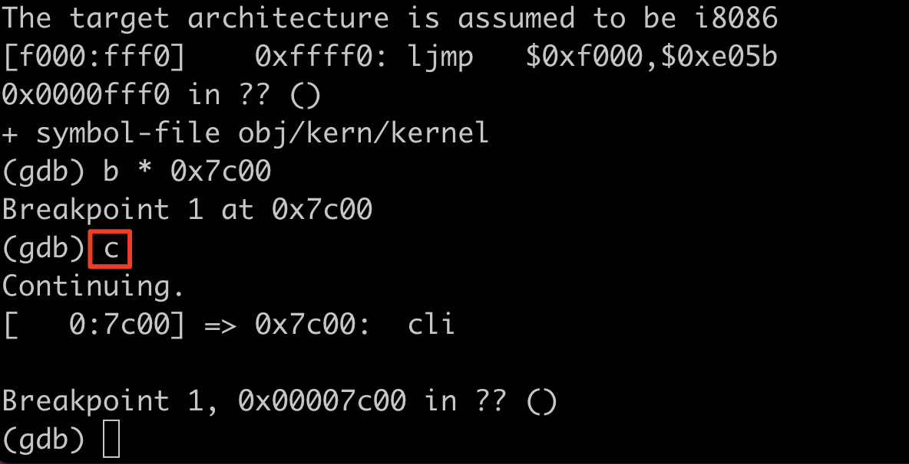
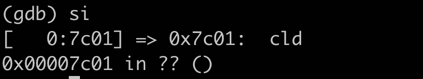
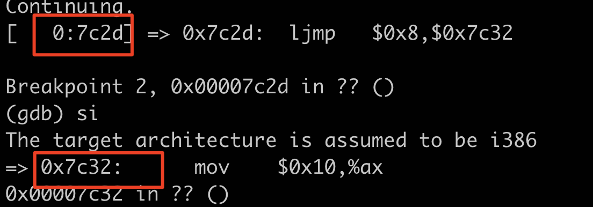
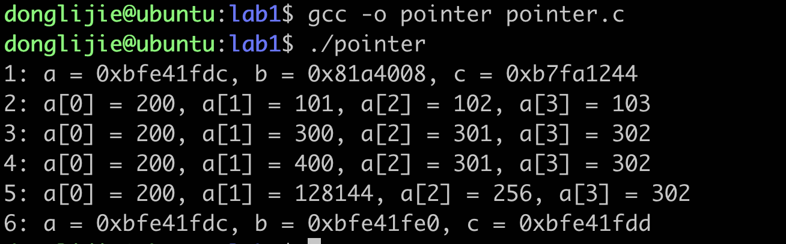
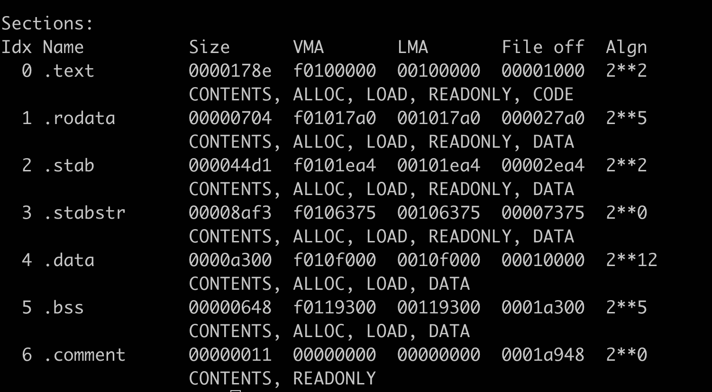
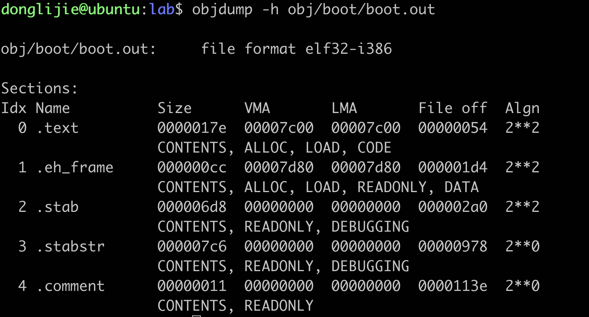
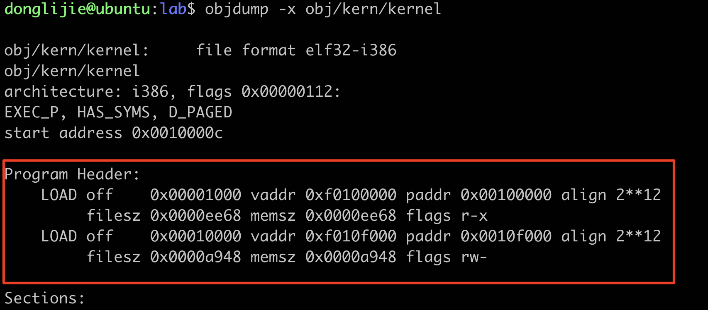

[TOC]

# LAB1 Booting a PC

[MIT 6.828 操作系统基础知识](https://zhuanlan.zhihu.com/p/420104751)

## 下载试验源码

```
#先创建一个目录，然后在这个目录下下载源码
mkdir mit6.828
cd mit6.828
```

使用git 下载源码的时候git报错：`symbol lookup error: /usr/lib/x86_64-linux-gnu/libhogweed.so.4: undefined symbol: __gmpn_cnd_add_n`，首先需要的解决的是ubuntu默认使用的vim不是完整版的，用起来非常难受，使用下面的命令安装完整版vim。

```
apt-get remove vim-common
apt-get install vim
```

[参考链接](https://blog.csdn.net/jiuweiljp/article/details/108213011?spm=1001.2101.3001.6650.1&utm_medium=distribute.pc_relevant.none-task-blog-2%7Edefault%7ECTRLIST%7ERate-1-108213011-blog-107722384.235%5Ev27%5Epc_relevant_multi_platform_whitelistv3&depth_1-utm_source=distribute.pc_relevant.none-task-blog-2%7Edefault%7ECTRLIST%7ERate-1-108213011-blog-107722384.235%5Ev27%5Epc_relevant_multi_platform_whitelistv3&utm_relevant_index=2)

上个问题解决后，使用git clone的时候，又出现了新的问题。提示ssl 证书有问题，解决方案：

直接跳过ssl认证：[参考链接](https://blog.csdn.net/Areigninhell/article/details/121560737?utm_medium=distribute.pc_relevant.none-task-blog-2~default~baidujs_baidulandingword~default-4-121560737-blog-123900491.235^v27^pc_relevant_multi_platform_whitelistv3&spm=1001.2101.3001.4242.3&utm_relevant_index=7)

```
export GIT_SSL_NO_VERIFY=1
```

不知道还有没有其他的问题。

不过现在可以把文件给克隆下来了

```
git clone https://pdos.csail.mit.edu/6.828/2018/jos.git lab
cd lab
make
make qemu-nox
```


退出qemu 快捷键：ctrl + a，然后在终端里输入x，就可以退出了。

## Part1 PC引导程序

[参考链接](https://zhuanlan.zhihu.com/p/472763115) [参考链接2](https://knowledgehive.github.io/6.828/lab1-Booting%20a%20PC.html) [参考链接3](https://zhuanlan.zhihu.com/p/74028717)

### Getting Started with x86 assembly

汇编的[参考书籍](https://pdos.csail.mit.edu/6.828/2018/readings/pcasm-book.pdf)，但是这本书上的例子是使用的nasm汇编器，本次教程里使用的是gnu汇编器，两者之间转变可以参考：[参考链接](http://www.delorie.com/djgpp/doc/brennan/brennan_att_inline_djgpp.html)

这个等碰到不懂的指令再去学习。

### Simulating the x86

这里主要介绍了一些关于QEMU模拟器和GDB如何进行debug的内容。

进入到lab目录，先输入make命令进行编译，然后再输入make qemu-nox运行qemu模拟器。

`kerninfo`命令可以帮助我们查看kernel运行的地址。


entry指明了kernel入口地址，entry指向的是_start的地址0x1000c，所以kernel执行的第一条指令一定是_start中的内容，然后就是etext代码段、edata数据段等。

#### The PC's Physical Address Space

一般一台电脑的物理地址空间有如下布局：


​	一开始的8088处理器只能寻16位地址，能够管理1MB的物理内存。之所以16位地址能够管理1MB的物理内存地址是因为采用(CS:IP)的寻址方式，`physical address = 16*segment + offset`。（这个乘16 就是指段寄存器左移4位然后再加上）

​	从 0x000A0000 到 0x000FFFFF 的 384KB 区域由硬件保留用于特殊用途，例如视频显示缓冲区和非易失性存储器中保存的固件（640+384正好就是1M，0x000FFFFF中共有5个F，这是16进制的数，共20位，寻址空间是以字节为单位进行计算的，正好就是1MB，而上图中的0x100000正好就是0x000FFFFF往前进一位）。**保留内存里面最重要的一部分就是基本的输入/输出系统BIOS，它占据了64KB的区域，从0x000F0000 到 0x000FFFFF**，在早期的PC中BIOS只保存在只读内存（ROM）中，但是现在的pc是把BIOS存储在可更新的闪存中的。BIOS 负责执行基本的系统初始化，例如激活视频卡和检查安装的内存量。执行了初始化以后，BIOS从某个适当的位置（如软盘、硬盘、CD-ROM或网络）加载操作系统，并将机器的控制权交给操作系统。

#### The Rom BIOS

​	在实验的这一部分，您将使用 QEMU 的调试工具来研究 IA-32 兼容计算机是如何启动的。

​	首先打开两个终端工具，都使用cd命令进入到lab目录下。在第一个窗口运行`make qemu-gdb（或者make qemu-nox-gdb，这个就是你连接服务器的时候可以使用）`，在另外一个窗口运行`make gdb`（使用cgdb -n -x .gdbinit 这个好像可以分屏展示源码，但是我不太会用）。


```
[f000:fff0]    0xffff0:	ljmp   $0xf000,$0xe05b
```

BIOS的第一条指令的执行地址是：0x000ffff0，这个是由0xf000 * 16 + 0xfff0 得出来的（[CS和IP](https://zhuanlan.zhihu.com/p/258863021)），第一条指令是一个jmp指令，将会跳到分段地址CS=0xf000 IP = 0xe05b。

​	为什么QEMU像这样启动，那是因为intel设计的8088处理器就是这样处理的，PC 中的 BIOS 是“硬连线”到物理地址范围 0x000f0000-0x000fffff，这种设计确保 BIOS 始终在加电或任何系统重启后首先控制机器 - 这是至关重要的，因为在加电时 - RAM被清空了。QEMU 仿真器带有自己的 BIOS，它将其放置在处理器的模拟物理地址空间中的这个位置。处理器复位时，（模拟）处理器进入实模式并将 CS 设置为 0xf000，将 IP 设置为 0xfff0，以便从该 (CS:IP) 段地址开始执行。分段地址0xf000:fff0如何变成物理地址呢？

​	首先，需要了解一下实模式寻址的相关知识，在实模式（PC 启动的模式）下，地址转换根据以下公式进行：物理地址 = 16 * 段 + 偏移量。 所以，当PC设置CS为0xf000，IP为0xfff0时，引用的物理地址为：

```
16 * 0xf000 + 0xfff0   # in hex multiplication by 16 is
   = 0xf0000 + 0xfff0     # easy--just append a 0.
   = 0xffff0 
```

> 这个也就是左移4位加偏移量。

#### exercise 2 使用si命令去追踪ROM BIOS更多的指令。

我试了一下，下面的这些指令我不是特别能看懂

```
0xffff0:	ljmp   $0xf000,$0xe05b # 跳转到#跳转到0xfe05b
0xfe05b:	cmpl   $0x0,%cs:0x6ac8

```

当 BIOS 运行时，它会建立一个中断描述符表并初始化各种设备，例如 VGA 显示器。这就是您在 QEMU 窗口中看到的“Starting SeaBIOS”消息的来源。

在初始化 PCI 总线和 BIOS 知道的所有重要设备后，它会搜索可引导设备，如软盘、硬盘或 CD-ROM。 最终，当它找到可引导磁盘时，BIOS 从磁盘读取引导加载程序并将控制权转移给它。

最后总结BIOS做的事情：PC通电后会设置CS为0xf000，IP为0xfff0，第一条指令会在物理内存0xffff0处，该地址位于BIOS区域的尾部。该条指令为`ljmp $0xf000,$0xe05b`跳转到BIOS的前半部分：`0xfe05b` 处,这里开始执行的指令就是bios做一些初始化操作：检测各种底层的设备，比如时钟，GDTR寄存器。以及设置中断向量表，然后找到一个可以boot的磁盘，load进物理地址为：`0x7c00 to 0x7dff` 的位置，然后设置两个寄存器:`CS:IP to 0000:7c00` ，将控制权交给boot loader。

1. boot loader，主要包含了两个文件：`/boot/boot.S` 和`/boot/main.c` ，boot loader 做两件事：
   - 从 real mode 切换到 32-bit protected mode(boot.s)
   - 通过一些io指令，从磁盘上读取kernel(boot/main.c)
2. 控制权交给了kernel，kernel开始执行一些任务

[参考链接](https://tangmengqiu.github.io/post/2020-11-15-mit6.828-lab1/)

## Part2 The Boot Loader

​	磁盘被分割的最小单位是sector（扇区），大小是512bytes。如果磁盘是可引导的，第一个扇区就是引导扇区。bios会把引导扇区加载到物理地址为 0x7c00 到 0x7dff 的内存中。

​	CD ROM的引导扇区从512bytes变成了2048bytes。

​	对于6.828，使用传统的硬盘引导机制，引导加载程序由一个汇编语言源文件 boot/boot.S 和一个 C 源文件 boot/main.c 组成。

**引导加载程序必须执行两个主要功能：**

- 首先，引导加载程序将处理器从实模式切换到 32 位保护模式，并且分段地址在转换偏移量之后是 32 位而不是 16 位。即physcial = segment*32 + offset
- 第二点是将kernel代码从硬盘中读取出来。这个过程涉及到特殊的I/O指令。对理解操作系统整体的框架来说，这并不是一个重要的点。

**boot.S**	

调试命令：**make qemu-nox-gdb** make gdb

它对应的反汇编文件是obj/boot/boot.asm。BIOS将`boot.S`这段代码从硬盘的第一个扇区load到物理地址为`0x7c00`的位置，同时CPU工作在`real mode`。

​	你可以在gdb中用b命令设置地址断点，比如，**b *0x7c00**，就是在地址0x7C00打了一个断点，一旦打了一个断点以后，你就可以执行c命令或者si命令，c是继续执行，直到遇到了下一个断点（continue继续执行到断点位置，如果没有停下直接进入kernel了就说明实验的理论部分错误0，si N 是一次执行N条指令。


要检查内存中的指令（除了下一个要执行的指令，GDB 会自动打印），您可以使用 x/i 命令。 此命令的语法为 x/Ni ADDR，其中 N 是要反汇编的连续指令数，ADDR 是开始反汇编的内存地址。比如输入`x/30i 0x7c00`就可以看到`boot.S`中类似的汇编代码了。


**exercis 3**	

```
熟悉GDB的调试指令。

使用GDB单步进行调试，调试的时候可以参考obj/boot/boot.asm这个反汇编中的指令，因为CPU就是按照这个文件里面的指令进行的。

readsect()里面调用的指令和读取完了执行了什么指令
```

boot.asm 中内容

```
obj/boot/boot.out:     file format elf32-i386


Disassembly of section .text:

00007c00 <start>:
.set CR0_PE_ON,      0x1         # protected mode enable flag

.globl start
start:
  .code16                     # Assemble for 16-bit mode
  cli                         # Disable interrupts
    7c00:	fa                   	cli
  cld                         # String operations increment
    7c01:	fc                   	cld

  # Set up the important data segment registers (DS, ES, SS).
  xorw    %ax,%ax             # Segment number zero
    7c02:	31 c0                	xor    %eax,%eax
  movw    %ax,%ds             # -> Data Segment
    7c04:	8e d8                	mov    %eax,%ds
  movw    %ax,%es             # -> Extra Segment
    7c06:	8e c0                	mov    %eax,%es
  movw    %ax,%ss             # -> Stack Segment
    7c08:	8e d0                	mov    %eax,%ss

00007c0a <seta20.1>:
  # Enable A20:
  #   For backwards compatibility with the earliest PCs, physical
  #   address line 20 is tied low, so that addresses higher than
  #   1MB wrap around to zero by default.  This code undoes this.
seta20.1:
  inb     $0x64,%al               # Wait for not busy
    7c0a:	e4 64                	in     $0x64,%al
  testb   $0x2,%al
    7c0c:	a8 02                	test   $0x2,%al
  jnz     seta20.1
    7c0e:	75 fa                	jne    7c0a <seta20.1>

  movb    $0xd1,%al               # 0xd1 -> port 0x64
    7c10:	b0 d1                	mov    $0xd1,%al
  outb    %al,$0x64
    7c12:	e6 64                	out    %al,$0x64

00007c14 <seta20.2>:

seta20.2:
  inb     $0x64,%al               # Wait for not busy
    7c14:	e4 64                	in     $0x64,%al
  testb   $0x2,%al
    7c16:	a8 02                	test   $0x2,%al
  jnz     seta20.2
    7c18:	75 fa                	jne    7c14 <seta20.2>

  movb    $0xdf,%al               # 0xdf -> port 0x60
    7c1a:	b0 df                	mov    $0xdf,%al
  outb    %al,$0x60
    7c1c:	e6 60                	out    %al,$0x60

  # Switch from real to protected mode, using a bootstrap GDT
  # and segment translation that makes virtual addresses
  # identical to their physical addresses, so that the
  # effective memory map does not change during the switch.
  lgdt    gdtdesc
    7c1e:	0f 01 16             	lgdtl  (%esi)
    7c21:	64                   	fs
    7c22:	7c 0f                	jl     7c33 <protcseg+0x1>
  movl    %cr0, %eax
    7c24:	20 c0                	and    %al,%al
  orl     $CR0_PE_ON, %eax
    7c26:	66 83 c8 01          	or     $0x1,%ax
  movl    %eax, %cr0
    7c2a:	0f 22 c0             	mov    %eax,%cr0

  # Jump to next instruction, but in 32-bit code segment.
  # Switches processor into 32-bit mode.
  ljmp    $PROT_MODE_CSEG, $protcseg
    7c2d:	ea 32 7c 08 00 66 b8 	ljmp   $0xb866,$0x87c32

00007c32 <protcseg>:

  .code32                     # Assemble for 32-bit mode
protcseg:
  # Set up the protected-mode data segment registers
  movw    $PROT_MODE_DSEG, %ax    # Our data segment selector
    7c32:	66 b8 10 00          	mov    $0x10,%ax
  movw    %ax, %ds                # -> DS: Data Segment
    7c36:	8e d8                	mov    %eax,%ds
  movw    %ax, %es                # -> ES: Extra Segment
    7c38:	8e c0                	mov    %eax,%es
  movw    %ax, %fs                # -> FS
    7c3a:	8e e0                	mov    %eax,%fs
  movw    %ax, %gs                # -> GS
    7c3c:	8e e8                	mov    %eax,%gs
  movw    %ax, %ss                # -> SS: Stack Segment
    7c3e:	8e d0                	mov    %eax,%ss

  # Set up the stack pointer and call into C.
  movl    $start, %esp
    7c40:	bc 00 7c 00 00       	mov    $0x7c00,%esp
  call bootmain
    7c45:	e8 c1 00 00 00       	call   7d0b <bootmain>

00007c4a <spin>:

  # If bootmain returns (it shouldn't), loop.
spin:
  jmp spin
    7c4a:	eb fe                	jmp    7c4a <spin>

00007c4c <gdt>:
	...
    7c54:	ff                   	(bad)
    7c55:	ff 00                	incl   (%eax)
    7c57:	00 00                	add    %al,(%eax)
    7c59:	9a cf 00 ff ff 00 00 	lcall  $0x0,$0xffff00cf
    7c60:	00 92 cf 00 17 00    	add    %dl,0x1700cf(%edx)

00007c64 <gdtdesc>:
    7c64:	17                   	pop    %ss
    7c65:	00 4c 7c 00          	add    %cl,0x0(%esp,%edi,2)
    7c69:	00 90 90 55 89 e5    	add    %dl,-0x1a76aa70(%eax)

00007c6c <waitdisk>:
	}
}

void
waitdisk(void)
{
    7c6c:	55                   	push   %ebp
    7c6d:	89 e5                	mov    %esp,%ebp

static inline uint8_t
inb(int port)
{
	uint8_t data;
	asm volatile("inb %w1,%0" : "=a" (data) : "d" (port));
    7c6f:	ba f7 01 00 00       	mov    $0x1f7,%edx
    7c74:	ec                   	in     (%dx),%al
	// wait for disk reaady
	while ((inb(0x1F7) & 0xC0) != 0x40)
    7c75:	25 c0 00 00 00       	and    $0xc0,%eax
    7c7a:	83 f8 40             	cmp    $0x40,%eax
    7c7d:	75 f5                	jne    7c74 <waitdisk+0x8>
		/* do nothing */;
}
    7c7f:	5d                   	pop    %ebp
    7c80:	c3                   	ret

00007c81 <readsect>:

void
readsect(void *dst, uint32_t offset)
{
    7c81:	55                   	push   %ebp
    7c82:	89 e5                	mov    %esp,%ebp
    7c84:	57                   	push   %edi
    7c85:	8b 7d 0c             	mov    0xc(%ebp),%edi
	// wait for disk to be ready
	waitdisk();
    7c88:	e8 df ff ff ff       	call   7c6c <waitdisk>
}

static inline void
outb(int port, uint8_t data)
{
	asm volatile("outb %0,%w1" : : "a" (data), "d" (port));
    7c8d:	ba f2 01 00 00       	mov    $0x1f2,%edx
    7c92:	b0 01                	mov    $0x1,%al
    7c94:	ee                   	out    %al,(%dx)
    7c95:	b2 f3                	mov    $0xf3,%dl
    7c97:	89 f8                	mov    %edi,%eax
    7c99:	ee                   	out    %al,(%dx)

	outb(0x1F2, 1);		// count = 1
	outb(0x1F3, offset);
	outb(0x1F4, offset >> 8);
    7c9a:	89 f8                	mov    %edi,%eax
    7c9c:	c1 e8 08             	shr    $0x8,%eax
    7c9f:	b2 f4                	mov    $0xf4,%dl
    7ca1:	ee                   	out    %al,(%dx)
	outb(0x1F5, offset >> 16);
    7ca2:	89 f8                	mov    %edi,%eax
    7ca4:	c1 e8 10             	shr    $0x10,%eax
    7ca7:	b2 f5                	mov    $0xf5,%dl
    7ca9:	ee                   	out    %al,(%dx)
	outb(0x1F6, (offset >> 24) | 0xE0);
    7caa:	c1 ef 18             	shr    $0x18,%edi
    7cad:	89 f8                	mov    %edi,%eax
    7caf:	83 c8 e0             	or     $0xffffffe0,%eax
    7cb2:	b2 f6                	mov    $0xf6,%dl
    7cb4:	ee                   	out    %al,(%dx)
    7cb5:	b2 f7                	mov    $0xf7,%dl
    7cb7:	b0 20                	mov    $0x20,%al
    7cb9:	ee                   	out    %al,(%dx)
	outb(0x1F7, 0x20);	// cmd 0x20 - read sectors

	// wait for disk to be ready
	waitdisk();
    7cba:	e8 ad ff ff ff       	call   7c6c <waitdisk>
}

static inline void
insl(int port, void *addr, int cnt)
{
	asm volatile("cld\n\trepne\n\tinsl"
    7cbf:	8b 7d 08             	mov    0x8(%ebp),%edi
    7cc2:	b9 80 00 00 00       	mov    $0x80,%ecx
    7cc7:	ba f0 01 00 00       	mov    $0x1f0,%edx
    7ccc:	fc                   	cld
    7ccd:	f2 6d                	repnz insl (%dx),%es:(%edi)

	// read a sector
	insl(0x1F0, dst, SECTSIZE/4);
}
    7ccf:	5f                   	pop    %edi
    7cd0:	5d                   	pop    %ebp
    7cd1:	c3                   	ret

00007cd2 <readseg>:

// Read 'count' bytes at 'offset' from kernel into physical address 'pa'.
// Might copy more than asked
void
readseg(uint32_t pa, uint32_t count, uint32_t offset)
{
    7cd2:	55                   	push   %ebp
    7cd3:	89 e5                	mov    %esp,%ebp
    7cd5:	57                   	push   %edi
    7cd6:	56                   	push   %esi
    7cd7:	53                   	push   %ebx
    7cd8:	8b 5d 08             	mov    0x8(%ebp),%ebx
    7cdb:	8b 75 10             	mov    0x10(%ebp),%esi
	uint32_t end_pa;

	end_pa = pa + count;
    7cde:	8b 7d 0c             	mov    0xc(%ebp),%edi
    7ce1:	01 df                	add    %ebx,%edi

	// round down to sector boundary
	pa &= ~(SECTSIZE - 1);
    7ce3:	81 e3 00 fe ff ff    	and    $0xfffffe00,%ebx

	// translate from bytes to sectors, and kernel starts at sector 1
	offset = (offset / SECTSIZE) + 1;
    7ce9:	c1 ee 09             	shr    $0x9,%esi
    7cec:	46                   	inc    %esi

	// If this is too slow, we could read lots of sectors at a time.
	// We'd write more to memory than asked, but it doesn't matter --
	// we load in increasing order.
	while (pa < end_pa) {
    7ced:	eb 10                	jmp    7cff <readseg+0x2d>
		// Since we haven't enabled paging yet and we're using
		// an identity segment mapping (see boot.S), we can
		// use physical addresses directly.  This won't be the
		// case once JOS enables the MMU.
		readsect((uint8_t*) pa, offset);
    7cef:	56                   	push   %esi
    7cf0:	53                   	push   %ebx
    7cf1:	e8 8b ff ff ff       	call   7c81 <readsect>
		pa += SECTSIZE;
    7cf6:	81 c3 00 02 00 00    	add    $0x200,%ebx
		offset++;
    7cfc:	46                   	inc    %esi
    7cfd:	58                   	pop    %eax
    7cfe:	5a                   	pop    %edx
	offset = (offset / SECTSIZE) + 1;

	// If this is too slow, we could read lots of sectors at a time.
	// We'd write more to memory than asked, but it doesn't matter --
	// we load in increasing order.
	while (pa < end_pa) {
    7cff:	39 fb                	cmp    %edi,%ebx
    7d01:	72 ec                	jb     7cef <readseg+0x1d>
		// case once JOS enables the MMU.
		readsect((uint8_t*) pa, offset);
		pa += SECTSIZE;
		offset++;
	}
}
    7d03:	8d 65 f4             	lea    -0xc(%ebp),%esp
    7d06:	5b                   	pop    %ebx
    7d07:	5e                   	pop    %esi
    7d08:	5f                   	pop    %edi
    7d09:	5d                   	pop    %ebp
    7d0a:	c3                   	ret

00007d0b <bootmain>:
void readsect(void*, uint32_t);
void readseg(uint32_t, uint32_t, uint32_t);

void
bootmain(void)
{
    7d0b:	55                   	push   %ebp
    7d0c:	89 e5                	mov    %esp,%ebp
    7d0e:	56                   	push   %esi
    7d0f:	53                   	push   %ebx
	struct Proghdr *ph, *eph;

	// read 1st page off disk
	readseg((uint32_t) ELFHDR, SECTSIZE*8, 0);
    7d10:	6a 00                	push   $0x0
    7d12:	68 00 10 00 00       	push   $0x1000
    7d17:	68 00 00 01 00       	push   $0x10000
    7d1c:	e8 b1 ff ff ff       	call   7cd2 <readseg>

	// is this a valid ELF?
	if (ELFHDR->e_magic != ELF_MAGIC)
    7d21:	83 c4 0c             	add    $0xc,%esp
    7d24:	81 3d 00 00 01 00 7f 	cmpl   $0x464c457f,0x10000
    7d2b:	45 4c 46
    7d2e:	75 39                	jne    7d69 <bootmain+0x5e>
		goto bad;

	// load each program segment (ignores ph flags)
	ph = (struct Proghdr *) ((uint8_t *) ELFHDR + ELFHDR->e_phoff);
    7d30:	8b 1d 1c 00 01 00    	mov    0x1001c,%ebx
    7d36:	81 c3 00 00 01 00    	add    $0x10000,%ebx
	eph = ph + ELFHDR->e_phnum;
    7d3c:	0f b7 05 2c 00 01 00 	movzwl 0x1002c,%eax
    7d43:	c1 e0 05             	shl    $0x5,%eax
    7d46:	8d 34 03             	lea    (%ebx,%eax,1),%esi
	for (; ph < eph; ph++)
    7d49:	eb 14                	jmp    7d5f <bootmain+0x54>
		// p_pa is the load address of this segment (as well
		// as the physical address)
		readseg(ph->p_pa, ph->p_memsz, ph->p_offset);
    7d4b:	ff 73 04             	pushl  0x4(%ebx)
    7d4e:	ff 73 14             	pushl  0x14(%ebx)
    7d51:	ff 73 0c             	pushl  0xc(%ebx)
    7d54:	e8 79 ff ff ff       	call   7cd2 <readseg>
		goto bad;

	// load each program segment (ignores ph flags)
	ph = (struct Proghdr *) ((uint8_t *) ELFHDR + ELFHDR->e_phoff);
	eph = ph + ELFHDR->e_phnum;
	for (; ph < eph; ph++)
    7d59:	83 c3 20             	add    $0x20,%ebx
    7d5c:	83 c4 0c             	add    $0xc,%esp
    7d5f:	39 f3                	cmp    %esi,%ebx
    7d61:	72 e8                	jb     7d4b <bootmain+0x40>
		// as the physical address)
		readseg(ph->p_pa, ph->p_memsz, ph->p_offset);

	// call the entry point from the ELF header
	// note: does not return!
	((void (*)(void)) (ELFHDR->e_entry))();
    7d63:	ff 15 18 00 01 00    	call   *0x10018
}

static inline void
outw(int port, uint16_t data)
{
	asm volatile("outw %0,%w1" : : "a" (data), "d" (port));
    7d69:	ba 00 8a 00 00       	mov    $0x8a00,%edx
    7d6e:	b8 00 8a ff ff       	mov    $0xffff8a00,%eax
    7d73:	66 ef                	out    %ax,(%dx)
    7d75:	b8 00 8e ff ff       	mov    $0xffff8e00,%eax
    7d7a:	66 ef                	out    %ax,(%dx)
    7d7c:	eb fe                	jmp    7d7c <bootmain+0x71>
```

先打一个断点:`b * 0x7c00`，然后输入c（continue 继续），一下子就执行到大断点的位置了。



输入si单步执行，



Q1：什么时候处理器开始执行32位的代码？什么引起了从16-转换到了32-bit？

从boot.asm文件中可以看到，当执行`ljmp    $PROT_MODE_CSEG, $protcseg`这条命令的时候就开始执行32位的代码。

从下面的截图也可以看出，寻址方式也发生了变化。



Q2:bootloader执行的最后一个语句？kernel执行的第一条语句为？

看人家的实验报告，确实这一行就是执行的最后一条语句。应该是把boot/main.c 给转成了汇编给查看的，暂时不太会这个，妈的，早晚我把这些都学会。

```c
movw    $0x1234,0x472            # warm boot
```

Q3：kernel执行的第一条指令？

```
movw    $0x1234,0x472            # warm boot
```

Q4：boot loader是怎么知道读取多少个sectors到内存的？

elf 暂时还不懂这个，先跳过吧。

这些信息保存到ELF header中，在编译的时候就已经决定了。

### Loading the kernel

这部分内容需要先熟悉C语言指针。

这段代码是这样的：

```
#include <stdio.h>
#include <stdlib.h>

void
f(void)
{
    int a[4]; // 声明一个整数数组，长度是4，这里自动初始化为0
    int *b = malloc(16); //分配一个16字节长度的内存，返回void指针，
    int *c;// 声明一个int 指针
    int i; // 声明一个int型变量i

// 第一行代码，输出a，b，c三个变量的内存地址
    printf("1: a = %p, b = %p, c = %p\n", a, b, c);
// 让指针c指向数组a的首地址
    c = a;
    for (i = 0; i < 4; i++)
	a[i] = 100 + i;  // 通过for循环给数组设置值，分别是100，101，102，103
    c[0] = 200; // 设置数组的第一个元素的值是200
    printf("2: a[0] = %d, a[1] = %d, a[2] = %d, a[3] = %d\n",
	   a[0], a[1], a[2], a[3]);

    c[1] = 300; // 设置数组的第二个元素值是300
    *(c + 2) = 301;// 设置数组的第三个元素的值是301
    3[c] = 302; // 设置数组的第四个元素，这三行代码，分别是访问数组的三种不同方式。
    // 所以第三行打印出来数组的元素分别是：200、300、301、302
    printf("3: a[0] = %d, a[1] = %d, a[2] = %d, a[3] = %d\n",
	   a[0], a[1], a[2], a[3]);

    c = c + 1;
    *c = 400; // 修改数组的第二个元素400，所以第四行打印出来数组元素分别是：200、300、400、301、302
    printf("4: a[0] = %d, a[1] = %d, a[2] = %d, a[3] = %d\n",
	   a[0], a[1], a[2], a[3]);

    c = (int *) ((char *) c + 1);
    *c = 500;
    printf("5: a[0] = %d, a[1] = %d, a[2] = %d, a[3] = %d\n",
	   a[0], a[1], a[2], a[3]);

    b = (int *) a + 1;
    c = (int *) ((char *) a + 1);
    printf("6: a = %p, b = %p, c = %p\n", a, b, c);
}

int
main(int ac, char **av)
{
    f();
    return 0;
}
```

[参考连接](https://www.cnblogs.com/fatsheep9146/p/5216735.html)

编译运行结果如下：

	为了弄明白boot/main.c你需要先知道什么是ELF二进制文件。当您编译和链接一个 C 程序（例如 JOS 内核）时，编译器将每个 C 源文件 ('.c') 转换为一个对象 ('.o') 文件，其中包含以硬件期望的二进制格式编码的汇编语言指令.链接器然后将所有已编译的目标文件组合成一个二进制映像，例如 obj/kern/kernel，在这种情况下，它是 ELF 格式的二进制文件，代表“可执行和可链接格式”。

​	在我们的参考页面上的 ELF 规范中提供了有关此格式的完整信息，但您无需在本课程中非常深入地研究此格式的详细信息。 虽然从整体上看这个格式还是比较强大和复杂的，但是复杂的部分大多是为了支持共享库的动态加载，这门课我们不会做。 维基百科页面有一个简短的描述。

​	出于 6.828 的目的，您可以将 ELF 可执行文件视为带有加载信息的标头，后跟几个程序部分，每个部分都是连续的代码块或数据块，旨在加载到指定地址的内存中。 引导加载程序不修改代码或数据； 它将它加载到内存中并开始执行它。

​	一个ELF二进制文件以固定长度的ELF标头开头，后面跟着可变长度的程序头，列出要加载的每个程序段。这些ELF标头的C定义在inc/elf.h中。我们感兴趣的程序部分是：

- .text：程序的可执行指令
- .rodata:只读数据，例如 C 编译器生成的 ASCII 字符串常量。 （但是，我们不会费心设置硬件来禁止写入。）
- .data:数据部分保存程序的初始化数据，例如使用 int x = 5; 等初始化程序声明的全局变量。

当链接器计算程序的内存布局时，它会在内存中紧跟在 .data 之后的名为 .bss 的部分中为未初始化的全局变量（例如 int x;）保留空间。C 要求“未初始化”的全局变量以零值开始。因此，无需在 ELF 二进制文件中存储 .bss 的内容；相反，链接器只记录 .bss 部分的地址和大小。加载程序或程序本身必须安排将 .bss 部分归零。

通过键入检查内核可执行文件中所有部分的名称、大小和链接地址的完整列表

```
objdump -h obj/kern/kernel
```



您会看到比我们上面列出的更多的部分，但其他部分对我们的目的并不重要。其他大部分用于保存调试信息，这些信息通常包含在程序的可执行文件中，但不会被程序加载器加载到内存中。

请特别注意 .text 部分的“VMA”（或链接地址）和“LMA”（或加载地址）。节的加载地址是该节应加载到内存中的内存地址。

节的链接地址是节期望从中执行的内存地址。 链接器以各种方式对二进制文件中的链接地址进行编码，例如当代码需要全局变量的地址时，结果是如果二进制文件是从它未链接的地址执行的，则通常无法工作.(可以生成不包含任何此类绝对地址的位置无关代码。这被现代共享库广泛使用，但它具有性能和复杂性成本，因此我们不会在 6.828 中使用它)

通常，链接地址和加载地址是相同的。例如，查看引导加载程序的 .text 部分.



引导加载程序使用 ELF 程序头来决定如何加载这些部分。程序头指定将 ELF 对象的哪些部分加载到内存中以及每个部分应占用的目标地址。您可以通过键入以下内容来检查程序头：

```
objdump -x obj/kern/kernel
```



然后程序头列在 objdump 输出的“Program Header”下。ELF对象需要加载到内存的区域就是那些被标记为“LOAD”的区域。给出了每个程序头的其他信息，例如虚拟地址（“vaddr”）、物理地址（“paddr”）和加载区域的大小（“memsz”和“filesz”）

回到 boot/main.c，每个程序头的 ph->p_pa 字段包含该段的目标物理地址（在这种情况下，它确实是一个物理地址，尽管 ELF 规范对该字段的实际含义含糊不清）。

BIOS 将引导扇区加载到从地址 0x7c00 开始的内存中，因此这是引导扇区的加载地址。这也是引导扇区执行的地方，所以这也是它的链接地址。我们通过将 -Ttext 0x7C00 传递给 boot/Makefrag 中的链接器来设置链接地址，因此链接器将在生成的代码中生成正确的内存地址。

> Exercise 5：再次跟踪引导加载程序的前几条指令，并确定第一条指令，如果您将引导加载程序的链接地址弄错，那将“中断”或以其他方式做错事。 然后在boot中更改链接地址
