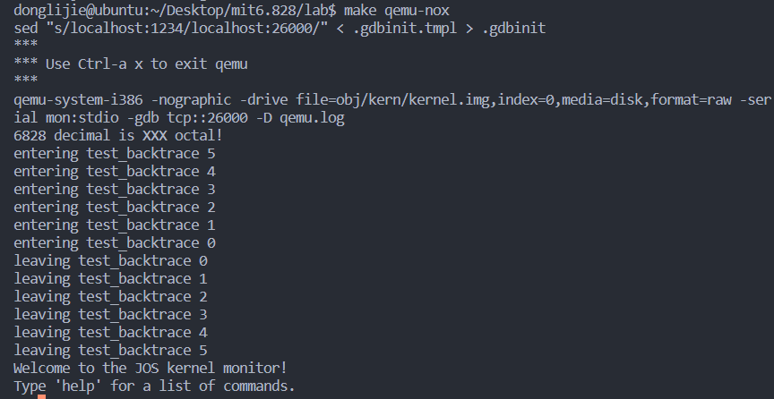
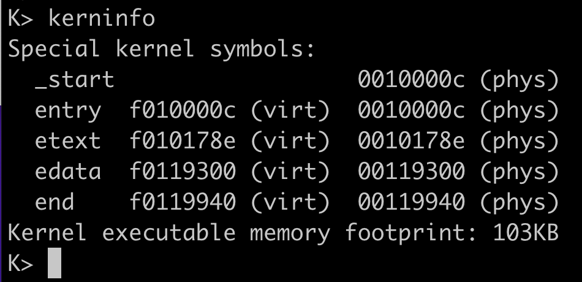
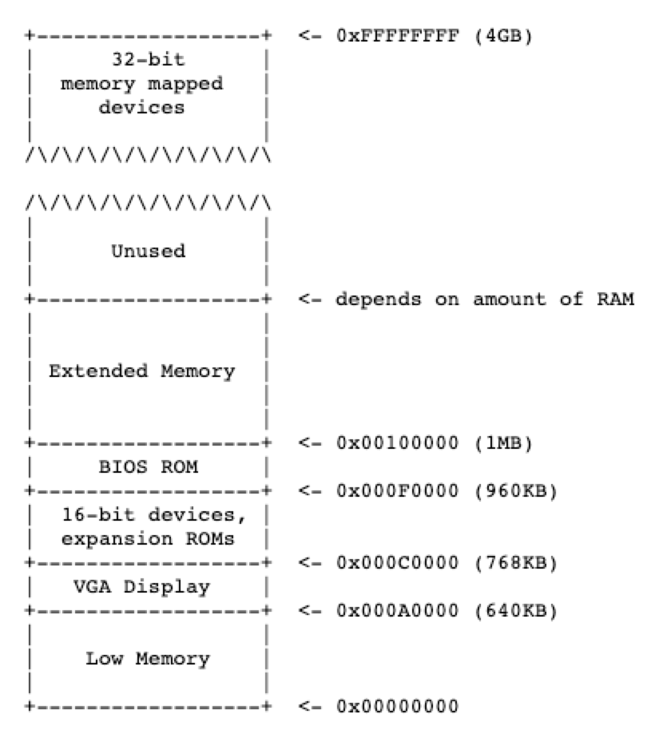
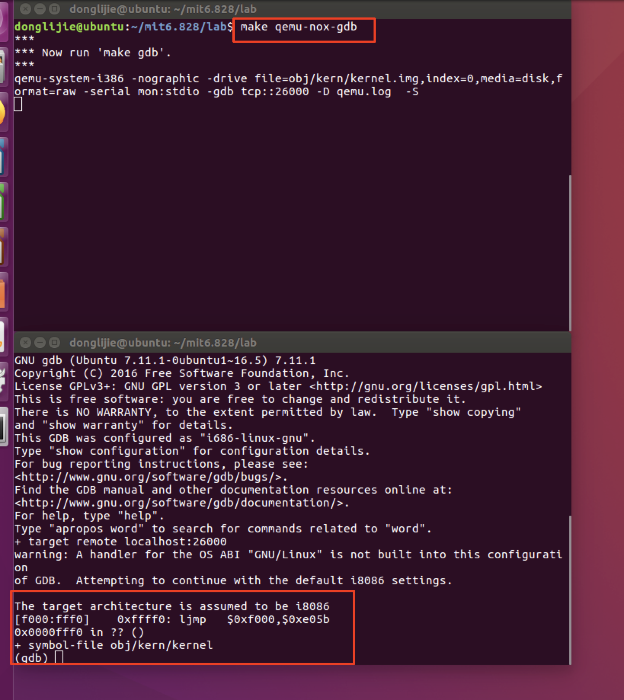
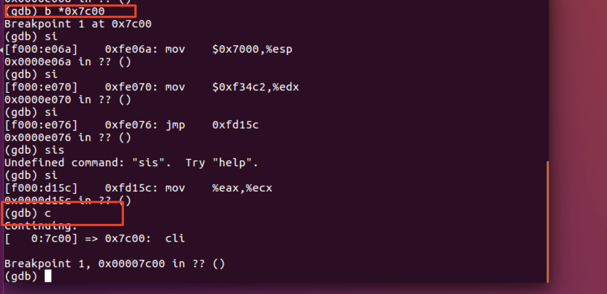
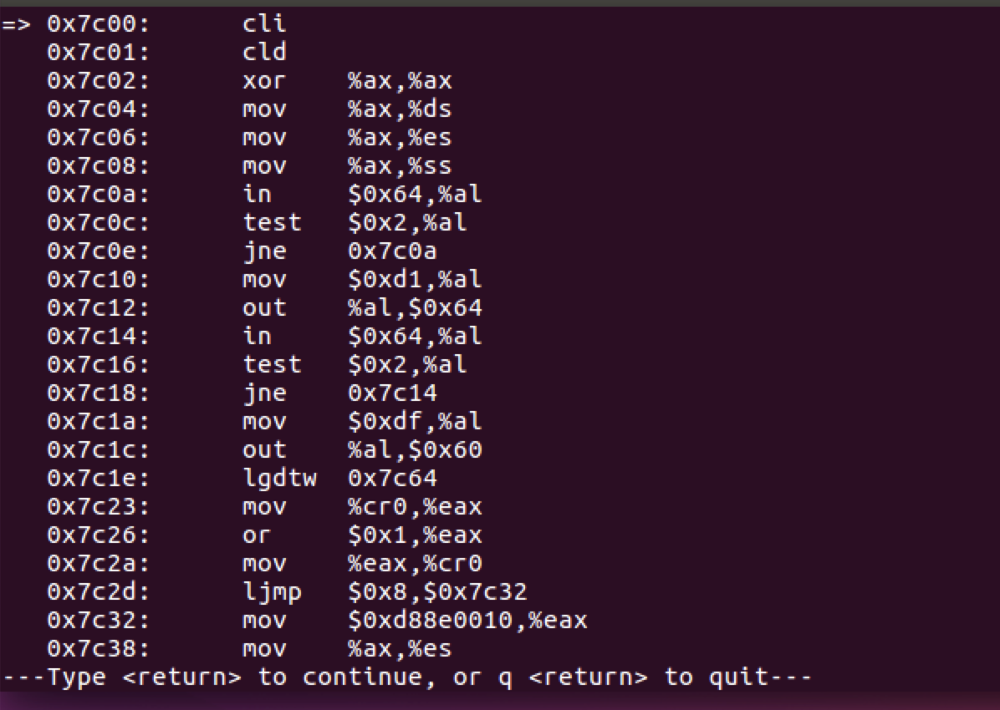

[TOC]

# LAB1 Booting a PC

[MIT 6.828 操作系统基础知识](https://zhuanlan.zhihu.com/p/420104751)

## 下载试验源码

```
#先创建一个目录，然后在这个目录下下载源码
mkdir mit6.828
cd mit6.828
```

使用git 下载源码的时候git报错：`symbol lookup error: /usr/lib/x86_64-linux-gnu/libhogweed.so.4: undefined symbol: __gmpn_cnd_add_n`，首先需要的解决的是ubuntu默认使用的vim不是完整版的，用起来非常难受，使用下面的命令安装完整版vim。

```
apt-get remove vim-common
apt-get install vim
```

[参考链接](https://blog.csdn.net/jiuweiljp/article/details/108213011?spm=1001.2101.3001.6650.1&utm_medium=distribute.pc_relevant.none-task-blog-2%7Edefault%7ECTRLIST%7ERate-1-108213011-blog-107722384.235%5Ev27%5Epc_relevant_multi_platform_whitelistv3&depth_1-utm_source=distribute.pc_relevant.none-task-blog-2%7Edefault%7ECTRLIST%7ERate-1-108213011-blog-107722384.235%5Ev27%5Epc_relevant_multi_platform_whitelistv3&utm_relevant_index=2)

上个问题解决后，使用git clone的时候，又出现了新的问题。提示ssl 证书有问题，解决方案：

直接跳过ssl认证：[参考链接](https://blog.csdn.net/Areigninhell/article/details/121560737?utm_medium=distribute.pc_relevant.none-task-blog-2~default~baidujs_baidulandingword~default-4-121560737-blog-123900491.235^v27^pc_relevant_multi_platform_whitelistv3&spm=1001.2101.3001.4242.3&utm_relevant_index=7)

```
export GIT_SSL_NO_VERIFY=1
```

不知道还有没有其他的问题。

不过现在可以把文件给克隆下来了

```
git clone https://pdos.csail.mit.edu/6.828/2018/jos.git lab
cd lab
make
make qemu-nox
```



退出qemu 快捷键：ctrl + a，然后在终端里输入x，就可以退出了。

## Part1 PC引导程序

[参考链接](https://zhuanlan.zhihu.com/p/472763115) [参考链接2](https://knowledgehive.github.io/6.828/lab1-Booting%20a%20PC.html) [参考链接3](https://zhuanlan.zhihu.com/p/74028717)

### Getting Started with x86 assembly

汇编的[参考书籍](https://pdos.csail.mit.edu/6.828/2018/readings/pcasm-book.pdf)，但是这本书上的例子是使用的nasm汇编器，本次教程里使用的是gnu汇编器，两者之间转变可以参考：[参考链接](http://www.delorie.com/djgpp/doc/brennan/brennan_att_inline_djgpp.html)

这个等碰到不懂的指令再去学习。

### Simulating the x86

`kerninfo`命令可以帮助我们查看kernel运行的地址。



entry指明了kernel入口地址，entry指向的是_start的地址0x1000c，所以kernel执行的第一条指令一定是_start中的内容，然后就是etext代码段、edata数据段等。

#### The PC's Physical Address Space

一般一台电脑的物理地址空间有如下布局：



​	一开始的8088处理器只能寻16位地址，能够管理1MB的物理内存。之所以16位地址能够管理1MB的物理内存地址是因为采用(CS:IP)的寻址方式，`physical address = 16*segment + offset`。

​	从 0x000A0000 到 0x000FFFFF 的 384KB 区域由硬件保留用于特殊用途，例如视频显示缓冲区和非易失性存储器中保存的固件（640+384正好就是1M，0x000FFFFF中共有5个F，这是16进制的数，共20位，寻址空间是以字节为单位进行计算的，正好就是1MB，而上图中的0x100000正好就是0x000FFFFF往前进一位）。保留内存里面最重要的一部分就是基本的输入/输出系统BIOS，它占据了64KB的区域，从0x000F0000 到 0x000FFFFF，在早期的PC中BIOS只保存在只读内存（ROM）中，但是现在的pc是把BIOS存储在可更新的闪存中的。BIOS 负责执行基本的系统初始化，例如激活视频卡和检查安装的内存量。执行了初始化以后，BIOS从某个适当的位置（如软盘、硬盘、CD-ROM或网络）加载操作系统，并将机器的控制权交给操作系统。

#### The Rom BIOS

​	在实验的这一部分，您将使用 QEMU 的调试工具来研究 IA-32 兼容计算机是如何启动的。

​	首先打开两个终端工具，都使用cd命令进入到lab目录下。在第一个窗口运行`make qemu-gdb（或者make qemu-nox-gdb，这个就是你连接服务器的时候可以使用）`，在另外一个窗口运行`make gdb`（使用cgdb -n -x .gdbinit 这个好像可以分屏展示源码，但是我不太会用）。



```
[f000:fff0]    0xffff0:	ljmp   $0xf000,$0xe05b
```

BIOS的第一条指令的执行地址是：0x000ffff0，这个是由0xf000 * 16 + 0xfff0 得出来的（[CS和IP](https://zhuanlan.zhihu.com/p/258863021)），第一条指令是一个jmp指令，将会跳到分段地址CS=0xf000 IP = 0xe05b。

​	为什么QEMU像这样启动，那是因为intel设计的8088处理器就是这样处理的，PC 中的 BIOS 是“硬连线”到物理地址范围 0x000f0000-0x000fffff，这种设计确保 BIOS 始终在加电或任何系统重启后首先控制机器 - 这是至关重要的，因为在加电时 - RAM被清空了。QEMU 仿真器带有自己的 BIOS，它将其放置在处理器的模拟物理地址空间中的这个位置。处理器复位时，（模拟）处理器进入实模式并将 CS 设置为 0xf000，将 IP 设置为 0xfff0，以便从该 (CS:IP) 段地址开始执行。分段地址0xf000:fff0如何变成物理地址呢？

​	首先，需要了解一下实模式寻址的相关知识，在实模式（PC 启动的模式）下，地址转换根据以下公式进行：物理地址 = 16 * 段 + 偏移量。 所以，当PC设置CS为0xf000，IP为0xfff0时，引用的物理地址为：

```
16 * 0xf000 + 0xfff0   # in hex multiplication by 16 is
   = 0xf0000 + 0xfff0     # easy--just append a 0.
   = 0xffff0 
```

> 这个也就是左移4位加偏移量。

#### exercise 2 使用si命令去追踪ROM BIOS更多的指令。

我试了一下，下面的这些指令我不是特别能看懂

```
0xffff0:	ljmp   $0xf000,$0xe05b # 跳转到#跳转到0xfe05b
0xfe05b:	cmpl   $0x0,%cs:0x6ac8

```

当 BIOS 运行时，它会建立一个中断描述符表并初始化各种设备，例如 VGA 显示器。这就是您在 QEMU 窗口中看到的“Starting SeaBIOS”消息的来源。

在初始化 PCI 总线和 BIOS 知道的所有重要设备后，它会搜索可引导设备，如软盘、硬盘或 CD-ROM。 最终，当它找到可引导磁盘时，BIOS 从磁盘读取引导加载程序并将控制权转移给它。

所以BIOS执行差不多就是初始化硬件。

## Part2 The Boot Loader

​	磁盘被分割的最小单位是sector（扇区），大小是512bytes。如果磁盘是可引导的，第一个扇区就是引导扇区。bios会把引导扇区加载到物理地址为 0x7c00 到 0x7dff 的内存中。

​	CD ROM的引导扇区从512bytes变成了2048bytes。

​	对于6.828，使用传统的硬盘引导机制，引导加载程序由一个汇编语言源文件 boot/boot.S 和一个 C 源文件 boot/main.c 组成。

引导加载程序必须执行两个主要功能：

- 首先，引导加载程序将处理器从实模式切换到 32 位保护模式，并且分段地址在转换偏移量之后是 32 位而不是 16 位。即physcial = segment*32 + offset
- 第二点是将kernel代码从硬盘中读取出来。这个过程涉及到特殊的I/O指令。对理解操作系统整体的框架来说，这并不是一个重要的点。

**boot.S**	

它对应的反汇编文件是obj/boot/boot.asm。BIOS将`boot.S`这段代码从硬盘的第一个扇区load到物理地址为`0x7c00`的位置，同时CPU工作在`real mode`。

​	你可以在gdb中用b命令设置地址断点，比如，**b *0x7c00**，就是在地址0x7C00打了一个断点，一旦打了一个断点以后，你就可以执行c命令或者si命令，c是继续执行，直到遇到了下一个断点（continue继续执行到断点位置，如果没有停下直接进入kernel了就说明实验的理论部分错误0，si N 是一次执行N条指令。



要检查内存中的指令（除了下一个要执行的指令，GDB 会自动打印），您可以使用 x/i 命令。 此命令的语法为 x/Ni ADDR，其中 N 是要反汇编的连续指令数，ADDR 是开始反汇编的内存地址。比如输入`x/30i 0x7c00`就可以看到`boot.S`中类似的汇编代码了。



**exercis 3**	

```
熟悉GDB的调试指令。

使用GDB单步进行调试，调试的时候可以参考obj/boot/boot.asm这个反汇编中的指令，因为CPU就是按照这个文件里面的指令进行的。

readsect()里面调用的指令和读取完了执行了什么指令
```

