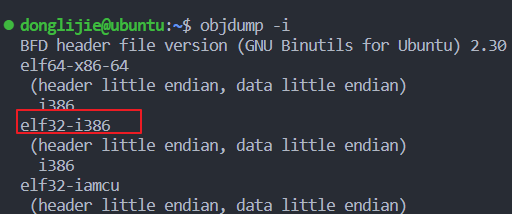
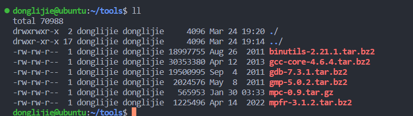
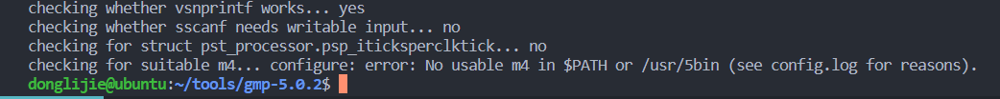

# 6.828中的工具使用

​	在这个课程里，你将使用两套工具：用于运行内核的X86的模拟器QEMU；以及编译器工具链包括汇编程序、链接器、C编译器和调试器，用于贬义和测试内核。这个页面包含你需要下载和安装自己副本所需要的信息。该课程假设你自始至终都十分熟悉Unix命令。

​	我们强烈建议你使用Debathena机器，如athena.dialup.mit.edu去做实验。如果你使用运行Linux的麻省理工学院Athena机器，那么本课程所需的所有软件工具都位于6.828文件夹中，只需要输入`add -f 6.828`就可以访问它们。

​	如果你无法访问Debathena机器，我们建议你使用带有Linux的虚拟机。如果你真的想，你可以构建安装这些工具在你自己的机器上，下面有Linux和MacOS机器的使用说明。

​	在Cygwin的帮助下，应该可以让这个开发环境在windows下运行。安装cygwin，并确保安装flex和bison包（它们位于开发标题下）。

​	有关6.828中使用的工具中有用命令的概述，请参阅实验室工具指南。

# 编译工具链

​	“编译器工具链”是一组程序，包括C编译器、汇编程序和链接程序，它们将代码转换为可执行的二进制文件。您需要一个编译器工具链，以ELF二进制格式为32位Intel体系结构（“x86”体系结构）生成代码。

## vmware fusion 

13 密钥；4C21U-2KK9Q-M8130-4V2QH-CF810

[参考链接](https://www.jianshu.com/p/828d0cc48a63)

## 安装git

因为我使用的ubuntu的版本是16.04，所以安装的git版本比较低。导致下载qemu模拟器的时候会出错，所以需要先升级一下git版本。

```
sudo add-apt-repository ppa:git-core/ppa -y
sudo apt-get update
sudo apt-get install git -y
```


## 测试编译工具链

`objdump -i`



执行`gcc -m32 -print-libgcc-file-name`测试gcc，一般系统没有装，需要安装一下（使用ubuntu16.04 没有这个问题）

```
sudo apt-get install -y build-essential gdb
```

然后是在64位的虚拟机上，安装32位的支持库。

```
sudo apt-get install gcc-multilib
```

## 编译你自己的工具链

[参考链接](https://blog.csdn.net/qq_38230634/article/details/106525187)

[参考链接2](https://blog.csdn.net/Rcary/article/details/125547980?utm_source=app&app_version=4.17.0) [官网地址](https://pdos.csail.mit.edu/6.828/2018/tools.html)

下载下列压缩包

```
ftp://ftp.gmplib.org/pub/gmp-5.0.2/gmp-5.0.2.tar.bz2
上面这个不好用，使用https://mirrors.sjtug.sjtu.edu.cn/gnu/gmp/gmp-5.0.2.tar.bz2 代替

https://www.mpfr.org/mpfr-3.1.2/mpfr-3.1.2.tar.bz2
http://www.multiprecision.org/downloads/mpc-0.9.tar.gz
http://ftpmirror.gnu.org/binutils/binutils-2.21.1.tar.bz2
http://ftpmirror.gnu.org/gcc/gcc-4.6.4/gcc-core-4.6.4.tar.bz2
http://ftpmirror.gnu.org/gdb/gdb-7.3.1.tar.bz2
```

我把这些下载到了tools目录下。



### 安装gmp-5.0.2

```
tar xjf gmp-5.0.2.tar.bz2
cd gmp-5.0.2/
./configure --prefix=/usr/local  
```

出现错误：No usable m4 in $PATH or /usr/5bin (see config.log for reasons).



解决方案：安装依赖`sudo apt install m4`。

然后重新执行`./configure --prefix=/usr/local`

继续执行：

```
make
sudo make install
```

### 安装 mpfr-3.1.2

```
#刚刚是在gmp-5.0.2 目录下，先返回到tools目录，然后进行安装
tar xjf mpfr-3.1.2.tar.bz2
./configure --prefix=/usr/local
make
sudo make install
```

### 安装mpc-0.9

```
# 同样的操作
tar xzf mpc-0.9.tar.gz
cd mpc-0.9
./configure --prefix=/usr/local
make
sudo make install
```

### 安装binutils-2.21.1

```
tar xjf binutils-2.21.1.tar.bz2
cd binutils-2.21.1
./configure --prefix=/usr/local --target=i386-jos-elf --disable-werror
make
sudo make install
```

上面三个安装完，可以使用下面的命令进行测试

```
i386-jos-elf-objdump -i
会输出下面的命令：
BFD header file version (GNU Binutils) 2.21.1
elf32-i386
 (header little endian, data little endian)
  i386
coff-i386
 (header little endian, data little endian)
  i386
elf32-little
 (header little endian, data little endian)
  i386
elf32-big
 (header big endian, data big endian)
  i386
srec
 (header endianness unknown, data endianness unknown)
  i386
symbolsrec
 (header endianness unknown, data endianness unknown)
  i386
verilog
 (header endianness unknown, data endianness unknown)
  i386
tekhex
 (header endianness unknown, data endianness unknown)
  i386
binary
 (header endianness unknown, data endianness unknown)
  i386
ihex
 (header endianness unknown, data endianness unknown)
  i386

               elf32-i386 coff-i386 elf32-little elf32-big srec symbolsrec 
          i386 elf32-i386 coff-i386 elf32-little elf32-big srec symbolsrec 

               verilog tekhex binary ihex 
          i386 verilog tekhex binary ihex 
```

### 安装gcc-core-4.6.4

```
tar xjf gcc-core-4.6.4.tar.bz2
cd gcc-core-4.6.4
mkdir build
cd build
../configure --prefix=/usr/local \
    --target=i386-jos-elf --disable-werror \
    --disable-libssp --disable-libmudflap --with-newlib \
    --without-headers --enable-languages=c MAKEINFO=missing
make all-gcc
sudo make install-gcc 
make all-target-libgcc 
# 执行上面这条命令会报错，先执行下面的命令
export LD_LIBRARY_PATH=$LD_LIBRARY_PATH:/usr/local/lib 
sudo make install-target-libgcc 
然后输入下面的命令进行验证
i386-jos-elf-gcc -v
输出如下：
Using built-in specs.
COLLECT_GCC=i386-jos-elf-gcc
COLLECT_LTO_WRAPPER=/usr/local/libexec/gcc/i386-jos-elf/4.6.4/lto-wrapper
Target: i386-jos-elf
Configured with: ../configure --prefix=/usr/local --target=i386-jos-elf --disable-werror --disable-libssp --disable-libmudflap --with-newlib --without-headers --enable-languages=c MAKEINFO=missing
Thread model: single
gcc version 4.6.4 (GCC) 
```

### 安装安装gdb-7.3.1

```shell
tar xjf gdb-7.3.1.tar.bz2
cd gdb-7.3.1
./configure --prefix=/usr/local --target=i386-jos-elf --program-prefix=i386-jos-elf- \
    --disable-werror
make all
# 可能的报错 no termcap library found
```

解决方案：

```
$wget http://ftp.gnu.org/gnu/termcap/termcap-1.3.1.tar.gz
$tar -zxv -f termcap-1.3.1.tar.gz
$cd termcap-1.3.1
$ ./configure 
$make
$sudo make install
```

继续安装

```
sudo make all
sudo make install
```

## 安装QEMU模拟器

```
安装工具包
git clone https://github.com/mit-pdos/6.828-qemu.git qemu
#安装一些库文件
sudo apt-get install libsdl1.2-dev
sudo apt-get install libtool-bin
sudo apt-get install libz-dev
sudo apt-get install libpixman-1-dev

cd qemu

#配置
./configure --disable-kvm --disable-werror --target-list="i386-softmmu x86_64-softmmu"

#安装
make
sudo make install
```

