# 资料

视频链接：https://www.bilibili.com/video/BV18p4y167Md

同步代码到服务器：

```
rsync -av /Users/donglijie/Desktop/selfLearning/cstudy-code donglijie@192.100.219.110:/home/donglijie
```

[代码参考链接](https://github.com/impact-eintr/LinuxC)

# 1 学习方法和基本概念简单介绍

学习建议：

1、概念的正确性

2、动手能力

3、阅读优秀的程序段

4、大量练习，面试题

c课程讲解思路

​	1、基本概念

​	2、数据类型，运算符和表达式

​	3、输入输出专题

​    4、流程控制

​	5、数组

​	6、指针

​    7、函数

​    8、构造类型

​	9、动态内存管理

​	10、调试工具（gdb,make）

​	11、常用库函数

## 1.2 gcc与vim的使用

hello world 程序，c语言main函数定义有很多种，在该课程里面，如果main函数不需要传参数，就定义成 int main(void), 如果需要传参数就定义成int main(int arc, char ** argv);

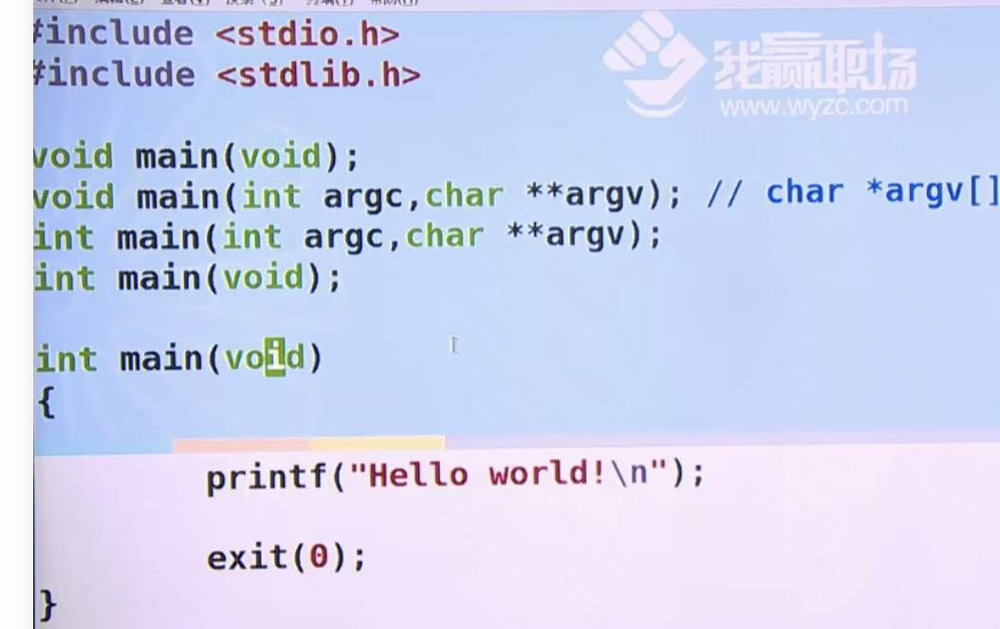

hello.c到可执行文件

编译器：gcc

c源文件->预处理->编译->汇编->链接

预处理： gcc -E hello.c > hello.i

编译：gcc -S hello.i 或gcc -S hello.i -o hello.s

汇编：gcc -c hello.s -o hello.o

链接： gcc hello.o -o hello

编辑器：

vim 熟悉vim常用的脚本

我不太想用vim。后面再说吧。

## 1.3 基本概念

写代码的时候把gcc报的warnging都给解决掉，除非你能确认这个warnging对程序无影响。

gcc 编译的时候， -Wall 选项可以打印出所有的警告

1、以hello world 程序为例

- 头文件包含的重要性
- 以函数为单位进行编程
- 声明部分+ 定义部分

 **echo $?** 在shell脚本中输出上一条命令的返回值。

- return 0;

- 添加注释

  #if  0 也可以添加注释

2、算法：解决问题的办法（流程图、NS图、有限状态机FSM）

3、程序：用某种语言实现算法

4、进程：

​	防止写越界，防止内存泄漏，谁打开谁关闭，谁申请谁释放。

# 2 数据类型，运算符和表达式

## 2.1 数据类型（基本数据类型）

如下图

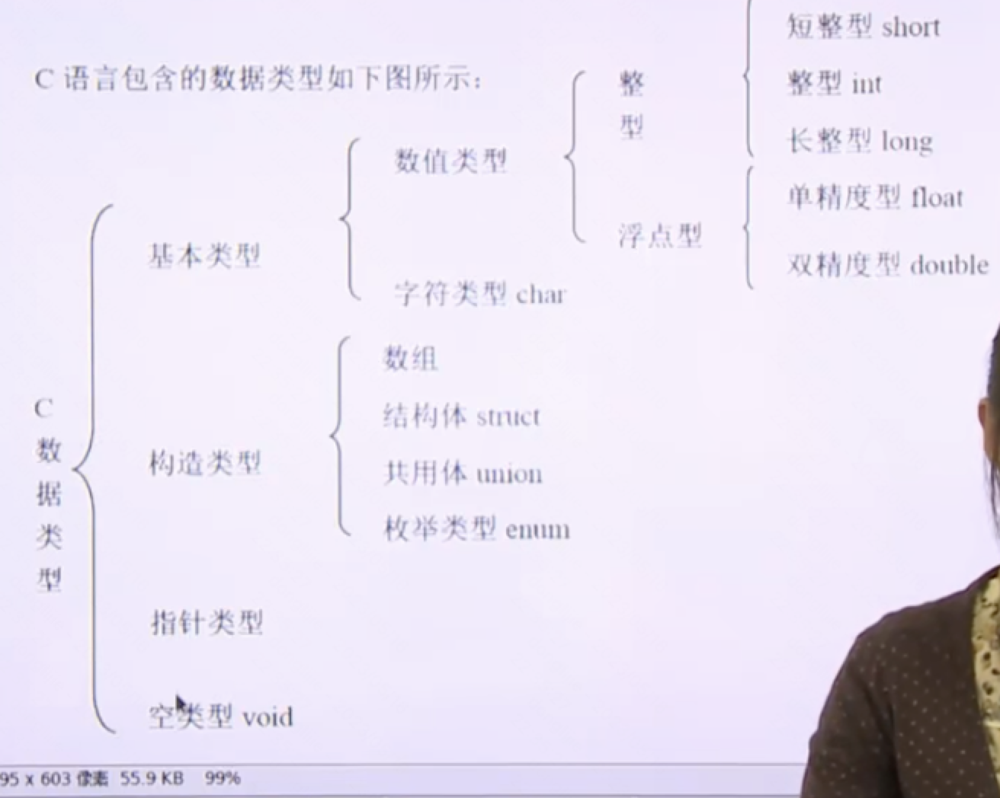

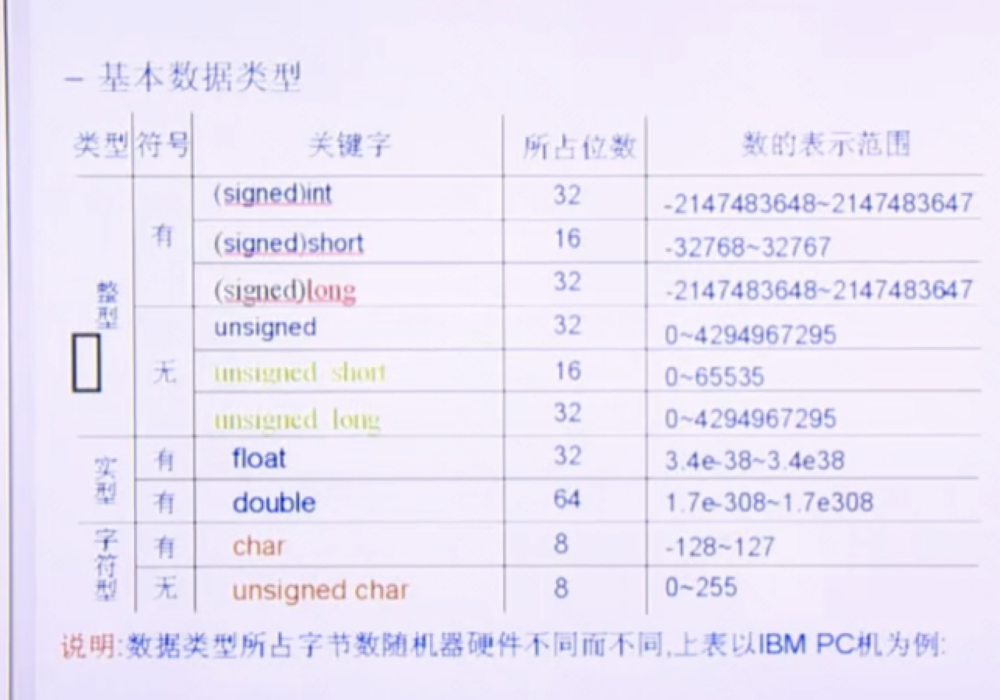

1）所占字节数

2）存储和区别

​	整型数在计算机中是以补码的形式进行存储。

​	float， 对于 32 位的浮点数，最高的 1 位是符号位 s ，接着的 8 位是指数 E ，剩下的 23 位为有效数字 M。[参考链接](https://www.jb51.net/article/244252.htm)

​	增加实数存储的详细过程，[参考链接](https://zhuanlan.zhihu.com/p/152338612)

​	c 语言char 型变量是有符号还是无符号是未定义的。

3）不同类型的数据间进行转换（隐式转换或显式转换-->强制类型转换）

​	隐士转换： 比如double 和 int 相加，会先把int 转成double然后进行操作。	

4）特殊性

​	（1）布尔型 bool

​	（2）float 类型

​			它是无法和一个准确的数值进行相等比较的，比如下图中的代码和0进行比较应该是和0相减，看它的精度，在某个范围内认为是0.

​		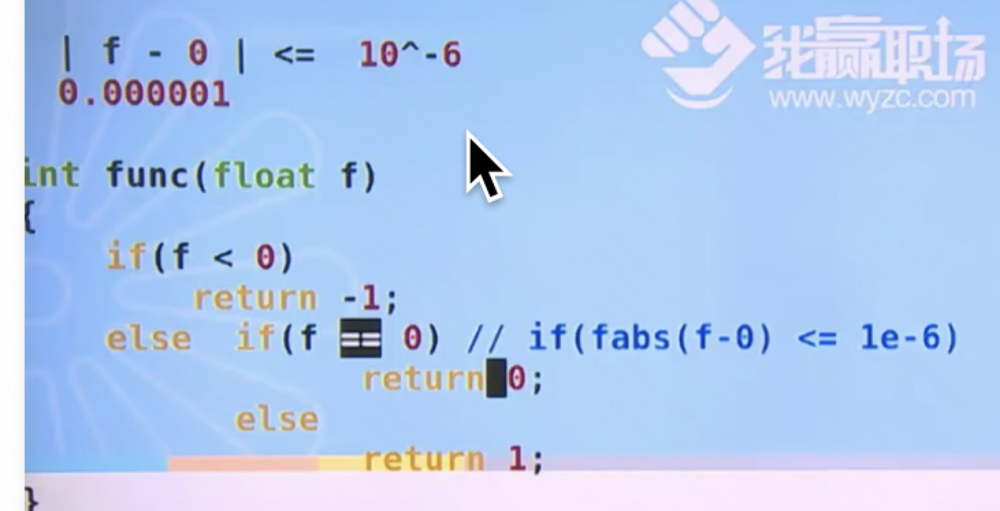

​		（3） char型是否有符号是未定义

​		（4） 不同状态下的零值 0，'0'，"0",'\0'

​		（5）数据类型与后续代码中所使用的输入输出要相匹配（防止自相矛盾）。

## 2.2 常量与变量

常量：在程序执行过程中值不会发生变化的量。

​	分类：整型常量、实型常量、字符常量、字符串常量、标识常量

​			整型常量：1，2，3

​			实型常量：3.14

​			字符常量：由单引号引起来的单个字符或转义字符，如'a'、'\n'、'\t'、'\015'、'\x7f'、'\018'(这是一个错误的字符)。

​			

​			字符串常量：由双引号引起来的一个或多个字符组成的序列。如：""(这个叫空串),"a"，"XYZ"，"abc\n\021\018"


变量：用来保存一些特定内存，并且在程序执行过程中值随时会发生变化的量。

标识常量： #define，处理在程序的预处理阶段，占编译时间，参数一改，全改，缺点：不检查语法，只是单纯的宏名和宏体的替换。

```
#define 宏名 宏体 # 在预处理阶段，宏名会被宏体替换
```

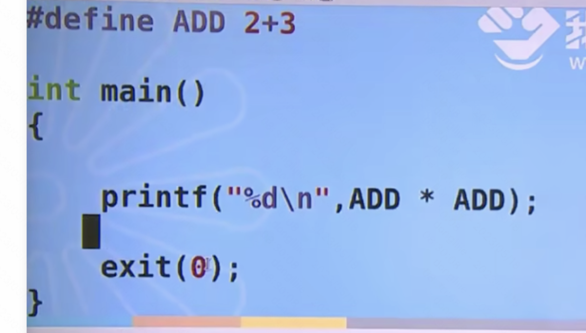

```
#include <stdio.h>
#include <stdlib.h>
#define ADD 2+3
int main(){
    printf("%d\n", ADD * ADD);
    exit(0);
}

编译： make define
运行：./define 
输出结果： 11
查看预处理结果：gcc -E define.c 
```

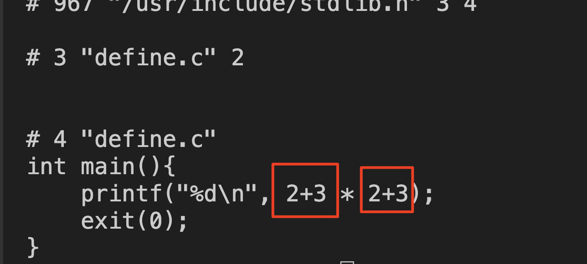

可以看到在预处理阶段，ADD 被完整替换为了2+3 ，所以程序运行的输出结果是11.

然后我们使用带参数的宏

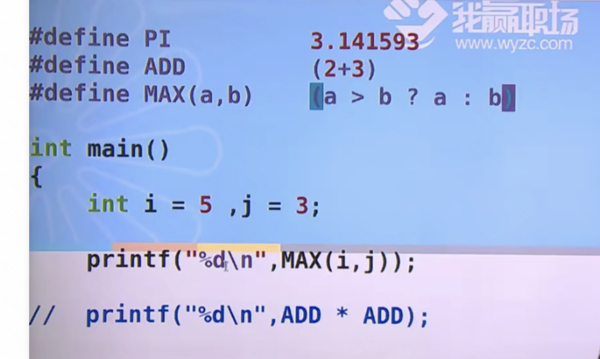

考虑到运算符的优先级，应该给每个变量都加上括号

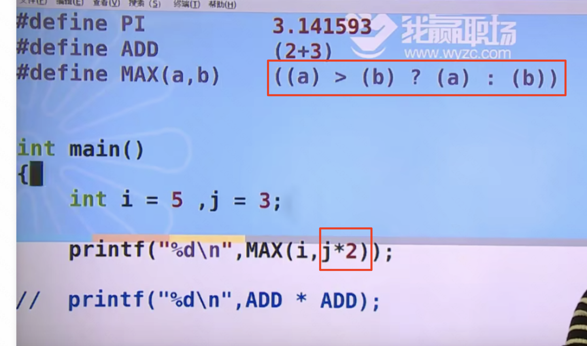

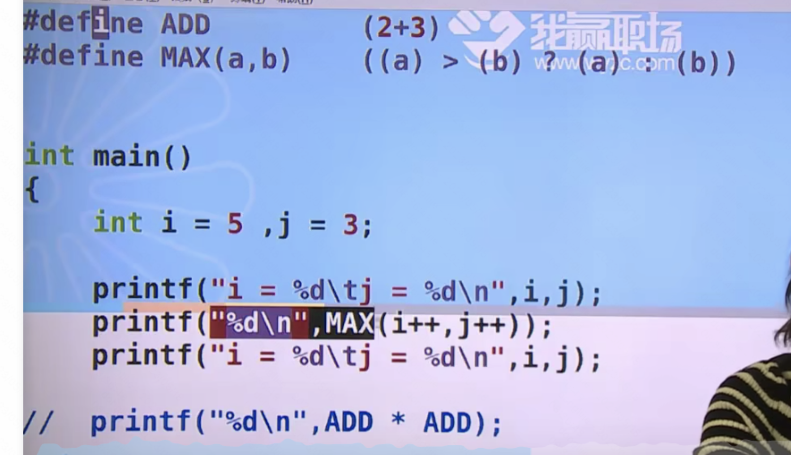

由于上面是完整替换，所有i的值会被计算两次，这是因为宏是完整替换。为了解决这个问题，可以使用函数来代替宏，也可以在宏里面使用变量接收传入的参数

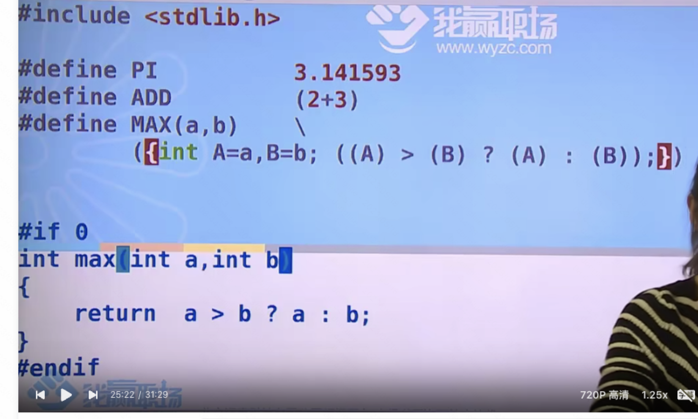

**变量的定义与声明**

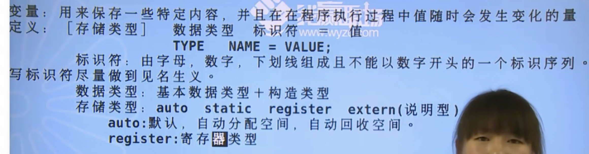

变量： 用来保存一些特定内容，并且在程序执行过程中值随时会发生变化的量。

定义：[存储类型] 数据类型 标识符 = 值

​				TYPE	NAME = VALUE

​	标识符：由字符，数字，下划线组成且不能以数字开头的一个标识序列。

​	数据类型：基本数据类型 + 构造类型

​	值：注意匹配。

​	存储类型：auto static register extern（说明型）

​			auto： 默认，自动分配空间，自动回收空间，它不会对变量进行初始化，如下代码 auto.c

```
#include <stdio.h>
#include <stdlib.h>
int main(){
    auto int i;
    int j;
    printf("i = %d\n", i);
    printf("j = %d\n", j);
    exit(0);
}
```

运行结果：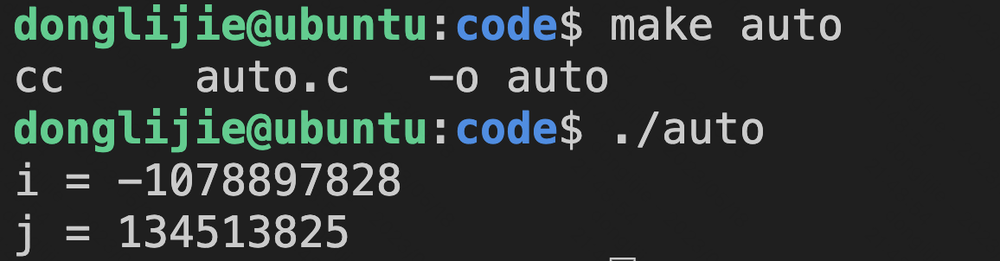

​			regiter：（建议型，编译器可以不采用）寄存器类型，只能定义局部变量，不能定义全局变量，大小有限制，只能定义32位大小的数据类型，如double就不可以，寄存器没有地址，所以一个寄存器类型的变量无法打印出地址查看或使用。

​			static： 静态型，自动初始化为0值或者空值，并且这种变量的值有继承性，也可以用来修饰变量或者函数(修饰全局变量和函数，就只能在当前文件中使用，不能在其他文件中使用)。

​			extern：说明型，意味着不能改变被说明的变量的值或类型,该变量在其他文件里面声明，没有必要在当前文件里面为它分配空间。通常用来表示，该变量是多个文件共享的。。

```
#include <stdio.h>
#include <stdlib.h>
void func(void){
    int x=0;
    x = x+1;
    printf("%p ->%d\n", &x,x);
}
int main(){
    func();
    func();
    func();
    exit(0);
}
```

运行结果：

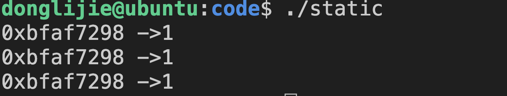

如果把x声明为static。

```
#include <stdio.h>
#include <stdlib.h>
void func(void){
   static int x=0;
    x = x+1;
    printf("%p ->%d\n", &x,x);
}
int main(){
    func();
    func();
    func();
    exit(0);
}
```

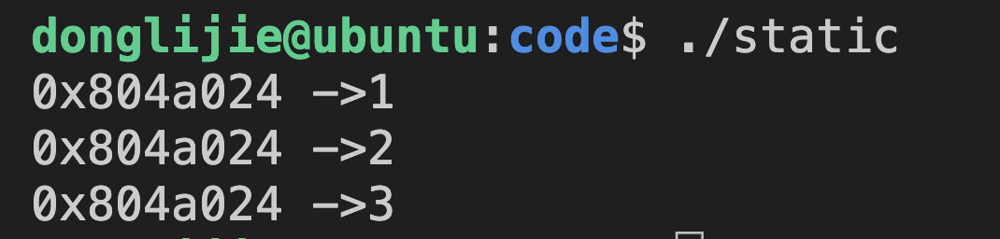

```
static说明符对于全局变量和局部变量有不同的含义。

（1）用于局部变量（位于块作用域内部）。

static用于函数内部声明的局部变量时，表示该变量的值会在函数每次执行后得到保留，下次执行时不会进行初始化，就类似于一个只用于函数内部的全局变量。由于不必每次执行函数时，都对该变量进行初始化，这样可以提高函数的执行速度，详见《函数》一章。

（2）用于全局变量（位于块作用域外部）。

static用于函数外部声明的全局变量时，表示该变量只用于当前文件，其他源码文件不可以引用该变量，即该变量不会被链接（link）。

static修饰的变量，初始化时，值不能等于变量，必须是常量。
```

​			extern：说明型，意味着不能改变被说明的变量的值或类型。

变量的生命周期和作用范围

​	1） 全局变量和局部变量

​		作用范围是从定义位置开始，一直到作用域结束，如果同时有全局变量和局部变量，则以局部变量为准。

**全局变量的冲突**

​		依次创建如下文件：main.c    project.c project.h，内容如下

```
#include <stdio.h>
#include <stdlib.h>
#include "project.h"
int i=10;
int main(){
    printf("[%s]:i = %d \n",__FUNCTION__, i);
    funcTest();
    exit(0);
}
```

```
#include <stdio.h>
#include <stdlib.h>
#include "project.h"
int i =100;
void funcTest(void){
    printf("[%s]:i = %d \n",__FUNCTION__, i);
    exit(0);
}
```

```
#ifndef PROJECT_H__
#define PROJECT_H__
void funcTest(void);
#endif
```

编译结果：

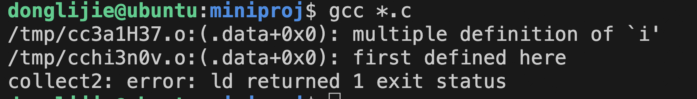

因为在两个文件里，都定义了一个全局变量i，所以导致了冲突。

这个时候就可以使用static关键字修饰，这样表示这个变量只能在当前文件中使用。

2）局部变量之间的区别	

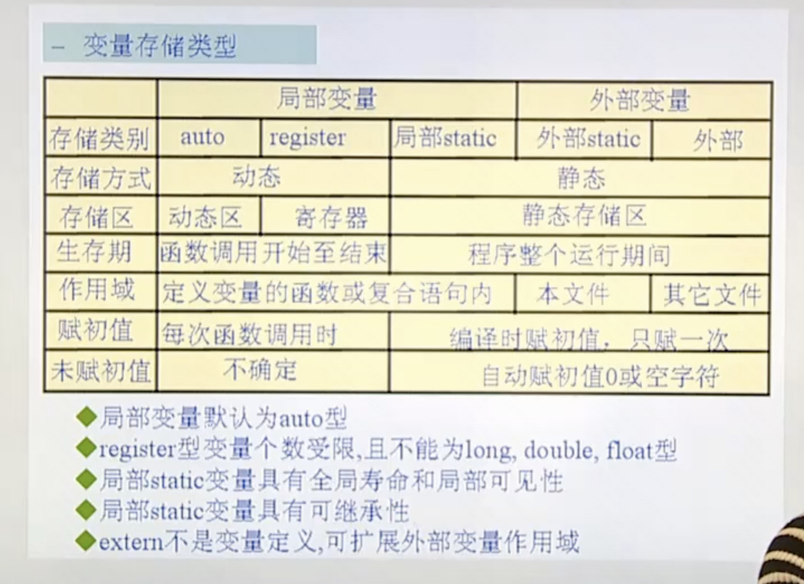

## 2.3 运算符和表达式

取余：% 要求两边都是正数。

sizeof： 是一个运算符，不是关键字。		

位运算：

​	将操作数中第n位置1，其他位不变：num = num |1 <<n

​	将操作数中第n位置0，其他位不变：num = num &~(1 <<n)

​	测试第n位：if（num & 1 <<n）

​	从一个指定宽度的数中取出其中的某几位。

# 3 输入、输出专题

标准IO和文件IO


格式化输入输出函数：scanf，printf

​	int printf(const char * format,...)

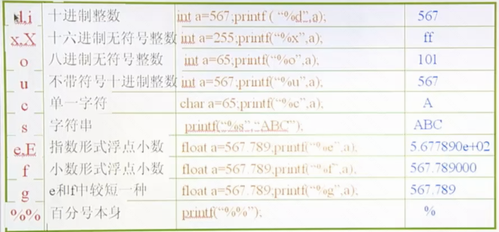

printf 加上\n，会刷新缓冲区。

scanf

​	int scanf(const char *format, ...);

​	抑制符： *

```
#include <stdio.h>
#include <stdlib.h>
int main(void){
    int i;
    float f;
    printf("Please enter:\n");
    scanf("%d%f", &i, &f);
    printf("i = %d\n", i);
    printf("f = %f\n", f);
    exit(0);
}
```

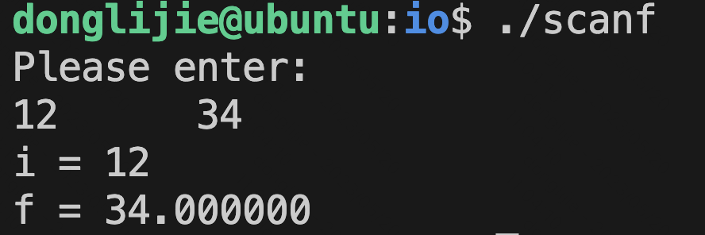

scanf 输入多个参数的时候，比如上面输入i和f，输入的格式字符串是"%d%f"，所以在输入的时候，可以按空格或者按回车或者按tab用来分割两个数，如果在格式字符串里加上一个逗号，那输入的时候就要按照这个格式，在两个数字之间加上逗号，否则就会有问题。

scanf 的返回值，用来表示输入的元素是否真的匹配。

抑制符 *

对于下面这样一段代码：

我定义了一个int i，然后定义了char ch，预期是我输入一个数字，然后再输入一个字符，然后程序再原样输出。但是运行结果如下，当我输入数字后，按照回车程序就结束了。程序输出的字符是换行。

```
#include <stdio.h>
#include <stdlib.h>
int main(void){
    int i;
    float f;
    char ch;
    scanf("%d", &i);
    scanf("%c", &ch);
    printf("i = %d,ch = %d\n", i, ch);
#if 0
    printf("Please enter:\n");
    scanf("%d#%f", &i, &f);
    printf("i = %d\n", i);
    printf("f = %f\n", f);
#endif

    exit(0);
}
```

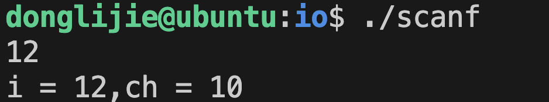

可以使用抑制符吞掉一个字符，把那个字符不赋值給ch。对应代码：`scanf("%*c%c", &ch);`


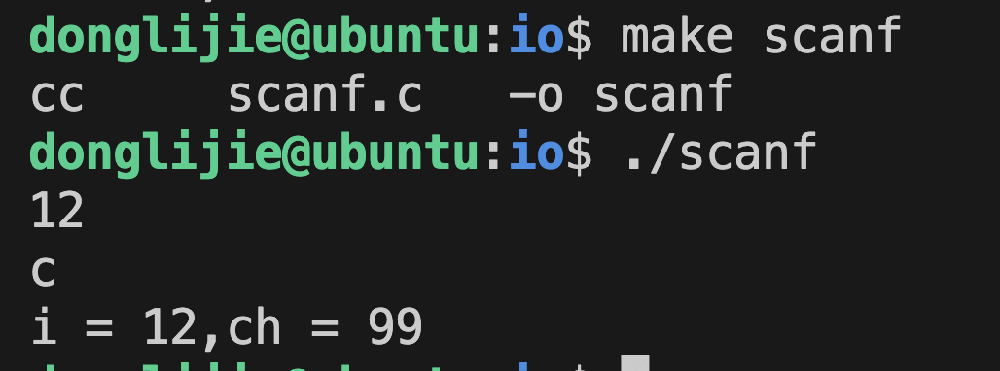

此外，scanf输入字符串(%s)的时候，不能在字符串中间上分割符，比如空格、tab等等，而且使用scanf输入字符串的时候有可能会出现溢出，就是限制输入字符串的长度N，可以输入超过N个字符。

字符输入输出函数：getchar,putchar

字符串输入输出函数：gets，puts

​	gets函数没有对输入的字符串的长度进行校验。可以使用fgets来代替。

# 4 流程控制

画流程图可以使用Dia，[参考链接](https://zhuanlan.zhihu.com/p/366116011)

# 5 数组

## 5.1一维数组

定义：[存储类型] 数据类型 标识符x

初始化： 使用static 声明数组，默认初始化为0

元素引用：数组名[下标]

数组名：数组名是表示地址的常量，也是数组的起始位置。

数组越界：完全没有校验

获取数组长度； sizeof(arr)/sizeof(arr[0])，就是数组总的长度除第一个元素的长度。

练习题：

1、fibonacci数列(求前十项)

2、数据排序

3、进制转换（终端输入十进制数，然后再输入要转换的进制）

4、删除法求质数（求1000以内，从2到1000，从2开始，把2，3，4等等一系列的倍数都删除，最后得出来的就是质数）

```
#include <stdio.h>
#include <stdlib.h>
static void fibonacci(void){
    int fib[10] ={1,1};
    for (int i=2; i<10; i ++) {
        fib[i] = fib[i -1] + fib[i-2];
    }
    for (int i=0; i<10; i++) {
        printf("%d  ", fib[i]);
    }
    printf("\n");
    return;
}
#define N 10
void bubble_sort(){
    int a[N] = {12,8,45,30,98,67,2,7,68,11};
    int tmp;
    for (int i=0; i< N; i ++) {
        printf("%d ", a[i]);
    }
    printf("\n");
    for (int i=0;i<N-1; i++) {
        for (int j=0;j <N-1-i; j ++) {
            if (a[j] > a[j+1]) {
             tmp = a[j];
             a[j] = a[j+1];
             a[j + 1] = tmp;
            }
        }
    }
    for (int i=0; i< N; i ++) {
        printf("%d ", a[i]);
    }
    printf("\n");
}
void select_sort(){
    int a[N] = {12,8,45,30,98,67,2,7,68,11};
    int tmp,k;
    for (int i=0; i< N; i ++) {
        printf("%d ", a[i]);
    }
    printf("\n");
    for(int i =0 ; i < N - 1; i++){ // i小于N或者i小于N-1 都没有关系
        k = i;
        for ( int j= i +1; j<N; j++) {
            if (a[j] < a[k]) {
                k = j;
            }
        }
        if (k!= i) {
           tmp = a[i];
           a[i] = a[k];
           a[k] = tmp;
        }

    }
    for (int i=0; i< N; i ++) {
        printf("%d ", a[i]);
    }
    printf("\n");
}
void base_convert(){
    int num, base;
    int n[128],i=0;
    printf("Please enter the convert number:");
    scanf("%d", &num);
    printf("Please enter the convert base:");
    scanf("%d", &base);
    do {
     n[i]= num %base;
     num = num /base;
     i ++;
    }while (num !=0);
    for (i --; i>=0; i--) {
        if (n[i]>=10) {
        printf("%c ", n[i] -10 + 'A');
        }else {
        printf("%d ", n[i]);
        }
    }
    printf("\n");

}
static void primer(void){
    char primer[1001] = {0};
    for (int i =2; i<1001;i++) {
        if (primer[i] ==0) {
            for (int j = i*2; j<1001;  j +=i) {
                primer[j] =-1;
            }
        }
    }
    printf("0-1000 primer is:");
    for (int i=2; i<1001; i++) {
        if (primer[i]==0) {
            printf("%d ",i);
        }
    }
    printf("\n");
}
int main(void){
    //fibonacci();
    //bubble_sort();
    //select_sort();
    //base_convert();
    primer();
    exit(0);
}
```

## 5.2二维数组

定义，初始化：[存储类型] 数据类型 标识符[行下标] [列下标]

​	二维数组定义时只有行号可以省略。

二维数组名是数组的起始值。

练习题：

1、行列互换

2、求最大值及其所在为i饿汉子

3、求各行各列的和

4、矩阵乘积

```
#include <stdio.h>
#include <stdlib.h>
#define M 2
#define N 3
static void conver_arr(void){
    int i,j;
    int a[M][N]={1,2,3,4,5,6},b[N][M];
    for (i =0; i<M; i++) {
        for (j =0; j<N; j++) {
            printf("%d ", a[i][j]);
            b[j][i]= a[i][j];
        }
        printf("\n");
    }
    for (i =0; i<N; i++) {
        for (j =0; j<M; j++) {
            printf("%d ", b[i][j]);
        }
        printf("\n");
    }
}
static void max(void){
    int a[M][N] = {43,4,23,89,9,7};
    int i,j;
    int max =a[0][0], row=0, col =0;
    for(i =0;i<M;i++){
        for (j=0; j<N; j++) {
            if(max < a[i][j]){
                max = a[i][j];
                row = i;
                col = j;
            }
        }
    }
    printf("max value is:%d, row is %d, col is:%d \n", max,row, col);
}
int main(){
    //conver_arr();
    max();
    exit(0);
}
```

二维数组实际上就是一个数组的数组。

比如int a[2] [3];这是一个两行三列的数组。a就是一个行指针。

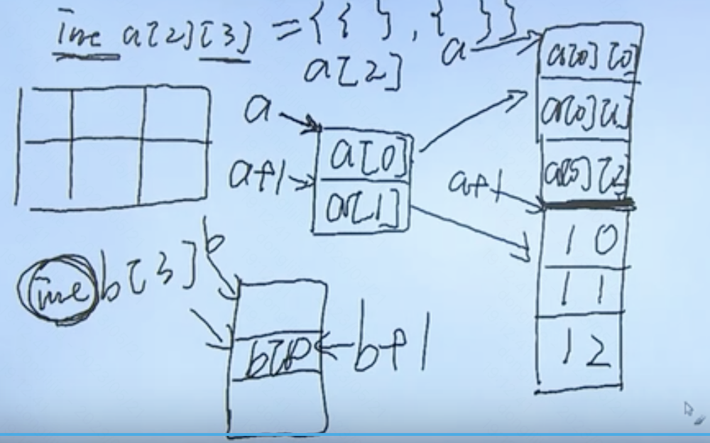

## 5.3字符数组

初始化，使用字符初始化，或者使用字符串常量初始化。

strlen函数获取字符串长度，遇到尾0（\0），就停止，比如这个字符串"hello\0abc"，输出的实际上就不对。输出的是5，但是实际上是10，sizeof 计算的是字符串在内容中的占用的字节数。

```
char str[] = "hello\0abc";
    printf("%u\n", strlen(str)); // 输出5
    printf("%u\n", sizeof(str)); // 输出10
```

strcpy 拷贝字符串

strncpy 拷贝字符串，同时指定长度。

# 6 指针

1、变量与地址的关系

​	变量实际上就是地址的别名，指针就是地址。

2、指针与指针变量

​	用来保存指针的变量。从下面这张图可以看出，指针变量就是一级一级的嵌套。


​	i 值是1

​	&i（i的地址）0x2000

​	p的值0x2000

​	&p的地址是0x3000

​	*p（获取p指向的值） *(0x2000) ->1

i<=>*p， i和 *p是等价的。

&i<=> p i的地址和p的值是等价的。

​	q：0x3000 （存储的是p的地址）

​	&q： 0x4000

​	*q： *（&p）->p -> &i , q指针的内容是0x3000，0x3000是一个地址， * 就是获取这个地址里面存储的内容，所以就是获取）0x3000里面存储的内容，就是0x2000，也就是i的地址，也是p的值。

​    **q： *( *q) -> *（p）->1 这个就相当于是获取p指向的值。

现在想要获取i就有三种方式：i<=>*p<=> **q

通过i获取值是直接访问，通过p获取i的值是间接访问。

```
#include <stdio.h>
#include <stdlib.h>

int main(){
    int i = 1;
    int *p;
    p =&i;
    printf("i = %d\n", i);
    printf("&i = %p\n", &i);
    printf("p = %p\n", p);
    printf("&p = %p\n", &p);
    printf("*p = %d\n", *p);


    exit(0);
}
运行结果：
i = 1
&i = 0x7ff7bac6c518
p = 0x7ff7bac6c518
&p = 0x7ff7bac6c510
*p = 1
```

不同类型的指针，在同一平台下面所占大小是一样的。比如下面这段代码，在32位的机器上输出的是4，

```
int *p;
    p =&i;
    char* ch;
    printf("%d\n", sizeof(p));
    printf("%d\n", sizeof(ch));
```

3、直接访问和间接访问

4、空指针与野指针	

```
int *p = NULL; // 定义空指针
野指针：当前指针指向的地址是不确定的。
```

5、空类型

6、定义与初始化的书写规则

```
int *p = NULL; // 没有确定指针的指向，就让它先指向NULL
```

7、指针运算

​	&（取地址） *（取值） 关系运算 ++ --

8、指针与数组

​	指针与一维数组

```
#include <stdio.h>
#include <stdlib.h>
int main(){
    int a[3] = {1,2,3};
    int *p = a;
    int i;
    /*
        a[i] = *(a + i) = *(p + i) = p[i]
        &a[i] = a + i = p + i = &p[i]
        获取数组长度可以使用： sizeof(a)/sizeof(a[0]) 或者 sizeof(a)/sizeof(*a)
        p和a 都可以用来访问数组，它俩之间的区别，a是常量，p是变量，也就是a在初始化以后，
        就不能再赋值，但是p是可以赋值
    */
    for (i=0; i< sizeof(a)/sizeof(a[0]);  i ++) {
        //printf("%p ->%d \n",&a[i], a[i]);
       // printf("%p ->%d \n",a + i, a[i]);
         printf("%p ->%d \n",p + i, a[i]);
    }
    printf("\n");
    exit(0);
}
```

​	

​	指针与二维数组


比如上面这张图，a[m] [n]是一个二维数组，a指向数组的首地址，a + i 就是一个行指针的移动，或者把a看作是一个一维的长度为n的数组，只不过a里面的元素又是一个一维数组，所以a + i就是相当于一个指针变量指向了第i行元素的首地址，*（a + i）就是获取第i行首元素的地址， *（a + i） + j 就是获取第i行第j列的地址，然后 *（ *（a + i） + j） 就是获取第i行第j列的值。所以a是一个指针常量，但是同时也是一个指向指针的指针。

```
#include <stdio.h>
#include <stdlib.h>
int main(){
    int a[2][3] = {1,2,3,4,5,6};
    int i,j;
    //以下是二维数组的输出
    #if 0
    for (i=0; i< 2;  i ++) {
         for (j=0; j<3 ;j++) {
            printf("%d ",a[i][j]);
         }
         printf("\n");
    }
    #endif
    /* a 是行指针，a + 1 是跳过一行,下面是验证代码，并且声明一个指针让 
    它指向数组首元素的地址，有两种方式 p = *(a+i) + j;或 p = &a[i][j]
    特别的是数组首元素的地址：p = *a; p = &a[0][0]，这里p指针是当作一个列指针。
    */
    int *p;
    p = *a;// p = &a[0][0]
    printf("%p %p\n",a, a + 1);
    printf("%p %p\n",p, &a[0][0]);

    for (i=0; i< 2;  i ++) {
         for (j=0; j<3 ;j++) {
            printf("%p -> %d\n",&a[i][j],a[i][j]);
         }
         printf("\n");
    }

    int  (*q)[3]= a;
    exit(0);
}
```

​	指针与字符数组

```
#include <stdio.h>
#include <stdlib.h>
#include <string.h>
int main(){
    char *str = "helloll";
    printf("%u %u\n", sizeof(str), strlen(str));
 //   strcpy(str,"world");  str指向了一个串常量，所以在拷贝的时候会出错。
    str = "worldll";
    puts(str);
    #if 0
    char str[] = "hello";
    // 下面这行代码有问题，数组名是一个常量是不能在除初始化的情况下进行赋值
   // str = "world"; 
   // sizeof 包含尾0， strlen不包含尾0，遇到尾0就终止，即使尾0在字符中间
    printf("%u %u\n", sizeof(str), strlen(str));
   strcpy(str,"world");
   puts(str);
   #endif
    exit(0);
}
```

9、const与指针

```
#include <stdio.h>
#include <stdlib.h>
/**
 * const int a;
 * int const a;
 * const int *p;
 * int const  *p;
 * int * const p;
 * const int * const p
 */
 #define PI 3.14
 // 2 * PI * r
 int main(){
    const float  pi = 3.14;
    // fi = 3.14159 这样赋值有问题
    float *p = &pi;
    *p = 3.14159;
    printf("%f\n", pi);
    exit(0);
 }
```

const 定义的常量无法进行修改，但是可以通过定义一个指针，间接对这个常量进行赋值。

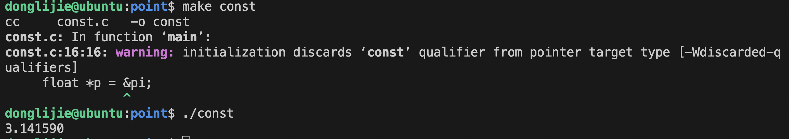

常量指针

```
#include <stdio.h>
#include <stdlib.h>
/**
 * const int a;
 * int const a;
 * const int *p; // 常量指针 ，指针指向的地址可以变化，但是指针指向的地址的值不可以变
   const 在星号前面，把*p看成一个值，const 一个值，就表示这个值不可以发生变化，
 * int const  *p; // 常量指针
 * int * const p; // 指针常量 指针指向的地址不能变，但是指针指向的地址的值可以变
 * const int * const p
 */
 #define PI 3.14
 // 2 * PI * r
 int main(){
    int i =1;
    int j=100;
    const int *p =&i;
    // i =10; 可以赋值
    //*p =10; 有问题
    p = &j; // 这样是没有问题的
    printf("%d\n", *p);
    exit(0);
 }
```

指针常量

```
#include <stdio.h>
#include <stdlib.h>
/**
 * const int a;
 * int const a;
 * const int *p; // 常量指针 ，指针指向的地址可以变化，但是指针指向的地址的值不可以变
   const 在星号前面，把*p看成一个值，const 一个值，就表示这个值不可以发生变化，
 * int const  *p; // 常量指针
 * int * const p; // 指针常量 指针指向的地址不能变，但是指针指向的地址的值可以变
 * const int * const p 指向的地址和指向的地址的值都不可以发生变化
 */
 #define PI 3.14
 // 2 * PI * r
 int main(){
    int i =1;
    int j=100;
    int * const p =&i;
   //  p = &j; 这样是有问题的
   *p =2;
    printf("%d\n", *p);
    exit(0);
 }
```

10、指针数组和数组指针

​	数组指针： [存储类型] 数据类型 (* 指针名) [下标] = 值

​		如 int (*p)[3] =a// 这里a是一个二维数组，列的长度是3, 这里进行抽象的话，typename 就是 int[3] ,实际上，要是把[3] 放到int后面就好了， 这样定义的话，对a进行操作在行之间进行移动，完全可以用p来代替。

​	指针数组：[存储类型] 数据类型 * 数组名[长度]

​		如 int * arr[3];=》 TYPE NAME;=> int *[3] arr；

字符指针和字符数组的区别：

​	字符指针： char *s = "helloll";

​	字符数组：char[] str = "helloll";

​	1、字符指针指向的字符窜，在C语言内部被当作常量，不能对字符串本身进行修改。

​	2、字符指针可以指向另一个字符串，但是字符数组不可以（这是因为字符数组名被当作是一个常量。）

比如下面这段代码：

```
// str 是字符指针，所以在使用strcpy函数的时候会报错，但是可以让它指向另一个字符串常量。
char *str = "helloll";
    printf("%u %u\n", sizeof(str), strlen(str));
 //   strcpy(str,"world");  str指向了一个串常量，所以在拷贝的时候会出错。
    str = "worldll";
    puts(str);
```

11、多级指针

# 7 函数

## 1、函数的定义

​	数据类型 函数名(数据类型 形参名)

## 2、函数的传参

​	值传递

​	地址传递

​	引用变量

## 3、函数的调用

​	嵌套调用

​	递归s

## 4、函数与数组

### 	函数与一维数组

```
#include <stdio.h>
#include <stdlib.h>
void print_arr(int *p){

    int i;
    printf("%s:%d\n",__FUNCTION__,sizeof(p));
    /*
    for( i=0; i< sizeof(a)/sizeof(*a); i++){
        printf("%d ",a[i]);
    }
    printf("\n");*/
}
int main(){
    int a[] ={1,3,5,7,9};
    printf("%s:%d\n",__FUNCTION__,sizeof(a));
    print_arr(a);
    exit(0);
}
```

输出结果：

```
main:20
print_arr:4
```

从上面可以看出来，在main函数里输出的是整个数组所占的字节长度，在把一维数组的首地址传递过去的时候，使用sizeof输出的是数组首元素所占的字节长度。

想要输出一维数组里的所有元素，可以使用下面的代码，把数组的长度传递进去。

```
#include <stdio.h>
#include <stdlib.h>
void print_arr(int *p, int n){

    int i;
    printf("%s:%d\n",__FUNCTION__,sizeof(p));
    
    for( i=0; i< n; i++){
        printf("%d ",*(p + i));
    }
    printf("\n");
}
int main(){
    int a[] ={1,3,5,7,9};
    printf("%s:%d\n",__FUNCTION__,sizeof(a));
    print_arr(a, sizeof(a)/sizeof(*a));
    exit(0);
}
```

print_arr()中的形参是数组，传递参数是可以是int * p，也可以是 int p[]，而且我在[菜鸟教程](https://www.runoob.com/cprogramming/c-passing-arrays-to-functions.html)上面还看到一维数组在传递的时候还可以带上数组的长度。这里int *p 和int p[] 是等价的，所以在有的函数里可以看到 char **argv 和char *argv。 

我还试了，在函数定义的时候把数组长度给设置上去。但是执行结果还是打印出来的是数组首元素所占字节的长度，也就是说无论带不带长度，c 语言都只会把传递进来数组参数，看作是数组的第一个元素。

```
void print_arr2(int a[5]){
    printf("%s %d", __FUNCTION__, sizeof(a));
}
```

### 	函数与二维数组

```
#include <stdio.h>
#include <stdlib.h>
#define  M 3
#define  N 4
void print_arr(int *p, int n){
    int j;
    for (j=0; j<n; j++) {
            printf("%d ", p[j]);
    }
    printf("\n");
}
int main(){
    int i,j;
    int a[M][N] = {1,2,3,4,5,6,7,8,9,10,11,12};
    print_arr(&a[0][0], M*N);
}
```

这是第一种方式，把二维数组当作一个普通的一维数组。

运行结果：

```
donglijie@ubuntu:func$ ./arr2
1 2 3 4 5 6 7 8 9 10 11 12 
```


```
*a <=>a[0]<=>*(a+0)<=>&a[0][0]  都是一个列指针
a+ i 就是一个行指针。
```


另外一种方式：

```
#include <stdio.h>
#include <stdlib.h>
#define  M 3
#define  N 4
void print_arr(int *p, int n){
    printf("%s sizeof(p) = %d\n",__FUNCTION__, sizeof(p));
    int j;
    for (j=0; j<n; j++) {
            printf("%d ", p[j]);
    }
    printf("\n");
}
void print_arr1(int (*p)[N],int m, int n){
    int i,j;
    printf("%s sizeof(p) = %d\n",__FUNCTION__, sizeof(p));

    for (i=0; i<m; i++) {
        for (j =0; j<n; j++) {
            printf("%4d  ", *(*(p +i) +j));
        }
        printf("\n");
    }

}
int main(){
    int i,j;
    int a[M][N] = {1,2,3,4,5,6,7,8,9,10,11,12};
    printf("%s sizeof(a) = %d\n",__FUNCTION__, sizeof(a));
    print_arr(&a[0][0], M*N);
    print_arr1(a, M, N);
    #if 0
    print_arr(*a, M*N);
    print_arr(*(a+0), M*N);
    print_arr(a[0], M*N);
    #endif

    /*
    
    printf("a=>%p\n", a);
    printf("a[0]=>%p\n", *a);
    printf("*a +1=>%p\n", *a +1);
    printf("a[0]+1=>%p\n", a[0]+1);
    printf("*a=>%p\n", *a);
    printf("a[0][0] =>%p\n", &a[0][0]);
    printf("a+1 => %p \n", a+1);
    printf("*(a+1) => %p\n", *(a+1));*/

    exit(0);
}


```

运行结果：

```
main sizeof(a) = 48
print_arr sizeof(p) = 4
1 2 3 4 5 6 7 8 9 10 11 12 
print_arr1 sizeof(p) = 4
   1     2     3     4  
   5     6     7     8  
   9    10    11    12  
```

从上面的运行结果可以看出来，a一共12个元素，int字节长度是4，所以main函数里sizeof(a) 是48， 而print_arr 和print_arr1两个函数，传递的都是地址，它的长度都是4。只不过print_arr是把数组当作一维数组来处理，传递的可以认为是列指针，而print_arr1传递的是一个行指针。

具体把再函数里传递二维数组可以参考：[参考链接](https://blog.csdn.net/wokaowokaowokao12345/article/details/52999502)

二维数组的实参和形参的对应关系如下：

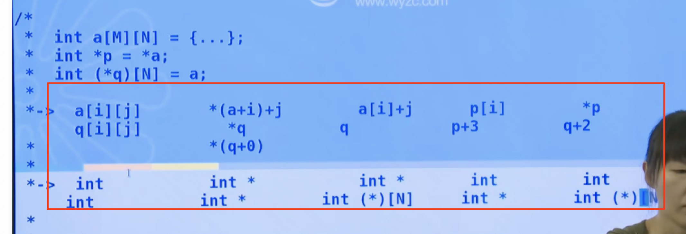

## 5、函数与指针

指针函数

​	返回值是一个指针

​		返回值 * 函数名(形参)

​		int * func(int)

函数指针

​	类型 (*指针名)(形参)

​	如 int (*p)(int); // 指针指向了函数

​	函数名是一段代码所关联的入口地址，所以可以定义一个同样类形的指针来代替函数。

函数指针数组

​	类型 （*数组名[下标]）(形参)

​	如: int (* arr[N])(int)

```
#include <stdio.h>
#include <stdlib.h>
int add(int a,int b){
    return a +b;
}
int main(){
    int a=3,b=5;
    int ret;
    // 定义一个函数指针
    int (*p)(int,int); 
    //ret =add(a,b);
    p = add;
    ret =p(a,b);
    int (* funcp[1])(int ,int);
    funcp[0] = add;
    ret = funcp[0](a,b);
    printf("%d\n", ret);

    exit(0);
}
```

# 八 构造类型

## 结构体

### 1、产生及意义

### 2、类型描述

```
struct 结构体名{

	数据类型 成员1；
	数据类型 成员2；
	......
}
```

### 3、嵌套定义

### 4、定义变量（变量，数组，指针），初始化及成员引用

​	成员引用：变量名.成员名

​			指针-> 成员名

### 5、占用内存空间大小

### 内存对齐

先定义一个这样的结构体：

```
struct simp_st{
    int i;
    char ch;
    float f;
    
};
```

输出这样两条语句

```
printf("sizeof(point) = %d\n", sizeof(p));
printf("sizeof(struct) = %d\n", sizeof(a));
```

执行结果：

```
sizeof(point) = 4
sizeof(struct) = 12
```

第一条语句输出指针变量所占字节大小，由于我的运行环境是32位机器，所以输出的结果是4。

第二条语句是输出结构体的大小，int float都是4字节，而char是1字节，具体原因稍后解释。

在结构体里面加一个字段

```
struct simp_st{
    int i;
    char ch1;
    char ch;
    float f;
    
};
```

执行结果没变

```
sizeof(point) = 4
sizeof(struct) = 12
```

然后调整一下位置就可以发现，结果发生变化

```
struct simp_st{
    int i;
    char ch;
    float f;
    char ch1;
};
```

运行结果：

```
sizeof(point) = 4
sizeof(struct) = 16
```

出现这个现象的原因就是因为内存对齐。

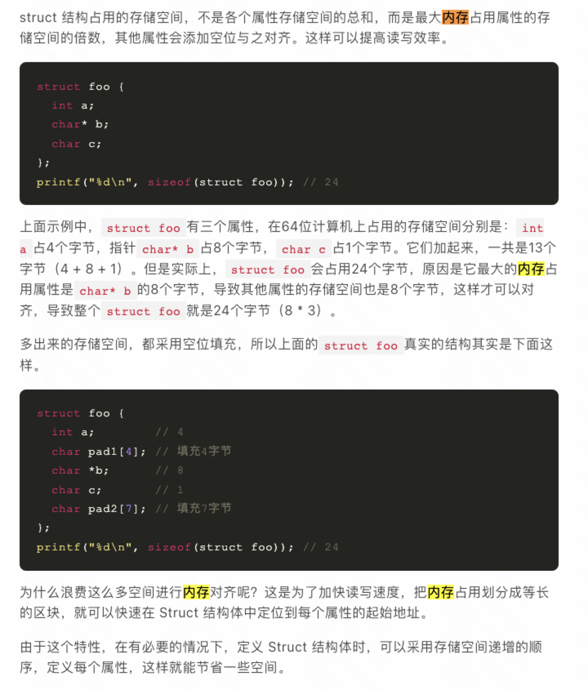

比如这样一个结构体：

```
struct simp_st{
    int i;
    char ch2;
    char ch;
    char ch3;
    char * b;
};
```

输出结果，这个结果是在64位的机器上输出的。

```
sizeof(point) = 8
sizeof(struct) = 16
```

char * b; 是8个字节，int 是4个字节char是1个字节，所以从上到下，是4，1，1，1，8前面四个加起来是7个字节，后面那个是8个字节，所以在7个字节后面加一个填充，就变成了16个字节。比如下面这样，我再加一个char ch4,

```
struct simp_st{
    int i;
    char ch2;
    char ch;
    char ch3;
    char ch4;
    char * b;
};
```

输出结果还是16个字节。

```
sizeof(point) = 8
sizeof(struct) = 16
```

然后我再加一个char ch5，结果就发生了变化了。

```
struct simp_st{
    int i;
    char ch2;
    char ch;
    char ch3;
    char ch4;
    char ch5;
    char * b;
};
```

```
sizeof(point) = 8
sizeof(struct) = 24
```

然后我再加一个char ch6

```
struct simp_st{
    int i;
    char ch2;
    char ch;
    char ch3;
    char ch4;
    char ch5;
    char ch6;
    char * b;
};
```

运行结果

```
sizeof(point) = 8
sizeof(struct) = 24
```

**在网络传输的过程中是要禁止对齐的。**

### 函数传参

```
#include <stdio.h>
#include <stdlib.h>
#define NAMESIZE 32

struct simp_st{
    int i;
    char ch;
    float f;
};

struct birthday_st{
    int year;
    int month;
    int day;
};
struct student_st{
    int id;
    char name[NAMESIZE];
    struct birthday_st birth;
    int math;
    int chinese;

};
void func(struct simp_st b){
    printf("%d \n", sizeof(b));
}
int main(){
    struct simp_st a;
    struct simp_st *p = &a;
    func(a);
    exit(0);
}
```

上面定义了一个函数，func，形参是一个struct变量。func输出形参所占的空间为12，相当于是把结构体a给完全拷贝了一份。

```
12 
sizeof(struct) = 12
```

### 练习：微型学生管理系统

```
#include <stdio.h>
#include <stdlib.h>
#include <string.h>
#define NAMESIZE 32
struct student_st{
    int id;
    char name[NAMESIZE];
    int math;
    int chinese;
};
void stu_set(struct student_st *p){
    p ->id = 10011;
    strncpy(p->name, "Alan", NAMESIZE);
    p->math =90;
    p->chinese =98;

}
void stu_show(struct student_st *p){
    printf("%d %s %d %d\n", p->id,p->name,p->math,p->chinese);
}
int main(){
    struct student_st stu;
    stu_set(&stu);
    stu_show(&stu);
   // stu_changename();
    exit(0);
}
```

### 共用体

### 1、产生及意义

### 2、类型描述

```
union 共用体名{
	数据类型 成员名1;
	数据类型 成员名2;
}
```

共用体中的多个变量一起共用一个空间，同一时间只有一个成员变量是有效的。

### 3、嵌套定义

```
struct {
    int i;
    char ch;
    union {
        int a;
        char c;

    }un;
    float f;
};
```


### 4、定义变量（变量、数组、指针）初始化及成员引用

​	成员引用： 变量名.成员名

​			  指针名->成员名

小练习：对一个32位的十六进制数相加。

```
#include <stdio.h>
#include <stdlib.h>
#include <stdint.h>

union test_un{
    struct{
        uint16_t i;
        uint16_t j;
    }x;
    uint32_t y;
}a;
int main(){
    a.y = 0x11223344;
    printf("%x\n", a.x.i+ a.x.j);
    exit(0);
}
```

运行结果：

```
4466
```

这里使用了共用体，虽然在赋值的时候把十六进制数0x11223344给赋值给了y，但是我们依旧可以通过结构体x来访问。

### 5、占用内存大小

内存以最大的元素为主。

### 6、函数传参（值、地址）

### 7、位域

## 枚举

### 定义：

```
enum 标识符{
	成员1,
	成员2；
	.....
}
```

# 九动态内存管理

## malloc calloc realloc free 

原则：谁申请谁释放

下面这段代码的问题，就是p申请的内存并没有真正的释放。

```
#include <stdio.h>
#include <stdlib.h>
void func(int *p, int n){
    p = malloc(n);
    if(p == NULL){
        exit(1);
    }
    return;
}
int main(){

    int num =100;
    int *p = NULL;
    func(p,num);
    free(p);
    exit(0);
 }
```

改进方法1：使用二级指针

```
#include <stdio.h>
#include <stdlib.h>
void func(int **p, int n){
    p = malloc(n);
    if(p == NULL){
        exit(1);
    }
    return;
}
int main(){

    int num =100;
    int *p = NULL;
    func(&p,num);
    free(p);
    exit(0);
 }
```

改进方法二： 增加返回值

```
#include <stdio.h>
#include <stdlib.h>
void * func(int *p, int n){
    p = malloc(n);
    if(p == NULL){
        exit(1);
    }
    return p;
}
int main(){

    int num =100;
    int *p = NULL;
    p = func(p,num);
    free(p);
    exit(0);
 }
```

## typedef

作用 为已有的数据类型改名

语法：typedef 已有的数据类型 新名字


```
#define INT int
typedef int INT
INT i; -> int i; //上面两种方式是没有区别的

#define IP int *
typedef int *IP
IP p,q; -> int *p,q;
IP p,q; ->int *p,*q;

typedef int ARR[6]; --> int[6] 起一个别名ARR
ARR a; --> int a[6]

struc node_st{
	int i;
	float f;
}
typedef struct node_st NODE;
NODE a; -> struct node_st a;
typedef struct node_st *NODEP; // 不推荐这样用，因为定义变量的时候，看不出来对应的变量是不是指针变量
NODEP p; --> struct node_st *p

typedef struc {
	int i;
	float f;
}NODE,*NODEP;    // 这样和上面是等价的

typedef int FUNC(int); // 给int(int)  起了一个别名FUNC
FUNC f; --> int f(int);
typedef int * FUNCP(int); // 给 int* (int) 起了一个别名 FUNCP
FUNCP p;-->int *p(int)

typedef int* (*FUNCP)(int);
FUNCP p;-->int* (*p)(int) // 定义了一个函数指针，该函数返回值是int*，形参是int。
```

# 十 Makefile工程文件的编写规则

文件名叫makefile 或者Makefile都可以。[参考链接](https://seisman.github.io/how-to-write-makefile/)

练习小demo

首先定义main.c tool1.c tool1.h tool2.c tool2.h

tool1.c

```
#include <stdio.h>
#include "tool1.h"
void mytool1(void){
    printf("tool1 print\n");
}
```

tool2.c

```
#include <stdio.h>
#include "tool2.h"
void mytool2(void){
    printf("tool2 print\n");
}
```

tool1.h

```
#ifndef TOOL1_H
#define TOOL1_H
void mytool1(void);
#endif
```

tool2.h

```
#ifndef TOOL2_H
#define TOOL2_H
void mytool2(void);
#endif
```

main.c

```
#include <stdio.h>
#include <stdlib.h>
#include "tool2.h"
#include "tool1.h"
int main(void){
    mytool1();
    mytool2();
    return 0;
}
```

makefile

需要注意的一点是，编辑main.o too1.o too2.o 这些目标文件时，都加上了-c选项，表示只生成目标文件（只进行编译，不生成链接生成可执行文件）。

```
mytool:main.o tool1.o tool2.o
	gcc main.o tool1.o tool2.o -o mytool
main.o:main.c
	gcc main.c	-c -Wall -g -o main.o	
tool1.o:tool1.c
	gcc tool1.c	-c -Wall -g -o tool1.o
tool2.o:tool2.c
	gcc tool2.c	-c -Wall -g -o tool2.o	
```

然后执行make 命令就可以了，然后输入./mytool 执行

在makefile末尾增加删除中间文件的代码

```
mytool:main.o tool1.o tool2.o
	gcc main.o tool1.o tool2.o -o mytool
main.o:main.c
	gcc main.c	-c -Wall -g -o main.o	
tool1.o:tool1.c
	gcc tool1.c	-c -Wall -g -o tool1.o
tool2.o:tool2.c
	gcc tool2.c	-c -Wall -g -o tool2.o	
clean:
	rm *.o mytool -rf
```

执行删除：make clean

第二个版本的makefile

```
OBJS= main.o tool1.o tool2.o
cc=gcc
mytool:$(OBJS)
	$(cc) $(OBJS) -o mytool
main.o:main.c
	$(cc) main.c	-c -Wall -g -o main.o	
tool1.o:tool1.c
	$(cc) tool1.c	-c -Wall -g -o tool1.o
tool2.o:tool2.c
	$(cc) tool2.c	-c -Wall -g -o tool2.o	
clean:
	$(RM) *.o mytool -r
```

在第二个版本里定义了一个变量OBJS， 然后在下面的编译命令里面就可以使用了，同时还使用了cc来代替gcc，cc也是定义的一个变量。$(RM) 等价于rm -f 

第三个版本的makefile

```
OBJS= main.o tool1.o tool2.o
cc=gcc
CFLAGS+=-c -Wall -g
mytool:$(OBJS)
	$(cc) $(OBJS) -o mytool
main.o:main.c
	$(cc) main.c	$(CFLAGS) -o main.o	
tool1.o:tool1.c
	$(cc) tool1.c	$(CFLAGS) -o tool1.o
tool2.o:tool2.c
	$(cc) tool2.c	$(CFLAGS) -o tool2.o	
clean:
	rm *.o mytool -rf
```

增加了一个CFLAGS变量用来增加编译选项，并且CFLAGS变量不能在右边加空格会有问题。

第四个版本的makefile

```
OBJS= main.o tool1.o tool2.o
cc=gcc
CFLAGS+=-c -Wall -g
mytool:$(OBJS)
	$(cc) $^ -o $@
main.o:main.c
	$(cc) $^	$(CFLAGS) -o $@
tool1.o:tool1.c
	$(cc) $^	$(CFLAGS) -o $@
tool2.o:tool2.c
	$(cc) $^	$(CFLAGS) -o $@
clean:
	rm *.o mytool -rf
```

用`$^` 代替上一个命令依赖的文件，比如下面这个，用$^ 代替依赖的$(OBJS)，同时也用$@来代替要生成的目标名。

```
mytool:$(OBJS)
	$(cc) $^ -o $@
```

# 数据结构

## 线性表

分为顺序存取的线性表（数组）和链式存储的线性表（单向链表和双向链表）

约瑟夫环：[参考链接](https://blog.csdn.net/qq_44625774/article/details/105518197) [参考链接2](https://bbs.huaweicloud.com/blogs/272825)

### 双向循环链表

双向循环链表的节点定义：

```
struct llist_node_st{
    void * data;
    struct llist_node_st *prev;
    struct llist_node_st *next;
};
typedef  struct{
    int size;
    struct llist_node_st head;

} LLIST;
```

上面这种定义，有一个问题就是在llist_node_st结构体中定义了一个指针data，用来指向要添加的数据，而且data这个指针，也占四个字节。这里就用到了[柔性数组](https://cloud.tencent.com/developer/article/2019613)这个是c99才开始支持的标准。

# 用过的c语言知识

## **snprintf**

作用：[格式化输出字符串，将结果写入到指定的缓冲区](https://www.runoob.com/cprogramming/c-function-snprintf.html)

## sizeof

这个函数主要是用来计算，输入的变量的size，让我疑惑的是，比如我定义了一个struct，然后我想要计算这个struct的大小，首先我定义了一个指针变量`struct llist_node_st  *newnode;`,然后我使用sizeof的时候，`sizeof(newnode)`,这样得到的size并不是struct llist_node_st的size，而是newnode 这个指针的大小，应该使用`sizeof(*newnode)`，我的理解是加上星号，表示取地址，表示这个指针指向的变量所占内容。我用下面的代码也进行了验证。

```
#include <stdlib.h>
#include <stdio.h>
 
int main()
{
    int *a;
    int b =12;
    printf("%d\n",sizeof(a));
    printf("%d\n",sizeof(*a));
    printf("%d\n",sizeof(b));
    return(0);
}
```

输出：

```
8
4
4
```

第一个是这个指针变量所占的内存的大小，后面两个是整型变量所占的内存大小。

函数指针当作回调函数

[参考链接](https://www.runoob.com/cprogramming/c-fun-pointer-callback.html)，在定义函数指针的时候，要加上typedef关键字，否则会有问题，比如在遍历双向循环链表的时候：`void llist_travel(LLIST *, llist_op *);`,，llist_travel这个函数的第二个参数llist_op就是一个回调函数。

```

//typedef void (*llist_op)(const void *); 这一行不是必须的
// 这是自定义了一个函数，上面那个才是函数指针
typedef void  llist_op1 (const void *);
```

自定义一个函数和自定义一个函数指针用法也不太一样：

在当作参数放到遍历函数里的时候，方式也不太一样，实际上，压根就不需要上面的typedef函数，头文件定义如下：

```
void llist_travel(LLIST *, void (*llist_op)(const void *));
void llist_travel1(LLIST *, llist_op1 *);
```

具体的实现：

可以看出来，自定义函数和自定义函数类型是完全不一样的。

```
void llist_travel(LLIST * ptr, void (*llist_op)(const void *)){
    struct llist_node_st *cur;
    for (cur = ptr->head.next; cur!=&ptr->head; cur = cur->next) {
        llist_op(cur->data);
    }

}
void llist_travel1(LLIST * ptr, llist_op1 * op){
    struct llist_node_st *cur;
    for (cur = ptr->head.next; cur!=&ptr->head; cur = cur->next) {
        op(cur->data);
    }

}
```

## if(0) if(1)

条件判断，在c语言里，0就表示为false，1就表示为真（准确来说，非0，就表示为真）。比如下面这段代码，就会输出true。

```
int x =-1;
	if(x){
		printf("true");
	}
```

