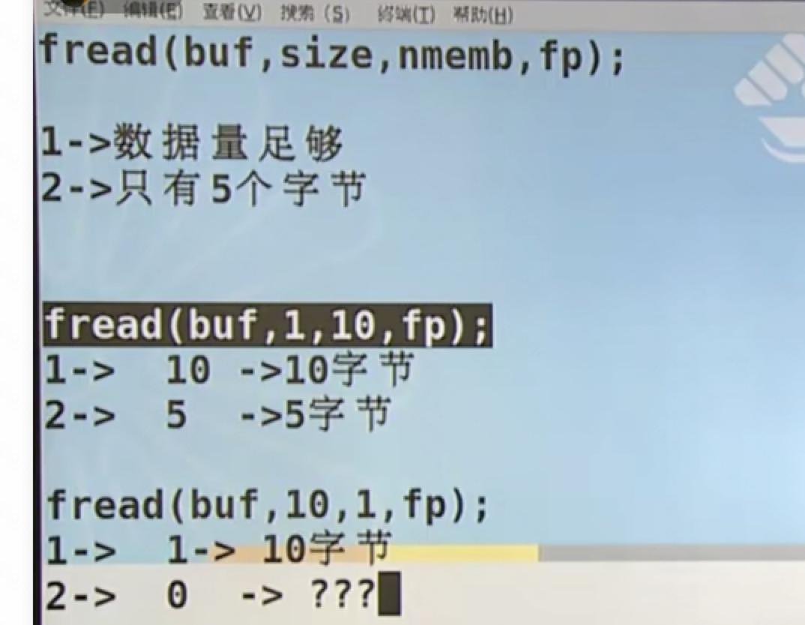
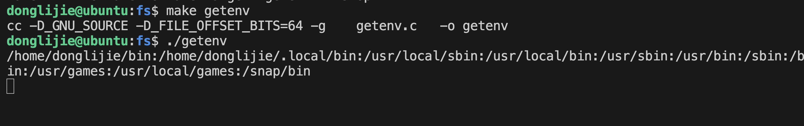
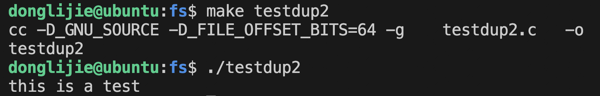
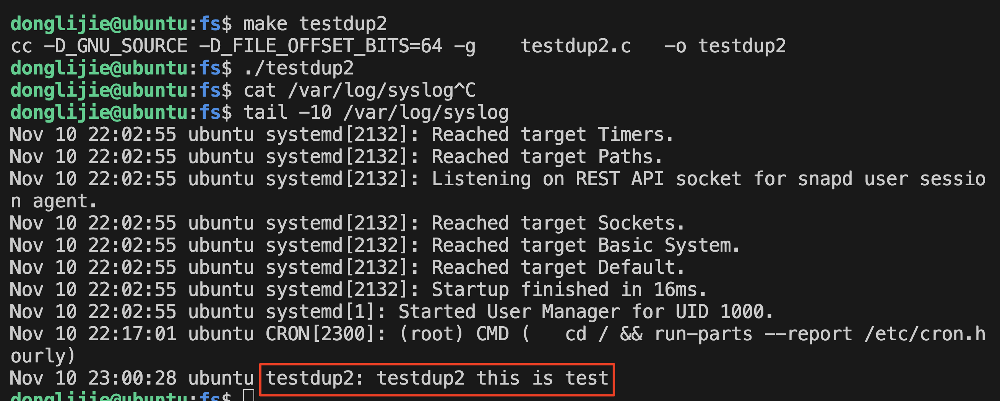
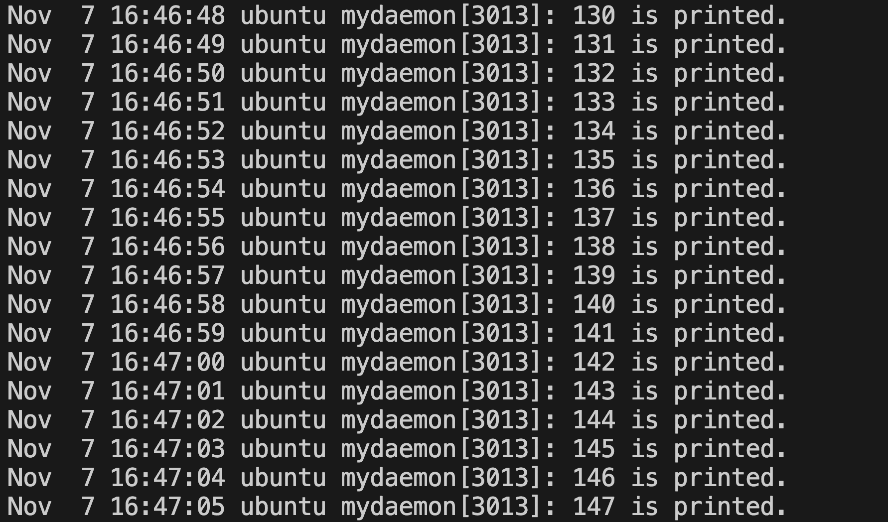
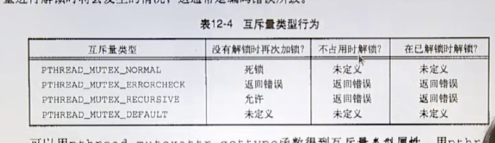

# 资料

视频链接：https://www.bilibili.com/video/BV18p4y167Md

同步代码到服务器：

```
rsync -av /Users/donglijie/Desktop/selfLearning/cstudy-code donglijie@192.100.219.110:/home/donglijie
```

[代码参考链接](https://github.com/impact-eintr/LinuxC)

[标准c和gnuc](https://blog.csdn.net/goodshanzi/article/details/119454523)

# 疑问

readdir 是不可重入的，返回结果存储在静态区，这个是如何得出来的。

[参考链接](https://zyfjeff.github.io/%E5%8D%9A%E5%AE%A2/doc/linux/Linux%E4%BF%A1%E5%8F%B7%E4%B8%93%E9%A2%98FAQ/)

可以打开多个目录，看一下结果是否正确，因为静态区只初始化一次，如果打开多次，第一次打开的访问就会有问题，可以写代码验证一下。

这个可能需要把信号给学了才知道。

# C基本内容

## 1 学习方法和基本概念简单介绍

学习建议：

1、概念的正确性

2、动手能力

3、阅读优秀的程序段

4、大量练习，面试题

c课程讲解思路

​	1、基本概念

​	2、数据类型，运算符和表达式

​	3、输入输出专题

​    4、流程控制

​	5、数组

​	6、指针

​    7、函数

​    8、构造类型

​	9、动态内存管理

​	10、调试工具（gdb,make）

​	11、常用库函数

### 1.2 gcc与vim的使用

hello world 程序，c语言main函数定义有很多种，在该课程里面，如果main函数不需要传参数，就定义成 int main(void), 如果需要传参数就定义成int main(int arc, char ** argv);


hello.c到可执行文件

编译器：gcc

c源文件->预处理->编译->汇编->链接

预处理： gcc -E hello.c > hello.i

编译：gcc -S hello.i 或gcc -S hello.i -o hello.s

汇编：gcc -c hello.s -o hello.o

链接： gcc hello.o -o hello

编辑器：

vim 熟悉vim常用的脚本

我不太想用vim。后面再说吧。

### 1.3 基本概念

写代码的时候把gcc报的warnging都给解决掉，除非你能确认这个warnging对程序无影响。

gcc 编译的时候， -Wall 选项可以打印出所有的警告

1、以hello world 程序为例

- 头文件包含的重要性
- 以函数为单位进行编程
- 声明部分+ 定义部分

 **echo $?** 在shell脚本中输出上一条命令的返回值。

- return 0;

- 添加注释

  #if  0 也可以添加注释

2、算法：解决问题的办法（流程图、NS图、有限状态机FSM）

3、程序：用某种语言实现算法

4、进程：

​	防止写越界，防止内存泄漏，谁打开谁关闭，谁申请谁释放。

## 2 数据类型，运算符和表达式

### 2.1 数据类型（基本数据类型）

如下图


1）所占字节数

2）存储和区别

​	整型数在计算机中是以补码的形式进行存储。

​	float， 对于 32 位的浮点数，最高的 1 位是符号位 s ，接着的 8 位是指数 E ，剩下的 23 位为有效数字 M。[参考链接](https://www.jb51.net/article/244252.htm)

​	增加实数存储的详细过程，[参考链接](https://zhuanlan.zhihu.com/p/152338612)

​	c 语言char 型变量是有符号还是无符号是未定义的。

3）不同类型的数据间进行转换（隐式转换或显式转换-->强制类型转换）

​	隐士转换： 比如double 和 int 相加，会先把int 转成double然后进行操作。	

4）特殊性

​	（1）布尔型 bool

​	（2）float 类型

​			它是无法和一个准确的数值进行相等比较的，比如下图中的代码和0进行比较应该是和0相减，看它的精度，在某个范围内认为是0.

​		

​		（3） char型是否有符号是未定义

​		（4） 不同状态下的零值 0，'0'，"0",'\0'

​		（5）数据类型与后续代码中所使用的输入输出要相匹配（防止自相矛盾）。

### 2.2 常量与变量

常量：在程序执行过程中值不会发生变化的量。

​	分类：整型常量、实型常量、字符常量、字符串常量、标识常量

​			整型常量：1，2，3

​			实型常量：3.14

​			字符常量：由单引号引起来的单个字符或转义字符，如'a'、'\n'、'\t'、'\015'、'\x7f'、'\018'(这是一个错误的字符)。

​			

​			字符串常量：由双引号引起来的一个或多个字符组成的序列。如：""(这个叫空串),"a"，"XYZ"，"abc\n\021\018"


变量：用来保存一些特定内存，并且在程序执行过程中值随时会发生变化的量。

标识常量： #define，处理在程序的预处理阶段，占编译时间，参数一改，全改，缺点：不检查语法，只是单纯的宏名和宏体的替换。

```
#define 宏名 宏体 # 在预处理阶段，宏名会被宏体替换
```


```
#include <stdio.h>
#include <stdlib.h>
#define ADD 2+3
int main(){
    printf("%d\n", ADD * ADD);
    exit(0);
}

编译： make define
运行：./define 
输出结果： 11
查看预处理结果：gcc -E define.c 
```


可以看到在预处理阶段，ADD 被完整替换为了2+3 ，所以程序运行的输出结果是11.

然后我们使用带参数的宏


考虑到运算符的优先级，应该给每个变量都加上括号


由于上面是完整替换，所有i的值会被计算两次，这是因为宏是完整替换。为了解决这个问题，可以使用函数来代替宏，也可以在宏里面使用变量接收传入的参数


**变量的定义与声明**


变量： 用来保存一些特定内容，并且在程序执行过程中值随时会发生变化的量。

定义：[存储类型] 数据类型 标识符 = 值

​				TYPE	NAME = VALUE

​	标识符：由字符，数字，下划线组成且不能以数字开头的一个标识序列。

​	数据类型：基本数据类型 + 构造类型

​	值：注意匹配。

​	存储类型：auto static register extern（说明型）

​			auto： 默认，自动分配空间，自动回收空间，它不会对变量进行初始化，如下代码 auto.c

```
#include <stdio.h>
#include <stdlib.h>
int main(){
    auto int i;
    int j;
    printf("i = %d\n", i);
    printf("j = %d\n", j);
    exit(0);
}
```

运行结果：

​			regiter：（建议型，编译器可以不采用）寄存器类型，只能定义局部变量，不能定义全局变量，大小有限制，只能定义32位大小的数据类型，如double就不可以，寄存器没有地址，所以一个寄存器类型的变量无法打印出地址查看或使用。

​			static： 静态型，自动初始化为0值或者空值，并且这种变量的值有继承性，也可以用来修饰变量或者函数(修饰全局变量和函数，就只能在当前文件中使用，不能在其他文件中使用)。

​			extern：说明型，意味着不能改变被说明的变量的值或类型,该变量在其他文件里面声明，没有必要在当前文件里面为它分配空间。通常用来表示，该变量是多个文件共享的。。

```
#include <stdio.h>
#include <stdlib.h>
void func(void){
    int x=0;
    x = x+1;
    printf("%p ->%d\n", &x,x);
}
int main(){
    func();
    func();
    func();
    exit(0);
}
```

运行结果：


如果把x声明为static。

```
#include <stdio.h>
#include <stdlib.h>
void func(void){
   static int x=0;
    x = x+1;
    printf("%p ->%d\n", &x,x);
}
int main(){
    func();
    func();
    func();
    exit(0);
}
```


```
static说明符对于全局变量和局部变量有不同的含义。

（1）用于局部变量（位于块作用域内部）。

static用于函数内部声明的局部变量时，表示该变量的值会在函数每次执行后得到保留，下次执行时不会进行初始化，就类似于一个只用于函数内部的全局变量。由于不必每次执行函数时，都对该变量进行初始化，这样可以提高函数的执行速度，详见《函数》一章。

（2）用于全局变量（位于块作用域外部）。

static用于函数外部声明的全局变量时，表示该变量只用于当前文件，其他源码文件不可以引用该变量，即该变量不会被链接（link）。

static修饰的变量，初始化时，值不能等于变量，必须是常量。
```

​			extern：说明型，意味着不能改变被说明的变量的值或类型。

变量的生命周期和作用范围

​	1） 全局变量和局部变量

​		作用范围是从定义位置开始，一直到作用域结束，如果同时有全局变量和局部变量，则以局部变量为准。

**全局变量的冲突**

​		依次创建如下文件：main.c    project.c project.h，内容如下

```
#include <stdio.h>
#include <stdlib.h>
#include "project.h"
int i=10;
int main(){
    printf("[%s]:i = %d \n",__FUNCTION__, i);
    funcTest();
    exit(0);
}
```

```
#include <stdio.h>
#include <stdlib.h>
#include "project.h"
int i =100;
void funcTest(void){
    printf("[%s]:i = %d \n",__FUNCTION__, i);
    exit(0);
}
```

```
#ifndef PROJECT_H__
#define PROJECT_H__
void funcTest(void);
#endif
```

编译结果：


因为在两个文件里，都定义了一个全局变量i，所以导致了冲突。

这个时候就可以使用static关键字修饰，这样表示这个变量只能在当前文件中使用。

2）局部变量之间的区别	


### 2.3 运算符和表达式

取余：% 要求两边都是正数。

sizeof： 是一个运算符，不是关键字。		

位运算：

​	将操作数中第n位置1，其他位不变：num = num |1 <<n

​	将操作数中第n位置0，其他位不变：num = num &~(1 <<n)

​	测试第n位：if（num & 1 <<n）

​	从一个指定宽度的数中取出其中的某几位。

## 3 输入、输出专题

标准IO和文件IO


格式化输入输出函数：scanf，printf

​	int printf(const char * format,...)


printf 加上\n，会刷新缓冲区。

scanf

​	int scanf(const char *format, ...);

​	抑制符： *

```
#include <stdio.h>
#include <stdlib.h>
int main(void){
    int i;
    float f;
    printf("Please enter:\n");
    scanf("%d%f", &i, &f);
    printf("i = %d\n", i);
    printf("f = %f\n", f);
    exit(0);
}
```


scanf 输入多个参数的时候，比如上面输入i和f，输入的格式字符串是"%d%f"，所以在输入的时候，可以按空格或者按回车或者按tab用来分割两个数，如果在格式字符串里加上一个逗号，那输入的时候就要按照这个格式，在两个数字之间加上逗号，否则就会有问题。

scanf 的返回值，用来表示输入的元素是否真的匹配。

抑制符 *

对于下面这样一段代码：

我定义了一个int i，然后定义了char ch，预期是我输入一个数字，然后再输入一个字符，然后程序再原样输出。但是运行结果如下，当我输入数字后，按照回车程序就结束了。程序输出的字符是换行。

```
#include <stdio.h>
#include <stdlib.h>
int main(void){
    int i;
    float f;
    char ch;
    scanf("%d", &i);
    scanf("%c", &ch);
    printf("i = %d,ch = %d\n", i, ch);
#if 0
    printf("Please enter:\n");
    scanf("%d#%f", &i, &f);
    printf("i = %d\n", i);
    printf("f = %f\n", f);
#endif

    exit(0);
}
```


可以使用抑制符吞掉一个字符，把那个字符不赋值給ch。对应代码：`scanf("%*c%c", &ch);`


此外，scanf输入字符串(%s)的时候，不能在字符串中间上分割符，比如空格、tab等等，而且使用scanf输入字符串的时候有可能会出现溢出，就是限制输入字符串的长度N，可以输入超过N个字符。

字符输入输出函数：getchar,putchar

字符串输入输出函数：gets，puts

​	gets函数没有对输入的字符串的长度进行校验。可以使用fgets来代替。

## 4 流程控制

画流程图可以使用Dia，[参考链接](https://zhuanlan.zhihu.com/p/366116011)

## 5 数组

### 5.1一维数组

定义：[存储类型] 数据类型 标识符x

初始化： 使用static 声明数组，默认初始化为0

元素引用：数组名[下标]

数组名：数组名是表示地址的常量，也是数组的起始位置。

数组越界：完全没有校验

获取数组长度； sizeof(arr)/sizeof(arr[0])，就是数组总的长度除第一个元素的长度。

练习题：

1、fibonacci数列(求前十项)

2、数据排序

3、进制转换（终端输入十进制数，然后再输入要转换的进制）

4、删除法求质数（求1000以内，从2到1000，从2开始，把2，3，4等等一系列的倍数都删除，最后得出来的就是质数）

```
#include <stdio.h>
#include <stdlib.h>
static void fibonacci(void){
    int fib[10] ={1,1};
    for (int i=2; i<10; i ++) {
        fib[i] = fib[i -1] + fib[i-2];
    }
    for (int i=0; i<10; i++) {
        printf("%d  ", fib[i]);
    }
    printf("\n");
    return;
}
#define N 10
void bubble_sort(){
    int a[N] = {12,8,45,30,98,67,2,7,68,11};
    int tmp;
    for (int i=0; i< N; i ++) {
        printf("%d ", a[i]);
    }
    printf("\n");
    for (int i=0;i<N-1; i++) {
        for (int j=0;j <N-1-i; j ++) {
            if (a[j] > a[j+1]) {
             tmp = a[j];
             a[j] = a[j+1];
             a[j + 1] = tmp;
            }
        }
    }
    for (int i=0; i< N; i ++) {
        printf("%d ", a[i]);
    }
    printf("\n");
}
void select_sort(){
    int a[N] = {12,8,45,30,98,67,2,7,68,11};
    int tmp,k;
    for (int i=0; i< N; i ++) {
        printf("%d ", a[i]);
    }
    printf("\n");
    for(int i =0 ; i < N - 1; i++){ // i小于N或者i小于N-1 都没有关系
        k = i;
        for ( int j= i +1; j<N; j++) {
            if (a[j] < a[k]) {
                k = j;
            }
        }
        if (k!= i) {
           tmp = a[i];
           a[i] = a[k];
           a[k] = tmp;
        }

    }
    for (int i=0; i< N; i ++) {
        printf("%d ", a[i]);
    }
    printf("\n");
}
void base_convert(){
    int num, base;
    int n[128],i=0;
    printf("Please enter the convert number:");
    scanf("%d", &num);
    printf("Please enter the convert base:");
    scanf("%d", &base);
    do {
     n[i]= num %base;
     num = num /base;
     i ++;
    }while (num !=0);
    for (i --; i>=0; i--) {
        if (n[i]>=10) {
        printf("%c ", n[i] -10 + 'A');
        }else {
        printf("%d ", n[i]);
        }
    }
    printf("\n");

}
static void primer(void){
    char primer[1001] = {0};
    for (int i =2; i<1001;i++) {
        if (primer[i] ==0) {
            for (int j = i*2; j<1001;  j +=i) {
                primer[j] =-1;
            }
        }
    }
    printf("0-1000 primer is:");
    for (int i=2; i<1001; i++) {
        if (primer[i]==0) {
            printf("%d ",i);
        }
    }
    printf("\n");
}
int main(void){
    //fibonacci();
    //bubble_sort();
    //select_sort();
    //base_convert();
    primer();
    exit(0);
}
```

### 5.2二维数组

定义，初始化：[存储类型] 数据类型 标识符[行下标] [列下标]

​	二维数组定义时只有行号可以省略。

二维数组名是数组的起始值。

练习题：

1、行列互换

2、求最大值及其所在为i饿汉子

3、求各行各列的和

4、矩阵乘积

```
#include <stdio.h>
#include <stdlib.h>
#define M 2
#define N 3
static void conver_arr(void){
    int i,j;
    int a[M][N]={1,2,3,4,5,6},b[N][M];
    for (i =0; i<M; i++) {
        for (j =0; j<N; j++) {
            printf("%d ", a[i][j]);
            b[j][i]= a[i][j];
        }
        printf("\n");
    }
    for (i =0; i<N; i++) {
        for (j =0; j<M; j++) {
            printf("%d ", b[i][j]);
        }
        printf("\n");
    }
}
static void max(void){
    int a[M][N] = {43,4,23,89,9,7};
    int i,j;
    int max =a[0][0], row=0, col =0;
    for(i =0;i<M;i++){
        for (j=0; j<N; j++) {
            if(max < a[i][j]){
                max = a[i][j];
                row = i;
                col = j;
            }
        }
    }
    printf("max value is:%d, row is %d, col is:%d \n", max,row, col);
}
int main(){
    //conver_arr();
    max();
    exit(0);
}
```

二维数组实际上就是一个数组的数组。

比如int a[2] [3];这是一个两行三列的数组。a就是一个行指针。


### 5.3字符数组

初始化，使用字符初始化，或者使用字符串常量初始化。

strlen函数获取字符串长度，遇到尾0（\0），就停止，比如这个字符串"hello\0abc"，输出的实际上就不对。输出的是5，但是实际上是10，sizeof 计算的是字符串在内容中的占用的字节数。

```
char str[] = "hello\0abc";
    printf("%u\n", strlen(str)); // 输出5
    printf("%u\n", sizeof(str)); // 输出10
```

strcpy 拷贝字符串

strncpy 拷贝字符串，同时指定长度。

## 6 指针

1、变量与地址的关系

​	变量实际上就是地址的别名，指针就是地址。

2、指针与指针变量

​	用来保存指针的变量。从下面这张图可以看出，指针变量就是一级一级的嵌套。


​	i 值是1

​	&i（i的地址）0x2000

​	p的值0x2000

​	&p的地址是0x3000

​	*p（获取p指向的值） *(0x2000) ->1

i<=>*p， i和 *p是等价的。

&i<=> p i的地址和p的值是等价的。

​	q：0x3000 （存储的是p的地址）

​	&q： 0x4000

​	*q： *（&p）->p -> &i , q指针的内容是0x3000，0x3000是一个地址， * 就是获取这个地址里面存储的内容，所以就是获取）0x3000里面存储的内容，就是0x2000，也就是i的地址，也是p的值。

​    **q： *( *q) -> *（p）->1 这个就相当于是获取p指向的值。

现在想要获取i就有三种方式：i<=>*p<=> **q

通过i获取值是直接访问，通过p获取i的值是间接访问。

```
#include <stdio.h>
#include <stdlib.h>

int main(){
    int i = 1;
    int *p;
    p =&i;
    printf("i = %d\n", i);
    printf("&i = %p\n", &i);
    printf("p = %p\n", p);
    printf("&p = %p\n", &p);
    printf("*p = %d\n", *p);


    exit(0);
}
运行结果：
i = 1
&i = 0x7ff7bac6c518
p = 0x7ff7bac6c518
&p = 0x7ff7bac6c510
*p = 1
```

不同类型的指针，在同一平台下面所占大小是一样的。比如下面这段代码，在32位的机器上输出的是4，

```
int *p;
    p =&i;
    char* ch;
    printf("%d\n", sizeof(p));
    printf("%d\n", sizeof(ch));
```

3、直接访问和间接访问

4、空指针与野指针	

```
int *p = NULL; // 定义空指针
野指针：当前指针指向的地址是不确定的。
```

5、空类型

6、定义与初始化的书写规则

```
int *p = NULL; // 没有确定指针的指向，就让它先指向NULL
```

7、指针运算

​	&（取地址） *（取值） 关系运算 ++ --

8、指针与数组

​	指针与一维数组

```
#include <stdio.h>
#include <stdlib.h>
int main(){
    int a[3] = {1,2,3};
    int *p = a;
    int i;
    /*
        a[i] = *(a + i) = *(p + i) = p[i]
        &a[i] = a + i = p + i = &p[i]
        获取数组长度可以使用： sizeof(a)/sizeof(a[0]) 或者 sizeof(a)/sizeof(*a)
        p和a 都可以用来访问数组，它俩之间的区别，a是常量，p是变量，也就是a在初始化以后，
        就不能再赋值，但是p是可以赋值
    */
    for (i=0; i< sizeof(a)/sizeof(a[0]);  i ++) {
        //printf("%p ->%d \n",&a[i], a[i]);
       // printf("%p ->%d \n",a + i, a[i]);
         printf("%p ->%d \n",p + i, a[i]);
    }
    printf("\n");
    exit(0);
}
```

​	

​	指针与二维数组


比如上面这张图，a[m] [n]是一个二维数组，a指向数组的首地址，a + i 就是一个行指针的移动，或者把a看作是一个一维的长度为n的数组，只不过a里面的元素又是一个一维数组，所以a + i就是相当于一个指针变量指向了第i行元素的首地址，*（a + i）就是获取第i行首元素的地址， *（a + i） + j 就是获取第i行第j列的地址，然后 *（ *（a + i） + j） 就是获取第i行第j列的值。所以a是一个指针常量，但是同时也是一个指向指针的指针。

```
#include <stdio.h>
#include <stdlib.h>
int main(){
    int a[2][3] = {1,2,3,4,5,6};
    int i,j;
    //以下是二维数组的输出
    #if 0
    for (i=0; i< 2;  i ++) {
         for (j=0; j<3 ;j++) {
            printf("%d ",a[i][j]);
         }
         printf("\n");
    }
    #endif
    /* a 是行指针，a + 1 是跳过一行,下面是验证代码，并且声明一个指针让 
    它指向数组首元素的地址，有两种方式 p = *(a+i) + j;或 p = &a[i][j]
    特别的是数组首元素的地址：p = *a; p = &a[0][0]，这里p指针是当作一个列指针。
    */
    int *p;
    p = *a;// p = &a[0][0]
    printf("%p %p\n",a, a + 1);
    printf("%p %p\n",p, &a[0][0]);

    for (i=0; i< 2;  i ++) {
         for (j=0; j<3 ;j++) {
            printf("%p -> %d\n",&a[i][j],a[i][j]);
         }
         printf("\n");
    }

    int  (*q)[3]= a;
    exit(0);
}
```

​	指针与字符数组

```
#include <stdio.h>
#include <stdlib.h>
#include <string.h>
int main(){
    char *str = "helloll";
    printf("%u %u\n", sizeof(str), strlen(str));
 //   strcpy(str,"world");  str指向了一个串常量，所以在拷贝的时候会出错。
    str = "worldll";
    puts(str);
    #if 0
    char str[] = "hello";
    // 下面这行代码有问题，数组名是一个常量是不能在除初始化的情况下进行赋值
   // str = "world"; 
   // sizeof 包含尾0， strlen不包含尾0，遇到尾0就终止，即使尾0在字符中间
    printf("%u %u\n", sizeof(str), strlen(str));
   strcpy(str,"world");
   puts(str);
   #endif
    exit(0);
}
```

9、const与指针

```
#include <stdio.h>
#include <stdlib.h>
/**
 * const int a;
 * int const a;
 * const int *p;
 * int const  *p;
 * int * const p;
 * const int * const p
 */
 #define PI 3.14
 // 2 * PI * r
 int main(){
    const float  pi = 3.14;
    // fi = 3.14159 这样赋值有问题
    float *p = &pi;
    *p = 3.14159;
    printf("%f\n", pi);
    exit(0);
 }
```

const 定义的常量无法进行修改，但是可以通过定义一个指针，间接对这个常量进行赋值。


常量指针

```
#include <stdio.h>
#include <stdlib.h>
/**
 * const int a;
 * int const a;
 * const int *p; // 常量指针 ，指针指向的地址可以变化，但是指针指向的地址的值不可以变
   const 在星号前面，把*p看成一个值，const 一个值，就表示这个值不可以发生变化，
 * int const  *p; // 常量指针
 * int * const p; // 指针常量 指针指向的地址不能变，但是指针指向的地址的值可以变
 * const int * const p
 */
 #define PI 3.14
 // 2 * PI * r
 int main(){
    int i =1;
    int j=100;
    const int *p =&i;
    // i =10; 可以赋值
    //*p =10; 有问题
    p = &j; // 这样是没有问题的
    printf("%d\n", *p);
    exit(0);
 }
```

指针常量

```
#include <stdio.h>
#include <stdlib.h>
/**
 * const int a;
 * int const a;
 * const int *p; // 常量指针 ，指针指向的地址可以变化，但是指针指向的地址的值不可以变
   const 在星号前面，把*p看成一个值，const 一个值，就表示这个值不可以发生变化，
 * int const  *p; // 常量指针
 * int * const p; // 指针常量 指针指向的地址不能变，但是指针指向的地址的值可以变
 * const int * const p 指向的地址和指向的地址的值都不可以发生变化
 */
 #define PI 3.14
 // 2 * PI * r
 int main(){
    int i =1;
    int j=100;
    int * const p =&i;
   //  p = &j; 这样是有问题的
   *p =2;
    printf("%d\n", *p);
    exit(0);
 }
```

10、指针数组和数组指针

​	数组指针： [存储类型] 数据类型 (* 指针名) [下标] = 值

​		如 int (*p)[3] =a// 这里a是一个二维数组，列的长度是3, 这里进行抽象的话，typename 就是 int[3] ,实际上，要是把[3] 放到int后面就好了， 这样定义的话，对a进行操作在行之间进行移动，完全可以用p来代替。

​	指针数组：[存储类型] 数据类型 * 数组名[长度]

​		如 int * arr[3];=》 TYPE NAME;=> int *[3] arr；

字符指针和字符数组的区别：

​	字符指针： char *s = "helloll";

​	字符数组：char[] str = "helloll";

​	1、字符指针指向的字符窜，在C语言内部被当作常量，不能对字符串本身进行修改。

​	2、字符指针可以指向另一个字符串，但是字符数组不可以（这是因为字符数组名被当作是一个常量。）

比如下面这段代码：

```
// str 是字符指针，所以在使用strcpy函数的时候会报错，但是可以让它指向另一个字符串常量。
char *str = "helloll";
    printf("%u %u\n", sizeof(str), strlen(str));
 //   strcpy(str,"world");  str指向了一个串常量，所以在拷贝的时候会出错。
    str = "worldll";
    puts(str);
```

11、多级指针

## 7 函数

### 1、函数的定义

​	数据类型 函数名(数据类型 形参名)

### 2、函数的传参

​	值传递

​	地址传递

​	引用变量

### 3、函数的调用

​	嵌套调用

​	递归s

### 4、函数与数组

#### 	函数与一维数组

```
#include <stdio.h>
#include <stdlib.h>
void print_arr(int *p){

    int i;
    printf("%s:%d\n",__FUNCTION__,sizeof(p));
    /*
    for( i=0; i< sizeof(a)/sizeof(*a); i++){
        printf("%d ",a[i]);
    }
    printf("\n");*/
}
int main(){
    int a[] ={1,3,5,7,9};
    printf("%s:%d\n",__FUNCTION__,sizeof(a));
    print_arr(a);
    exit(0);
}
```

输出结果：

```
main:20
print_arr:4
```

从上面可以看出来，在main函数里输出的是整个数组所占的字节长度，在把一维数组的首地址传递过去的时候，使用sizeof输出的是数组首元素所占的字节长度。

想要输出一维数组里的所有元素，可以使用下面的代码，把数组的长度传递进去。

```
#include <stdio.h>
#include <stdlib.h>
void print_arr(int *p, int n){

    int i;
    printf("%s:%d\n",__FUNCTION__,sizeof(p));
    
    for( i=0; i< n; i++){
        printf("%d ",*(p + i));
    }
    printf("\n");
}
int main(){
    int a[] ={1,3,5,7,9};
    printf("%s:%d\n",__FUNCTION__,sizeof(a));
    print_arr(a, sizeof(a)/sizeof(*a));
    exit(0);
}
```

print_arr()中的形参是数组，传递参数是可以是int * p，也可以是 int p[]，而且我在[菜鸟教程](https://www.runoob.com/cprogramming/c-passing-arrays-to-functions.html)上面还看到一维数组在传递的时候还可以带上数组的长度。这里int *p 和int p[] 是等价的，所以在有的函数里可以看到 char **argv 和char *argv。 

我还试了，在函数定义的时候把数组长度给设置上去。但是执行结果还是打印出来的是数组首元素所占字节的长度，也就是说无论带不带长度，c 语言都只会把传递进来数组参数，看作是数组的第一个元素。

```
void print_arr2(int a[5]){
    printf("%s %d", __FUNCTION__, sizeof(a));
}
```

#### 	函数与二维数组

```
#include <stdio.h>
#include <stdlib.h>
#define  M 3
#define  N 4
void print_arr(int *p, int n){
    int j;
    for (j=0; j<n; j++) {
            printf("%d ", p[j]);
    }
    printf("\n");
}
int main(){
    int i,j;
    int a[M][N] = {1,2,3,4,5,6,7,8,9,10,11,12};
    print_arr(&a[0][0], M*N);
}
```

这是第一种方式，把二维数组当作一个普通的一维数组。

运行结果：

```
donglijie@ubuntu:func$ ./arr2
1 2 3 4 5 6 7 8 9 10 11 12 
```


```
*a <=>a[0]<=>*(a+0)<=>&a[0][0]  都是一个列指针
a+ i 就是一个行指针。
```


另外一种方式：

```
#include <stdio.h>
#include <stdlib.h>
#define  M 3
#define  N 4
void print_arr(int *p, int n){
    printf("%s sizeof(p) = %d\n",__FUNCTION__, sizeof(p));
    int j;
    for (j=0; j<n; j++) {
            printf("%d ", p[j]);
    }
    printf("\n");
}
void print_arr1(int (*p)[N],int m, int n){
    int i,j;
    printf("%s sizeof(p) = %d\n",__FUNCTION__, sizeof(p));

    for (i=0; i<m; i++) {
        for (j =0; j<n; j++) {
            printf("%4d  ", *(*(p +i) +j));
        }
        printf("\n");
    }

}
int main(){
    int i,j;
    int a[M][N] = {1,2,3,4,5,6,7,8,9,10,11,12};
    printf("%s sizeof(a) = %d\n",__FUNCTION__, sizeof(a));
    print_arr(&a[0][0], M*N);
    print_arr1(a, M, N);
    #if 0
    print_arr(*a, M*N);
    print_arr(*(a+0), M*N);
    print_arr(a[0], M*N);
    #endif

    /*
    
    printf("a=>%p\n", a);
    printf("a[0]=>%p\n", *a);
    printf("*a +1=>%p\n", *a +1);
    printf("a[0]+1=>%p\n", a[0]+1);
    printf("*a=>%p\n", *a);
    printf("a[0][0] =>%p\n", &a[0][0]);
    printf("a+1 => %p \n", a+1);
    printf("*(a+1) => %p\n", *(a+1));*/

    exit(0);
}


```

运行结果：

```
main sizeof(a) = 48
print_arr sizeof(p) = 4
1 2 3 4 5 6 7 8 9 10 11 12 
print_arr1 sizeof(p) = 4
   1     2     3     4  
   5     6     7     8  
   9    10    11    12  
```

从上面的运行结果可以看出来，a一共12个元素，int字节长度是4，所以main函数里sizeof(a) 是48， 而print_arr 和print_arr1两个函数，传递的都是地址，它的长度都是4。只不过print_arr是把数组当作一维数组来处理，传递的可以认为是列指针，而print_arr1传递的是一个行指针。

具体把再函数里传递二维数组可以参考：[参考链接](https://blog.csdn.net/wokaowokaowokao12345/article/details/52999502)

二维数组的实参和形参的对应关系如下：


## 5、函数与指针

指针函数

​	返回值是一个指针

​		返回值 * 函数名(形参)

​		int * func(int)

函数指针

​	类型 (*指针名)(形参)

​	如 int (*p)(int); // 指针指向了函数

​	函数名是一段代码所关联的入口地址，所以可以定义一个同样类形的指针来代替函数。

函数指针数组

​	类型 （*数组名[下标]）(形参)

​	如: int (* arr[N])(int)

```
#include <stdio.h>
#include <stdlib.h>
int add(int a,int b){
    return a +b;
}
int main(){
    int a=3,b=5;
    int ret;
    // 定义一个函数指针
    int (*p)(int,int); 
    //ret =add(a,b);
    p = add;
    ret =p(a,b);
    int (* funcp[1])(int ,int);
    funcp[0] = add;
    ret = funcp[0](a,b);
    printf("%d\n", ret);

    exit(0);
}
```

## 八 构造类型

### 结构体

### 1、产生及意义

### 2、类型描述

```
struct 结构体名{

	数据类型 成员1；
	数据类型 成员2；
	......
}
```

如果是结构体的普通变量，就需要用malloc申请内存，如果是指针变量就需要申请内存。

### 3、嵌套定义

### 4、定义变量（变量，数组，指针），初始化及成员引用

​	成员引用：变量名.成员名

​			指针-> 成员名

### 5、占用内存空间大小

### 内存对齐

先定义一个这样的结构体：

```
struct simp_st{
    int i;
    char ch;
    float f;
    
};
```

输出这样两条语句

```
printf("sizeof(point) = %d\n", sizeof(p));
printf("sizeof(struct) = %d\n", sizeof(a));
```

执行结果：

```
sizeof(point) = 4
sizeof(struct) = 12
```

第一条语句输出指针变量所占字节大小，由于我的运行环境是32位机器，所以输出的结果是4。

第二条语句是输出结构体的大小，int float都是4字节，而char是1字节，具体原因稍后解释。

在结构体里面加一个字段

```
struct simp_st{
    int i;
    char ch1;
    char ch;
    float f;
    
};
```

执行结果没变

```
sizeof(point) = 4
sizeof(struct) = 12
```

然后调整一下位置就可以发现，结果发生变化

```
struct simp_st{
    int i;
    char ch;
    float f;
    char ch1;
};
```

运行结果：

```
sizeof(point) = 4
sizeof(struct) = 16
```

出现这个现象的原因就是因为内存对齐。


比如这样一个结构体：

```
struct simp_st{
    int i;
    char ch2;
    char ch;
    char ch3;
    char * b;
};
```

输出结果，这个结果是在64位的机器上输出的。

```
sizeof(point) = 8
sizeof(struct) = 16
```

char * b; 是8个字节，int 是4个字节char是1个字节，所以从上到下，是4，1，1，1，8前面四个加起来是7个字节，后面那个是8个字节，所以在7个字节后面加一个填充，就变成了16个字节。比如下面这样，我再加一个char ch4,

```
struct simp_st{
    int i;
    char ch2;
    char ch;
    char ch3;
    char ch4;
    char * b;
};
```

输出结果还是16个字节。

```
sizeof(point) = 8
sizeof(struct) = 16
```

然后我再加一个char ch5，结果就发生了变化了。

```
struct simp_st{
    int i;
    char ch2;
    char ch;
    char ch3;
    char ch4;
    char ch5;
    char * b;
};
```

```
sizeof(point) = 8
sizeof(struct) = 24
```

然后我再加一个char ch6

```
struct simp_st{
    int i;
    char ch2;
    char ch;
    char ch3;
    char ch4;
    char ch5;
    char ch6;
    char * b;
};
```

运行结果

```
sizeof(point) = 8
sizeof(struct) = 24
```

**在网络传输的过程中是要禁止对齐的。**

### 函数传参

```
#include <stdio.h>
#include <stdlib.h>
#define NAMESIZE 32

struct simp_st{
    int i;
    char ch;
    float f;
};

struct birthday_st{
    int year;
    int month;
    int day;
};
struct student_st{
    int id;
    char name[NAMESIZE];
    struct birthday_st birth;
    int math;
    int chinese;

};
void func(struct simp_st b){
    printf("%d \n", sizeof(b));
}
int main(){
    struct simp_st a;
    struct simp_st *p = &a;
    func(a);
    exit(0);
}
```

上面定义了一个函数，func，形参是一个struct变量。func输出形参所占的空间为12，相当于是把结构体a给完全拷贝了一份。

```
12 
sizeof(struct) = 12
```

### 练习：微型学生管理系统

```
#include <stdio.h>
#include <stdlib.h>
#include <string.h>
#define NAMESIZE 32
struct student_st{
    int id;
    char name[NAMESIZE];
    int math;
    int chinese;
};
void stu_set(struct student_st *p){
    p ->id = 10011;
    strncpy(p->name, "Alan", NAMESIZE);
    p->math =90;
    p->chinese =98;

}
void stu_show(struct student_st *p){
    printf("%d %s %d %d\n", p->id,p->name,p->math,p->chinese);
}
int main(){
    struct student_st stu;
    stu_set(&stu);
    stu_show(&stu);
   // stu_changename();
    exit(0);
}
```

### 共用体

### 1、产生及意义

### 2、类型描述

```
union 共用体名{
	数据类型 成员名1;
	数据类型 成员名2;
}
```

共用体中的多个变量一起共用一个空间，同一时间只有一个成员变量是有效的。

### 3、嵌套定义

```
struct {
    int i;
    char ch;
    union {
        int a;
        char c;

    }un;
    float f;
};
```


### 4、定义变量（变量、数组、指针）初始化及成员引用

​	成员引用： 变量名.成员名

​			  指针名->成员名

小练习：对一个32位的十六进制数相加。

```
#include <stdio.h>
#include <stdlib.h>
#include <stdint.h>

union test_un{
    struct{
        uint16_t i;
        uint16_t j;
    }x;
    uint32_t y;
}a;
int main(){
    a.y = 0x11223344;
    printf("%x\n", a.x.i+ a.x.j);
    exit(0);
}
```

运行结果：

```
4466
```

这里使用了共用体，虽然在赋值的时候把十六进制数0x11223344给赋值给了y，但是我们依旧可以通过结构体x来访问。

### 5、占用内存大小

内存以最大的元素为主。

### 6、函数传参（值、地址）

### 7、位域

## 枚举

### 定义：

```
enum 标识符{
	成员1,
	成员2；
	.....
}
```

## 九动态内存管理

### malloc calloc realloc free 

原则：谁申请谁释放

下面这段代码的问题，就是p申请的内存并没有真正的释放。

```
#include <stdio.h>
#include <stdlib.h>
void func(int *p, int n){
    p = malloc(n);
    if(p == NULL){
        exit(1);
    }
    return;
}
int main(){

    int num =100;
    int *p = NULL;
    func(p,num);
    free(p);
    exit(0);
 }
```

改进方法1：使用二级指针

```
#include <stdio.h>
#include <stdlib.h>
void func(int **p, int n){
    p = malloc(n);
    if(p == NULL){
        exit(1);
    }
    return;
}
int main(){

    int num =100;
    int *p = NULL;
    func(&p,num);
    free(p);
    exit(0);
 }
```

改进方法二： 增加返回值

```
#include <stdio.h>
#include <stdlib.h>
void * func(int *p, int n){
    p = malloc(n);
    if(p == NULL){
        exit(1);
    }
    return p;
}
int main(){

    int num =100;
    int *p = NULL;
    p = func(p,num);
    free(p);
    exit(0);
 }
```

## typedef

作用 为已有的数据类型改名

语法：typedef 已有的数据类型 新名字


```
#define INT int
typedef int INT
INT i; -> int i; //上面两种方式是没有区别的

#define IP int *
typedef int *IP
IP p,q; -> int *p,q;
IP p,q; ->int *p,*q;

typedef int ARR[6]; --> int[6] 起一个别名ARR
ARR a; --> int a[6]

struc node_st{
	int i;
	float f;
}
typedef struct node_st NODE;
NODE a; -> struct node_st a;
typedef struct node_st *NODEP; // 不推荐这样用，因为定义变量的时候，看不出来对应的变量是不是指针变量
NODEP p; --> struct node_st *p

typedef struct {
	int i;
	float f;
}NODE,*NODEP;    // 这样和上面是等价的

//参考这个链接，下面两个typedef，FUNC 和FUNCP，变成了类型，类似于int和int* https://blog.csdn.net/weixin_43772611/article/details/124115413
typedef int FUNC(int); // 给int(int)  起了一个别名FUNC
FUNC f; --> int f(int);
typedef int * FUNCP(int); // 给 int* (int) 起了一个别名 FUNCP
FUNCP p;-->int *p(int)

typedef int* (*FUNCP)(int);
FUNCP p;-->int* (*p)(int) // 定义了一个函数指针，该函数返回值是int*，形参是int。
```

## 十 Makefile工程文件的编写规则

文件名叫makefile 或者Makefile都可以。[参考链接](https://seisman.github.io/how-to-write-makefile/)

练习小demo

首先定义main.c tool1.c tool1.h tool2.c tool2.h

tool1.c

```
#include <stdio.h>
#include "tool1.h"
void mytool1(void){
    printf("tool1 print\n");
}
```

tool2.c

```
#include <stdio.h>
#include "tool2.h"
void mytool2(void){
    printf("tool2 print\n");
}
```

tool1.h

```
#ifndef TOOL1_H
#define TOOL1_H
void mytool1(void);
#endif
```

tool2.h

```
#ifndef TOOL2_H
#define TOOL2_H
void mytool2(void);
#endif
```

main.c

```
#include <stdio.h>
#include <stdlib.h>
#include "tool2.h"
#include "tool1.h"
int main(void){
    mytool1();
    mytool2();
    return 0;
}
```

makefile

需要注意的一点是，编辑main.o too1.o too2.o 这些目标文件时，都加上了-c选项，表示只生成目标文件（只进行编译，不进行链接生成可执行文件）。

```
mytool:main.o tool1.o tool2.o
	gcc main.o tool1.o tool2.o -o mytool
main.o:main.c
	gcc main.c	-c -Wall -g -o main.o	
tool1.o:tool1.c
	gcc tool1.c	-c -Wall -g -o tool1.o
tool2.o:tool2.c
	gcc tool2.c	-c -Wall -g -o tool2.o	
```

然后执行make 命令就可以了，然后输入./mytool 执行

在makefile末尾增加删除中间文件的代码

```
mytool:main.o tool1.o tool2.o
	gcc main.o tool1.o tool2.o -o mytool
main.o:main.c
	gcc main.c	-c -Wall -g -o main.o	
tool1.o:tool1.c
	gcc tool1.c	-c -Wall -g -o tool1.o
tool2.o:tool2.c
	gcc tool2.c	-c -Wall -g -o tool2.o	
clean:
	rm *.o mytool -rf
```

执行删除：make clean

第二个版本的makefile

```
OBJS= main.o tool1.o tool2.o
cc=gcc
mytool:$(OBJS)
	$(cc) $(OBJS) -o mytool
main.o:main.c
	$(cc) main.c	-c -Wall -g -o main.o	
tool1.o:tool1.c
	$(cc) tool1.c	-c -Wall -g -o tool1.o
tool2.o:tool2.c
	$(cc) tool2.c	-c -Wall -g -o tool2.o	
clean:
	$(RM) *.o mytool -r
```

在第二个版本里定义了一个变量OBJS， 然后在下面的编译命令里面就可以使用了，同时还使用了cc来代替gcc，cc也是定义的一个变量。$(RM) 等价于rm -f 

第三个版本的makefile

```
OBJS= main.o tool1.o tool2.o
cc=gcc
CFLAGS+=-c -Wall -g
mytool:$(OBJS)
	$(cc) $(OBJS) -o mytool
main.o:main.c
	$(cc) main.c	$(CFLAGS) -o main.o	
tool1.o:tool1.c
	$(cc) tool1.c	$(CFLAGS) -o tool1.o
tool2.o:tool2.c
	$(cc) tool2.c	$(CFLAGS) -o tool2.o	
clean:
	rm *.o mytool -rf
```

增加了一个CFLAGS变量用来增加编译选项，并且CFLAGS变量不能在右边加空格会有问题。

第四个版本的makefile

```
OBJS= main.o tool1.o tool2.o
cc=gcc
CFLAGS+=-c -Wall -g
mytool:$(OBJS)
	$(cc) $^ -o $@
main.o:main.c
	$(cc) $^	$(CFLAGS) -o $@
tool1.o:tool1.c
	$(cc) $^	$(CFLAGS) -o $@
tool2.o:tool2.c
	$(cc) $^	$(CFLAGS) -o $@
clean:
	rm *.o mytool -rf
```

用`$^` 代替上一个命令依赖的文件，比如下面这个，用$^ 代替依赖的$(OBJS)，同时也用$@来代替要生成的目标名。

```
mytool:$(OBJS)
	$(cc) $^ -o $@
```

# 数据结构

## 线性表

分为顺序存取的线性表（数组）和链式存储的线性表（单向链表和双向链表）

约瑟夫环：[参考链接](https://blog.csdn.net/qq_44625774/article/details/105518197) [参考链接2](https://bbs.huaweicloud.com/blogs/272825)

### 双向循环链表

双向循环链表的节点定义：

```
struct llist_node_st{
    void * data;
    struct llist_node_st *prev;
    struct llist_node_st *next;
};
typedef  struct{
    int size;
    struct llist_node_st head;

} LLIST;
```

上面这种定义，有一个问题就是在llist_node_st结构体中定义了一个指针data，用来指向要添加的数据，而且data这个指针，也占四个字节。这里就用到了[柔性数组](https://cloud.tencent.com/developer/article/2019613)这个是c99才开始支持的标准。

# 俄罗斯方块项目

1、图形

​	画图工具：ANSI_VT和frame_buffer

ANSI_VT以光标为单位进行着色，frame_buffer 使用像素点进行着色。

```
光标控制码以\033开头
\033[2J 清除屏幕
\033[M;NH 将光标移至第X行，第Y列的位置。
```

2、输入设备的设置（用于当通过键盘玩游戏的时候，不在控制台显示对应的文字）

# linux系统开发

参考书籍：


unix 环境高级编程第二版有错误。

```
3～16 章（9章与本次项目关系不大）
I/O：3、5 章

文件系统：4、6、7

并发：
	信号10章
	多线程10、11章
IPC：进程间通信
	8章 进程基础（涉及到多进程）
	13章守护进程
	15、16章
	
```

## I/O 

### 标准IO

I/O：input&output是一切实现的基础。

标准IO和系统IO(文件io)，优先使用标准io。

标准IO依赖系统IO，系统IO在不同的系统内是不一样的，比如标准IO：fopen，在linux依赖open系统调用，在windows下依赖openfile。

stdio：FILE类型贯穿始终。

man手册 第一章：linux基本使用 第二章：系统IO，第三章：标准IO。

#### 流和FILE对象

​    对于ACSII字符集，一个字符用**一个字节**表示，而对于国际字符集，一个字符可用**多个字节**表示。

​    流的定向，决定了所读所写的字符是单字节还是多字节的，当一个流被创建时，它并没有定向，在流上使用多字节io函数，会把该流的定向设置为宽定向的，在未定向的流上使用一个单字节I/O函数，会把流的定向设置为字节定向的，

```
freopen 清除一个流的定向
fwide 用于设置流的定向，并且fwide不改变已定向流的定向，并且fwide无出错返回。
```

#### 缓冲

标准I/O提供了三种类型的缓冲：

- 全缓冲，在填满标准I/O缓冲区才进行实际I/O操作。
- 行缓冲，当输入和输出遇到换行符时，标准I/O库执行I/O操作（比如printf函数），另外，由于标准io中行缓冲区的长度是固定的，只要填满了缓冲区，即使没有换行符也会进行io操作；还有一点，**任何时候，只要通过标准io从一个不带缓冲区的流或一个行缓冲的流（它从内核请求需要数据）得到输入数据，那么就会冲洗所有行缓冲输出流**（加粗的这句话，不太理解）。
- 不带缓冲，标准I/O库不对字符进行缓冲存储（比如标准错误流stderr是不带缓冲的，可以使得出错信息尽快显示出来）

[缓冲区参考链接](https://blog.csdn.net/zhangxiao93/article/details/70666125)

#### fopen& fcloses

fopen:打开文件，成功返回FILE对象，否则返回NULL，并且会设置errno，但是errno是一个全局的，如果不立即取出来，就会被后面的程序给覆盖，errno就是一个整型变量。这是最开始的定义，errno一开始是一个串，现在已经是一个宏了, apue上有提到这内容，叫线程私有化。

验证：

创建一个文件，errno.c,

```
#include <stdio.h>
#include <stdlib.h>
#include <errno.h>
errno;
```

使用预处理命令：gcc -E errno.c，可以看到下面的输出，errno已经被替换了，就说明errno现在是一个宏。


在`/usr/include/asm-generic/errno-base.h`里面有错误码

#### fopen

fopen打开模式，r，w，a，除了这个以外，还有个b，这个是在windows下会进行区分，就是把文件以二进制流进行处理，还是以字符流进行处理。但是在linux都是以二进制流进行处理，所以可以忽略。

fopen 打开模式（mode）：

- r 以只读形式打开，文件不存在，会出错，stream会定位到文件开始处。

- r+ 以读写形式打开，文件不存在，会出错，stream会定位到文件开始处。

- w 以只写形式打开，无则创建，有则清空，stream会定位到文件结尾处。

- w+ 以读写形式打开，无则创建，有则清空，stream会定位到文件结尾处。

  w 和w+的区别是，以w+打开的流，还可以继续读取，但是以w打开的，不支持读取。

- a 以追加形式打开文件，文件不存在会创建，stream会定位到文件末尾处。

- a+ 以读和追加形式打开文件，文件不存在会创建，如果是读文件，最开始的文件位置指针是在文件开始处，如果是写文件，文件位置指针会在文件末尾处。

```
#include <stdio.h>
#include <stdlib.h>
#include <errno.h>
#include <string.h>

int main(){
    FILE * fp;
    fp = fopen("tmp", "r");
    if (fp==NULL) {
        //fprintf(stderr, "fopen() failed!errno=%d\n", errno);
        perror("fopen()");
       fprintf(stderr, "fopen() failed!%s\n", strerror(errno));
        exit(1);
    }
    puts("OK!");
    exit(0);

}
```

当打开文件失败时会提示错误信息。这里使用了两个函数[perror和strerror](https://blog.csdn.net/luseysd/article/details/120081009)。

strerror的头文件是string.h。

fopen返回的File指针存放在**堆里**，并没有存放在栈里或者静态区里。

fopen在一个进程里能打开的文件是有限制的。

在不更改当前默认环境的话，一个进程默认打开了三个流，stdin、stdout、stderr（这三个文件指针定义在stdio.h中）,能够打开的文件是1024。

下面这段代码时输出结果是1021。

```
#include <stdio.h>
#include <stdlib.h>
#include <errno.h>
#include <string.h>

int main(){
    FILE * fp=NULL;
    int count =0;
    while (1) {
        fp = fopen("tmp", "r");

        if (fp==NULL) {
            perror("fopen()");
            break;
        }
        count ++;
    }
    printf("count= %d \n", count);
    exit(0);

}
```

fclose

关闭文件流，成功返回0， 失败返回EOF。一般不对返回结果进行校验。

创建文件权限 0666 & ~umask

第一个0表示是8进制数。


#### fgetc&fputc

fgetc 和getc是相同的，只不过getc是被定义成宏，而fgetc被定义成函数。

fputc 和putc是类似的。

小练习实现mycp命令，类似cp。

```
#include <stdio.h>
#include <stdlib.h>
/**
 * @brief 实现的类似cp的程序，接收三个参数。
 * 
 * @param argc 
 * @param argv 
 * @return int 
 */
int main(int argc, char ** argv){

    if (argc!=3) {
        fprintf(stderr, "Usage%s <src_file> <dest_file>\n",argv[0]);
        exit(1);
    }
    FILE * fps,*fpd;
    fps = fopen(argv[1], "r");
    if (fps==NULL) {
        perror("fopen()");
        exit(1);
    }
    fpd = fopen(argv[2], "w");
    if (fpd==NULL) {
        fclose(fps);
        perror("fopen()");
        exit(1);
    }
    int ch;
    while (1) {
        ch = fgetc(fps);
        if (ch==EOF) {
            break;
        }
        //这个一般不会出错，所以先不校验
        fputc(ch, fpd);
    }

    fclose(fpd);
    fclose(fps);

}
```

#### fgets&fputs

gets有bug，使用fgets代替。

```
char *fgets(char *s, int size, FILE *stream)
```

fgets有两种情况会停止读取，一种是读到换行符，另外一种是读了n-1个字符，因为第n个字符要加上'\0',组成一个字符串。

```
#define SIZE 5
char buf[SIZE]
fgets(buf,SIZE,stream);
要读的文件内容： ab
实际上ab后面还有一个换行符
这个时候fgets读到buf里的内容是： ab\n'\0'
当文件里只有abcd
这个时候会读取两次才能把文件给完。
第一次： a b c d '\0'
第二次： \n '\0'
```

fputs将特定的串输出指定的流里去。

小练习，使用fgets实现mycp的功能

#### fread&fwrite

```
size_t fread(void *ptr, size_t size, size_t nmemb, FILE *stream);
// 从流里读取nmemb 个对象，对象大小是size，然后写入到指针ptr里
size_t fwrite(const void *ptr, size_t size, size_t nmemb,FILE *stream);
// 从指针ptr里读取nmemb个对象，对象大小是size，然后写入到流里
```



第一种情况，当对象大小是1个字节，读取十个，上面和下面都返回

一般就把fread 当作fgetc使用，即把fread读取的元素size大小设置为1。

使用fread实现的cp命令。

```
#include <stdio.h>
#include <stdlib.h>
#define BUFSIZE 1024
/**
 * @brief 实现的类似cp的程序，接收三个参数。
 * 
 * @param argc 
 * @param argv 
 * @return int 
 */
int main(int argc, char ** argv){

    if (argc!=3) {
        fprintf(stderr, "Usage%s <src_file> <dest_file>\n",argv[0]);
        exit(1);
    }
    FILE * fps,*fpd;
    char buf[BUFSIZE];
    fps = fopen(argv[1], "r");
    if (fps==NULL) {
        perror("fopen()");
        exit(1);
    }
    fpd = fopen(argv[2], "w");
    if (fpd==NULL) {
        fclose(fps);
        perror("fopen()");
        exit(1);
    }
    int ch;
    int len=0;
    while ((len=fread(buf, 1,BUFSIZ, fps))>0) {
        fwrite(buf,1,len,fpd);
    }

    fclose(fpd);
    fclose(fps);

}
```

#### fseek&ftell&rewind

里面的参数是long，很丑，这两个函数当文件大小超过2G可能会有问题。

可替代的是fseeko和ftello，但是这两个函数遵循的协议posix标准的，移植性不好。

在fseeko中有一个参数off_t，


rewind 直接把文件指针返回到文件首。

示例：求一个文件的长度。

#### fflush

刷新缓冲区，可以指定流，当不指定流的时候，会把所有的打开的流，都进行刷新。

比如下面这段代码：

```
#include <stdio.h>
#include <stdlib.h>
int main(){
    int i;
    printf("Before While");
    while (1) ;
    printf("after While");

    exit(0);
}
```

正常应该打印出Before While，但是实际运行的结果并没有。


原因是因为printf只有当缓冲区满或者遇到换行符才会打印输出，所以可以改成下面这样。

```
#include <stdio.h>
#include <stdlib.h>
int main(){
    int i;
    printf("Before While\n");
    while (1) ;
    printf("after While\n");

    exit(0);
}
```

也可以用另外一种方式，不加换行符，调用fflush方法也是可以的。

缓冲区的作用：大多数情况下是好事，合并系统调用。

行缓冲：换行时刷新，满了的时候刷新，强制刷新（标准输出是这样的，因为是终端设备）。

全缓冲：满了的时候刷新，强制刷新（默认，只要不是终端设备）。

无缓冲：如stderr，需要立即输出的内容。

setvbuf可以修改缓冲模式。

#### getline

获取一行，在视频里需要添加一个宏定义，


可以在makefile里面添加

getline函数，返回的结果不包含尾0；

demo：

```
#include <stdio.h>
#include <string.h>
#include <stdlib.h>
int main(int argc,char ** argv){
    if (argc<2) {
     fprintf(stderr, "Usage...\n");
        exit(1);
    }
    FILE * fp;
    // 在声明指针的时候，一定要给变量设置初始值，否则会出现段错误。
    //char * linebuf=NULL;
    char * linebuf;
    //size_t linesize=0;
    size_t linesize;
    fp= fopen(argv[1], "r");
    if (fp==NULL) {
        perror("fopen()");
    }
    while (1) {
        // 这里并没有把linebuf申请的内存给释放掉。
        if (getline(&linebuf, &linesize, fp)<0) {
            // 没有读到数据
            break;
        }
        printf("%s\n", linebuf);
        printf("%d\n", strlen(linebuf));
        printf("%d\n", linesize);

    }
    fclose(fp);
    exit(0);
}
```

上面这个demo是有问题的，会报段错误。我这里打算用gdb debug一下。

首先修改makefile文件，添加-g选项。

然后输入`gdb getline`开始调试。

接着输入`start makefile`，这个会停止到main函数的第一行。

在start的时候，makefile是文件路径，需要传绝对路径进去。

输入step或者next执行下一行。二者区别，如果下一行要执行的是函数，step会进入到函数内部执行，而next则会把这个函数给执行完。

看了man手册，getline第一个参数指针可以指向NULL，也可以是一个已经调用malloc函数分配内存的地址。man手册的示例代码，是把第一个参数给置为null了。

还有一个问题，当把linebuf置为null的时候，我在debug的时候，传递的makefile文件路径不是绝对路径，也没有问题。感觉好奇怪。

既然是段错误，那就把段错误文件给转存下来，然后查看段错误文件，[参考链接](https://blog.csdn.net/test1280/article/details/73655994)

```
ulimit -c unlimited # 先通过这行命令设置不限制core dump文件大小。
```

调试core dump文件：[参考1](https://zhuanlan.zhihu.com/p/74897601) [参考2](https://www.yanbinghu.com/2018/09/26/61877.html)


从上面这张图可以看出来是在第28行报的错。

我自己实现的类似getline功能的代码，妈的，花了我一小时。

```
#include <stdio.h>
#include <stdlib.h>
#include <string.h>
#include <stdint.h>
/**
 * 实现的类似getline函数的功能，一开始linebuf为null，然后申请内存，随着内容越来越多，然后在realloc扩展内存
 */
 int add_char_to_linebuf(char ** linebuf, uint32_t * linesize, int ch){
    // 把字符给加到linebuf里，如果满了的话，就调用realloc函数再获取内存。
    // 先构建一个字符串tmp，然后调用字符串拼接函数，把字符串tmp给拼接到linebuf里。
    char tmp[2]={ch};
    // 拼接之前先看linebuf是不是已经满了
    int len= strlen(*linebuf);
    // strlen 返回字符串长度不包含尾0，因此，需要加1
    if (*linesize == (len+1)) {
        // 这个时候说明分配的空间已满，需要扩大内存。
        // 这里直接扩大二倍
        *linesize = 2*(*linesize); 
        *linebuf= realloc(*linebuf, (*linesize) *sizeof(char));
        if (*linebuf == NULL) {
            perror("realloc");
            exit(1);
        }
    }
    strcat(*linebuf, tmp);
    return 0;
}
 int add_char_to_linebuf1(char * linebuf, uint32_t * linesize, int ch){
 //这是有问题的版本。
    // 把字符给加到linebuf里，如果满了的话，就调用realloc函数再获取内存。
    // 先构建一个字符串tmp，然后调用字符串拼接函数，把字符串tmp给拼接到linebuf里。
    char tmp[2]={ch};
    // 拼接之前先看linebuf是不是已经满了
    int len= strlen(linebuf);
    // strlen 返回字符串长度不包含尾0，因此，需要加1
    if (*linesize == (len+1)) {
        // 这个时候说明分配的空间已满，需要扩大内存。
        // 这里直接扩大二倍
        *linesize = 2*(*linesize); 
        linebuf= realloc(linebuf, (*linesize) *sizeof(char));
        if (linebuf == NULL) {
            perror("realloc");
            exit(1);
        }
    }
    strcat(linebuf, tmp);
    return 0;
}
int get_line(char **linebuf, uint32_t * linesize,FILE * stream){
    if (*linesize==0) {
        *linesize=2;
    }
    if (*linebuf== NULL) {
        // 函数第一次进入，这个时候，就需要分配内存，
        *linebuf = malloc((*linesize) *sizeof(char));
        
    }
    if (*linebuf== NULL) {
        // 分配内存不成功，直接返回
        return -2;
    }
    // 内存分配成功，开始读取文件内容，要先判断stream是否为null，为null直接返回
    if (stream==NULL) {
        return -3;
    }
    // 文件流不为空，开始读取文件，这里使用fgetc。
    int ch;
    // 读之前把linebuf全部置为空
    memset(*linebuf, '\0', *linesize);
    while (1) {
        ch = fgetc(stream);
        if (ch==EOF ) {
            // 读到的字符等于EOF，说明到了文件结尾了，这个时候，就该停止了
            break;
        }
        if (ch=='\n') {
            // 等于换行符，说明读到了一行的结尾,这个时候需要把读取到的换行符给添加到linebuf中
            add_char_to_linebuf(linebuf, linesize, ch);
            //add_char_to_linebuf1(*linebuf, linesize, ch);

            break;
        }
        add_char_to_linebuf(linebuf, linesize, ch);
        //add_char_to_linebuf1(*linebuf, linesize, ch);

    }
    // 返回一行读取的字符数
    int len=strlen(*linebuf);
    if (ch==EOF && len ==0) {
        return -1;
    }
    return len;
}

int main(int argc,char ** argv){
    if (argc <2) {
        fprintf(stderr, "invalid argument\n");
        exit(1);
    }
    //以只读模式打开文件
    FILE * fp = fopen(argv[1], "r");
    if (fp==NULL) {
        // 打印失败原因
        perror("fopen()");
        exit(1);
    }

    char* linebuf=NULL;
    uint32_t linesize=0;
    int count=0;
    while (1) {
        if ((count=get_line(&linebuf, &linesize, fp))<0) {
            // 返回结果小于0，说明结束了。
            break;
        }
        printf("content:%s\n", linebuf);
        printf("linesize:%d\n",linesize);
        printf("readcount:%d\n", count);

    }
    // 关闭指针
    fclose(fp);
    free(linebuf);
    printf("%d\n",sizeof(char));

    
#if 0
    char * str =malloc(6 *sizeof(char));
    printf("sizeof(str):%d\n", sizeof(*str));
    if (*str =='\0') {
        printf("str only have '\\0'\n");
    }
    printf("%s\n", str);
    printf("%d\n", *str);
    char string[2]={'a'};
    strcat(str,string);
    char string1[2]={'b'};

    strcat(str,string1);
    printf("after add sizeof(str):%d\n", sizeof(*str));
    printf("first character%c\n", *(str+1));

    printf("strlen(str):%d\n", strlen(str));
    printf("%s\n", str);
    printf("sizeof(char):%d", sizeof(char));
    int* i = malloc(sizeof(int));

    printf("i%d\n", *i);
#endif


    exit(0);
}
```

出现了一个问题，报了一个错误`invalid next size`，我查了好久，这个报错是在调用`realloc`的时候，在这个代码里，我使用了动态内存，当空间不够的时候，我会再扩大内存。但是realloc在扩大内存的时候，存在下面两种情况：

```
realloc 函数重新分配内存的时候，存在一下两种情况（扩大内存的情况）：

ptr指针后续仍有足够空间分配size大小的内存
此时，realloc函数会在ptr的尾部开辟size大小的内存。
ptr指针后续没有足够空间分配size大小的内存
此时，realloc函数会在其它内存位置分配一个size大小的内存空间，并将原有大小的数据复制到新地址。此时新空间的地址发生了变化。
```

[参考链接](https://www.jianshu.com/p/1d814eaa74ef)

原因就是我在遍历文件的某一行的时候，申请给linebuf增加内存，但是linebuf的地址发生了改变，但是在add_char_to_linebuf1里面，我并没有把linebuf改变后的地址传递给二级指针，导致在读下一行的时候出现了问题。

```
int add_char_to_linebuf1(char * linebuf, uint32_t * linesize, int ch){
 //这是有问题的版本。
    // 把字符给加到linebuf里，如果满了的话，就调用realloc函数再获取内存。
    // 先构建一个字符串tmp，然后调用字符串拼接函数，把字符串tmp给拼接到linebuf里。
    char tmp[2]={ch};
    // 拼接之前先看linebuf是不是已经满了
    int len= strlen(linebuf);
    // strlen 返回字符串长度不包含尾0，因此，需要加1
    if (*linesize == (len+1)) {
        // 这个时候说明分配的空间已满，需要扩大内存。
        // 这里直接扩大二倍
        *linesize = 2*(*linesize); 
        linebuf= realloc(linebuf, (*linesize) *sizeof(char));
        if (linebuf == NULL) {
            perror("realloc");
            exit(1);
        }
    }
    strcat(linebuf, tmp);
    return 0;
}
```

#### 临时文件

两个问题：1、创建文件不冲突。2、创建文件及时销毁。

tmpnam 没有办法创建一个十分安全的临时文件。

tmpfile 直接返回一个临时文件FILE指针。

### 系统调用IO：文件描述符

fd：在文件IO中贯穿始终的类型。

文件描述符的概念（就是一个整数，数组下标，优先使用当前数组可用下标最小的）：open，close，read，write，lseek


下面这张图是在一个进程空间内，如果有另外一个进程打开同一个文件，会创建同一个结构体（另外一个进程会有一个类似的数组，然后一个描述符指向文件。）, 这里的结构体类似FILE * 的对象。inode 表示文件。


在同一个进程内，一个文件被打开，会创建两个结构体。


而且不同的文件描述符可以指向一个相同的结构体，4和6就是，当释放4的时候，并不会立刻把结构体给释放掉，因为6还指向这个结构体，所以这个结构体上还有一个引用计数器。


标准IO和系统IO读写模式对应关系


文件IO与标准IO的区别

IO的效率问题

文件共享

原子操作

程序中的重定向：dup，dup2

同步：sync、fsync、fdatasync

fcntl（）

ioctl（）

/dev/fd 目录

#### open&close

[参考链接](https://blog.csdn.net/weixin_43215126/article/details/88053301)

[参考链接2](https://blog.csdn.net/weixin_28077113/article/details/117182043)

int open(const char *pathname, int flags);

// 创建文件，使用三参的函数

int open(const char *pathname, int flags, mode_t mode);

比如：

```
以只写打开文件，或者新建文件，文件存在就清空，创建文件的时候，指定文件的权限。
dfd=open(argv[2],O_WRONLY|O_CREAT,O_TRUNC, 0600)
```

flags必须包含：O_RDONLY, O_WRONLY, or O_RDWR

另外零个或多个文件的创建选项或者状态选项可以按照按位或的形式放到flags。

编译的时候，加上all warning。

O_TRUNC 清空文件

O_APPEND 追加文件

O_EXCL 文件必须是没有创建的，文件已经存在就会有问题。


示例demo：

```
#include <stdio.h>
#include <stdlib.h>
#include <sys/types.h>
#include <sys/stat.h>
#include <fcntl.h>
#include <unistd.h>
#include <string.h>
int main(){
    // 写这个是为了测试open 的参数
    //int fd = open("test1.txt", O_WRONLY|O_CREAT|O_TRUNC, 0600);
    // 这种方式并没有清空文件
    int fd = open("test2.txt", O_WRONLY|O_CREAT, O_TRUNC, 0600);
    
    char * s= "Hello, world!";
    int len= strlen(s);
    int ret;
    ret= write(fd, s, len);
    fprintf(stdout, "read len:%d, ret:%d", len,ret);
    close(fd);
    exit(0);
}
```


创建的test1.txt，我的期望是没有就创建新的，有就清空，是符合预期的，但是按照视频里也就是创建test2.txt的那种方式创建文件，是有问题的，文件并没有清空，而且文件的访问权限也很奇怪。T表示可以删除这个文件。[参考链接](https://bbs.huaweicloud.com/blogs/218469)，也就是说，创建这个文件的时候，其对应的权限设置使用的是O_TRUNC对应的值，所以才有问题。 

#### 文件IO（系统IO）与标准IO的区别

区别：吞吐量：标准IO大，响应速度：文件IO快。

注意：标准IO和文件IO不可混用。

转换：fileno和fdopen

FILE* 对象里的pos 和fd中的position的是不一致的。


strace 命令可以查看可执行文件的执行过程。

比如下面这段代码：

```
#include <stdlib.h>
#include <stdio.h>
#include <unistd.h>
int main(){
    putchar('a');
    //往标准输出写入内容
    write(1, "b", 1);
    putchar('a');
    //往标准输出写入内容
    write(1, "b", 1);
    putchar('a');
    //往标准输出写入内容
    write(1, "b", 1);
    exit(0);
}
```


从上面这张图可以看出来，是先输出bbb，然后再输出aaa，可以用strace 命令查看执行过程，从下图可以看出，putchar是标准io，写入，实际上先写入到了缓冲区，最后再一次性调用了write，进行写入的。


#### IO效率问题


time 命令，测试执行时间


从下面的数据看，缓冲区在4M的时候，就出现了性能拐点。8M的时候，出现了core dump。出现这个问题的原因，是因为linux 默认把栈空间的大小设置为了8M，所以出错了。

| bufSize | real    | user   | sys     |
| ------- | ------- | ------ | ------- |
| 1k      | 12.170s | 1.347s | 10.799s |
| 10k     | 4.801s  | 0.139s | 3.150s  |
| 100K    | 3.723s  | 0.019s | 3.072s  |
| 1M      | 2.834s  | 0.004s | 2.757s  |
| 2M      | 2.110s  | 0.000s | 2.090s  |
| 4M      | 2.644s  | 0.013s | 2.180s  |
| 8M      |         |        |         |

#### 文件共享：多个任务共同操作一个文件，或者协同完成任务。

面试：写程序删除一个文件的第10行

简单的一种方式是在一个进程内，同时打开一个文件，得到两个文件描述符，一个用来读，一个用来写，最后修改文件长度。

也可以用两个进程。


修改文件长度使用的函数是：truncate/ftruncate

#### 原子操作：不可分割的操作

原子：不可分割的最小单位

原子操作的作用：解决竞争和冲突

#### 程序中的重定向dup，dup2

puts 函数 会往标准输出里写入内容，现在希望puts将内容写入到文件里。

可以先将stdout给关闭，然后重新创建一个文件描述符，这个时候，会优先使用最小的，描述符就会是1。

```
#include <stdio.h>
#include <stdlib.h>
#include <unistd.h>
#include <sys/types.h>
#include <sys/stat.h>
#include <fcntl.h>
#define  FNAME "/tmp/out"
int main(){
    // 把hello 输出到某个文件里。
    int fd;
    close(1);
    fd =open(FNAME,O_WRONLY|O_TRUNC|O_CREAT,0600);
    if (fd<0) {
        perror("open()");
        exit(1);
    }
// 往标准输出里输出hello
    puts("hello!");
    exit(0);
}
```

dup2 复制文件描述符

```
int dup2(int oldfd, int newfd);
```

是一个原子化操作，复制一个新的文件描述符，如果新的文件描述符和原来的一样，就不进行操作。

#### 同步：sync、fsync、fdatasync

sync: 解除设备挂载的时候，同步内核层面缓存的数据刷到磁盘里。

fsync：同步一个文件的buffer

fdatasync：只刷文件的数据，不刷亚数据（比如修改文件时间）

#### fcntl：文件描述符所变的魔术几乎都来源于该函数

```
int fcntl(int fd, int cmd, ... /* arg */ );
```

#### ioctl 设备相关的内容

#### /dev/fd/目录：虚目录，显示的是当前进程的文件描述符信息

### 文件系统

类似 ls的实现，如myls

这涉及到深入理解计算机的知识。

#### 目录和文件

##### 1、获取文件属性

```
#include <sys/types.h>
#include <sys/stat.h>
#include <unistd.h>

int stat(const char *pathname, struct stat *buf);
int fstat(int fd, struct stat *buf);
int lstat(const char *pathname, struct stat *buf);
stat：通过文件路径获取属性，面对符合链接时获取的是所指向目标文件的属性
fstat：通过文件描述符获取属性
lstat：面对符号链接文件时获取的是符号链接文件的属性
```

获取文件长度

```
#include <stdio.h>
#include <stdlib.h>
#include <sys/types.h>
#include <sys/stat.h>
#include <unistd.h>
static off_t flen(const char * fname){
    struct stat statres;
    if (stat(fname, & statres)<0) {
        perror("stat()");
        exit(1);
    }
    return statres.st_size;

}
int main(int argc, char ** argv){
    if (argc<2) {
        fprintf(stderr, "Ussage ...\n");
        exit(1);
    }
    // off_t 不知道是多少位，所以使用强转，或者在makefile里，设置off_t 64位。
    printf("%lld\n",(long long)flen(argv[1]));
    exit(0);
}
```

运行结果


上面用到了off_t 类型的变量，可以使用tags工具查看它是如何自定义的。

安装到/usr/include目录下。

[空洞文件](https://banbanpeppa.github.io/2019/08/21/linux/holefile/)

制造空洞文件的代码如下：

```
#include <stdlib.h>
#include <stdio.h>
#include <unistd.h>
#include <sys/types.h>
#include <sys/stat.h>
#include <fcntl.h>
int main(int argc, char **argv){
    if (argc<2) {
        fprintf(stderr, "Usage ... \n");
        exit(1);
    }
   int  fd = open(argv[1], O_WRONLY | O_CREAT|O_TRUNC,0600);
   if (fd <0) {
    perror("open()");
    exit(1);
   }
   // 应该判断lseek的返回值，会有整型溢出，把变量提升为long型
   lseek(fd,5LL*1024*1024*1024-1, SEEK_SET);
   write(fd, "", 1);
   close(fd);
   exit(0);
}
```


所以st_size 只是表示文件的逻辑大小，并不是它真正占的存储空间，可以看到/tmp/bigfile /tmp/bigfile.bak，/tmp/bigfile.bak 是用cp命令拷贝来的，和视频上有一点不一样，视频里bigfile.bak大小是0，这里还是4k，估计是因为内核不一样。但是为啥空洞文件大小是4k，是因为，linux默认一个块大小是4k，所以文件大小才是4k。磁盘的扇区是512字节，而在linux中，文件读取的基本单位是以块为单位，linux块的单位是4096字节。

[stat命令block字段解释](https://blog.csdn.net/qq_42759112/article/details/126249990)

使用stat命令展示文件，block就是512字节构成的块的个数。

##### 2、文件访问权限

```
mode_t    st_mode; // 就是stat结构体里的内容，表示文件的权限,以位图的形式存储，是一个16位的位图，用于表示文件类型，文件访问权限，及特殊权限位。

文件类型：dcb-lsp

```

下面截图里的红色部分就是文件权限


判断文件类型有两种方式：

1、使用预先定义好的宏，类似下面这种

```
if (S_ISREG(statres.st_mode)) {
        return '-';
    }else if (S_ISDIR(statres.st_mode)) {
        return 'd';
    }else if (S_ISCHR(statres.st_mode)) {
        return 'c';
    }else if (S_ISBLK(statres.st_mode)) {
        return 'b';
    }else {
        return '?';
    }
```

2、使用按位与的方式，

```
S_IFMT     0170000   bit mask for the file type bit field

           S_IFSOCK   0140000   socket
           S_IFLNK    0120000   symbolic link
           S_IFREG    0100000   regular file
           S_IFBLK    0060000   block device
           S_IFDIR    0040000   directory
           S_IFCHR    0020000   character device
           S_IFIFO    0010000   FIFO

       Thus, to test for a regular file (for example), one could write:

           stat(pathname, &sb);
           if ((sb.st_mode & S_IFMT) == S_IFREG) {
               /* Handle regular file */
           }
```

##### 3、umask

 作用，防止产生权限过松的问题。	

4、文件权限的更改/管理

 chmod fchmod

5、粘住位

  t位，[参考链接](https://blog.csdn.net/qq_61932634/article/details/129189669)，设置了粘住位后，目录下可以创建文件，但是不能随意删除文件，除非你是

​    1.root-超级用户

​    2.目录拥有者

​    3.文件拥有者

##### 6、文件系统：FAT，UFS

   文件系统：文件或数据的存储和管理。

   FAT对大文件支持不友好。

##### 7、硬链接，符号链接

​	硬链接与目录项是同义词，且建立硬链接有限制：不能给分区建立，不能给目录建立，符号链接优点：可跨分区，可以给目录建立。

[https://www.runoob.com/note/29134](https://www.runoob.com/note/29134)

​	link

​	unlink

​	remove

​	rename

##### 8、utime

​	修改文件的最终读的时间和最后修改的时间。

##### 9、目录的创建和销毁

​	mkdir

​	rmdir

##### 10、更改当前工作路径

​	chdir

​	fchdir

​	getcwd 获取当前工作路径。	

##### 11、分析目录/读取目录内容

- glob()：查找文件系统中指定模式的路径,解析模式或者通配符。
- opendir()
- readdir()
- rewinddir()
- seekdir()
- telldir()

du 不带任何参数，显示的当前目录所占的字节数，以k为单位。

#### 系统数据文件和信息

##### 1、/etc/passwd

注：并不是所有的系统都有/etc/passwd这个文件。

getpwuid()

getpwnam()

##### 2、 /etc/group

getgrgid()

getgrgrname()

##### 3、/etc/shadow 

getspnam()

crypt()

getpass()

##### 4、时间戳

time():返回从1970年1月1日0点0分0秒的时间，以秒为单位

time(0) 和time(NULL)是等效的，都是把当前的时间给返回。

gmtime()

localtime()

mktime()

strftime()

#### 进程环境

##### 1、main函数

​	int main(int argc, char ** argv)

##### 2、进程的终止

- 正常终止：

  - 从main函数返回

  - 调用exit

  - 调用_exit 或\_Exit（这个是系统调用）

    exit和_exit区别，\_exit执行时不会执行钩子函数以及释放资源

    ​	只有当出错的时候，才应该用\_exit，不刷新资源，避免故障扩大。
  
  
    - 最后一个线程从其启动例程返回
  
  
  
    - 最后一个线程调用pthread_exit
  


- 异常终止：
  - 调用abort
  - 接到一个信号并终止
  - 最后一个线程对其取消请求作出响应

atexit（）：钩子函数，进程正常终止的时候会被调用,on_exit 也是钩子函数，二者基本一样，但是on_exit是非标准的，有些平台上不存在这个函数，建议使用atexit

```
#include <stdlib.h>
#include <stdio.h>
static void f1(void ){
    puts("f1() is working1");
}
static void f2(void ){
    puts("f2() is working1");
}
static void f3(void ){
    puts("f3() is working1");
}
int main(){
    puts("Begin");
   	// 下面只是注册了钩子函数，不会立刻执行
    atexit(f1);
    atexit(f2);
    atexit(f3);
    puts("End");
    exit(0);

}
```

运行结果：


钩子函数的执行顺序是跟钩子函数的注册顺序相反。

##### 3、命令行参数的分析

- getopt()
- getopt_long()

##### 4、环境变量

   environ 是一个全局的环境变量，是一个字符数组。char** environ，类似argv

   getenv() 

```
#include <stdio.h>
#include <stdlib.h>

int main(){
    puts(getenv("PATH"));
    exit(0);
}
```

   setenv()：里面有一个参数表示是否覆盖，设置环境变量的时候，会重新申请一块内存，覆盖原来的。

   putenv()

##### 5、C程序的存储空间布局

[参考链接](https://cloud.tencent.com/developer/article/1825840)，感觉有很多没有知识都不懂，还是得接着学习。

getenv 代码

```
#include <stdio.h>
#include <stdlib.h>

int main(){
    puts(getenv("PATH"));
    getchar();
    exit(0);
}
```

编译运行：



然后再打开一个终端


##### 6、库

- 动态库

- 静态库

- 手工装载库（比如开机启动时的ftp服）

  - dlopen

  - dlclose

  - dlerror

    

##### 7、函数跳转

goto 不支持跨函数跳转。

setjmp

longjmp

```
#include <stdio.h>
#include <stdlib.h>
static void d(void){
    printf("%s():Begin.\n", __FUNCTION__);
    printf("%s():End.\n", __FUNCTION__);
}
static void c(void){
    printf("%s():Begin.\n", __FUNCTION__);
    printf("%s():Call d().\n", __FUNCTION__);
    d();
    printf("%s():d() returned.\n", __FUNCTION__);
    printf("%s():End.\n", __FUNCTION__);
}
static void b(void){
    printf("%s():Begin.\n", __FUNCTION__);
    printf("%s():Call c().\n", __FUNCTION__);
    c();
    printf("%s():c() returned.\n", __FUNCTION__);
    printf("%s():End.\n", __FUNCTION__);
}
static void a(void){
    int ret;
    printf("%s():Begin.\n", __FUNCTION__);
   
    printf("%s():Call b().\n", __FUNCTION__);
    b();
    printf("%s():b() returned.\n", __FUNCTION__);
    printf("%s():End.\n", __FUNCTION__);
}
int main(){
    printf("%s():Begin.\n", __FUNCTION__);
    printf("%s():Call a().\n", __FUNCTION__);
    a();
    printf("%s():a() returned.\n", __FUNCTION__);
    printf("%s():End.\n", __FUNCTION__);
}
```

运行结果：

```
donglijie@ubuntu:fs$ ./jmp 
main():Begin.
main():Call a().
a():Begin.
a():Call b().
b():Begin.
b():Call c().
c():Begin.
c():Call d().
d():Begin.
d():End.
c():d() returned.
c():End.
b():c() returned.
b():End.
a():b() returned.
a():End.
main():a() returned.
main():End.
```

从上面可以看出就是正常的main->a->b->c->d

接下来在a里面设置跳转点，然后在d里面设置返回。 

```
#include <stdio.h>
#include <stdlib.h>
#include <setjmp.h>
static jmp_buf save;
static void d(void){
    printf("%s():Begin.\n", __FUNCTION__);
    printf("%s():Jump now\n",__FUNCTION__);
    // 跳转到跳转点save，并设置返回值6
    longjmp(save,6);
    printf("%s():End.\n", __FUNCTION__);
}
static void c(void){
    printf("%s():Begin.\n", __FUNCTION__);
    printf("%s():Call d().\n", __FUNCTION__);
    d();
    printf("%s():d() returned.\n", __FUNCTION__);
    printf("%s():End.\n", __FUNCTION__);
}
static void b(void){
    printf("%s():Begin.\n", __FUNCTION__);
    printf("%s():Call c().\n", __FUNCTION__);
    c();
    printf("%s():c() returned.\n", __FUNCTION__);
    printf("%s():End.\n", __FUNCTION__);
}
static void a(void){
    int ret;
    
    printf("%s():Begin.\n", __FUNCTION__);
    ret =setjmp(save);
    if (ret ==0) {
        // 返回值为0，说明是设置挑
        printf("%s():Call b().\n", __FUNCTION__);
        b();
        printf("%s():b() returned.\n", __FUNCTION__);
    }else {
        // 跳转回来
        printf("%s():Jumped back here with code:%d\n",__FUNCTION__, ret );
    }
    
    printf("%s():End.\n", __FUNCTION__);
}
int main(){
    printf("%s():Begin.\n", __FUNCTION__);
    printf("%s():Call a().\n", __FUNCTION__);
    a();
    printf("%s():a() returned.\n", __FUNCTION__);
    printf("%s():End.\n", __FUNCTION__);
}
```

运行结果：

```
main():Begin.
main():Call a().
a():Begin.
a():Call b().
b():Begin.
b():Call c().
c():Begin.
c():Call d().
d():Begin.
d():Jump now
a():Jumped back here with code:6
a():End.
main():a() returned.
main():End.
```


##### 8、资源的获取及控制

- getrlimit()

- setrlimit() 

```
struct rlimit {
               rlim_t rlim_cur;  /* Soft limit */
               rlim_t rlim_max;  /* Hard limit (ceiling for rlim_cur) */
           };
```

// 普通用户不能升高硬限制，root可以升高也可以降低硬限制

硬限制是可以获取资源的上限。

## 进程

### 进程基本知识

#### 1、进程标识符pid

- 类型pid_t 传统意义上是有符号的16位整形数，但具体每个机器上占多少位，是不确定的，如果想看，可以将pid_t转成long long类型进行输出。
- ps 命令：ps axf ,ps axm ,ps ax -L
- 进程号是顺次向下使用（和文件描述符不同）
- getpid()：获取当前进程号
- getppid():获取当前进程的父进程号

#### 2、进程的产生

- fork()

  注意理解关键字：duplicating，意味着拷贝，克隆，一模一样等含义

  fork后父子进程的区别：fork的返回值不一样，pid不同，ppid也不同，未决信号和文件锁不继承，资源利用量清0.

  init进程：pid 是1，是所有进程的祖先进程，

  fork()返回值，成功会给父进程返回子进程pid，给子进程返回0，如果失败的话，会给父进程返回-1，同时不会创建子进程，然后设置errno。

  调度器的调度策略来决定哪个进程先运行。

  fflush的重要性，在fork之前，要刷新缓冲区。

- vfork(): 即将消失

demo:

```
#include <stdio.h>
#include <stdlib.h>
#include <unistd.h>
int main(){
    pid_t pid;
    printf("[%d]:Begin!\n", getpid());
    pid = fork();
    if (pid<0) {
       perror("fork()");
       exit(1);
    }
    if (pid ==0) {
        printf("[%d]:Child is working!\n", getpid());

    }else {
        printf("[%d]:Parent is working!\n", getpid());
        
    }

    printf("[%d]:End!\n", getpid());

    exit(0);
}
```

运行结果：

1496 是父进程，1497 是子进程。


上面这段代码实际上是有问题的，比如我们把输出的结果重定向到缓冲区


就会在文件里打印两个begin语句。

原因是因为未刷新缓冲区，当重定向以后，就会缓冲模式就会变成全缓冲，fork以后，父进程和子进程的缓冲区里，就都会有begin这句话，所以才会打印两个begin，因此在fork之前，一定要刷新缓冲区。[参考链接](https://blog.csdn.net/fhp123/article/details/119805361)

> 在linux系统中，系统内核也有个缓冲区叫做内核缓冲区。每个进程有自己独立的缓冲区，叫做进程缓冲区。

修改后的代码：

```
#include <stdio.h>
#include <stdlib.h>
#include <unistd.h>
int main(){
    pid_t pid;
    printf("[%d]:Begin!\n", getpid());
    fflush(NULL);// 一定要有这行，要刷新缓冲区，
    pid = fork();
    if (pid<0) {
       perror("fork()");
       exit(1);
    }
    if (pid ==0) {
        printf("[%d]:Child is working!\n", getpid());

    }else {
        printf("[%d]:Parent is working!\n", getpid());
        
    }

    printf("[%d]:End!\n", getpid());

    exit(0);
}
```

第二个demo，求质数

第一个版本

```
#include <stdio.h>
#include <stdlib.h>
#include <unistd.h>
#define LEFT 30000000
#define RIGHT 30000200
int main(){

    for (int i=LEFT; i<=RIGHT; i++) {
        int mark=1;
        for (int j =2; j<i/2; j++) {
            if (i%j==0) {
                mark=0;
                break;
            }
        }
        if (mark) {
            printf("%d is a primer\n", i);
        }
    }

    exit(0);
}
```

单进程执行耗时：


第二版fork多进程执行。

这段代码有问题，会导致系统崩溃，原因是子进程计算结束后，没有正常退出。

```
#include <stdio.h>
#include <stdlib.h>
#include <unistd.h>
#define LEFT 30000000
#define RIGHT 30000200
int main(){
    pid_t pid;
    for (int i=LEFT; i<=RIGHT; i++) {
        int mark=1;
        // 创建一个新的进程
        pid = fork();
        if (pid<0) {
            // 创建进程失败，直接结束。
            perror("fork()");
            exit(1);
        }else if (pid ==0) {
            // 子进程
            for (int j =2; j<i/2; j++) {
                if (i%j==0) {
                    mark=0;
                    break;
                }
            }
            if (mark) {
                printf("%d is a primer\n", i);
            }
            // 一定要加上这个，否则会有问题，
            exit(0);
        }
    
    }

    exit(0);
}
```

运行结果：


如果在子进程里加上一个sleep语句。


打开另外一个终端，可以看到这些sleep的进程都顶格写，说明它们的父进程都变成了init进程。


换一种方式，在父进程里sleep。运行结果如下，可以看到这些子进程都变成了僵尸进程。


vfork():创建的进程只能执行_exit函数或exec函数族里的函数。

fork写时拷贝：一开始创建一个子进程的时候，父进程和子进程里面的一些资源会指向同一份数据，只有当父进程或者子进程需要进行写的时候，才会创建一个新的副本。[参考链接](https://blog.csdn.net/weixin_45030965/article/details/124035512)

#### 3、进程的消亡及释放资源

- wait()
- waitpid()
- waitid
- wait3
- wait4

最后两个是freebsd的方言，暂时先跳过。

然后修改一下上面求质数的代码

```
#include <stdio.h>
#include <stdlib.h>
#include <unistd.h>
#include <sys/types.h>
#include <sys/wait.h>
#define LEFT 30000000
#define RIGHT 30000200
int main(){
    pid_t pid;
    for (int i=LEFT; i<=RIGHT; i++) {
        int mark=1;
        // 创建一个新的进程
        pid = fork();
        if (pid<0) {
            // 创建进程失败，直接结束。
            perror("fork()");
            exit(1);
        }else if (pid ==0) {
            // 子进程
            for (int j =2; j<i/2; j++) {
                if (i%j==0) {
                    mark=0;
                    break;
                }
            }
            if (mark) {
                printf("%d is a primer\n", i);
            }
        
            exit(0);
        }
    
    }
    // int st;
    for (int i=LEFT; i<=RIGHT; i++) {
        wait(NULL);
    }
    exit(0);
}
```

三个版本程序的执行时间如下图，primer2是加了wiat的多进程代码，primer1是多进程代码，没有加wait，而primer0是单进程代码。


求质数的这个代码只会创建201个子进程进行处理，但是当要求的区间比较大的时候，比如一千或者一万甚至十万，就会有问题，因为不一定能创建出来这么多子进程，所以需要进行调整，比如，指定N的子进程去处理这些任务。使用交叉分配法，

```
#include <stdio.h>
#include <stdlib.h>
#include <unistd.h>
#include <sys/types.h>
#include <sys/wait.h>
#define LEFT 30000000
#define RIGHT 30000200
#define N 3
int main(){
    pid_t pid;
    for (int n=0;n<N; n++) {
        pid = fork();
        if (pid<0) {
            perror("fork()");
            //要加上等待已经成功创建的进程的释放逻辑。
            exit(1);
        }
        if (pid ==0) {
            for (int i=LEFT+n; i<=RIGHT; i+=N) {
                int mark=1;
                for (int j =2; j<i/2; j++) {
                    if (i%j==0) {
                        mark=0;
                        break;
                    }
                }
                if (mark) {
                    printf("[%d]%d is a primer\n",n, i);
                }
             }
        exit(0);
        }
    }
    
    // int st;
    for (int i=0; i<N; i++) {
        // 释放创建的子进程
        wait(NULL);
    }
    exit(0);
}
```

上面的这段代码，实际执行的时候也会有问题，比如某个特定的继承，永远也输出不了数据。


#### 4、exec函数族

上面的primer2 执行时对应的进程关系如下图：


可能存在的疑问：

```
1、bash创建了primer2，那为啥fork出来的子进程，不是bash，而是最开始的primer进程。

2、为何shell创建的子进程不是shell，而是primer2
```

exec函数族：用一个新的进程image 替换当前的进程image

- execl()： 变参终止条件，NULL结尾，用这几个函数，最后一个参数都要传NULL。

- execlp()

- execlp

- execv

- execvp

  注意fflush

示例代码：

```
#include <stdio.h>
#include <stdlib.h>
#include <unistd.h>
extern char **environ;
/**
 * 实现date 
 * 
 * @return int 
 */
int main(){
    puts("Begin");
    execl("/bin/date", "date", "+%s", NULL);
    // 这里没有加返回值的判断，是因为，如果execl执行成功，就再也不会执行下面的逻辑了
    perror("execl()");
    exit(1);
    puts("End");
    exit(0);
}
```

运行结果：输出了begin，以及对应的时间。


但是如果重定向到文件：begin没有输出。


加上fflush后


上面这段代码还是有一些问题，它会把自己给变成别的进程，只是进程号没有改变，最好是一开始执行的时候，就变成别的进程，就相当于fork一个进程，exec执行，wait释放。

示例代码：

```
#include <stdio.h>
#include <stdlib.h>
#include <unistd.h>
#include <sys/types.h>
#include <sys/wait.h>
extern char **environ;
int main(){
    puts("Begin");
    // 刷新缓冲区
    fflush(NULL);
    pid_t pid;
    pid = fork();
    if (pid<0) {
        perror("fork()");
        exit(1);
    }
    if (pid==0) {
        execl("/bin/date", "date", "+%s", NULL);
        // execl替换进程出错
        perror("execl()");
        exit(1);
    }
    wait(NULL);
    puts("End");
    exit(0);
}
```

比如在shell下执行一个命令：

它的流程是，shell先fork一个子进程（这个时候子进程是shell），然后execl替换成要执行的子进程，shell就等待子进程执行结束（wait）。

为什么父子进程会打印数据到同一个终端？

父进程创建后，它会几个默认的文件描述符，0，1，2 指向特定的文件，fork子进程后，子进程继承父进程的文件描述符，0，1，2会指向同样的文件，所以公用一个文件描述符。所以父子进程会往同一个终端输出内容。

实现一个sleep程序。

```
#include <stdio.h>
#include <stdlib.h>
#include <unistd.h>
#include <sys/types.h>
#include <sys/wait.h>
extern char **environ;
int main(){
    puts("Begin");
    // 刷新缓冲区
    fflush(NULL);
    pid_t pid;
    pid = fork();
    if (pid<0) {
        perror("fork()");
        exit(1);
    }
    if (pid==0) {
        execl("/bin/sleep", "sleep", "100", NULL);
        // execl替换进程出错
        perror("execl()");
        exit(1);
    }
    wait(NULL);
    puts("End");
    exit(0);
}
```

查看进程关系图


改一下excel中的argv[1]，进程间关系如下：


实现一个mysh


#### 5、用户权限及组权限

uid 存储了三份：

- real uid
- effective uid
- save uid

```
SUID（u+s）权限
含义：为了让一般用户在执行某些程序的时候， 在程序的运行期间， 暂时获得该程序文件所属者的权限
```

[u+s参考](https://blog.csdn.net/weixin_62443409/article/details/129352731)

鉴定权限的时候，是以effective权限在跑。

这块看的不是特别懂，后续再看看吧。

getuid() 获取真实的uid

geteuid() 获取有效的uid

getgid()

getugid()

setuid()

setgid()

setreuid()

setregid()

seteuid()

setegid()

mysu 示例代码

```
#include <stdio.h>
#include <stdlib.h>
#include <unistd.h>
#include <sys/types.h>
#include <sys/wait.h>
int main(int argc, char ** argv){
    if (argc<3) {
        fprintf(stderr, "Usage...\n");
        exit(1);
    }
    pid_t pid = fork();
    if (pid<0) {
        // 创建子进程出错了
        perror("fork()");
        exit(1);
    }
    if (pid ==0) {
        setuid(atoi(argv[1]));
        execvp(argv[2], argv+2);
        perror("execvp()");
        exit(1);
    }
    wait(NULL);
    exit(0);
}
```

将文件编译后，需要将mysu 的拥有者改成root，然后再用chown u+s 给mysu加上权限，然后才可以执行。


#### 6、观摩课：解释器文件

就是脚本文件。

7、system()

system 就是fork一个子进程，通过shell执行命令。比如下面的demo：

```
#include<stdio.h>
#include<stdlib.h>
int main(){
    system("date +%s > /tmp/out");
    exit(0);
}
```

运行结果如下：


实际上就是fork exec wait

#### 8、进程会计

acct bsd的方言，了解即可。

#### 9、进程时间

times

#### 10、守护进程

- 会话 session 标识sid，会话是一个或者多个进程组的集合。
- 终端


前台进程组：最多只有一个可以没有，可以接收标准的输入和输出

后段进程组：可以有多个，（不能接收标准的输入和输出）

setsid：如果当前调用该方法的进程不是一个进程组的leader，就会创建一个会话，调用该方法的进程会成为新会话的leader，会成为当前新的进程组的leader，并且脱离控制终端。（也就是说只有子进程可以调用，父进程不可以调用，因为父进程是子进程的leader）

> ps axj:查看作业信息。


pid和pgid 和sid会一样，都变成进程号。

守护进程的ppid是1，pid pgid sid是相同的，TTY是问号，表示脱离控制终端。

[进程组参考链接](https://blog.csdn.net/jinking01/article/details/126925313)

[守护进程参考链接](https://www.cnblogs.com/mickole/p/3188321.html)

- getpgrp()
- getpgrp(pid_t pid)
- getpgid
- set-bid

示例代码：

```
#include <stdlib.h>
#include <stdio.h>
#include <unistd.h>
#include <sys/types.h>
#include <sys/stat.h>
#include <fcntl.h>
#define FNAME "/tmp/out"
static int  daemonize(){
    int fd;
    pid_t pid = fork();
    if (pid<0) {
        perror("fork()");
        return -1;;
    }
    if (pid>0) {// parent
        exit(0);
    }
    // 进程默认打开的文件描述符0 1 2 就不需要打开了，因此先进行重定向。
    fd = open("/dev/null",O_RDWR);
    if (fd<0) {
        perror("open()");
        return -1;
    }
    // 标准输入、输出、出错重定向到fd
    dup2(fd, 0);
    dup2(fd, 1);
    dup2(fd, 2);
    if (fd>2) {
        // 关闭fd
        close(fd);
    }
    setsid(); // 设置守护进程
    // 把当前工作路径设置为根路径，如果守护进程是在某个设备上工作
    // 如果设备umount可能会出问题，所以需要修改工作路径
    chdir("/"); 
    // 如果确定后续不会在产生文件，可以执行umask(0)
    // umask(0)
    return 0;

}
int main(){
    FILE * fp;
    if (daemonize()) {
        // 失败了就直接结束
        exit(1);
    }
    fp = fopen(FNAME, "w");
    if (fp==NULL) {
        perror("fopen()");
        exit(1);
    }
    for (int i=0; i<1000; i++) {
        fprintf(fp, "%d\n", i);
        fflush(fp);
        sleep(1);
    }
    exit(0);
}
```

上面的代码，调用setuid 创建了一个守护进程，在此之前，把输入输出重定向了，但是还有一个问题，就是代码里出错的地方，都会打印到标准输出，但是守护进程已经脱离了终端，所以需要用到系统日志。


**单实例的守护进程**：锁文件， 在/var/run/name.pid

比如下面这个：


启动脚本文件： /etc/rc*  目录下

在守护进程的示例代码里，是通过输出重定向关闭标准输入输出，不太理解，通过chatgpt的说明：

```
通过输出重定向关闭标准输出与直接关闭标准输出是不同的。输出重定向是指将输出从标准输出重定向到另外一个文件描述符或文件中。这样做可以保留程序的输出（包括错误输出）并将其发送到指定位置。通过输出重定向关闭标准输出，可以将输出重定向到一个文件中，保留程序的输出，而不是直接关闭标准输出，导致程序无法输出任何信息。

因此，建议使用输出重定向方式关闭标准输出，以便保留输出信息，并将其发送到指定文件中进行记录。这样可以保证程序在后台运行时仍能输出重要信息，如日志和警报。
```

下面开始进行测试：

```
#include <unistd.h>
#include <stdio.h>
#include <stdlib.h>
int main(){

    printf("this is a test\n");
    exit(0);
}
```

输出结果：



```
#include <unistd.h>
#include <stdio.h>
#include <stdlib.h>
int main(){
    // 关闭标准输出
    close(STDOUT_FILENO);
    printf("this is a test\n");
    exit(0);
}
```

运行结果：


使用dup2进行重定向

```
#include <unistd.h>
#include <stdio.h>
#include <stdlib.h>
#include <sys/types.h>
#include <sys/stat.h>
#include <fcntl.h>
int main(){
    // 关闭标准输出
    int fd = open("test1.txt", O_WRONLY|O_CREAT|O_TRUNC, 0600);
    // 输出重定向
    dup2(fd, STDOUT_FILENO);
    printf("this is a test\n");
    fflush(NULL);
    exit(0);
}
```

可以看到，printf把内容给输出到文件里了。


然后我在dup2以后，调用close把一开始打开的文件描述符给关闭

```
#include <unistd.h>
#include <stdio.h>
#include <stdlib.h>
#include <sys/types.h>
#include <sys/stat.h>
#include <fcntl.h>
int main(){
    // 关闭标准输出
    int fd = open("test1.txt", O_WRONLY|O_CREAT|O_TRUNC, 0600);
    // 输出重定向
    dup2(fd, STDOUT_FILENO);
    close(fd);
    printf("this is a test\n");
    fflush(NULL);
    exit(0);
}
```

运行结果：


可以看到test1.txt的文件里面还是有内容。我一开始觉得有点奇怪，后来才知道是我的理解有问题，open打开了一个文件描述符fd，这个文件描述符指向了一个文件，然后使用dup2是让标准输出对应的文件描述符从指向标准输出，变成了指向fd对应的文件，然后我执行close函数，它也只是关闭了fd这个文件描述符，并没有把标准输出指向的文件给关闭。

```
#include <unistd.h>
#include <stdio.h>
#include <stdlib.h>
#include <sys/types.h>
#include <sys/stat.h>
#include <fcntl.h>
int main(){
    // 关闭标准输出
    int fd = open("test1.txt", O_WRONLY|O_CREAT|O_TRUNC, 0600);
    // 输出重定向
    dup2(fd, STDOUT_FILENO);
    close(fd);
    close(STDOUT_FILENO);
    printf("this is a test\n");
    fflush(NULL);
    exit(0);
}
```

加上close(STDOUT_FILENO)这行后，可以看到test1.txt文件中，就没有啥内容了。


我突然好奇如果往系统日志里写内容会有问题吗，

```
#include <unistd.h>
#include <stdio.h>
#include <stdlib.h>
#include <sys/types.h>
#include <sys/stat.h>
#include <fcntl.h>
#include <syslog.h>
int main(){
    // 关闭标准输出
    int fd = open("test1.txt", O_WRONLY|O_CREAT|O_TRUNC, 0600);
    // 输出重定向
    dup2(fd, STDOUT_FILENO);
    close(fd);
    syslog(LOG_INFO, "testdup2 this is test");
    fflush(NULL);
    exit(0);
}
```

运行结果如下，可以看到系统日志里是有内容的。



```
#include <unistd.h>
#include <stdio.h>
#include <stdlib.h>
#include <sys/types.h>
#include <sys/stat.h>
#include <fcntl.h>
#include <syslog.h>
int main(){
    // 关闭标准输出
    int fd = open("test1.txt", O_WRONLY|O_CREAT|O_TRUNC, 0600);
    // 输出重定向
    dup2(fd, STDOUT_FILENO);
    close(fd);
    close(STDOUT_FILENO);
    syslog(LOG_INFO, "testdup2 this is test");
    fflush(NULL);
    exit(0);
}
```

可以发现当把标准输出给关闭后，系统日志里并没有新增日志，并不是没有新增日志，可能是系统有延迟，


因为我改了一下代码

```
#include <unistd.h>
#include <stdio.h>
#include <stdlib.h>
#include <sys/types.h>
#include <sys/stat.h>
#include <fcntl.h>
#include <syslog.h>
#include <time.h>
int main(){
    // 关闭标准输出
    int fd = open("test1.txt", O_WRONLY|O_CREAT|O_TRUNC, 0600);
    // 输出重定向
    dup2(fd, STDOUT_FILENO);
    close(fd);
    close(STDOUT_FILENO);
    syslog(LOG_INFO, "testdup2 this is test%ld", time(0));
    fflush(NULL);
    exit(0);
}
```

可以看到是有打印的，所以，系统日志，跟是否关闭标准输出没有啥关系。


所以输出重定向，只是让标准输出不再输出到控制终端上，而是输出到其他文件里。

#### 11、系统日志

系统日志的目录在 /var/log 目录下

只有syslogd才有写系统日志的能力，所有的程序把日志按指定格式提交到syslogd就可以了。

- openlog:关联系统日志
- syslog：
- closely

上面写的守护进程的代码，现在加上系统日志后。

```
#include <stdlib.h>
#include <stdio.h>
#include <unistd.h>
#include <sys/types.h>
#include <sys/stat.h>
#include <fcntl.h>
#include <syslog.h>
#include <string.h>
#include <errno.h>
#define FNAME "/tmp/out"
static int  daemonize(){
    int fd;
    pid_t pid = fork();
    if (pid<0) {
        //perror("fork()");
        return -1;;
    }
    if (pid>0) {// parent
        exit(0);
    }
    // 进程默认打开的文件描述符0 1 2 就不需要打开了，因此先进行重定向。
    fd = open("/dev/null",O_RDWR);
    if (fd<0) {
       // perror("open()");
        return -1;
    }
    // 标准输入、输出、出错重定向到fd
    dup2(fd, 0);
    dup2(fd, 1);
    dup2(fd, 2);
    if (fd>2) {
        // 关闭fd
        close(fd);
    }
    setsid(); // 设置守护进程
    // 把当前工作路径设置为根路径，如果守护进程是在某个设备上工作
    // 如果设备umount可能会出问题，所以需要修改工作路径
    chdir("/"); 
    // 如果确定后续不会在产生文件，可以执行umask(0)
    // umask(0)
    return 0;

}
int main(){
    FILE * fp;
    openlog("mydaemon", LOG_PID, LOG_DAEMON);
    if (daemonize()) {
        // 失败了就直接结束
        //exit(1);
        syslog(LOG_ERR, "daemonize() failed");
    }else {
        syslog(LOG_INFO, "daemonize() successed!");
    }
    fp = fopen(FNAME, "w");
    if (fp==NULL) {
        //perror("fopen()");
        syslog(LOG_ERR, "fopen:%s", strerror(errno));
        exit(1);
    }
    syslog(LOG_INFO, "%s was opened.", FNAME);

    for (int i=0; i<1000; i++) {
        fprintf(fp, "%d\n", i);
        fflush(fp);
        syslog(LOG_DEBUG, "%d is printed.", i);

        sleep(1);
    }
    fclose(fp);
    exit(0);
}
```

可以在/var/log/syslog 文件中看到添加的内容。



打印到系统日志的级别是可以配置的，具体可以在/etc/rsyslog.conf中进行配置。而且ubuntu的日志级别貌似是DEBUG，因为DEBUG的日志也写到日志文件里了。

但是守护进程写的还是有问题，比如fclose 不会执行到。

[系统日志参考链接](https://betterstack.com/community/guides/logging/how-to-view-and-configure-linux-logs-on-ubuntu-20-04/#step-3-examining-the-syslog-deamon-configuration)

[参考链接2](https://www.digitalocean.com/community/tutorials/how-to-view-and-configure-linux-logs-on-ubuntu-debian-and-centos#step-3-using-the-rsyslog-daemon)

## 并发（信号、线程）

异步事件的处理：查询法，通知法

### 一、信号

#### 1、信号的概念

​    信号是软件中断，大多数信号对应的系统默认动作是终止该进程。

​    信号的响应依赖于中断

#### 2、signal()

信号类型,1-31是标准信号，34到64是实时信号。

信号会打断阻塞的系统调用。


函数指针的格式：类型 (*指针名)(形参)

signal 的man手册说明：


入参是两个参数：第一个是signum，第二个是自定义的一个函数指针，然后它的返回值也是一个函数指针。	

从上图可以看出，signal的入参是两个参数，一个是函数指针，所以可以先写成这样：

signal (int signum, void (*func)(int))

然后signal函数的返回值是一个函数指针，所以定义成下面这样。

void(\*signal (int signum, void (*func)(int)))(int) 

关于man手册上的typedef的说明， [参考链接](https://zhuanlan.zhihu.com/p/380264864)，看了这个文章以后，我突然有点明白了，比如下面这段代码，add 函数，我没有使用typedef一开始，我声明了一个函数指针p，然后让p指向了add，这个使用使用的定义是`int (*p)(int,int); `，如果我想再声明一个函数指针p1，还需要用这种方式来声明，比较麻烦，而当我用typedef，`typedef int(*pp)(int, int);`,这里它的语义就是，定义一个函数指针，类型是 int(*)(int,int)，定义的别名是pp。这样的话我如果想多次定义函数指针就比较方便，话说，typedef的作用不就是用来起别名嘛，方便定义。关于typedef，可以看上面typedef那一节。

```
#include <stdio.h>
#include <stdlib.h>
int add(int a,int b){
    return a +b;
}
typedef int(*pp)(int, int);
int main(){
    int a=3,b=5;
    int ret;
    // 定义一个函数指针
    int (*p)(int,int); 
    //ret =add(a,b);
    p = add;
    ret =p(a,b);
    int(*p1)(a,b);
    p1 = add;
    int ret1 =p1(a,b);
    pp p2;
    p2 = add;
    int ret2= p2(a,b);
    pp p3;
    p3 = add;
    int ret3= p3(a,b);
    printf("%d %d %d %d\n", ret, ret1,ret2, ret3);

    exit(0);
}
```

示例：

下面这段代码，每隔一秒打印一个星号，可以接收ctrl +c的终止信号。

```
#include <stdio.h>
#include <stdlib.h>
#include <signal.h>
#include <unistd.h>
int main(){
    int i;
    for (i=0; i<10; i++) {
        write(1, "*", 1);
        sleep(1);
    }
    exit(0);
}
```


也可以让程序忽略终端输入的信号，运行结果如下图，这样在控制台输入ctrl +c 也没有啥用了。

```
#include <stdio.h>
#include <stdlib.h>
#include <signal.h>
#include <unistd.h>
int main(){
    int i;
    // singal 除了接受函数指针外，还可以接特定的信号： SIG_IGN, SIG_DFL
    signal(SIGINT, SIG_IGN);
    for (i=0; i<10; i++) {
        write(1, "*", 1);
        sleep(1);
    }
    exit(0);
}
```


```
#include <stdio.h>
#include <stdlib.h>
#include <signal.h>
#include <unistd.h>
static void int_handler(int s){
    // 参数s的含义后面再说。
    write(1, "!", 1);
}
int main(){
    int i;
    // singal 除了接受函数指针外，还可以接特定的信号： SIG_IGN, SIG_DFL
    //signal(SIGINT, SIG_IGN);
    signal(SIGINT, int_handler);
    for (i=0; i<10; i++) {
        write(1, "*", 1);
        sleep(1);
    }
    exit(0);
}
```


我按ctrl +c的时候，就会打印叹号。

但是我一直按照ctrl+c的时候，执行结果是下面这样，执行时间根本没有10s。这个是因为信号会阻断系统调用。


#### 3、信号的不可靠

信号的行为不可靠，这里是指一个信号在处理这个行为的同时，又来了另外一个相同的信号，由于信号的处理对应的执行现场，是由内核来布置的，那么执行现场是有可能部署在相同的位置，那第二次的执行现场就会把第一次的给冲掉，

#### 4、可重入函数

为了解决信号不可靠的问题。第一次调用还没有结束，就发生了第二次调用，这种就是可重入函数。

所有的系统调用，都是可重入的，一部分标准库函数也是可重入的，比如memcpy是可重入的，rand是不可重入的。

#### 5、信号的响应过程

**信号从收到到响应有一个不可避免的延迟。**

思考：如何忽略掉一个信号的？把mask对应的位给置为0

​	标准信号为什么要丢失？

​	在处理信号的时候，再次收到相同的信号，就不会进行响应。

​	标准信号的响应没有严格的顺序。

​	不能从信号处理函数中随意的往外跳（sigsetjmp siglongjmp）

内核为每个进程维护了两个位图，一个是mask（信号屏蔽字） 另外一个是pending， 这两个位图都是32位的，因为unix规定的标准信号是32位。

mask：用来表示当前信号的状态。

pending：用来记录当前进程收到哪些信号。

mask 屏蔽字的值一般都是1，pending初始值为0，


[信号](https://blog.csdn.net/lyzzs222/article/details/127085661)

比如打星号的这个程序，当时间片用尽的时候,会被打断（也不一定是时间片用尽，也有可能是因为调用了sleep函数，从用户态切好到内核态），操作系统会保存现场，现场里会保存main函数执行的地址，然后可以执行的时候，操作系统又恢复现场，就会进行mask&pending，如果按位与的结果为0，就说明没有收到信号，然后就是我们所看到的，每隔一秒打印一个星号。

如果接到中断信号了，pending中的一位就会置为1，这个时候程序并不知道自己接收到中断了，当程序从kenal态切换会用户态，执行mask&pending操作，就会得到一个非0的值，根据这个值，就可以知道具体是哪个信号，比如就是SIGINT，然后程序就知道收到了信号，接着就把mask和pending对应的位给置为0，然后操作系统把保存的现场里存放的main函数的执行地址，替换为之前注册的对应信号的处理函数的地址，执行对应的逻辑，执行完，再回到内核态，然后把现场里的执行位置给换回来，换成main函数的执行地址，把mask对应的位置为1，然后再从内核态切换到用户态，再执行mask&pending操作，发现对应的信号已经没有了，再接着打印星号。


信号，实际上依赖中断。

#### 6、信号常用函数

- kill()：用来发信号。

- raise()：给当前进程或者线程发送一个信号，等价于kill(getpid(),sig)

- alarm()：以秒为单位的计时器，

  例：使用单一计时器利用alram或者setitimer，构造一组函数，实现任意数量的计时器

- pause()：等待一个信号唤醒

sleep是有问题的，因为有的环境下**，sleep = alarm+pause, sleep使用alarm和pause来封装的**。**如果我们的程序当中也用到了alarm函数，这个就会出现问题**

那为什么当前情况下用sleep没有事？ 是因为当前环境下我们的sleep是用nanosleep封装的， 所以sleep在linux环境下使用都不会有问题，如果**考虑到程序的移植的话，就不要使用sleep函数，因为你不知道对方环境下是怎么封装的。**

[参考链接](https://thoughts.teambition.com/share/60ac9c0f6d76bc0046b9adc4#60a87eff9f69670046551355)

- sleep()

alarm示例代码

```
#include <stdio.h>
#include <stdlib.h>
#include <unistd.h>
int main(){
    alarm(5);
    while (1);
    exit(0);
}
```

运行结果如下图：


alarm没有办法实现多任务的计时器，当有多个alarm的时候，只能响应最后一个。

因为**进程从收到信号到响应，有一个不可避免的时间**，如果用信号来计时的话， 理论上 讲10ms以内的计时是不准确的，只要超过这个时间，用信号可以准确的计时。

alarm： 当当前倒计时到时间以后，会给当前进程发送一个SIGALARM的信号，SIGALARM信号的默认动作是杀掉当前进程。

并且上面这段代码，在执行的时候，会导致cpu使用率飙升，飙升的原因是while（1）死循环在那里空转。可以加上pause，这样就不会导致cpu飙升了。

示例代码：

定时执行五秒

使用time函数

```
#include <stdint.h>
#include <stdio.h>
#include <stdlib.h>
#include <time.h>
#include <unistd.h>

int main(){
    time_t end;
    int64_t count =0;
    end = time(NULL) +5;
    while (time(NULL)<=end) {
        count ++;
    }
    printf("%lld\n", count);
    exit(0);

}
```

我们可以看到下面它执行的时间是不固定的。


使用alarm的执行结果如下图，可以看出时间控制的更精准，而且

```
#include <stdint.h>
#include <stdio.h>
#include <stdlib.h>
#include <signal.h>
#include <unistd.h>
static int loop =1;
static void alarm_handler(int s){
    loop=0;
}
int main(){
    
    int64_t count =0;
    alarm(5);
    signal(SIGALRM, alarm_handler);
    while (loop) {
        count++;
    }
    printf("%lld\n", count);
    exit(0);
    //下面这版代码，alarm会终止进程，异常终止根本就不会打印count的值
    // 所以使用上面这种，使用signal函数。
    // int64_t count =0;
    // alarm(5);
    // while (1) {
    //     count++;
    // }
    // printf("%lld\n", count);
    // exit(0);

}
```


mycat.c 实现了类似cat的功能，将文件输出到终端。接下来有一个目标，实现一个slow cat，每秒输出指定的字符。

slowcat_alarm.c 使用了alarm每秒定时输出，这个就是漏桶算法

slowcat_alarm_token.c 也是使用了alarm每秒定时输出，这个是令牌桶算法

将slowcat_alarm_token.c封装成库

```
在mytbf目录下一共三个文件，mytbf.c mytbf.h main.c

mytbf.c:就是具体的令排桶封装的算法

mytbf.h:头文件

main.c: 调用mytbf封装的库。

第一种方式，使用sleep函数。

注意：cps =token ，代码里，并且这个cps以及burst是可以变的

cps：每秒传输的字节数

burst：上限（令牌桶算法可以攒令牌）
并且令牌桶需要有多个。这就需要把这些令牌桶给存起来。这里先用数组存储。
```

setitimer()： 和alarm类似，支持更多的时钟参数。

```
 
 #include <sys/time.h>

 int getitimer(int which, struct itimerval *curr_value);
int setitimer(int which, const struct itimerval *new_value,
                     struct itimerval *old_value);
 struct itimerval {
               struct timeval it_interval; /* Interval for periodic timer */
               struct timeval it_value;    /* Time until next expiration */
           };

           struct timeval {
               time_t      tv_sec;         /* seconds */
               suseconds_t tv_usec;        /* microseconds */
           };
it_interval 的值赋值给it_value 的值，是原子化的，
setitimer误差不累计。
it_interval指定间隔时间，it_value指定初始定时时间。如果只指定it_value，就是实现一次定时；如果同时指定 it_interval，则超时后，系统会重新初始化it_value为it_interval，实现重复定时；两者都清零，则会清除定时器。
```

abort：

system：

sleep可以替换的函数：

nanosleep：

usleep

select

#### 7、信号集

```
sigemptyset, sigfillset, sigaddset, sigdelset, sigismember

信号集类型：sigse_t 是位图
```

#### 8、信号屏蔽字/pending集的处理

sigprocmask()：设置mask的值，决定信号什么时候被处理。

sigpeding():切换到内核态，查询收到的信号集合。（没有什么大的作用）

代码1

```
#include <stdio.h>
#include <stdlib.h>
#include <signal.h>
#include <unistd.h>
static void int_handler(int s){
    // 参数s的含义后面再说。
    write(1, "!", 1);
}
int main(){
    int i;
   
    signal(SIGINT, int_handler);
    for (int j=0 ; j<1000; j++) {
         for (i=0; i<5; i++) {
             write(1, "*", 1);
             sleep(1);
        }   
        write(1, "\n", 1);

    }
   
    exit(0);
}
```

因为循环了特别多的次数，所以ctrl+c 无法退出，这里按了ctrl + \ 退出的。


现在期望是打印一排5个星号的时候不会被信号打断。期望在换行的时候响应。

代码2

```
#include <stdio.h>
#include <stdlib.h>
#include <signal.h>
#include <unistd.h>
static void int_handler(int s){
    // 参数s的含义后面再说。
    write(1, "!", 1);
}
int main(){
    int i;
    sigset_t set;
    signal(SIGINT, int_handler);
    sigemptyset(&set);// 置成空集
    sigaddset(&set, SIGINT);// 添加一个中断信号
    for (int j=0 ; j<1000; j++) {
        //先阻塞住
        sigprocmask(SIG_BLOCK, &set, NULL);
         for (i=0; i<5; i++) {
             write(1, "*", 1);
             sleep(1);
        }   
        write(1, "\n", 1);
        sigprocmask(SIG_UNBLOCK, &set, NULL);
    }
   
    exit(0);
}
```


也可以用下面这段代码：

代码3:

```
#include <stdio.h>
#include <stdlib.h>
#include <signal.h>
#include <unistd.h>
static void int_handler(int s){
    // 参数s的含义后面再说。
    write(1, "!", 1);
}
int main(){
    int i;
    sigset_t set,oset;
    signal(SIGINT, int_handler);
    sigemptyset(&set);// 置成空集
    sigaddset(&set, SIGINT);// 添加一个中断信号
    for (int j=0 ; j<1000; j++) {
        //先阻塞住
        sigprocmask(SIG_BLOCK, &set, &oset);
         for (i=0; i<5; i++) {
             write(1, "*", 1);
             sleep(1);
        }   
        write(1, "\n", 1);
        // 恢复之前的信号集
        sigprocmask(SIG_SETMASK, &oset, NULL);

        //下面这行是解除阻塞
        //sigprocmask(SIG_UNBLOCK, &set, NULL);
    }
   
    exit(0);
}
```

代码2 实际上是有问题的，因为我在代码里，先block信号集，然后再unblock信号集，经过这段代码，会改变信号的状态。


#### 9、扩展

**sigsuspend()**：等待一个信号，类似pause

代码：打星号的那个程序，打一行就停止，收到信号再继续打印下一行。

```
#include <stdio.h>
#include <stdlib.h>
#include <signal.h>
#include <unistd.h>
static void int_handler(int s){
    // 参数s的含义后面再说。
    write(1, "!", 1);
}
int main(){
    int i;
    sigset_t set,oset,saveset;
    signal(SIGINT, int_handler);
    sigemptyset(&set);// 置成空集
    sigaddset(&set, SIGINT);// 添加一个中断信号
    // 通过for 循环外面的sigprocmask 保证了经过这段程序信号的状态不会发生改变。
  //  sigprocmask(SIG_UNBLOCK, &set, &saveset);

    for (int j=0 ; j<1000; j++) {
        //先阻塞住
  //      sigprocmask(SIG_BLOCK, &set, NULL);
         for (i=0; i<5; i++) {
             write(1, "*", 1);
             sleep(1);
        }   
        write(1, "\n", 1);
        pause();
 //       sigprocmask(SIG_UNBLOCK, &set, NULL);
    }
  //  sigprocmask(SIG_SETMASK, &saveset, NULL);
   
    exit(0);
}
```

上面的代码基本实现了需求，但是在打印的过程中，还是能响应信号的，不太符合我们的需求。


代码2:

```
#include <stdio.h>
#include <stdlib.h>
#include <signal.h>
#include <unistd.h>
static void int_handler(int s){
    // 参数s的含义后面再说。
    write(1, "!", 1);
}
int main(){
    int i;
    sigset_t set,oset,saveset;
    signal(SIGINT, int_handler);
    sigemptyset(&set);// 置成空集
    sigaddset(&set, SIGINT);// 添加一个中断信号
    // 通过for 循环外面的sigprocmask 保证了经过这段程序信号的状态不会发生改变。
   sigprocmask(SIG_UNBLOCK, &set, &saveset);

    for (int j=0 ; j<1000; j++) {
        //先阻塞住
       sigprocmask(SIG_BLOCK, &set, NULL);
         for (i=0; i<5; i++) {
             write(1, "*", 1);
             sleep(1);
        }   
        write(1, "\n", 1);
        sigprocmask(SIG_UNBLOCK, &set, NULL);
        pause();
    }
    sigprocmask(SIG_SETMASK, &saveset, NULL);
   
    exit(0);
}
```

执行结果如下，在打印星号的时候，我按ctrl+c，确实没有响应，但是当一行打印完，先打印出叹号，并没有继续打印星号，需要再等我按一下ctrl +c，才能继续打印。问题的原因是因为下面这两行代码，并不是原子化的，当把信号解除阻塞的时候，信号立马就被响应了，并没有走到pause。

```
 sigprocmask(SIG_UNBLOCK, &set, NULL);
  pause();
```


使用sigsuspend就可以了

```
#include <stdio.h>
#include <stdlib.h>
#include <signal.h>
#include <unistd.h>
static void int_handler(int s){
    // 参数s的含义后面再说。
    write(1, "!", 1);
}
int main(){
    int i;
    sigset_t set,oset,saveset;
    signal(SIGINT, int_handler);
    sigemptyset(&set);// 置成空集
    sigaddset(&set, SIGINT);// 添加一个中断信号
    // 通过for 循环外面的sigprocmask 保证了经过这段程序信号的状态不会发生改变。
   sigprocmask(SIG_UNBLOCK, &set, &saveset);
   sigprocmask(SIG_BLOCK, &set, &oset);
    for (int j=0 ; j<1000; j++) {
        //先阻塞住
         for (i=0; i<5; i++) {
             write(1, "*", 1);
             sleep(1);
        }   
        write(1, "\n", 1);
        // 解除信号集的阻塞，并马上进入到等待信号阶段
        sigsuspend(&oset);// 这一行的作用，就等于下面几行代码，是一个原子化的操作。
        /*
        首先for 循环外面先block住信号，打印完星号后，下面这几行代码，先恢复oset，
        然后把原来的状态给保存到tmpset，然后调用pause，等待信号，信号处理完以后，再把tmpset给恢复
        sigset_t tmpset; // tmpset 和set是一样的
        sigprocmask(SIG_SETMASK, &oset, &tmpset);
        pause();
        sigprocmask(SIG_SETMASK, &tmpset, NULL);
        */

    }
    sigprocmask(SIG_SETMASK, &saveset, NULL);
   
    exit(0);
}
```

sigaction()

守护进程的代码，由于守护进程会被kill掉，不会被正常终止fclose和closelog那两行代码不会被正常执行到，因此，需要加入信号的处理函数，来执行释放逻辑，但是由于信号存在重入的问题，因此使用sigaction，在响应信号的时候，屏蔽其他信号。

```
#include <signal.h>
#include <stdlib.h>
#include <stdio.h>
#include <sys/syslog.h>
#include <unistd.h>
#include <sys/types.h>
#include <sys/stat.h>
#include <fcntl.h>
#include <syslog.h>
#include <string.h>
#include <errno.h>
#define FNAME "/tmp/out"
static   FILE * fp;
static int  daemonize(){
    int fd;
    pid_t pid = fork();
    if (pid<0) {
        //perror("fork()");
        return -1;;
    }
    if (pid>0) {// parent
        exit(0);
    }
    // 进程默认打开的文件描述符0 1 2 就不需要打开了，因此先进行重定向。
    fd = open("/dev/null",O_RDWR);
    if (fd<0) {
       // perror("open()");
        return -1;
    }
    // 标准输入、输出、出错重定向到fd
    dup2(fd, 0);
    dup2(fd, 1);
    dup2(fd, 2);
    if (fd>2) {
        // 关闭fd
        close(fd);
    }
    setsid(); // 设置守护进程
    // 把当前工作路径设置为根路径，如果守护进程是在某个设备上工作
    // 如果设备umount可能会出问题，所以需要修改工作路径
    chdir("/"); 
    // 如果确定后续不会在产生文件，可以执行umask(0)
    // umask(0)
    return 0;

}
static void daemon_exit(){
    fclose(fp);
    closelog();
    exit(0); // 进程变成正常终止了，这句话不太理解
}
int main(){

    /*
     注册了多个信号，执行相同的信号处理函数，daemon_exit 是会有重入的危险，比如第一个信号来了刚执行完fclose，
     然后另外一个信号来了，又执行了一遍fclose。会有问题，在这里，期望是响应一个信号的时候，先把另外的信号给block住。
    */
    // signal(SIGINT, daemon_exit);
    // signal(SIGQUIT, daemon_exit);
    // signal(SIGTERM, daemon_exit);
    // 上面的三行代码有重入的风险。
    struct sigaction sa;
    sa.sa_handler = daemon_exit;
    sigemptyset(&sa.sa_mask);
    // 设置处理信号的时候的忽略信号。
    sigaddset(&sa.sa_mask, SIGQUIT);
    sigaddset(&sa.sa_mask, SIGTERM);
    sigaddset(&sa.sa_mask, SIGINT);
    sa.sa_flags =0;
    sigaction(SIGINT, &sa, NULL);
    sigaction(SIGQUIT, &sa, NULL);
    sigaction(SIGTERM, &sa, NULL);
    openlog("mydaemon", LOG_PID, LOG_DAEMON);
    if (daemonize()) {
        // 失败了就直接结束
        //exit(1);
        syslog(LOG_ERR, "daemonize() failed");
    }else {
        syslog(LOG_INFO, "daemonize() successed!");
    }
    fp = fopen(FNAME, "w");
    if (fp==NULL) {
        //perror("fopen()");
        syslog(LOG_ERR, "fopen:%s", strerror(errno));
        exit(1);
    }
    syslog(LOG_INFO, "%s was opened.", FNAME);

    for (int i=0; i<1000; i++) {
        fprintf(fp, "%d\n", i);
        fflush(fp);
        syslog(LOG_DEBUG, "%d is printed.", i);

        sleep(1);
    }
    exit(0);
}
```

还有一个问题就是mytbf的代码，是流控的代码，我在一个控制台里执行`./mytbf mytbf.c`，然后找到这个进程的pid，然后通过一个while循环不停的发信号`while true; do kill -ALRM 2992;done`，很快mytbf那个程序就执行结束，把文件给输出完，流控就失效了，这是因为信号处理程序并没有区分信号的来源，只是一味的响应信号，我通过终端发送的信号，它的来源实际上是用户态，不是内核态。这里就可以使用sigaction。区分信号来源。

#### 10、实时信号。

标准信号的响应顺序是未定义的，并且标准信号会丢失，但实时信号，不会丢失，是有顺序的，可以排队的，但是实时信号排队的数量是有限的，可以通过ulimit-a 查看，pending signals ，表示可以排队的数量。

如果同时收到标准信号和实时信号，会优先响应标准信号。

kill -l 显示所有的信号。

/usr/include/bits/signum.h 存放所有的信号定义。

sigusr1 和sigusr2 这两个标准信号的行为是未定义的。

比如打星号的这个程序，使用实时信号

可以看到，发送多个信号，是依次响应。


```
#include <stdio.h>
#include <stdlib.h>
#include <signal.h>
#include <unistd.h>
// 使用实时信号
#define MYRTSIG (SIGRTMIN+6) //括号在这里主要是起到了边界的作用，防止歧义
static void mysig_handler(int s){
    // 参数s的含义后面再说。
    write(1, "!", 1);
}
int main(){
    int i;
    sigset_t set,oset,saveset;
    signal(MYRTSIG, mysig_handler);
    sigemptyset(&set);// 置成空集
    sigaddset(&set, MYRTSIG);// 添加一个中断信号
    // 通过for 循环外面的sigprocmask 保证了经过这段程序信号的状态不会发生改变。
   sigprocmask(SIG_UNBLOCK, &set, &saveset);
   sigprocmask(SIG_BLOCK, &set, &oset);
    for (int j=0 ; j<1000; j++) {
        //先阻塞住
         for (i=0; i<5; i++) {
             write(1, "*", 1);
             sleep(1);
        }   
        write(1, "\n", 1);
        // 解除信号集的阻塞，并马上进入到等待信号阶段
        sigsuspend(&oset);// 这一行的作用，就等于下面几行代码，是一个原子化的操作。

    }
    sigprocmask(SIG_SETMASK, &saveset, NULL);
   
    exit(0);
}
```

信号，不太好用，因为重入，所以只能用一些系统调用，并且执行时间越短越好，还是使用线程比较好。

## 线程

### 1、线程的概念

线程就是一个正在运行的函数，

posix线程是一套标准，而不是实现，还有openmp线程

线程标识：pthread_t poisx标准下的线程标识。具体是什么类型，是不知道的。pthread 线程的相关属性都是以 pthread 开头

ps axm，可以看到进程下面的线程。

ps ax -L 以linux的形式查看进程和线程的关系。

```
pthread_equal 比较两个线程变量是否相同
pthread_self 获取当前线程id
```


### 2、线程的创建、终止，线程的取消选项，栈的清理

pthread_create

线程的调度取决于调度器的调度策略。

线程终止，共三种方式：

- 线程从启动例程返回，返回值就是线程的退出码
- 线程可以被同一进程中的其他线程取消
- 线程调用pthread_exit()函数

pthread_join() 相当于进程的wait

栈的清理

- pthread_cleanup_push()
- pthread_cleanup_pop() 

> 上面这两个实际上是宏，并不是函数，可以使用gcc -E来查看，这两个必须成对出现

线程的取消选项

- pthread_cancel

```
取消有两种状态，允许和不允许，允许取消又分为

异步cancel和推迟canel（默认）推迟至cancel点再响应cancel点，
cancel点：POSIX定义的cancel点，都是可能引发阻塞的系统调用。

pthread_setcancelstate(): 设置是否允许取消
pthread_setcanceltype()：设置取消类型
pthread_testcancel()：本函数什么不做，就是一个取消点
比如下面图里的这段伪码，把fd1打开了，还没有给它注册清理的钩子函数（即没有执行cleanup_push函数），这个时候即使收到了线程的取消请求，也不会响应，而是在下一行执行系统调用open的时候进行响应。
```


线程分离

- pthread_detach：创建完线程后，让其自生自灭。不再对其进行收尸

### 3、线程同步

第一版求质数的程序

```
#include <stdio.h>
#include <stdlib.h>
#include <string.h>
#include <unistd.h>
#include <pthread.h>
#define LEFT 30000000
#define RIGHT 30000200
#define THRNUM (RIGHT-LEFT) +1

static void * thr_prime(void * p){
    int mark=1;
    int i = *(int *)p;
        for (int j =2; j<i/2; j++) {
            if (i%j==0) {
                mark=0;
                break;
            }
        }
        if (mark) {
            printf("%d is a primer\n", i);
        }
    pthread_exit(NULL);
}
int main(){
    int err,i;
    pthread_t tid[THRNUM];

    for (i=LEFT; i<=RIGHT; i++) {
        err = pthread_create(tid+(i-LEFT), NULL, thr_prime, &i);
        if (err) {
            fprintf(stderr, "pthred_create():%s\n", strerror(err));
            exit(1);
        }
    }
    for (i=LEFT; i<=RIGHT; i++) {
        pthread_join(tid[i-LEFT], NULL);
    }

    exit(0);
}
```

运行结果如下图：是有问题的。


出现问题的原因是出现了竞争。

在一个32位的机器上，虚拟的内存是4G，而内核用的是1G大小，给用户使用的是不到3G，因为给用户使用的是从某一个特定的地址（0X8004没有听清，后面可以再了解一下）开始，通过ulimt -a，可以看到栈空间大小，比如视频里是10M，然后创建线程时调用函数都会有一个栈空间，3G/10M 约等于300，但是由于分配内存时不单单是栈空间，还有其他的，所以一个进程，最多创建300个左右的线程。

竞争故障：

比如下面这段代码，就是20个线程通知读取一个文件，读出里面的数字，然后加1，再写进去，但是运行的结果却是不符合预期的。

```
#include <stdio.h>
#include <stdlib.h>
#include <pthread.h>
#include <string.h>
#include <unistd.h>

#define  THRNUM 20
#define  FANME "/tmp/out"
#define  LINESIZE 1024

static void * thr_add(void * p){
    FILE * fp;
    fp = fopen(FANME, "r+");
    char linebuf[LINESIZE];
    if (fp==NULL) {
        // 打开文件失败，直接退出
        perror("fopen()");
        exit(1);
    }
    fgets(linebuf, LINESIZE,  fp);
    // 需要重新定位一下文件位置指针
    fseek(fp, 0, SEEK_SET);
    fprintf(fp, "%d\n", atoi(linebuf)+1);
    sleep(1);
    fclose(fp);
    pthread_exit(p);
}
int main(){
    pthread_t tid[THRNUM];
    int err;
    for(int i =0;i<THRNUM;i++){
        err = pthread_create(tid+i, NULL, thr_add, NULL);
        if (err) {
            fprintf(stderr, "pthread_create():%s\n", strerror(err));
            exit(1);
        }
    }
    for (int i=0; i<THRNUM; i++) {
        pthread_join(tid[i], NULL); 
    }
    exit(0);
}
```

##### 互斥量

ps:需要执行sudo apt-get install manpages-posix-dev，在ubuntu上才能通过man手册查看。

pthread_mutex_t

- pthread_mutex_init/ PTHREAD_MUTEX_INITIALIZER
- pthread_mutex_destroy
- pthread_mutex_lock
- pthread_mutex_trylock
- pthread_mutex_unlock
- pthread_once

条件变量

pthread_cond_t

- pthread_cond_init/PTHREAD_COND_INITIALIZER
- pthread_cond_destory
- pthread_cond_broadcast
- pthread_cond_signal
- pthread_cond_wait
- pthread_cond_timewait

信号量

相当于就是一个并发的控制，在mysem文件夹里，使用线程求质数，最多创建201个线程，但是通过并发控制，最多同时创建N个线程。

读写锁：

​	读锁：共享锁，写锁：互斥锁

### 4、线程属性，线程同步的属性

pthread_attr_init：成功了返回0，否则返回非0

pthread_attr_destroy

pthread_attr_setstacksize

剩下的看手册man pthread_attr_init 的see also

互斥量的属性：

pthread_mutexattr_init

pthread_mutexattr_destroy

pthread_mutexattr_getpshared 是否跨进程起作用

pthread_mutexattr_getpshared

clone：既可以克隆类似一个线程的东西，也可以克隆一个类似进程的东西

互斥量类型：



设置互斥量类型


条件变量属性：


读写锁属性

### 5、重入，线程与信号，线程与fork

多线程中的IO，默认是线程安全的，加后缀的unlockeded方法，是线程不安全的。

以进程为单位，只有peding位图，而线程既有mask位图，也有pending位图。

当程序从内核态切换到user态的时候，正在运行的线程会先和进程的pending位图按位与，然后再和线程本身的pending位图按位与。


- pthread_sigmask
- pthread_kill
- sigwait

线程与fork

### 6、openmp线程标准

openmp--> www.OpenMP.org


# 用过的c语言知识

## **snprintf**

作用：[格式化输出字符串，将结果写入到指定的缓冲区](https://www.runoob.com/cprogramming/c-function-snprintf.html)

## sizeof

这个函数主要是用来计算，输入的变量的size，让我疑惑的是，比如我定义了一个struct，然后我想要计算这个struct的大小，首先我定义了一个指针变量`struct llist_node_st  *newnode;`,然后我使用sizeof的时候，`sizeof(newnode)`,这样得到的size并不是struct llist_node_st的size，而是newnode 这个指针的大小，应该使用`sizeof(*newnode)`，我的理解是加上星号，表示取地址，表示这个指针指向的变量所占内容。我用下面的代码也进行了验证。

```
#include <stdlib.h>
#include <stdio.h>
 
int main()
{
    int *a;
    int b =12;
    printf("%d\n",sizeof(a));
    printf("%d\n",sizeof(*a));
    printf("%d\n",sizeof(b));
    return(0);
}
```

输出：

```
8
4
4
```

第一个是这个指针变量所占的内存的大小，后面两个是整型变量所占的内存大小。

另外给一个结构体申请内存可以使用：

```
struct mytbf_st * me;
me = malloc(sizeof(*me));
me = malloc(sizeof(struct mytbf_st));
```

函数指针当作回调函数

[参考链接](https://www.runoob.com/cprogramming/c-fun-pointer-callback.html)，在定义函数指针的时候，要加上typedef关键字，否则会有问题，比如在遍历双向循环链表的时候：`void llist_travel(LLIST *, llist_op *);`,，llist_travel这个函数的第二个参数llist_op就是一个回调函数。

```

//typedef void (*llist_op)(const void *); 这一行不是必须的
typedef void  llist_op1 (const void *);
typedef int* Func(int);
分析:
去掉typedef  ，得到正常变量声明=> int* Func(int);
变量Func的类型为一个函数标识符，该函数返回值类型为int*，参数类型为int;
=> "typedef int* Func(int)"中Func是函数类型(函数返回值类型为int*，参数类型为int)的一个typedef-name。
Func    *fptr; <=> fptr是一个pointer to function with one int parameter, returning a pointer to int
Func     f;   这样的声明意义就不大了。


```

自定义一个函数和自定义一个函数指针用法也不太一样：

在当作参数放到遍历函数里的时候，方式也不太一样，实际上，压根就不需要上面的typedef函数，头文件定义如下：

```
void llist_travel(LLIST *, void (*llist_op)(const void *));
void llist_travel1(LLIST *, llist_op1 *);
```

具体的实现：

可以看出来，自定义函数和自定义函数类型是完全不一样的。

```
void llist_travel(LLIST * ptr, void (*llist_op)(const void *)){
    struct llist_node_st *cur;
    for (cur = ptr->head.next; cur!=&ptr->head; cur = cur->next) {
        llist_op(cur->data);
    }

}
void llist_travel1(LLIST * ptr, llist_op1 * op){
    struct llist_node_st *cur;
    for (cur = ptr->head.next; cur!=&ptr->head; cur = cur->next) {
        op(cur->data);
    }

}
```

## if(0) if(1)

条件判断，在c语言里，0就表示为false，1就表示为真（准确来说，非0，就表示为真）。比如下面这段代码，就会输出true。

```
int x =-1;
	if(x){
		printf("true");
	}
```

## 静态库和动态库

libxx.a, 静态库的名字就是xx。


/usr/local/inclue 存储的是头文件

/usr/local/lib 存储的是库的二进制内容。

ldd  可执行文件名，查看当前可执行文件依赖的动态库.


制作静态库：

1、先生成一个.o文件

```
gcc -c llist.c  // 生成一个llist.o文件
```

2、生成静态库文件

```
ar -cr libllist.a llist.o
```

3、发布静态库文件

```
sudo cp libllist.a /usr/local/lib
sudo cp llist.h /usr/local/include
```

4、使用静态库

```
gcc -o main main.c -lllist
```

而且这个时候，可以把main.c中对llist.h的依赖从双信号改成尖括号。

并且只保留main.c就可以了。


然后用上面的gcc -o的命令就可以编译了

制作动态库


1、生成动态库文件

```
gcc -shared -fpic -o libllist.so llist.c
```

2、发布头文件和静态库文件

```
sudo cp libllist.so /usr/local/lib // 发布动态库，头文件已发布
```

3、修改配置文件把刚刚的二进制文件的路径给加进去。


4、重读配置文件

```
sudo /sbin/ldconfig
```

## 二级指针

测试二级指针可以用下面这段代码

```
#include <stdio.h>
#include <stdlib.h>
#define NAMESIZE 32

struct score_st{
    int id;
    char name[NAMESIZE];
    int math;
    int chinese;
};
void test(struct score_st **root){
	struct score_st **node = root;
	printf("%p\n", root);
	printf("%p\n", node);
	printf("%p\n", &root);
	printf("%p\n", &node);
	printf("%p\n", *root);
	printf("%p\n", *node);
	struct score_st *tmp =NULL;
	tmp= malloc(sizeof(*tmp));
	*node= tmp;
	//node = &tmp;
	printf("%p\n", root);
	printf("%p\n", node);
	printf("%p\n", &root);
	printf("%p\n", &node);
	printf("%p\n", *root);
	printf("%p\n", *node);
	printf("%p\n", tmp);
	
}
int main()
{
   /*  Write C code in this online editor and run it. */
   printf("Hello, World! \n");
   struct score_st *node =NULL;
	node= malloc(sizeof(*node));
	printf("%p\n", node);
	printf("%p\n", &node);
	
	test(&node);
	printf("%p\n", node);
	printf("%p\n", &node);
	
   return 0;
}
```

## char

char型变量不要当作参数进行传递，直接使用int。

## 数组作为函数参数传递

数组作为函数参数传递，一般是同时传递数组名和数组长度。

```
int sum_array(int a[], int n) {
  // ...
}
int sum_array(int *a, int n) {
  // ...
}
```

上面这两种方式都可以，在传递的时候，要把数组以及长度都传过去，求数组长度可以使用`sizeof(arr)/sizeof(*arr)`,但是这个需要在数组定义的地方来使用，否则会有问题。

比如下面这段代码。在print_arr1里面，传递了数组指针，但是但是实际上是求不出来数组的长度的，在在线编辑器里求出来的长度为2，实际上是指针的长度8/指针指向元素的长度4得出来的2。

```
#include <stdio.h>
void change_arr(int arr[], int length){
	arr[0]=12;
}
void print_arr1(int *arr){
	printf("%sarrLength%d\n",__FUNCTION__,sizeof(arr)/sizeof(*arr));
	for(int i=0;i<sizeof(arr)/sizeof(*arr);i++){
		printf("%d ",arr[i]);
	}
	printf("\n");
}
void print_arr2(int **arr){
	printf("%sarrLength%d\n",__FUNCTION__,sizeof(*arr)/sizeof(**arr));
	for(int i=0;i<sizeof(*arr)/sizeof(**arr);i++){
		printf("%d ",(*arr)[i]);
	}
	printf("\n");
}
void print_arr(int arr[], int length){
	for(int i=0;i<length;i++){
		printf("%d ",arr[i]);
	}
	printf("\n");
}
int main()
{
   /*  Write C code in this online editor and run it. */
  int arr[]  ={1,2,3,3,4,5,6,7,8}, *p;   
	p=arr;
	change_arr(arr,3);
	print_arr1(p);
	print_arr2(&p);
	int length= sizeof(arr)/sizeof(*arr);
	printf("length:%d\n",length);
	print_arr(arr,length);
	
   return 0;
}
```

