## lec02

负数的补码计算：

n位二进制，最高位的幂就是2^(n-1)，然后取反，直接加就行了，这种方式算着挺方便的。

## lec06

### 浮点数表示方法

如下图：

前面的1是固定的，后面的xxx 有23位， yyy有8位。

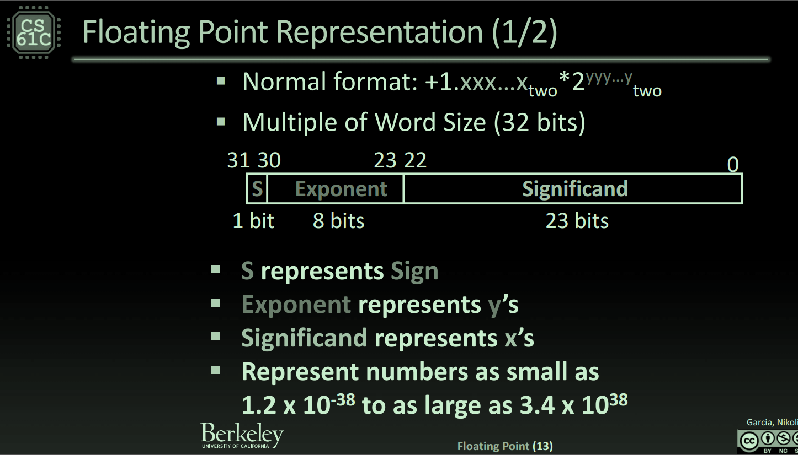

上溢和下溢

overflow我知道，但是underflow我还真不太清楚。

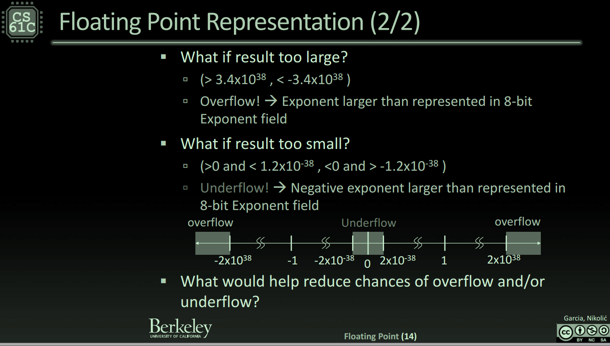

如何减少overflow和underflow？

使用更多的位数，所以有了双精度浮点数。

### IEEE754

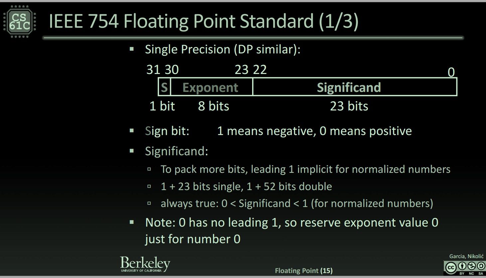

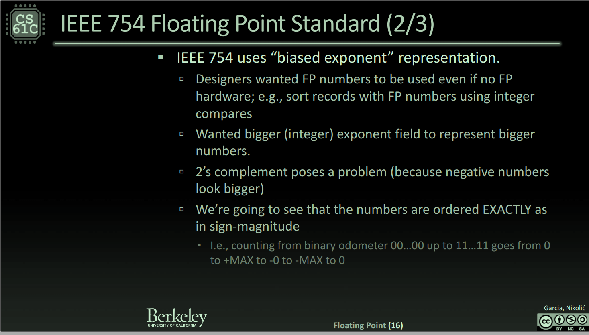

浮点数的 指数部分，加了一个偏置量。

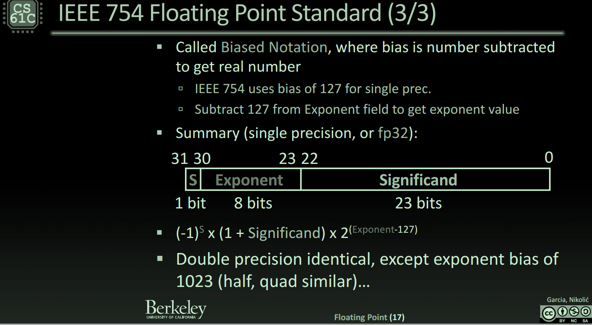

### 特殊数字

无穷大：有效位数全是0，指数部分全是1。

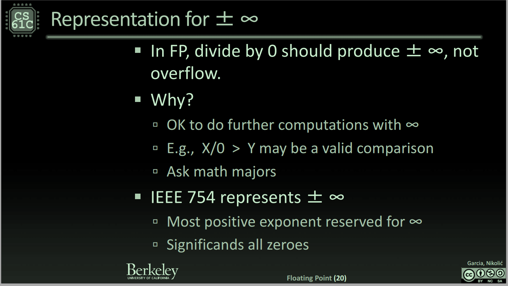

零

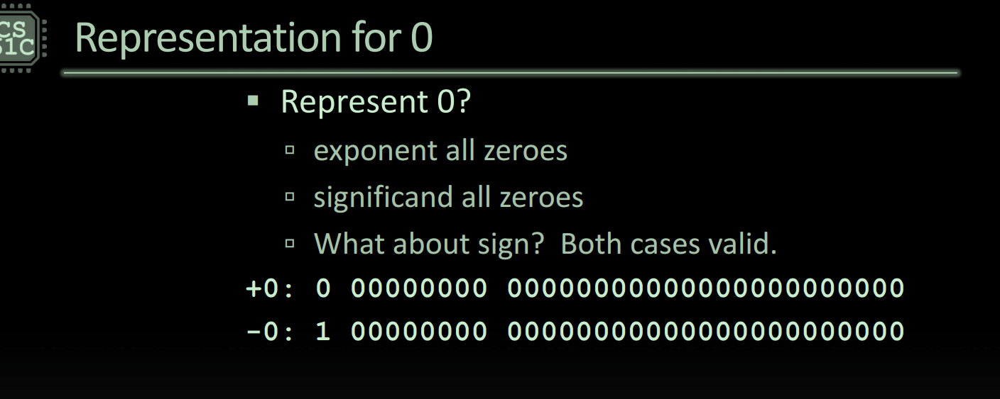

下面这张图

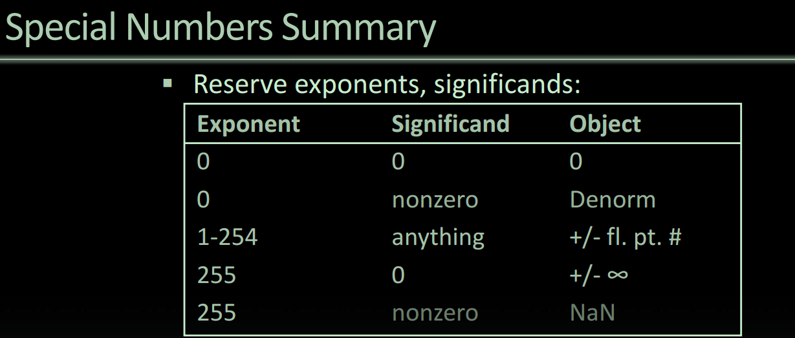

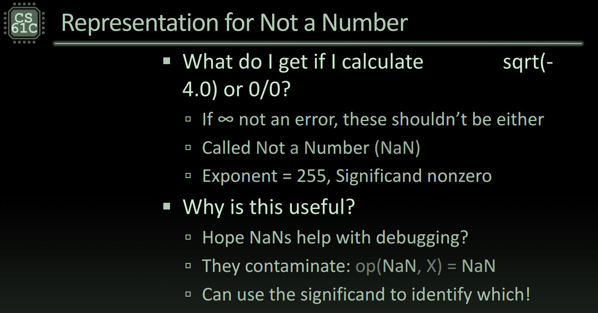

NaN具有传染性，对一个NaN执行加减乘除得到的结果还是一个NaN。

非规约数： 这也是一类特殊的数字。浮点数的指数部分为0，并且去掉前导1，使用这些数的原因是因为 ，浮点数的最小值是`1.0 × 2^(-126)`，第二小就是 ` 2^(-126)+2^(-149)`，这些数并不是均匀增加的。所以才有了非规约数，2^(-149)是最小的，第二小是2^(-148)

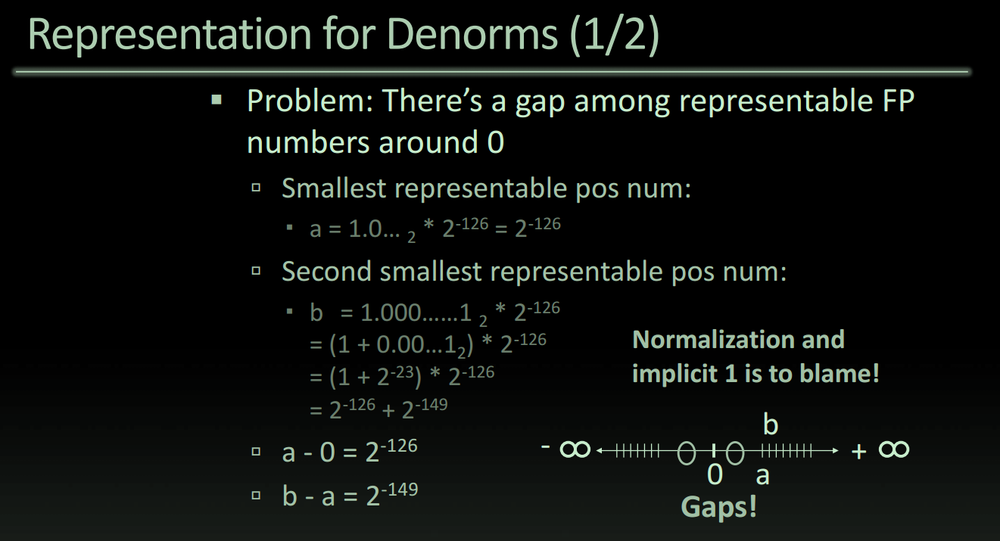

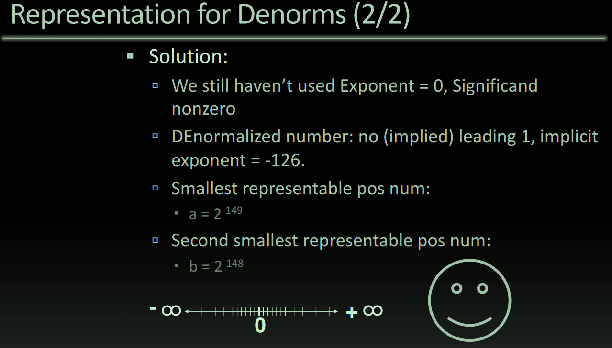

[用模拟器来看](https://www.h-schmidt.net/FloatConverter/IEEE754.html)

最小的非归约数：

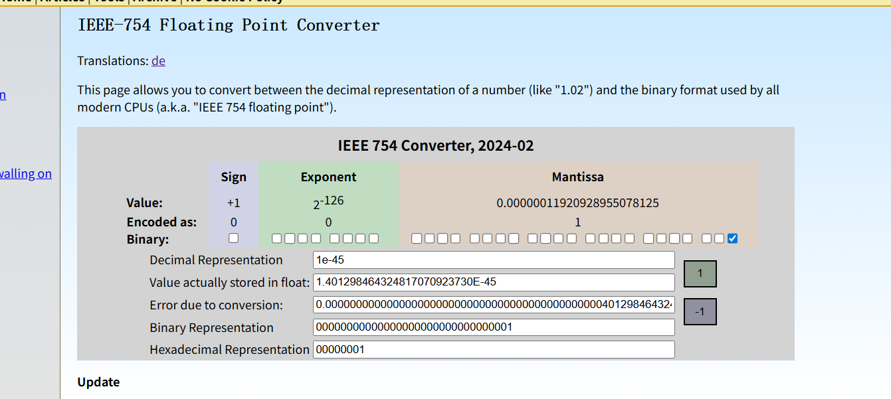

最大的非规约数

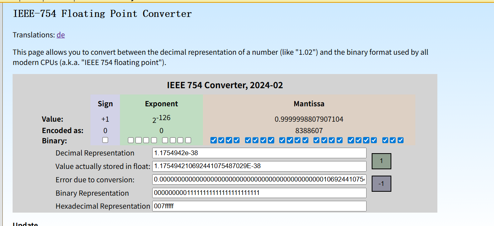

最小的归约数：2^-126

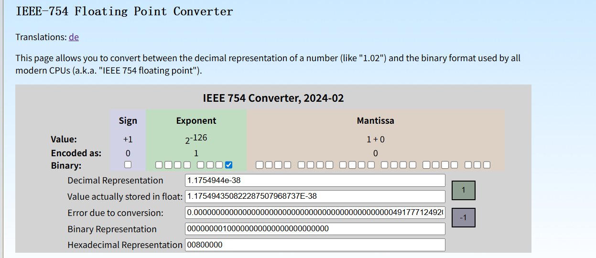

有个问题，为啥非规约数是按照2^-149递增，而规约数是按照2^-126递增呢？

对于非规约数：**标准规定，非规约数的真实指数固定为 -126**

最小值：0 00000000 00000000000000000000001

- **符号位 S** = `0`（正数）
- **指数位 E** = `00000000`（全0，表示非规约数）
- **尾数位 M** = `00000000000000000000001`（只有最后一位是1）

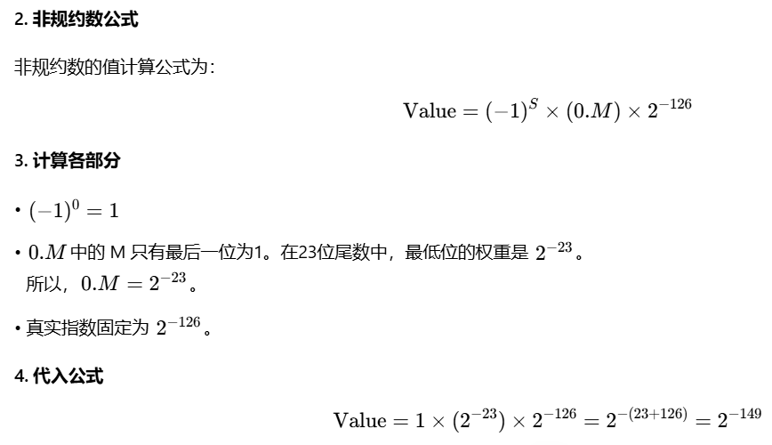

**最小的正非规约数对应的十进制数值是 2−149，约等于 1.401298464×10−45。**

而最小的规约数

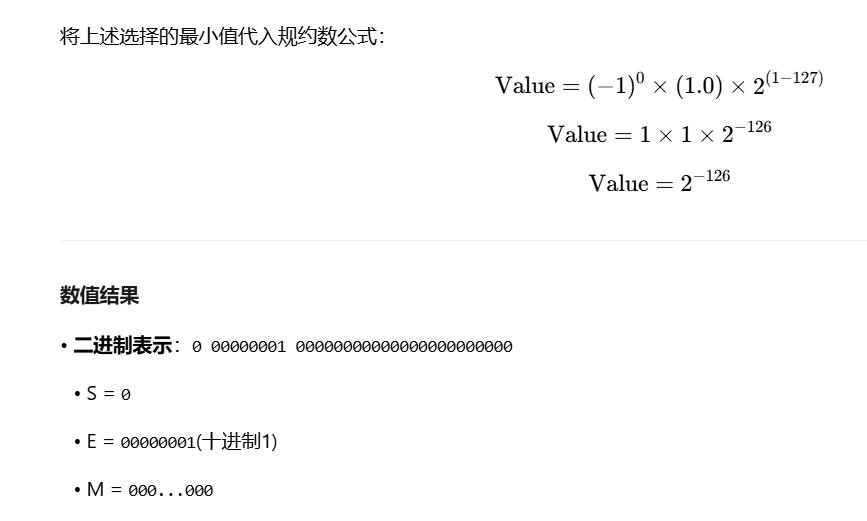

### 浮点数加法

整数的加法满足结合律，但是在浮点数里，不满足结合律。

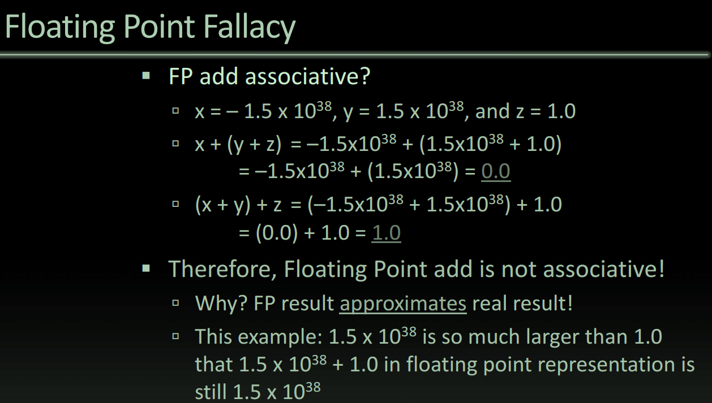

### 其他浮点数

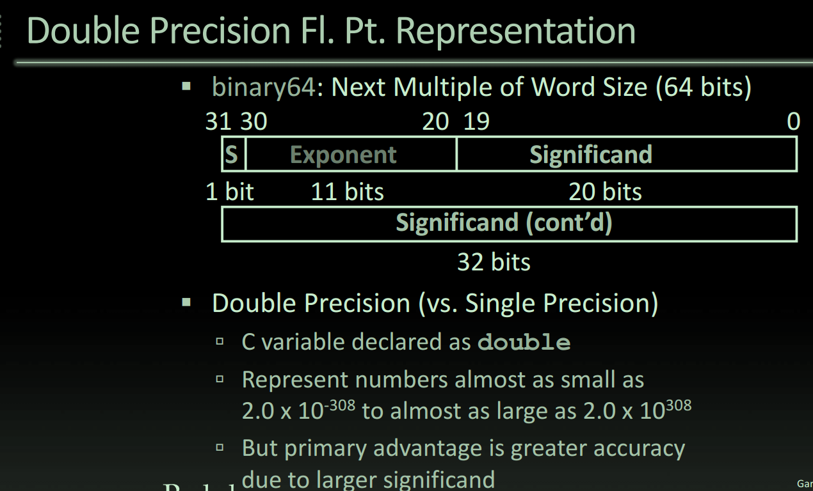