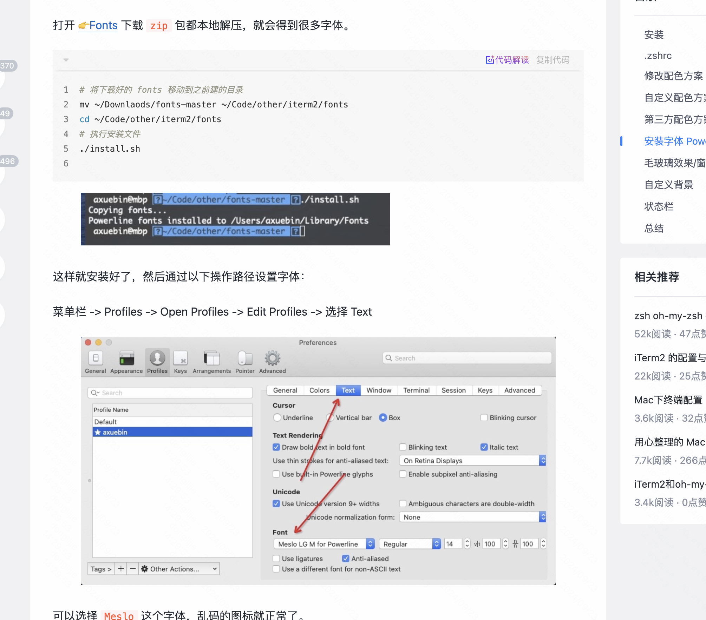
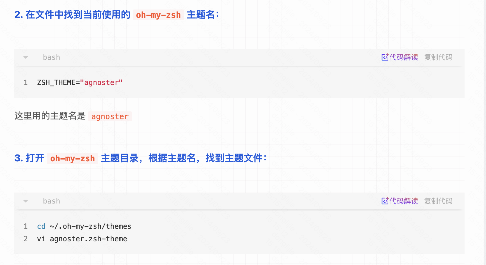
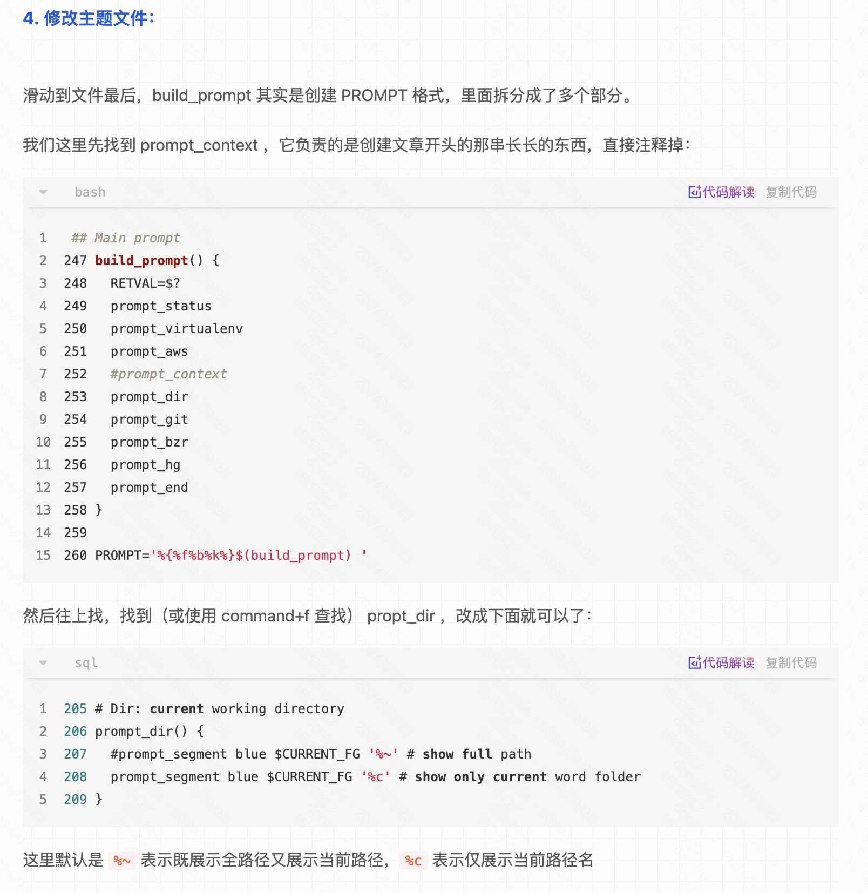
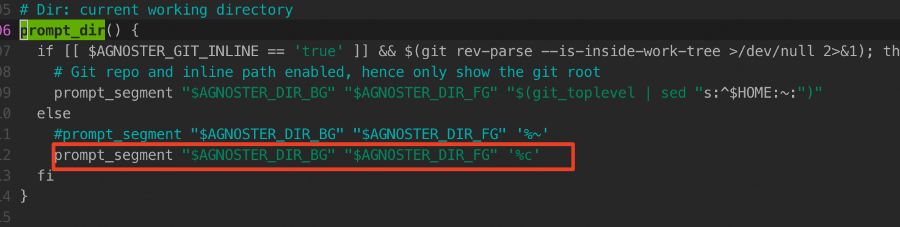

# Iterm 安装

先尝试安装iterm， oh myszsh，homebrew，可能会出现：Failed to connect to raw.githubusercontent.com port 443: Connection refused 的问题，解决方案参考：[参考链接](https://github.com/hawtim/hawtim.github.io/issues/10)，

安装[switchhost](https://github.com/oldj/SwitchHosts/releases)

```
在本机的 host 文件中添加，建议使用 switchhosts 方便 host 管理

199.232.68.133 raw.githubusercontent.com
199.232.68.133 user-images.githubusercontent.com
199.232.68.133 avatars2.githubusercontent.com
199.232.68.133 avatars1.githubusercontent.com
```


# oh my zsh 安装

然后就是oh my zsh 配置插件

```
git 插件  自带不需要装
brew install zsh-autosuggestions
# 把下面这张加到zsh文件里， 使用brew安装的时候可以看到提示。
source /usr/local/share/zsh-autosuggestions/zsh-autosuggestions.zsh
# 语法高亮插件也是。
brew install zsh-syntax-highlighting 
z 插件是oh my zsh 自备的，可以实现跳转,启用的话，需要在.zshrc 文件里plugins 里面加上z，如下图。
plugins=(git z) 
设置主题，修改.zshrc文件
ZSH_THEME="agnoster"
配置完这个插件以后，还需要设置字体。
```

[参考链接1](https://juejin.cn/post/6999622707427934245#heading-4)

[参考链接2](https://juejin.cn/post/6844904178075058189#heading-22)

对了iterm2 可以设置状态栏，[参考链接](https://juejin.cn/post/6999622707427934245#heading-12)

设置字体，字体的git 仓库：https://github.com/powerline/fonts



终端路径显示过长，使用了agnoster主题后，终端显示的路径很长，需要进行调整，[参考链接](https://juejin.cn/post/7034821984034750494)





改成下面这样就行



初始化git

```
git config  --global user.name "donglijie"
git config  --global user.email "673742128@qq.com"
生成密钥，不停回车即可
ssh-keygen -t rsa -b 4096 -C "673742128@qq.com"
```

Vim 设置主题，使用仓库https://github.com/sainnhe/archived-colors/tree/master

```
cp /usr/share/vim/vimrc ~/.vimrc
mkdir ~/.vim
 cd .vim
 git clone git@github.com:sainnhe/archived-colors.git
 mkdir colors
 cd archived-colors
cp colors/* ~/.vim/colors
修改~/.vimrc
syntax enable # 这个好像不是必须的，因为在配置vim的时候已经配置了syntax on 也是可以的
set t_Co=256
let g:solarized_termcolors=256
set background=light
colorscheme solarized
```

不需要装vim插件，直接把这个主题文件拷贝到color文件夹下也可以。

vm-plug 安装参考教程https://blog.csdn.net/qq_35575868/article/details/139584339

使用这个主题：https://github.com/altercation/vim-colors-solarized


# git push 超时

```
修改 ~/.ssh/config 文件（不存在则新建）：
# 必须是 github.com
Host github.com
   HostName github.com
   User git
   # 走 HTTP 代理
   # ProxyCommand socat - PROXY:127.0.0.1:%h:%p,proxyport=8080
   # 走 socks5 代理（如 Shadowsocks）
   # ProxyCommand nc -v -x 127.0.0.1:1086 %h %p
```

https://blog.systemctl.top/2017/2017-09-28_set-proxy-for-git-and-ssh-with-socks5/

git config --global https.proxy socks5://127.0.0.1:7897

git config --global http.proxy 'socks5://127.0.0.1:7897'


git config --global https.proxy socks://127.0.0.1:7897

git config --global http.proxy socks://127.0.0.1:7897


git clone -c http.proxy="127.0.0.1:7897" https://github.com/donglijie001/myNand2tetris.git


# appclean 安装

安装 appclean 提示已损坏，无法打开，移动到废纸篓

参考[github链接](https://github.com/Super-Badmen-Viper/NSMusicS/issues/88)解决了这个问题。

```
sudo xattr -rd com.apple.quarantine /Applications/App\ Cleaner\ 8.app
```

# Home-brew 设置镜像

https://zhuanlan.zhihu.com/p/30704752

```
echo '
export HOMEBREW_BREW_GIT_REMOTE="https://mirrors.ustc.edu.cn/brew.git"
export HOMEBREW_API_DOMAIN="https://mirrors.ustc.edu.cn/homebrew-bottles/api"
export HOMEBREW_BOTTLE_DOMAIN="https://mirrors.ustc.edu.cn/homebrew-bottles/bottles"
' >> ~/.zshrc
```

不要设置镜像了，直接使用代理，在.zshrc文件里添加如下内容，就可以解决了

```
export ALL_PROXY=socks5://127.0.0.1:7897
```

创建软链接，可能会提示`/usr/local/bin` 不存在

```
sudo mkdir -p /usr/local/bin
sudo chown -R $(whoami) /usr/local/bin
sudo chmod 755 /usr/local/bin

然后创建软链接
ln -s /usr/local/Homebrew/bin/brew /usr/local/bin/brew
```

我放弃了，在旧版本上安装homebrew，镜像源一直有问题。不再使用这种方式了。

# 手动安装jdk

下载openjdk安装包。

```
# 解压到 /Library/Java/JavaVirtualMachines/（需管理员权限）
sudo tar -xzf OpenJDK11U-jdk_x64_mac_hotspot_11.0.12_7.tar.gz -C /Library/Java/JavaVirtualMachines/

# 验证安装
/Library/Java/JavaVirtualMachines/jdk-11.0.12+7/Contents/Home/bin/java -version
# 设置 JAVA_HOME
echo 'export JAVA_HOME=$(/usr/libexec/java_home -v 11)' >> ~/.zshrc

# 添加到 PATH
echo 'export PATH=$JAVA_HOME/bin:$PATH' >> ~/.zshrc

# 生效配置
source ~/.zshrc
```

# 手动安装maven

去官网下载最新版，然后照着下面安装即可。

```
# 创建安装目录
sudo mkdir -p /usr/local/maven

# 移动解压内容（请将版本号替换为你下载的版本）
sudo mv apache-maven-3.9.6 /usr/local/maven/3.9.6

# 创建版本软链接（方便后续升级）
sudo ln -s /usr/local/maven/3.9.6 /usr/local/maven/current
# 配置环境变量
# Maven 配置
export MAVEN_HOME=/usr/local/maven/current
export PATH=$MAVEN_HOME/bin:$PATH

配置镜像加速

<mirror>
      <id>aliyun</id>
      <name>Aliyun Maven Mirror</name>
      <url>https://maven.aliyun.com/repository/public</url>
      <mirrorOf>central</mirrorOf>
    </mirror>

```

