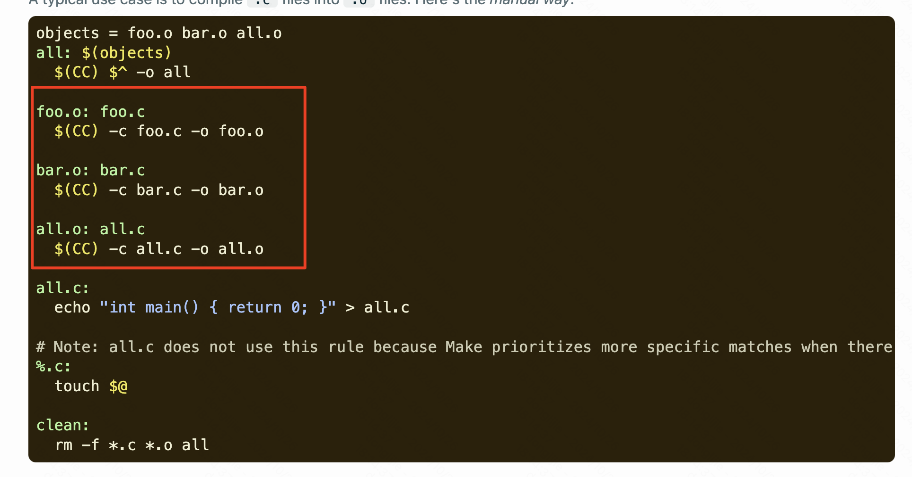
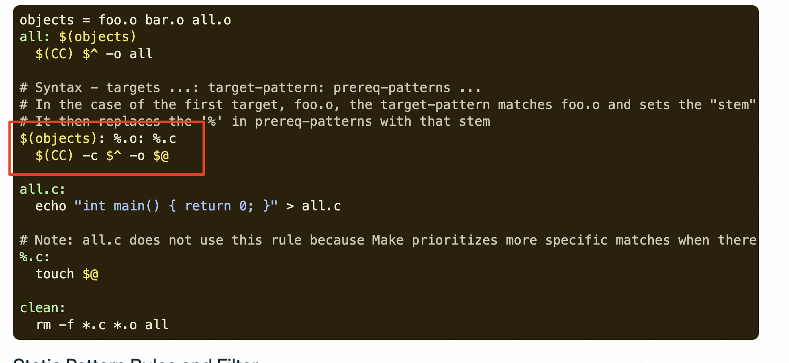
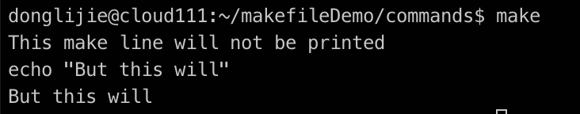

[参考链接](https://makefiletutorial.com/)

makeFile 语法

```
targets: prerequisites
	command
	command
	command
```

Makefile 变量

```
定义变量：varName=***
访问变量：$(varName) 或者${varName}
makefile中自带的变量
$@ 对应目标文件 用$(@) 这个也是可以的。
```

自动变量和通配符

```
* 只能用在targets或者prerequisites里，否则就要用wildcard function。
比如在makefile中定义了一个变量
SRC_FILES := $(wildcard src/*.c)  
如果换成SRC_FILES := src/*.c 就会报错，这种情况必须要加 wildcard声明

% 用于匹配的话，只要要匹配一个字符
  用于替换，可以替换一个字符串
自动变量，常用的如下：
$@ 对应目标文件
$^ 对应所有的prerequisites
$< 对应第一个prerequisite

```

# Fancy Rules（花哨的规则）

Implicit Rules（隐含规则）

```
Compiling a C program: n.o is made automatically from n.c with a command of the form $(CC) -c $(CPPFLAGS) $(CFLAGS) $^ -o $@ 
# 上面这个 $@ 对应目标文件， $^ 对应prerequisite
# 默认 filename.o 就是根据filename.c来的。
比如下面这段makefile，就没有设置blah.o是怎么来的，默认就是根据blah.c来的
CC = gcc # Flag for implicit rules
CFLAGS = -g # Flag for implicit rules. Turn on debug info

# Implicit rule #1: blah is built via the C linker implicit rule
# Implicit rule #2: blah.o is built via the C compilation implicit rule, because blah.c exists
blah: blah.o

blah.c:
	echo "int main() { return 0; }" > blah.c

clean:
	rm -f blah*
```

> $(CPPFLAGS) 和 $(CFLAGS) 都是 Makefile 中的预定义变量，用于传递编译器选项。
>
> $(CPPFLAGS)：预处理器选项。在编译源代码之前，预处理器需要先处理源文件中的预处理指令，并生成一些中间文件。$(CPPFLAGS) 变量可以用来指定编译时的预处理器选项，例如头文件的搜索路径、宏定义等。通常包括了 -I 和 -D 选项。
>
> $(CFLAGS)：编译器选项。用于指定编译器的编译选项，例如优化级别、警告等级、调试信息等。通常包括了 -Wall、-g 和 -O2 等选项，这些选项可以提高代码的可读性和可维护性，并且能够在编译时捕获一些潜在的错误。

Static Pattern Rules

```
targets...: target-pattern: prereq-patterns ...
   commands
```

下面这个例子，根据.c文件生成.o文件，正常写法，foo.o bar.o all.o 都需要依赖对应的.c文件创建。



也可以变成下面这种，这样更有效率。



还有其他的一些规则先跳过，感觉一次记不完了。

# Commands and execution

```
@ 符号可以停止一个命令在终端打印内容
比如下面这个makefile，使用@符号标注后，@符号开头的命令就不会再打印出来。
all: 
	@echo "This make line will not be printed"
	echo "But this will"
```



## Error handling with `-k`, `-i`, and `-`
