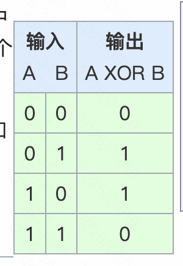
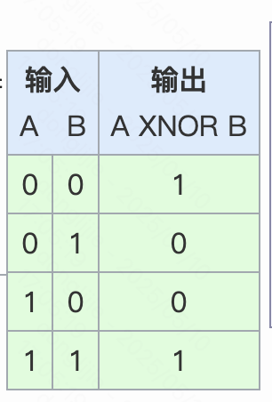

主要是用来记录https://hdlbits.01xz.net/wiki/Main_Page 这个网站上的练习题，因为老容易忘。

参考答案：https://github.com/y-C-x/HDLBits_Solution

# [01 step one](https://hdlbits.01xz.net/wiki/Step_one)

这道题，就是一直输出1.

答案很简单

```
module top_module( output one );
	
	assign one = 1'b1;
	
endmodule
```

这里用到的知识点，就是表示数字`N'Bxx`，表示多少位的数字，**`N` 表示的是这个数在二进制下的位宽（即二进制位数）**，N表示位宽，B表示基数，如果想要表示负数，就在前面加一个负号就行，比如-6'd15，就表示-15。

另外这里的assign ，就是无间断赋值，针对wire 类型的变量，没有特别说明，在verilog中，变量就是wire类型。

# [02 zero](https://hdlbits.01xz.net/wiki/Zero)

这道题和上面的一样，一直输出0

```
module top_module(
    output zero
);// Module body starts after semicolon
	assign zero=1'b0;
endmodule
```

# [03 wire](https://hdlbits.01xz.net/wiki/Wire)

这道题就是建立一个模块，将输入的信号给到输出的信号。

```
module top_module( input in, output out );
    assign out =in;
endmodule
```

# [04 wire4](https://hdlbits.01xz.net/wiki/Wire4)

这道题，将三个输入转成4个输出。

```
module top_module( 
    input a,b,c,
    output w,x,y,z );
    assign w=a;
    assign x=b;
    assign y=b;
    assign z=c;

endmodule
```

# [05 nogate](https://hdlbits.01xz.net/wiki/Notgate)

这道题相当于实现了一个反相器，由于输入输出只有一位，按位取反或者逻辑取反都行。

```
module top_module( input in, output out );
	assign out=!in; // assign out=~in;
endmodule
```

相关知识点：

```
“！”表示逻辑求反，“~”表示按位求反。对于多位会有不同
例如对in=1101分别进行逻辑取反与按位取反
assign	out = ! in;//逻辑取反，in不为0，所以out=0
assign	out = ~ in;//按位取反，out=0010
```

# [06 and gate](https://hdlbits.01xz.net/wiki/Andgate)

这道题就是求逻辑与， 使用&&， 按位与，使用&。

```
module top_module( 
    input a, 
    input b, 
    output out );
    assign out =a&&b;

endmodule
```

```
逻辑与 &&
按位与 &
```

# [07 nor gate](https://hdlbits.01xz.net/wiki/Norgate)

这道题实现一个或非门,not or

```
module top_module( 
    input a, 
    input b, 
    output out );
    assign out= ~(a | b);

endmodule
```

# [08 Xnor gate](https://hdlbits.01xz.net/wiki/Xnorgate)

实现一个同或门， 按位异或（xor）是` ^`, 同或（xnor）（~^）

```
module top_module( 
    input a, 
    input b, 
    output out );
    assign out= ~(a^b);

endmodule
```

| 异或门                                                       | 同或门                                                       |
| ------------------------------------------------------------ | ------------------------------------------------------------ |
|  |  |


# [09 Wire decl](https://hdlbits.01xz.net/wiki/Wire_decl)

就是连接几个比较复杂的门，相同功能的电路，不需要中间连线。

```
`default_nettype none
module top_module(
    input a,
    input b,
    input c,
    input d,
    output out,
    output out_n   ); 
    wire o1,o2, o3;
    assign o1=a & b;
    assign o2 = c & d;
    assign o3= o1 | o2; 
    assign out =o3;
    assign out_n = ~ o3;
endmodule
推荐答案是下面这种
module top_module (
	input a,
	input b,
	input c,
	input d,
	output out,
	output out_n );
	
	wire w1, w2;		// Declare two wires (named w1 and w2)
	assign w1 = a&b;	// First AND gate
	assign w2 = c&d;	// Second AND gate
	assign out = w1|w2;	// OR gate: Feeds both 'out' and the NOT gate

	assign out_n = ~out;	// NOT gate
	
endmodule

```

# [10 7458](https://hdlbits.01xz.net/wiki/7458)

这道题也很简单，就是一些逻辑门的连接。

```
module top_module ( 
    input p1a, p1b, p1c, p1d, p1e, p1f,
    output p1y,
    input p2a, p2b, p2c, p2d,
    output p2y );
    wire o2ab, o2cd, o1abc, o1edf;
    assign o2ab= p2a & p2b;
    assign o2cd= p2c & p2d;
    assign p2y = o2ab | o2cd;
    assign o1abc = p1a & p1b & p1c;
    assign o1edf = p1e & p1d & p1f;
    assign p1y= o1abc | o1edf;


endmodule
```

# [11 Vector0](https://hdlbits.01xz.net/wiki/Vector0) 

vector就是数组，不知道c++ 里面的vector是不是源自于这个。比如下面这个，

wire **[99:0]** my_vector;      // Declare a 100-element vector， 高位写在左边，低位写在右边。

这道题就是关于vector的用法。

```
module top_module(
	input [2:0] vec, 
	output [2:0] outv,
	output o2,
	output o1,
	output o0
);
	
	assign outv = vec;

	// This is ok too: assign {o2, o1, o0} = vec; 这个是参考答案的另一种解法。
	assign o0 = vec[0];
	assign o1 = vec[1];
	assign o2 = vec[2];
	
endmodule
```

# [12 Vector1](https://hdlbits.01xz.net/wiki/Vector1)

```
Vectors must be declared:

type [upper:lower] vector_name;
例如：
wire [7:0] w;         // 8-bit wire
reg  [4:1] x;         // 4-bit reg
output reg [0:0] y;   // 1-bit reg that is also an output port (this is still a vector)
input wire [3:-2] z;  // 6-bit wire input (negative ranges are allowed)
output [3:0] a;       // 4-bit output wire. Type is 'wire' unless specified otherwise.
wire [0:7] b;         // 8-bit wire where b[0] is the most-significant bit.


`default_nettype none 可以禁止隐式网络的创建，减少bug

Unpacked vs. Packed Arrays
向量索引在向量名称前面的是packed 数组 
reg [7:0] mem [255:0];   // 256 unpacked elements, each of which is a 8-bit packed vector of reg.
reg mem2 [28:0];         // 29 unpacked elements, each of which is a 1-bit reg.

https://stackoverflow.com/questions/477646/packed-vs-unpacked-vectors-in-system-verilog

打包数组与非打包数组的不同之处在于，当打包数组作为主数组出现时，它会被视为单个向量。

Accessing Vector Elements: Part-Select
w[3:0]      // Only the lower 4 bits of w
x[1]        // The lowest bit of x
x[1:1]      // ...also the lowest bit of x
z[-1:-2]    // Two lowest bits of z， 这种方式竟然也行。
b[3:0]      // Illegal. Vector part-select must match the direction of the declaration.
b[0:3]      // The *upper* 4 bits of b.
assign w[3:0] = b[0:3];    // Assign upper 4 bits of b to lower 4 bits of w. w[3]=b[0], w[2]=b[1], etc.
```

下面是练习题，题很简单，就是将输入input 的高低位分别赋值， 我一开始做错了，是因为我计算错了input的长度，[15:0] 我认为长度是15，实际上是16，所以写错了。

```
`default_nettype none     // Disable implicit nets. Reduces some types of bugs.
module top_module( 
    input wire [15:0] in,
    output wire [7:0] out_hi,
    output wire [7:0] out_lo );
    assign out_hi[7:0]=in[15:8];
    assign out_lo[7:0]=in[7:0];

endmodule
```

# [13 vector2](https://hdlbits.01xz.net/wiki/Vector2)

这道题是要将32位的高低位交换一下。就是把第四个字节放到第一个字节上。

AaaaaaaaBbbbbbbbCcccccccDddddddd => DdddddddCcccccccBbbbbbbbAaaaaaaa

```
module top_module( 
    input [31:0] in,
    output [31:0] out );//

    // assign out[31:24] = ...;
    assign out[31:24]=in[7:0];
    assign out[23:16]=in[15:8];
    assign out[15:8]=in[23:16];
    assign out[7:0]=in[31:24];

endmodule
```

# [14 Vector gates](https://hdlbits.01xz.net/wiki/Vectorgates)

给定两个三位的input，计算这两个input的按位或、逻辑或、逻辑非的结果

```
module top_module( 
    input [2:0] a,
    input [2:0] b,
    output [2:0] out_or_bitwise,
    output out_or_logical,
    output [5:0] out_not
);
    assign out_or_bitwise= a | b;
    assign out_or_logical= a || b;
    assign out_not[5:3] = ~b; 
    assign out_not[2:0] = ~a; 

endmodule
```

# [15 Gates4](https://hdlbits.01xz.net/wiki/Gates4)

这道题就是给一个四位的input， 求这4位的与、或、异或

```
module top_module( 
    input [3:0] in,
    output out_and,
    output out_or,
    output out_xor
);
    assign out_and=in[0]&in[1]&in[2]&in[3];
    assign out_or=in[0]|in[1]|in[2]|in[3];
    assign out_xor=in[0]^in[1]^in[2]^in[3];
endmodule

```

# [16 Vector3](https://hdlbits.01xz.net/wiki/Vector3)

这道题讲了一个新的语法：vector拼接，类似 `{a,b,c}`

```
input [15:0] in;
output [23:0] out;
assign {out[7:0], out[15:8]} = in;         // Swap two bytes. Right side and left side are both 16-bit vectors.
assign out[15:0] = {in[7:0], in[15:8]};    // This is the same thing.
assign out = {in[7:0], in[15:8]};       // This is different. The 16-bit vector on the right is extended to
                                        // match the 24-bit vector on the left, so out[23:16] are zero.
                                        // In the first two examples, out[23:16] are not assigned.
```


```
module top_module (
    input [4:0] a, b, c, d, e, f,
    output [7:0] w, x, y, z );//

    // assign { ... } = { ... };
    assign w ={a,b[4:2]};
    assign x ={b[1:0],c,d[4]};
    assign y ={d[3:0],e[4:1]};
    assign z ={e[0],f[4:0],2'b11};

endmodule
```

# [17 Vectorr](https://hdlbits.01xz.net/wiki/Vectorr)

这道题就是反转 vector，这道题实际上用循环比较方便。

```
module top_module( 
    input [7:0] in,
    output [7:0] out
);
    assign out[0]=in[7];
    assign out[1]=in[6];
    assign out[2]=in[5];
    assign out[3]=in[4];
    assign out[4]=in[3];
    assign out[5]=in[2];
    assign out[6]=in[1];
    assign out[7]=in[0];

endmodule
```

下面是答案给的解法

```
module top_module (
	input [7:0] in,
	output [7:0] out
);
	
	assign {out[0],out[1],out[2],out[3],out[4],out[5],out[6],out[7]} = in;
	
	/*
	// I know you're dying to know how to use a loop to do this:

	// Create a combinational always block. This creates combinational logic that computes the same result
	// as sequential code. for-loops describe circuit *behaviour*, not *structure*, so they can only be used 
	// inside procedural blocks (e.g., always block).
	// The circuit created (wires and gates) does NOT do any iteration: It only produces the same result
	// AS IF the iteration occurred. In reality, a logic synthesizer will do the iteration at compile time to
	// figure out what circuit to produce. (In contrast, a Verilog simulator will execute the loop sequentially
	// during simulation.)
	always @(*) begin	
		for (int i=0; i<8; i++)	// int is a SystemVerilog type. Use integer for pure Verilog.
			out[i] = in[8-i-1];
	end


	// It is also possible to do this with a generate-for loop. Generate loops look like procedural for loops,
	// but are quite different in concept, and not easy to understand. Generate loops are used to make instantiations
	// of "things" (Unlike procedural loops, it doesn't describe actions). These "things" are assign statements,
	// module instantiations, net/variable declarations, and procedural blocks (things you can create when NOT inside 
	// a procedure). Generate loops (and genvars) are evaluated entirely at compile time. You can think of generate
	// blocks as a form of preprocessing to generate more code, which is then run though the logic synthesizer.
	// In the example below, the generate-for loop first creates 8 assign statements at compile time, which is then
	// synthesized.
	// Note that because of its intended usage (generating code at compile time), there are some restrictions
	// on how you use them. Examples: 1. Quartus requires a generate-for loop to have a named begin-end block
	// attached (in this example, named "my_block_name"). 2. Inside the loop body, genvars are read only.
	generate
		genvar i;
		for (i=0; i<8; i = i+1) begin: my_block_name
			assign out[i] = in[8-i-1];
		end
	endgenerate
	*/
	
endmodule
```

# [18 Vector4](https://hdlbits.01xz.net/wiki/Vector4)

这道题讲的是新的语法，上面讲了vector 拼接，这里讲了将一个vector重复多次的语法，比如assign a = {b,b,b,b,b,b}; 可以用{num{vector}}来代替。

```
{5{1'b1}}           // 5'b11111 (or 5'd31 or 5'h1f)
{2{a,b,c}}          // The same as {a,b,c,a,b,c}
{3'd5, {2{3'd6}}}   // 9'b101_110_110. It's a concatenation of 101 with
                    // the second vector, which is two copies of 3'b110.
```

书上给的练习是扩展有符号数的符号位。

```
module top_module (
    input [7:0] in,
    output [31:0] out );//

    // assign out = { replicate-sign-bit , the-input };
    assign out = {{24{in[7]}}, in};

endmodule
```

# [19 Vector5](https://hdlbits.01xz.net/wiki/Vector5)

这道题是给5个一位的input， 将其组装成25位的，然后执行同或运算，我一开始一直过不来了， 是因为漏了一个点，vector，必须要先声明，然后再使用。

```
module top_module (
    input a, b, c, d, e,
    output [24:0] out );//

    // The output is XNOR of two vectors created by 
    // concatenating and replicating the five inputs.
    // assign out = ~{ ... } ^ { ... };
    wire [24:0] top, bottom;
    assign  top = {{5{a}}, {5{b}}, {5{c}}, {5{d}}, {5{e}}};
    assign  bottom = {{5{a,b,c,d,e}}};
    assign out = ~(top ^ bottom);
    

endmodule
```

# [20 module](https://hdlbits.01xz.net/wiki/Module) 

这道题主要是module的创建和访问

创建：

```
module mod_a ( input in1, input in2, output out );
    // Module body
endmodule
```

访问：

```
按照位置
	mod_a instance1 ( wa, wb, wc );
按照名称
	mod_a instance2 ( .out(wc), .in1(wa), .in2(wb) );
```


我直接用的按照位置访问。

```
module top_module ( input a, input b, output out );
    mod_a(a,b,out);

endmodule
```

# [21 Module_pos](https://hdlbits.01xz.net/wiki/Module_pos)

这道题就是在一个模块里访问另一个模块。 需要注意的一点是，模块声明的时候还要加上实例名。

```
module top_module ( 
    input a, 
    input b, 
    input c,
    input d,
    output out1,
    output out2
);
    mod_a instance1 (out1,out2,a,b,c,d);

endmodule
```

# [22 Module_name](https://hdlbits.01xz.net/wiki/Module_name)

这道题还是在一个模块里访问另一个模块。只不过这道题要求按照名称去访问模块。

```
module top_module ( 
    input a, 
    input b, 
    input c,
    input d,
    output out1,
    output out2
);
    mod_a inst1(.in1(a),.in2(b),.in3(c),.in4(d),.out1(out1),.out2(out2));

endmodule
```

# [23 Module_shift](https://hdlbits.01xz.net/wiki/Module_shift)

这道题给你一个预先实现好的DFF，实例化3个DFF，并用统一的时钟信号连接它们。因为要连接不同的dff，所以需要导线，这些都需要提前声明（这个和C语言不一样，C语言可以在变量声明的时候并使用它）。

```
module top_module ( input clk, input d, output q );
    wire out1,out2;
    my_dff inst1 (clk,d,out1);
    my_dff inst2 (clk,out1,out2);
    my_dff inst3 (clk,out2,q);

endmodule
```

# [24 Modeel_shift8](https://hdlbits.01xz.net/wiki/Module_shift8) 

这道题需要实现一个mux。还要用到if else 以及always block， 另外需要注意的一点是在assign 并不能在always block里使用。

```
module top_module ( 
    input clk, 
    input [7:0] d, 
    input [1:0] sel, 
    output [7:0] q 
);
    wire[7:0] out1,out2,out3;
    
    my_dff8 inst1(clk,d,out1);
    my_dff8 inst2(clk,out1,out2);
    my_dff8 inst3(clk,out2,out3);
    always @(*) begin
        if (sel == 2'b00)
            q=d;
        else if (sel == 2'b01)
            q=out1;
        else if (sel == 2'b10)
           q=out2;
        else if (sel == 2'b11)
            q=out3;
      end
     

endmodule
```

if的语法：

```
if (condition1)       true_statement1 ;
else if (condition2)        true_statement2 ;
else if (condition3)        true_statement3 ;
else                      default_statement ;

```

always 语法：[这是相关说明](https://www.chipverify.com/verilog/verilog-always-block)

```
always @ (event)
	[statement]

always @ (event) begin
	[multiple statements]
end
```

# [25 Module_add](https://hdlbits.01xz.net/wiki/Module_add) 

这道题是用两个16位的加法器，组合成一个32位的加法器，低16位相加会产生一个进位，然后把进位和两个高16位相加，最终得到一个32位的结果，最终产生的32位进位直接忽略。这道题用了如下知识点：

- 变量必须先声明再使用
- vector 声明
- module 声明和使用
- vector 拼接


```
module top_module(
    input [31:0] a,
    input [31:0] b,
    output [31:0] sum
);
    wire lower_carry_out;
    wire upper_carry_out;
    wire[15:0] lower_sum;
    wire[15:0] upper_sum;
  
    add16 low_add (a[15:0], b[15:0],1'b0,lower_sum, lower_carry_out);
    add16 upper_add (a[31:16], b[31:16],lower_carry_out,upper_sum, upper_carry_out);
    assign sum={upper_sum, lower_sum};
    

endmodule
```

# [26 Module fadd](https://hdlbits.01xz.net/wiki/Module_fadd) 

这道题实现一个全加器，题目要求是实现一个32位全加器，忽略进位，32位全加器由2个16位全加器实现，16位加法器已经定义，但是16位加法器内部是通过16个一位加法器实现的，一位加法器需要实现。

```
module top_module (
    input [31:0] a,
    input [31:0] b,
    output [31:0] sum
);//
    wire lower_carry_out;
    wire upper_carry_out;
    wire[15:0] lower_sum;
    wire[15:0] upper_sum;
  
    add16 low_add (a[15:0], b[15:0],1'b0,lower_sum, lower_carry_out);
    add16 upper_add (a[31:16], b[31:16],lower_carry_out,upper_sum, upper_carry_out);
    assign sum={upper_sum, lower_sum};
endmodule

module add1 ( input a, input b, input cin,   output sum, output cout );

// Full adder module here
    wire[1:0] tmp_sum;
    assign tmp_sum=a+b+cin;
    assign sum=tmp_sum[0];
    assign cout=tmp_sum[1];

endmodule
```

我的方法是在一位加法器里面，先声明一个两位的变量，然后再把进位给和结果给分别赋值。

题目上给了提示，使用了位运算

```
module add1 ( input a, input b, input cin,   output sum, output cout );

// Full adder module here
  assign sum = a ^ b ^ cin;
  assign cout = a & b | a &cin | b & cin;
endmodule
```

# [27 Module_cseladd](https://hdlbits.01xz.net/wiki/Module_cseladd)

这道题也是实现一个32位加法器，之前是先算低16位然后拿到进位再算高16位，最后得出结果，但是这样有点慢，所以这道题就用了另一种方式，低16位和高16位一起计算，因为进位要么是1要么是0，所以高16位计算同时算两个，进位是0和进位是1，然后根据低16位计算的进位去选择高16位的结果。

这道题又用到了always的语法

```
module top_module(
    input [31:0] a,
    input [31:0] b,
    output [31:0] sum
);
    wire cout;
    wire cout_0;
    wire cout_1;
    wire[31:0] tmp_sum_0;
    wire[31:0] tmp_sum_1;
    add16 lower16 (a[15:0],b[15:0], 0, sum[15:0], cout);
    add16 upper16_0 (a[31:16],b[31:16], 0, tmp_sum_0[31:16], cout_0);
    add16 lower16_1 (a[31:16],b[31:16], 1, tmp_sum_1[31:16], cout_1);
    always @(*) begin
        if (cout == 1'b0)
            sum[31:16]=tmp_sum_0[31:16];
        else if (cout == 1'b1)
            sum[31:16]=tmp_sum_1[31:16];
      end  

endmodule
```

# [28 Module_addsub](https://hdlbits.01xz.net/wiki/Module_addsub) 

这道题是用加法实现一个减法器。

```
module top_module(
    input [31:0] a,
    input [31:0] b,
    input sub,
    output [31:0] sum
);
    wire[31:0] subs={32{sub}};
    wire[31:0] tmp_b;
    assign tmp_b=b ^ subs;
    wire lower_carry_out;
    wire upper_carry_out;
    wire[15:0] lower_sum;
    wire[15:0] upper_sum;
  
    add16 low_add (a[15:0], tmp_b[15:0],sub,lower_sum, lower_carry_out);
    add16 upper_add (a[31:16], tmp_b[31:16],lower_carry_out,upper_sum, upper_carry_out);
    assign sum={upper_sum, lower_sum};

endmodule

```

# [29 always block1](https://hdlbits.01xz.net/wiki/Alwaysblock1) 

这道题就是简单的介绍了一下always的语法


```
// synthesis verilog_input_version verilog_2001
module top_module(
    input a, 
    input b,
    output wire out_assign,
    output reg out_alwaysblock
);
    assign out_assign = a&b;
    always @(*) begin
        out_alwaysblock= a&b;
    
    end
     

endmodule
```

# [30 Alwaysblock2](https://hdlbits.01xz.net/wiki/Alwaysblock2) 

阻塞赋值和非阻塞赋值

- **Continuous** assignments (`assign x = y;`). Can only be used when **not** inside a procedure ("always block").
- Procedural **blocking** assignment: (`x = y;`). Can only be used inside a procedure.
- Procedural **non-blocking** assignment: (`x <= y;`). Can only be used inside a procedure.

在组合逻辑的always的block中，使用阻塞赋值，在时钟逻辑的always的block中，使用非阻塞赋值。

这道题就是实现 xor 计算，用不同的方式。


```
// synthesis verilog_input_version verilog_2001
module top_module(
    input clk,
    input a,
    input b,
    output wire out_assign,
    output reg out_always_comb,
    output reg out_always_ff   );
    assign out_assign = a ^b;
    always @(*) begin
        out_always_comb = a^b;
     end 
    always @(posedge clk) begin  // poseedge 表示时钟信号上升沿， negedge 表示始终信号下降沿
        out_always_ff <= a^b;
     end 
endmodule
```

# [31 Alwys_if](https://hdlbits.01xz.net/wiki/Always_if) 

这道题主要是用来在always block 里，练习if 语句的语法， 目前看到的题，并没有在除了always以外的地方使用if。

```
always @(*) begin
    if (condition) begin
        out = x;
    end
    else begin
        out = y;
    end
end
```


```
module top_module(
    input a,
    input b,
    input sel_b1,
    input sel_b2,
    output wire out_assign,
    output reg out_always   ); 
    assign out_assign = ((sel_b1==1'b1)&&(sel_b2==1'b1)) ? b : a;
    always @(*) begin
        if ((sel_b1==1'b1)&&(sel_b2==1'b1)) begin
        	out_always = b;
    	end
    	else begin
        	out_always = a;
    	end
    end

endmodule
```

# [32 alwaysIf2](https://hdlbits.01xz.net/wiki/Always_if2) 

这道题讲了避免使用锁存器，讲了一堆，我不是太理解那个话，感觉就是在always 的组合逻辑块中，使用了if，但是没有把所有的分支条件都给覆盖全，导致出现了问题，不知道我理解的是否正确。但是我把代码给改对了。

```
// synthesis verilog_input_version verilog_2001
module top_module (
    input      cpu_overheated,
    output reg shut_off_computer,
    input      arrived,
    input      gas_tank_empty,
    output reg keep_driving  ); //

    always @(*) begin
        if (cpu_overheated)
           shut_off_computer = 1;
        else 
            shut_off_computer = 0;
    end

    always @(*) begin
        if(gas_tank_empty)
            keep_driving = 0;
       else if(arrived)
            keep_driving = 0;
        else 
            keep_driving =1;      
    end

endmodule
```

# [33 always_case](https://hdlbits.01xz.net/wiki/Always_case) 

这道就讲了case 的用法，类似c语言里的swith case，语法如下，和c语言不同的一点是，verilog允许 case 语句重复，看到有说，case 只在always中使用。

```
always @(*) begin     // This is a combinational circuit
    case (in)
      1'b1: begin 
               out = 1'b1;  // begin-end if >1 statement
            end
      1'b0: out = 1'b0;
      default: out = 1'bx;
    endcase
end
```


```
// synthesis verilog_input_version verilog_2001
module top_module ( 
    input [2:0] sel, 
    input [3:0] data0,
    input [3:0] data1,
    input [3:0] data2,
    input [3:0] data3,
    input [3:0] data4,
    input [3:0] data5,
    output reg [3:0] out   );//

    always@(*) begin  // This is a combinational circuit
        case(sel)
            3'b000: begin
                out=data0;
            end
            3'b001: begin
                out=data1;
            end
            3'b010: begin
                out=data2;
            end
            3'b011: begin
                out=data3;
            end
            3'b100: begin
                out=data4;
            end
            3'b101: begin
                out=data5;
            end
            default: out = 4'b0000; // default: out = 0; 这样也行
        endcase
    end

endmodule
```

# [34 Always_case2](https://hdlbits.01xz.net/wiki/Always_case2)

这道题，就是统计一个数字的二进制第一个1出现的位置，从低到高。题目给的是一个四位的二进制数。 如果用case 语法，要写16遍。

```
// synthesis verilog_input_version verilog_2001
module top_module (
    input [3:0] in,
    output reg [1:0] pos  );
    
    always @(*) begin
        case(in) 
            4'b0000: begin
                pos=2'b00;
            end
            4'b0001: begin
                pos=2'b00;
            end
            4'b0010: begin
                pos=2'b01;
            end
            4'b0011: begin
                pos=2'b00;
            end
            4'b0100: begin
                pos=2'b10;
            end
            4'b0101: begin
                pos=2'b00;
            end
            4'b0110: begin
                pos=2'b01;
            end
        	4'b0111: begin
                pos=2'b00;
            end
        	4'b1000: begin
                pos=2'b11;
            end
        	4'b1001: begin
                pos=2'b00;
            end
        	4'b1010: begin
                pos=2'b01;
            end
        	4'b1011: begin
                pos=2'b00;
            end
        	4'b1100: begin
                pos=2'b10;
            end
        	4'b1101: begin
                pos=2'b00;
            end
       		4'b1110: begin
                pos=2'b01;
            end
        	4'b1111: begin
                pos=2'b00;
            end
        	default pos=2'b00;
        endcase
    end

endmodule

```

# [35 always_casez](https://hdlbits.01xz.net/wiki/Always_casez) 

上面那道题，用case 表示16种情况贼复杂。因此出现了casez 来简化。z 和？ 是等价的用来表示don't care

casez语法

```
casez (in[3:0]) // 注意这里是casez， 不是case，不然能编译过去，但是运行结果不对
        4'bzzz1: ...
        4'bzz10: ...
        4'bz100: ...
        4'b1000: ...
        default: ...
    endcase
```


```
// synthesis verilog_input_version verilog_2001
module top_module (
    input [7:0] in,
    output reg [2:0] pos );
    always @(*) begin
        casez(in)
            8'bzzzzzzz1: begin
                pos=3'b000;
            end
            8'bzzzzzz10: begin
                pos=3'b001;
            end
            8'bzzzzz100: begin
                pos=3'b010;
            end
            8'bzzzz1000: begin
                pos=3'b011;
            end
            8'bzzz10000: begin
                pos=3'b100;
            end
            8'bzz100000: begin
                pos=3'b101;
            end
            8'bz1000000: begin
                pos=3'b110;
            end
            8'b10000000: begin
                pos=3'b111;
            end
            default pos=3'b000;
        endcase
    
    end

endmodule

```

# [36 always_nolatches](https://hdlbits.01xz.net/wiki/Always_nolatches) 

这道题也是一个always的练习，主要还是讲的要注意状态的变化。因为题目中ps有四个方向，一个方向的变化

```
// synthesis verilog_input_version verilog_2001
module top_module (
    input [15:0] scancode,
    output reg left,
    output reg down,
    output reg right,
    output reg up  ); 
    always @(*) begin
        up = 1'b0; down = 1'b0; left = 1'b0; right = 1'b0;
        case (scancode)
            16'he06b: begin
                left=1'b1;
                down=1'b0;
                up=1'b0;
                right=1'b0;
            end 
            16'he072:begin
                left=1'b0;
				down=1'b1;
				up=1'b0;
				right=1'b0;
            end 
            16'he074: begin
                left=1'b0;
				down=1'b0;
				up=1'b0;
				right=1'b1;   
            end
            16'he075: begin
                left=1'b0;
				down=1'b0;
				up=1'b1;
				right=1'b0;                  
            end
            default : begin
                up = 1'b0; down = 1'b0; left = 1'b0; right = 1'b0;
            end
        endcase
    
    end

endmodule

```

# [37 Conditional](https://hdlbits.01xz.net/wiki/Conditional) 

这道题讲了饿一个知识点：条件运算符`(condition ? if_true : if_false)`，这个类似c语言里的三目运算符。

题目就是让求四个输入中的最小的那个。

```
module top_module (
    input [7:0] a, b, c, d,
    output [7:0] min);//

    // assign intermediate_result1 = compare? true: false;
    wire[7:0] ab_min, cd_min;
    assign ab_min= a<b ? a : b;
    assign cd_min= c<d ? c : d;
    assign min=ab_min<cd_min ? ab_min : cd_min;

endmodule
```

# [38 reduction](https://hdlbits.01xz.net/wiki/Reduction) 

```
归约运算符可以对向量的位进行与、或和异或运算，产生一位输出： 就是给你一个向量，让你对所有的元素都执行同一种操作的简洁运算符我感觉。

& a[3:0] // 与：a[3]&a[2]&a[1]&a[0]。等同于 (a[3:0] == 4'hf)
| b[3:0] // 或：b[3]|b[2]|b[1]|b[0]。等同于 (b[3:0] != 4'h0)
^ c[2:0] // 异或：c[2]^c[1]^c[0]
```

这道题实际上是让你求 输入的8位向量的异或值，用于当作奇偶校验。

```
module top_module (
    input [7:0] in,
    output parity); 
    assign parity = ^in[7:0];

endmodule

```

# [39 gates100](https://hdlbits.01xz.net/wiki/Gates100) 

这道题就是上面那道题知识的应用。

```
module top_module( 
    input [99:0] in,
    output out_and,
    output out_or,
    output out_xor 
);
    assign out_and= &in[99:0];
    assign out_or= |in[99:0];
    assign out_xor= ^in[99:0];

endmodule
```

# [40 vector100r](https://hdlbits.01xz.net/wiki/Vector100r) 

这道题就是将input反转输出， 我的答案是使用了for循环，

```
module top_module( 
    input [99:0] in,
    output [99:0] out
);
    always @(*) begin
        for (integer i=0; i<100; i++)	// int is a SystemVerilog type. Use integer for pure Verilog.
            out[i] = in[100-i-1];
    end
endmodule
```

参考答案也是用了for循环，但是它用到了一个系统函数$bits()，返回信号的位宽。

```
module top_module (
	input [99:0] in,
	output reg [99:0] out
);
	
	always @(*) begin
		for (int i=0;i<$bits(out);i++)		// $bits() is a system function that returns the width of a signal.
			out[i] = in[$bits(out)-i-1];	// $bits(out) is 100 because out is 100 bits wide.
	end
	
endmodule
```

# [41 popcount255](https://hdlbits.01xz.net/wiki/Popcount255)

这道题是统计255位的input里的1的个数，这道题用到了for循环，但是我没有想到out可以直接做++运算。

```
module top_module( 
    input [254:0] in,
    output [7:0] out );
    always @(*) begin
        out = 0;
        for (integer i=0;i<255;i++)
			out = out + in[i];
    end

endmodule
```

# [42 adder100i](https://hdlbits.01xz.net/wiki/Adder100i)

这道题我一开始是这样写的,不行

```
module top_module( 
    input [99:0] a, b,
    input cin,
    output [99:0] cout,
    output [99:0] sum );
    always @(*) begin
        wire[1:0] tmp_sum;
        tmp_sum=2'b0;
        for(integer i=0;i<100;i++)
            tmp_sum=cin+a[i]+b[i]+tmp_sum[0];
            cout[i]=tmp_sum[1];
            sum[i]=tmp_sum[0];
        
            
    end

endmodule
```

后面改成了这样

```
module top_module( 
    input [99:0] a, b,
    input cin,
    output [99:0] cout,
    output [99:0] sum );
    reg [1:0] tmp_sum;
    integer i;

    always @(*) begin
        tmp_sum = cin+a[0]+b[0];
        cout[0]=tmp_sum[1];
        sum[0]=tmp_sum[0];
        for (i = 1; i < 100; i = i + 1) begin
            tmp_sum =a[i] + b[i] +cout[i-1];
            cout[i] = tmp_sum[1];
            sum[i] = tmp_sum[0];
        end
    end

endmodule
```

也可以这样，但有一点是，在always 的代码块中，不能声明wire类型的变量。

```
module top_module( 
    input [99:0] a, b,
    input cin,
    output [99:0] cout,
    output [99:0] sum );
    	
    wire [1:0] tmp_sum;
    always @(*) begin
        tmp_sum = cin+a[0]+b[0];
        cout[0]=tmp_sum[1];
        sum[0]=tmp_sum[0];
        for (integer i = 1; i < 100; i = i + 1) begin
            tmp_sum =a[i] + b[i] +cout[i-1];
            cout[i] = tmp_sum[1];
            sum[i] = tmp_sum[0];
        end
    end

endmodule
```

github 上的参考答案

```
module top_module( 
    input [99:0] a, b,
    input cin,
    output [99:0] cout,
    output [99:0] sum );
    
    integer i;
    always @(*) begin
        sum[0] = a[0] ^ b[0] ^ cin;
        cout[0] = a[0] & b[0] | cin & (a[0]|b[0]);
        for (i = 1; i<100; i++) begin
            sum[i] = a[i] ^ b[i] ^ cout[i-1];
            cout[i] = a[i] & b[i] | cout[i-1] & (a[i]|b[i]);
        end
    end

endmodule
```

# [43 bcdadd100](https://hdlbits.01xz.net/wiki/Bcdadd100)

这道题是用了generate 

```
module top_module( 
    input [399:0] a, b,
    input cin,
    output cout,
    output [399:0] sum );
    wire[99:0] cout_wires;
    genvar i;
    
    generate
        bcd_fadd(a[3:0], b[3:0], cin, cout_wires[0],sum[3:0]);
        for (i=4; i<400; i=i+4) begin: bcd_adder_instances
            bcd_fadd bcd_adder(a[i+3:i], b[i+3:i], cout_wires[i/4-1],cout_wires[i/4],sum[i+3:i]);
        end
    endgenerate
    
    assign cout = cout_wires[99];

endmodule

```

# [44 m2014_q4h](https://hdlbits.01xz.net/wiki/Exams/m2014_q4h)

这道题很简单，就是让out=in就可以了。

```
module top_module (
    input in,
    output out);
assign out=in;
endmodule
```

# [45 m2014_q4i](https://hdlbits.01xz.net/wiki/Exams/m2014_q4i)

这道题就是实现接地。

```
module top_module (
    output out);
	assign out=1'b0;
endmodule
```

# [46 m2014_q4e](https://hdlbits.01xz.net/wiki/Exams/m2014_q4e)


```
module top_module (
    input in1,
    input in2,
    output out);
    assign out=~(in1 | in2);

endmodule
```

# [47m2014 q4f](https://hdlbits.01xz.net/wiki/Exams/m2014_q4f)

这几道题都没啥难度。

```
module top_module (
    input in1,
    input in2,
    output out);
    assign out=in1 &(~in2);
endmodule
```

# [48 m2014_q4g](https://hdlbits.01xz.net/wiki/Exams/m2014_q4g)

```
module top_module (
    input in1,
    input in2,
    input in3,
    output out);
    assign out= ~(in1^in2)^in3;

endmodule
```

# [49 Gates](https://hdlbits.01xz.net/wiki/Gates)

```
module top_module( 
    input a, b,
    output out_and,
    output out_or,
    output out_xor,
    output out_nand,
    output out_nor,
    output out_xnor,
    output out_anotb
);
    assign out_and = a & b;
    assign out_or= a | b;
    assign out_xor= a ^ b;
    assign out_nand= ~(a & b);
    assign out_nor= ~(a | b);
    assign out_xnor = ~(a ^ b);
    assign out_anotb = a &(~b);

endmodule

```

# [50 7420](https://hdlbits.01xz.net/wiki/7420)

```
module top_module ( 
    input p1a, p1b, p1c, p1d,
    output p1y,
    input p2a, p2b, p2c, p2d,
    output p2y );
    assign p1y=~(p1a&p1b&p1c&p1d);
    assign p2y=~(p2a&p2b&p2c&p2d);

endmodule

```

# [51 truetable1](https://hdlbits.01xz.net/wiki/Truthtable1)

就是一个真值表，minitem，简化一下就可以了。

```
module top_module( 
    input x3,
    input x2,
    input x1,  // three inputs
    output f   // one output
);
    assign f= (~x3)&x2 | x1&x3;

endmodule
```

# [52 mt2015eq2](https://hdlbits.01xz.net/wiki/Mt2015_eq2)

这是我的答案，

```
module top_module ( input [1:0] A, input [1:0] B, output z ); 
    always @(*) begin
        if(A==B) begin
            z=1;
        end
        else
            z=0;      
    end

endmodule
```

github上的参考答案：

```
module top_module(
	input [1:0] A,
	input [1:0] B,
	output z);
    // assign z = (A[0] == B[0]) && (A[1] == B[1]);
	assign z = (A[1:0]==B[1:0]);	// Comparisons produce a 1 or 0 result.
	
	// Another option is to use a 16-entry truth table ( {A,B} is 4 bits, with 16 combinations ).
	// There are 4 rows with a 1 result.  0000, 0101, 1010, and 1111.

endmodule
```

# [53 Mt2015q4a](https://hdlbits.01xz.net/wiki/Mt2015_q4a)

```
module top_module (input x, input y, output z);
    assign z=(x^y)&x;

endmodule

```

# [54 Mt2015q4b](http://hdlbits.01xz.net/wiki/Mt2015_q4b)

这道题感觉没啥难度，直接看图做就行了。

```
module top_module ( input x, input y, output z );
    assign z= x&y | (~x)&(~y);
endmodule
```

# [55 Mt2015q4](https://hdlbits.01xz.net/wiki/Mt2015_q4)

这就是一道综合题，就是把上面两道题定义的模块给一起使用了，我不清楚的一个点是怎么在一个模块定义另一个模块，

```
module top_module (input x, input y, output z);
    
    wire o1, o2, o3, o4;
	
	A ia1 (x, y, o1);
	B ib1 (x, y, o2);
	A ia2 (x, y, o3);
	B ib2 (x, y, o4);
    assign z= (o1 | o2) ^(o3&o4);
    
endmodule
module A (input x, input y, output z);
    	assign z=(x^y)&x;
endmodule
module B ( input x, input y, output z );
        assign z= x&y | (~x)&(~y);
endmodule
```

# [56 Rigner](https://hdlbits.01xz.net/wiki/Ringer) 

这道题比较简单，看懂题就行了。

```
module top_module (
    input ring,
    input vibrate_mode,
    output ringer,       // Make sound
    output motor         // Vibrate
);
    assign motor = vibrate_mode & ring;
    assign ringer = ~vibrate_mode & ring;

endmodule

```

# [57 Thermostat](https://hdlbits.01xz.net/wiki/Thermostat)

这道题比较简单，就是根据题目的描述，把这些设置出来。


```
module top_module (
    input too_cold,
    input too_hot,
    input mode,
    input fan_on,
    output heater,
    output aircon,
    output fan
); 
    assign heater =mode&&too_cold;
    assign aircon = ~mode&&too_hot;
    assign fan= fan_on | heater | aircon;

endmodule

```

# [58 Popcount3](https://hdlbits.01xz.net/wiki/Popcount3)

这道题，统计输入的3位的vector中1的个数。

下面是我写的，这种感觉比较笨，穷举了所有的case。

```
module top_module( 
    input [2:0] in,
    output [1:0] out );
    always @(*) begin
        case(in)
            3'b000: begin
                out=0;
            end
            3'b001: begin
                out=2'b01;
            end
            3'b010: begin
                out=2'b01;
            end
            3'b011: begin
                out=2'b10;
            end
            3'b100: begin
                out=2'b01;
            end
            3'b101: begin
                out=2'b10;
            end
            3'b110: begin
                out=2'b10;
            end
            3'b111: begin
                out=2'b11;
            end
            default: out =0; 
        endcase
         
    end
    
    

endmodule

```

参考答案是这种，比较简洁，我觉得第二种和第三种比较好。

```
module top_module (
	input [2:0] in,
	output [1:0] out
);

	// This is a function of 3 inputs. One method is to use a 8-entry truth table:
	// in[2:0] out[1:0]
	// 000      00
	// 001      01
	// 010      01
	// 011      10
	// 100      01
	// 101      10
	// 110      10
	// 111      11
	assign out[0] = (~in[2] & ~in[1] & in[0]) | (~in[2] & in[1] & ~in[0]) | (in[2] & ~in[1] & ~in[0]) | (in[2] & in[1] & in[0]);
	assign out[1] = (in[1] & in[0]) | (in[2] & in[0]) | (in[2] & in[1]);
	
	// Using the addition operator works too:
	// assign out = in[0]+in[1]+in[2];
	
	// Yet another method uses behavioural code inside a procedure (combinational always block)
	// to directly implement the truth table:
	/*
	always @(*) begin
		case (in)
			3'd0: out = 2'd0;
			3'd1: out = 2'd1;
			3'd2: out = 2'd1;
			3'd3: out = 2'd2;
			3'd4: out = 2'd1;
			3'd5: out = 2'd2;
			3'd6: out = 2'd2;
			3'd7: out = 2'd3;
		endcase
	end
	*/
	
endmodule

```

# [59 Gatesv](https://hdlbits.01xz.net/wiki/Gatesv)

这道题对我而言，最大的问题是英文，然后我的解法是穷举了可能的情况，因为受上一道题的影响。

```
module top_module( 
    input [3:0] in,
    output [2:0] out_both,
    output [3:1] out_any,
    output [3:0] out_different );
    assign out_both[0]= (in[0]+in[1])==2'd2 ? 1:0;
    assign out_both[1]= (in[1]+in[2])==2'd2 ? 1:0;
    assign out_both[2]= (in[2]+in[3])==2'd2 ? 1:0;
    assign out_any[1]= (in[1]+in[0]==2'd0) ? 0:1;
    assign out_any[2]= (in[2]+in[1]==2'd0) ? 0:1;
    assign out_any[3]= (in[3]+in[2]==2'd0) ? 0:1;
    assign out_different[0]= (in[0]!=in[1]) ? 1:0;
    assign out_different[1]= (in[1]!=in[2]) ? 1:0;
    assign out_different[2]= (in[2]!=in[3]) ? 1:0;
    assign out_different[3]= (in[3]!=in[0]) ? 1:0;

endmodule

```

答案给的很简单，直接用vector进行位运算，还是第一次见，还是思想太僵化。

```
module top_module (
	input [3:0] in,
	output [2:0] out_both,
	output [3:1] out_any,
	output [3:0] out_different
);

	// Use bitwise operators and part-select to do the entire calculation in one line of code
	// in[3:1] is this vector:   					 in[3]  in[2]  in[1]
	// in[2:0] is this vector:   					 in[2]  in[1]  in[0]
	// Bitwise-OR produces a 3 bit vector.			   |      |      |
	// Assign this 3-bit result to out_any[3:1]:	o_a[3] o_a[2] o_a[1]

	// Thus, each output bit is the OR of the input bit and its neighbour to the right:
	// e.g., out_any[1] = in[1] | in[0];	
	// Notice how this works even for long vectors.
	assign out_any = in[3:1] | in[2:0];

	assign out_both = in[2:0] & in[3:1];
	
	// XOR 'in' with a vector that is 'in' rotated to the right by 1 position: {in[0], in[3:1]}
	// The rotation is accomplished by using part selects[] and the concatenation operator{}.
	assign out_different = in ^ {in[0], in[3:1]};
	
endmodule

```

# [60 Gatesv100](https://hdlbits.01xz.net/wiki/Gatesv100)

这道题和上面一样，只不过数组的维度变大了。

```
module top_module( 
    input [99:0] in,
    output [98:0] out_both,
    output [99:1] out_any,
    output [99:0] out_different );
    assign out_both = in[98:0] & in[99:1];
    assign out_any = in[99:1] | in[98:0];
    assign out_different = in ^{in[0], in[99:1]};
    

endmodule

```

# [61 Mux2to1](https://hdlbits.01xz.net/wiki/Mux2to1)

实现一个二选一的选择器，很简单。

```
module top_module (
	input a,
	input b,
	input sel,
	output out
);

	assign out = (sel & b) | (~sel & a);	// Mux expressed as AND and OR
	
	// Ternary operator is easier to read, especially if vectors are used:
	// assign out = sel ? b : a;
	
endmodule
```

# [62 Mux2to1v](https://hdlbits.01xz.net/wiki/Mux2to1v)

这道题是上面的延伸，input 从一位变成了100位的vector， 用三目运算符没有问题，不知道为啥用assign out = (sel & b) | (~sel & a);有问题。

```
module top_module (
	input [99:0] a,
	input [99:0] b,
	input sel,
	output [99:0] out
);

	assign out = sel ? b : a;
	
	// The following doesn't work. Why?
	// assign out = (sel & b) | (~sel & a);
	
endmodule
```

# [63 Mux9to1v](https://hdlbits.01xz.net/wiki/Mux9to1v) 

这道题很简单，就是给你9个输入，从中选择1个。使用case when， case 必须要在always中使用

```
module top_module( 
    input [15:0] a, b, c, d, e, f, g, h, i,
    input [3:0] sel,
    output [15:0] out );
    always @(*) begin 
    case (sel)
          4'b0000: begin 
                   out = a;  // begin-end if >1 statement
                end
          4'b0001: begin 
                   out = b;  // begin-end if >1 statement
                end
        4'b0010: begin 
                   out = c;  // begin-end if >1 statement
                end
        4'b0011: begin 
                   out = d;  // begin-end if >1 statement
                end
        4'b0100: begin 
                   out = e;  // begin-end if >1 statement
                end
        4'b0101: begin 
                   out = f;  // begin-end if >1 statement
                end
        4'b0110: begin 
                   out = g;  // begin-end if >1 statement
                end
        4'b0111: begin 
                   out = h;  // begin-end if >1 statement
                end
        4'b1000: begin 
                   out = i;  // begin-end if >1 statement
                end
        default:
            begin
                out={16{1'b1}};
            end
        endcase
    end
endmodule

```

参考答案比较简单

```
module top_module (
	input [15:0] a,
	input [15:0] b,
	input [15:0] c,
	input [15:0] d,
	input [15:0] e,
	input [15:0] f,
	input [15:0] g,
	input [15:0] h,
	input [15:0] i,
	input [3:0] sel,
	output logic [15:0] out
);

	// Case statements can only be used inside procedural blocks (always block)
	// This is a combinational circuit, so use a combinational always @(*) block.
	always @(*) begin
		out = '1;		// '1 is a special literal syntax for a number with all bits set to 1.
						// '0, 'x, and 'z are also valid.
						// I prefer to assign a default value to 'out' instead of using a
						// default case.
		case (sel)
			4'h0: out = a;
			4'h1: out = b;
			4'h2: out = c;
			4'h3: out = d;
			4'h4: out = e;
			4'h5: out = f;
			4'h6: out = g;
			4'h7: out = h;
			4'h8: out = i;
		endcase
	end
	
endmodule

```

# [64 Mux256to1](https://hdlbits.01xz.net/wiki/Mux256to1)

可以直接把input的值作为vector的数组索引，我之前从来没有想过可以这样搞。

```
module top_module( 
    input [255:0] in,
    input [7:0] sel,
    output out );
assign out = in[sel];
endmodule

```

# [65 256to1v](https://hdlbits.01xz.net/wiki/Mux256to1v)

这道题比较简单，我是这样写的。

```
module top_module( 
    input [1023:0] in,
    input [7:0] sel,
    output [3:0] out );
    assign out[0]=in[sel*4];
    assign out[1]=in[sel*4+1];
    assign out[2]=in[sel*4+2];
    assign out[3]=in[sel*4+3];

endmodule

```

参考答案是下面这种：

```
module top_module (
	input [1023:0] in,
	input [7:0] sel,
	output [3:0] out
);

	// We can't part-select multiple bits without an error, but we can select one bit at a time,
	// four times, then concatenate them together.
	assign out = {in[sel*4+3], in[sel*4+2], in[sel*4+1], in[sel*4+0]};

	// Alternatively, "indexed vector part select" works better, but has an unfamiliar syntax:
	// assign out = in[sel*4 +: 4];		// Select starting at index "sel*4", then select a total width of 4 bits with increasing (+:) index number.
	// assign out = in[sel*4+3 -: 4];	// Select starting at index "sel*4+3", then select a total width of 4 bits with decreasing (-:) index number.
	// Note: The width (4 in this case) must be constant.

endmodule
```

# [67 Hadd](https://hdlbits.01xz.net/wiki/Hadd)

这道题就是实现一个半加器不考虑进位。这里是用位运算来搞的。

```
module top_module( 
    input a, b,
    output cout, sum );
    assign sum= a ^b;
    assign cout=a & b;

endmodule
```

# [68 FAdd](https://hdlbits.01xz.net/wiki/Fadd)

这道题是实现一个全加器，包含进位

```
module top_module( 
    input a, b, cin,
    output cout, sum );
    assign sum = a ^ b ^ cin;
    assign cout = a & b | a &cin | b & cin;

endmodule

```

# [69 Add3](https://hdlbits.01xz.net/wiki/Adder3)


这道题是实现一个三位的全加器。

```
module top_module( 
    input [2:0] a, b,
    input cin,
    output [2:0] cout,
    output [2:0] sum );
    assign sum[0] = a[0] ^ b[0] ^ cin;
    assign cout[0] = a[0] & b[0] | a[0] &cin | b[0] & cin;
    assign sum[1] = a[1] ^ b[1] ^ cout[0] ;
    assign cout[1] = a[1] & b[1] | a[1] &cout[0]  | b[1] & cout[0] ;
    assign sum[2] = a[2] ^ b[2] ^ cout[1] ;
    assign cout[2] = a[2] & b[2] | a[2] &cout[1]  | b[2] & cout[1] ;
endmodule
```

# [70 m2014_q4j](https://hdlbits.01xz.net/wiki/Exams/m2014_q4j)

我的代码比较傻逼，按位进行计算的，

```
module top_module (
    input [3:0] x,
    input [3:0] y, 
    output [4:0] sum);
    wire carry_out_0,carry_out_1,carry_out_2,carry_out_3;
    assign sum[0]= x[0] ^ y[0];
    assign carry_out_0=x[0] & y[0];
    assign sum[1] = x[1] ^ y[1] ^ carry_out_0;
    assign carry_out_1 = x[1] & y[1] | x[1] &carry_out_0 |y[1] & carry_out_0;
    assign sum[2] = x[2] ^ y[2] ^ carry_out_1;
    assign carry_out_2 = x[2] & y[2] | x[2] &carry_out_1 |y[2] & carry_out_1;
    assign sum[3] = x[3] ^ y[3] ^ carry_out_2;
    assign sum[4] = x[3] & y[3] | x[3] &carry_out_2 |y[3] & carry_out_2;
endmodule

```

用下面这行代码代替就行。

```
 //assign sum = x+y;   // Verilog addition automatically produces the carry-out bit.
```

