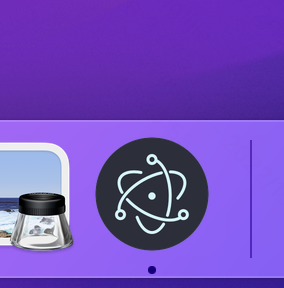
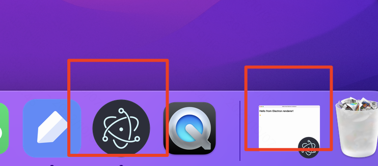
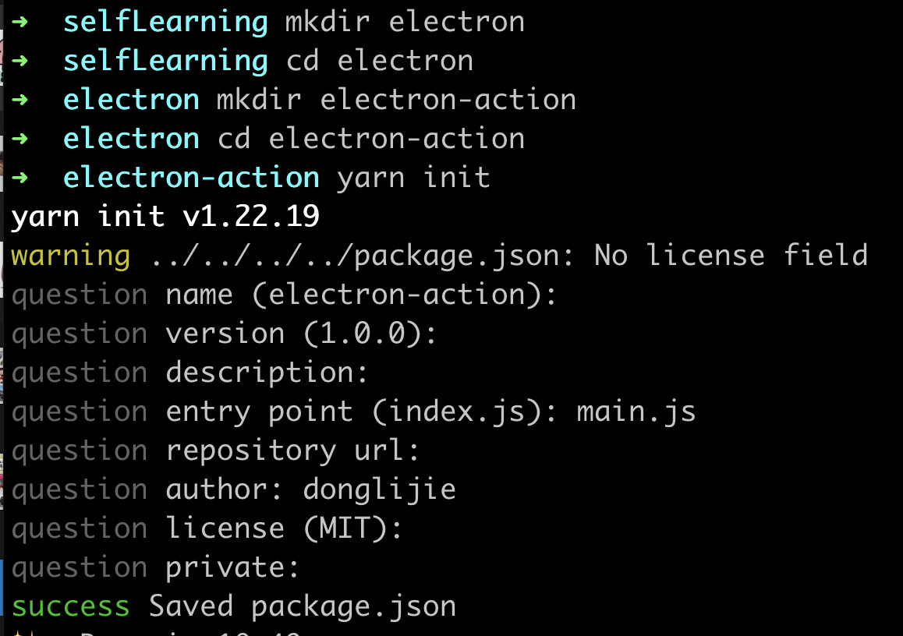

[toc]

# 参考链接

[electron参考链接](https://www.jianshu.com/p/4dff80a333a8)

# 参考书籍

electron 实战

深入浅出Electron

# 官方教程

## 安装node

用electron开发，需要在电脑上先安装node。我现在是在macos上开发，所以用homebrew安装node。

```
brew install node
查看node版本：
➜  ~ node -v
v16.15.1
查看npm版本号
➜  ~ npm -v
8.11.0

```

> 只有在开发环境上安装node，而在运行的时候就不需要node了，因为electron中内置了node.js运行时。

配置npm 的镜像源

```
设置镜像方法
npm config set registry https://registry.npm.taobao.org
查看config的registry方法
npm config get registry
```

## 创建第一个程序

```
mkdir my-electron-app && cd my-electron-app
npm init
# 创建时，入口点应该是main.js，
# 安装依赖， --save-dev 开发时依赖
npm install electron --save-dev
```

Package.json中指定的main是所有electron应用的入口点，这个文件控制主程序，ta

electron app 退出：

如果是mac os 是不会退出的，因为mac os上，点击关闭按钮，只会把程序给缩小到下方的工具栏上，

```
app.on('window-all-closed', () => {
    if (process.platform !== 'darwin') {
        app.quit();
    }
});
```



但是点击关闭和点击缩小还是不太一样，点击缩小，不仅仅是右下角有一个electron的图案，同时还会有一个那个界面的缩略图。



# Electron实战笔记

## 开发环境搭建

书上是使用的yarn 来初始化项目啥的。

```
# windows下可以使用这个命令，mac上不行，mac要使用brerw安装
npm install -g yarn 
# macos安装命令
brew install yarn
2.升级yarn

brew upgrade yarn
3.查看版本号

yarn -v
```

创建一个项目，目录是electron-action，这个命令用起来确实比npm 要好一点。

