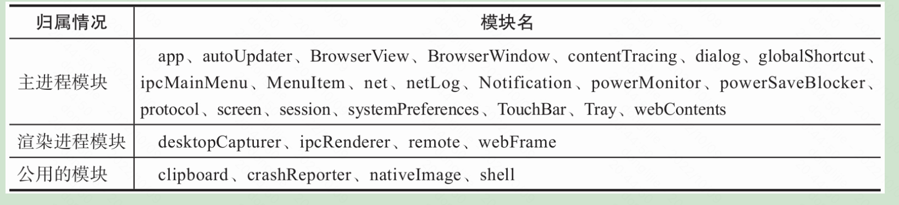
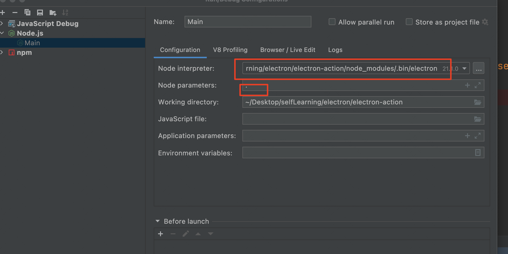
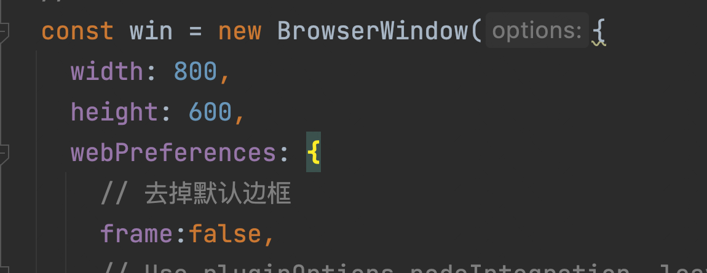
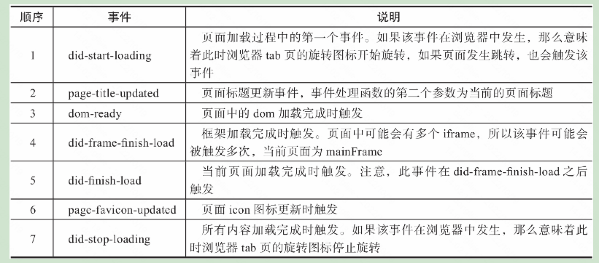

[toc]

# 参考链接

[electron参考链接](https://www.jianshu.com/p/4dff80a333a8)

# 参考书籍

electron 实战

深入浅出Electron

# 官方教程

## 安装node

用electron开发，需要在电脑上先安装node。我现在是在macos上开发，所以用homebrew安装node。

```
brew install node
查看node版本：
➜  ~ node -v
v16.15.1
查看npm版本号
➜  ~ npm -v
8.11.0

```

> 只有在开发环境上安装node，而在运行的时候就不需要node了，因为electron中内置了node.js运行时。

配置npm 的镜像源

```
设置镜像方法
npm config set registry https://registry.npm.taobao.org
查看config的registry方法
npm config get registry
```

## 创建第一个程序

```
mkdir my-electron-app && cd my-electron-app
npm init
# 创建时，入口点应该是main.js，
# 安装依赖， --save-dev 开发时依赖
npm install electron --save-dev
```

Package.json中指定的main是所有electron应用的入口点，这个文件控制主程序，ta

electron app 退出：

如果是mac os 是不会退出的，因为mac os上，点击关闭按钮，只会把程序给缩小到下方的工具栏上，

```
app.on('window-all-closed', () => {
    if (process.platform !== 'darwin') {
        app.quit();
    }
});
```


但是点击关闭和点击缩小还是不太一样，点击缩小，不仅仅是右下角有一个electron的图案，同时还会有一个那个界面的缩略图。


# Electron实战笔记

## 开发环境搭建

书上是使用的yarn 来初始化项目啥的。

```
# windows下可以使用这个命令，mac上不行，mac要使用brerw安装
npm install -g yarn 
# macos安装命令
brew install yarn
2.升级yarn

brew upgrade yarn
3.查看版本号

yarn -v
```

创建一个项目，目录是electron-action，这个命令用起来确实比npm 要好一点。


安装依赖，不用像书上那样指定平台版本啥的。

```
yarn add electron --dev
```

添加运行参数

```
"scripts": {
    "start": "electron ."
  },
```

运行命令：

```
yarn run start
```

书上的代码用的还是旧版的监听事件，现在已经不推荐用了，我直接替换了。

### 在index.html中引入js

首先创建一个objRender.js

```
window.objRender = { key: 'value' }
```

上面这种方式是直接引入的，书上是用另一种方式，通过require，来导入。

创建objRender2.js

```
module.exports = {
    key: 'value'
}
```

然后 在index.html中

```
let ObjRender2 = require('./ObjRender2');
    alert(ObjRender2.key)
```

运行代码，第二个并没有弹出，需要进行如下设置：

```
nodeIntegration: true, contextIsolation: false
```

因为：[参考链接](https://stackoverflow.com/questions/59523682/nodeintegration-true-ignored)

```
In Electron 12, contextIsolation will be enabled by default, so require() cannot be used in the renderer process unless nodeIntegration = true and contextIsolation = false.
```

##  主进程和渲染进程

一个Electron应用只有一个主进程、多个渲染进程。一个BrowserWindow实例就代表着一个渲染进程。

electron 内置的主要模块归属情况



debug main进程

主要就两个点，第一，Node interpreter 选择 node_modules下面的bin/electron，然后 paramsters 选 . 就可以了。

[参考链接](https://blog.jetbrains.com/webstorm/2016/05/getting-started-with-electron-in-webstorm/)



### 渲染进程访问主进程对象

书上使用的是electron 的remote模块。[参考链接](https://www.csdn.net/tags/MtjaAg3sMTA0ODctYmxvZwO0O0OO0O0O.html)

```
#安装依赖
npm install --save @electron/remote
首先是main.js
const electron = require('electron');
const remote = require("@electron/remote/main") //1
remote.initialize()//2
const app = electron.app;
const BrowserWindow = electron.BrowserWindow;
let win = null;
const createWindow = () => {
    win = new BrowserWindow({
        webPreferences: {
            nodeIntegration: true,
            contextIsolation: false,// 开启remote
            enableRemoteModule: true
        }
    });
    win.loadFile('index.html');
    remote.enable(win.webContents); // 3
    win.on('closed', function () {
        win = null
    });
};

app.whenReady().then(() => {
    createWindow();
})
app.on('window-all-closed', function () {
    app.quit();
});
```

然后是index.html

```
<script>
    //const { remote } = require("@electron/remote");
    const { currentWindow } = require("@electron/remote").getCurrentWindow();
    console.log(currentWindow)

    document.querySelector("#openDevToolsBtn").addEventListener('click', function() {
        //currentWindow.webContents.openDevTools();
        require('@electron/remote').getCurrentWindow().webContents.openDevTools();
        /*let webContents = remote.getCurrentWebContents();
        webContents.openDevTools();*/
    });
</script>
```

很奇怪的一点是，我在document 外面导入的remote对象，返回的结果是undefine。很奇怪。找到原因了，是因为我使用的const { currentWindow } ，这种方式不对，这种方式是对象解构赋值，remote里没有currentWindow 这个属性，所以一直返回的是空。

### 渲染进程访问主进程类型

这个是在render中创建一个新的窗体。这个实际上还是调用的主进程的方法，主进程创建了BrowserWindow后把对象返回给render。

```
let remote = require('@electron/remote');
    let win = null;
    document.querySelector("#makeNewWindow").addEventListener('click', function() {
        win = new remote.BrowserWindow({
            webPreferences: { nodeIntegration: true }
        });
        win.loadFile('index.html');
    })
```

### 渲染进程访问主进程自定义内容

创建mainModel.js

```
let { BrowserWindow } = require('electron')
exports.makeWin = function() {
    let win = new BrowserWindow({
        webPreferences: { nodeIntegration: true }
    });
    return win;
}
```

在index.html，添加：

```
let mainModel = remote.require('./mainModel');
    let win2 = null;
    document.querySelector("#makeNewWindow2").addEventListener('click', () => {
        win2 = mainModel.makeWin();
        win2.loadFile('index.html');
    });
```

## 进程间消息传递

### 渲染进程向主进程发送消息

ipcRenderer.send方法的第一个参数是消息管道的名称，主进程会根据该名称接收消息；后面两个对象是随消息传递的数据。该方法可以传递任意多个数据对象。下面这个是异步传递消息。ipcRenderer.send方法的第一个参数是消息管道的名称，主进程会根据该名称接收消息；后面两个对象是随消息传递的数据。该方法可以传递任意多个数据对象。

```
let { ipcRenderer } = require('electron');
    document.querySelector("#sendMsg1").addEventListener('click', () => {
        ipcRenderer.send('msg_render2main', { name: 'param1' }, { name: 'param2' });
    });
    
# 主进程
let { ipcMain } = require('electron')
ipcMain.on('msg_render2main', (event, param1, param2) => {
    console.log(param1);
    console.log(param2);
    console.log(event.sender);
});
```

### 主进程向渲染进程发送消息

在主线程里加入如下代码

```
ipcMain.on('msg_render2main', (event, param1, param2) => {
    win.webContents.send('msg_main2render', param1, param2)
});
```

上面的这种方式，只能是win 这个窗体对应的渲染进程能接收到消息。

在render线程里加入如下代码

```
ipcRenderer.on('msg_main2render',(event, param1, param2)=>{
        console.log(param1);
        console.log(param2);
    })
```

## 引入现代前端框架

## 引入webpack

```
 mkdir electron-webpack
 cd electron-webpack
 yarn init
 yarn add electron --dev
 yarn add webpack@4.5.0 --dev
 yarn add electron-webpack --dev
```

按照书上，webpack会自动生成一个index.html 文件，但是我在开发模式下运行的时候，并没有生成。是我自己的问题，我没有把loadFile给改成loadUrl(这个花了我几个小时，真无语)。

自定义入口页面

```
,
"electronWebpack": {
  "renderer": {
    "template": "src/renderer/index.html"
  }
}
```

### 引入vue

```
# 安装vue-cli
yarn global add @vue/cli
# 创建项目
vue create chapter3_4   
# 安装electron-builder
vue add electron-builder
# 编译命令
yarn electron:serve

```

生成的项目里，src/background.js 是主进程入口程序，src/main.js是渲染进程入口程序

## 窗口

### 窗口标题栏和边框

禁用默认的窗口标题栏



但是在mac系统上我看不出来效果。

窗口的控制按钮

在这里需要使用remote模块，参考前面的步骤，引入remote。但是这个时候项目编译是报错的，提示：Module not found: Error: Can't resolve 'fs' in '/Users/donglijie/Desktop/selfLearning/electron/chapter3_4/node_modules/electron'，这个错误是因为系统默认不支持node，需要把node给集成进来，修改vue.config.js,[参考链接](https://blog.csdn.net/feinifi/article/details/126898900)

```
module.exports = defineConfig({
  transpileDependencies: true,
  pluginOptions:{
    electronBuilder:{
      nodeIntegration:true
    }
  }
})
```

## 页面

### 页面内容

页面主要由webContents进行渲染。

#### 页面加载事件及触发顺序


