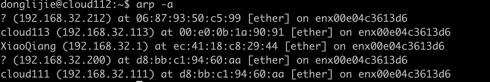

[toc]

# 第一章 tcp/ip协议族

## arp 协议工作原理
为了测试arp的工作原理，这里准备了两台服务器和一个路由器。

arp协议能实现网络层地址到物理地址的转换。

### arp 高速缓存的的查看和修改
arp维护一个高速缓存（这个缓存是经常变化的），包含经常访问或者最近访问的机器的ip地址到物理地址的映射。
查看使用：arp-a 命令

可以看到cloud113 的Mac地址，ip地址，网卡名。


### 使用tcpdump观察ARP通信过程
首先，我在cloud112上删除cloud113的缓存记录，但是我查看以后，立刻就有了，原因应该是我这台电脑上还运行着k8s的程序，会不停的发心跳信息，所以，即使我删除arp缓存以后，马上就会有了。
抓包命令：**sudo tcpdump -i enx00e04c3613d6 -ent '(dst 192.168.32.113 and src 192.168.32.112)' >> log.txt**
我把tcpdump抓包的日志输出到文件里，然后执行 arp 的删除命令：**sudo arp -d 192.168.32.113**

00:e0:4c:36:13:d6是cloud112的mac地址。第一条记录，请求的目的地址是ff:ff:ff:ff:ff:ff，这是广播地址，该局域网的所有机器都会收到并处理这样的帧。

arp请求帧实际上也是以太网帧。

#### 以太网帧格式

以太网帧的格式：历史上以太网帧的格式有很多种，目前的格式是IEEE802.3格式。


> 以太网的类型：0x0800 表示帧的数据部分为IP数据报，以太网驱动程序会把帧交给IP模块，0x0806表示帧的数据部分为ARP请求或者应答报文。

#### 以太网ARP请求报文的格式


所以对于下面这个ARP请求报文，但是不知道为啥，我抓包的日志文件里，并没有arp请求的应答报文。书上说，只有目标主机才会响应arp请求。

```
00:e0:4c:36:13:d6 > ff:ff:ff:ff:ff:ff, ethertype ARP (0x0806), length 42: Request who-has 192.168.32.113 tell 192.168.32.112, length 28
```

## DNS工作原理

dns报文格式


  16位标识字段用于标记一对DNS查询和应答，以此区分一个DNS应答是哪个DNS查询的应答。
  16位标志字段用于协商具体的通信方式和反馈通信状态。DNS报文头部的16位标志字段的细节如下表格所示：


QR，查询/应答标志。0表示这是一个查询报文，1表示这是一个应答报文。
    opcode，定义查询和应答的类型。0表示标准查询，1表示反向查询（通过IP地址获得主机域名），2表示请求服务器状态
    AA，授权应答标志。仅有应答报文使用。1表示域名服务器是授权服务器
    TC，截断标志。仅当DNS报文使用DNS服务时使用。因为UDP数据包有长度的限制，所以过长的DNS报文将被截断。1表示DNS报文超过512个字节，并被截断
    RD，递归查询标志。1表示执行递归查询，即如果目标DNS服务器无法解析某个主机名，则它将向其他DNS服务器继续查询，如此递归，直到获得结果，并把结果返回给客户端。0表示执行迭代查询，即如果目标DNS服务器无法解析某个主机名，则它将自己知道的其他DNS服务器的IP地址返回给客户端，以供客户端参考。
    RA，允许递归标志。仅由应答报文使用，1表示DNS服务器支持递归查询 
    zero，未使用位。设置位0
    rcode，4位返回码，表示应答的状态。常用值有0(无错误)，3(域名不存在)

[参考链接](https://blog.csdn.net/impossble_2017/article/details/117039914)

linux使用/etc/resolv.conf文件来存放dns服务器的ip地址。第一个是首选的dns服务器地址，第二个是备选的。


比如使用host命令查询百度这个域名的ip地址


使用tcpdump观察DNS通信过程

**sudo tcpdump -i enx00e04c3613d6 -nt -s 500 port domain**，然后我在另一个窗口输入：**host -t A www.baidu.com**，就可以看到tcpdump 抓到的报文了。


tcpdump 加上-X 会展示出报文的每一个字节。


[参考链接](https://blog.csdn.net/xiao666wang/article/details/107742372)

# 第2章 IP协议详解

## IPv4头部结构


4位版本号，指定ip协议到版本，对于ipv4，它的值就是4。

4位头部长度，标识该IP头部有多少个32bit字（4字节），因为4位最大能表示15，所以ip头部最长是60字节。

8位服务类型，包括一个3位的优先权字段（现在已被忽略）、4位的TOS字段和一位保留字段（必须置0），4位TOS字段分别表示：最小延时，最大吞吐量，最高可靠性和最小费用，其中最多有一位能置为1，

16位总长度是指整个IP数据报的长度，以字节为单位，因此IP数据报的最大长度为65535（2^16-1）字节，但由于没TU的限制，长度超过MTU的数据报都会被分片传输。

16位标识唯一地标识主机发送的每个数据报，其初始值由系统随机生成，每发送一个数据报，其值就加1。该值在数据报分片时被复制到每个分片中，因此同一个数据报的所有分片都具有相同的标识值。

3位标志字段的第一位保留，第二位表示禁止分片，如果设置了这个位，IP模块将不对数据报进行分片，在这种情况下，如果IP数据报长度超过MTU，IP模块将丢弃该数据报并返回一个ICMP差错报文，第三位表示更多分片，除了数据报的最后一个分片外，其他分片都要把它置1。

13位分片偏移是分片相对原始IP数据报开始处（仅指数据部分）的偏移，实际的偏移值应该是该值左移3位（乘8）后得到的，由于这个原因，除了最后一个IP分片外，每个IP分片的数据部分的长度必须是8的整数倍（这样才能保证后面的IP分片拥有一个合适的偏移值）。

8位生存时间是数据报到达目的地之前允许经过的路由器跳数，TTL值被发送端设置（常见的值是64），数据报在转发过程中每经过一个路由，该值就被路由器减1，当TTL值减为0时，路由器将丢弃数据报，并向源端发送一个ICMP差错报文，TTL值可以防止数据报陷入路由循环。

8位协议用来区分上层协议，/ect/protocols文件定义了所有上层协议对应的protocol字段的数值，其中ICMP 是1，TCP是6，UDP是17，/etc/protocols文件是RFC1700的一个子集。

16位头部校验和由发送端填充，接收端对其使用CRC算法以校验IP数据报头部（**仅校验头部**）在查传输过程中是否有损坏。

32位的源端IP地址和目的端IP地址用来标识数据报的发送端和接收端。一般情况下，这两个ip地址在整个数据报的传递过程中保持不变。

IPV4 最后一个选项字段是可变长的可选信息，这部分最多包含40个字节，可用的IP选项包括：

- 记录路由
- 时间戳
- 松散源路由选择
- 严格源路由选择

## 使用tcpdump观察Ipv4头部结构

比如我执行host 命令抓的报文。参考书上的似乎是4位解析成一个数字，所以0x4500， 第一个数字表示ip版本号。


## ip分片

使用tcpdump进行监听，执行命令：sudo tcpdump -ntv -i enx00e04c3613d6 icmp

使用ping 命令发送icmp 报文；ping cloud113 -s 1473


以太网帧的MTU是1500字节，因此它能携带的ip数据报的数据部分最多是1480字节（ip头部占用20字节），因此可以用ip数据报封装一个长度为1481字节的icmp报文（这个长度包含8字节的ICMP头部，所以数据部分1473字节），因此该数据报在使用以太网帧传输时必须被分片。


这1473个字节被拆分成两个，前1472字节加上ICMP头部在第一个ip数据报里，第一个IP数据报里还会设置MF的值为1，表示有更多分片，在第最后一个分片的报文里就不会设置了。从上面的截图里可以看到两个IP分片的标识都是51643，说明它们是同一个IP数据报的分片，第一个分片的偏移值是0，而第二个则是1480。

## IP路由

### IP模块工作流程


具体流程如下：

1. IP模块接收到来自数据链路层的IP数据报时，对数据报的头部进行CRC校验，确认无误后，分析其头部的具体信息。
2. 看数据报头部是否设置了源站选路选项（松散源路由选择或者严格源路由选择），如果设置了就直接调用数据转发子模块来处理该数据报。
3. 如果该IP数据报的头部目标IP地址是本机的某个IP地址，或者广播地址，即该数据报是发送给本机的，则IP模块就根据数据报头部中的协议字段来决定将它派发给哪个上层应用，如果IP模块发现这个数据报不是发送给本机的，则也调用数据报转发子模块来处理该数据报。
4. 数据报转发子模块将首先检测系统是否允许转发，如果不允许，IP模块就将数据报丢弃，如果允许，数据报转发子模块将对该数据报执行一些操作，然后将它交给IP数据报输出子模块。
5. IP数据报应该发送至哪个下一跳路由（或者目标机器），以及经过哪个网卡来发送，就是IP路由过程，即上图中“计算下一跳路由”子模块。IP模块实现数据报路由的核心数据是路由表，这个表按照数据报的目标IP地址分类，同一类型的IP数据报将被发往相同的下一跳路由器（或者目标机器）。
6. IP输出队列中存放的是所有等待发送的IP数据报，其中除了需要转发的IP数据报外，还包括封装的了本机上层数据（ICMP报文、TCP报文段和UDP数据报）的IP数据报。

上图中的虚线箭头显示了路由表更新的过程，这一过程是指通过路由协议或者route命令调整路由表，使之更适应最新的网络拓扑结构。

### 路由机制

可以使用route命令查看路由表。


路由表内容：

| 字段        | 含义                                                         |
| ----------- | ------------------------------------------------------------ |
| Destination | 目标网络或主机                                               |
| Gateway     | 网关地址，* 表示目标和本机在同一个网络，不需要路由           |
| Genmask     | 网络掩码                                                     |
| Flags       | 路由项标志，常见表标志有如下5种：U： 该路由项是活动的，H 该路由项是一台主机，G 该路由项的目标是网关，D：该路由项是由重定向生成的，M：该路由项被重定向修改过。 |
| Metric      | 路由距离，即到达指定网络所需的中转数                         |
| Ref         | 路由项种被引用的次数（linux未使用）                          |
| Use         | 该路由项被使用的次数                                         |
| Iface       | 该路由项对应的输出网卡接口                                   |

第一项的目标地址是default，即默认路由选项，该选项包含一个“G”标志，说明路由的下一跳目标是网关，在我的网络里它的地址就是192.168.32.1。

IP的路由机制分为三个步骤：

1. 查找路由表中和数据报的目标IP地址完全匹配的主机IP地址，如果找到，就使用该路由项，没找到则转步骤2。
2. 查找路由表中和数据报的IP地址具有相同网络ID的网络IP地址，如果找到，就使用该路由项，没找到就转到步骤3。
3. 选择默认路由项，这也意味着数据报的下一跳路由是网关。

###  路由表更新

除了使用route命令来更新路由表，还有通过BGP、RIP、OSPF等协议来发现路径、并更新自己的路由表。

## IP转发

## 重定向

ICMP重定向报文也能用于更新路由表。

### ICMP重定向报文


ICMP 重定向报文段头部3个固定字段：8位类型、8位代码和16位校验码。ICMP重定向报文的类型值是5，代码字段有4个可选值，用来区分不同的重定向类型，主机重定向代码值是1。接收主机根据原始IP数据报的源端IP地址和应该使用的路由器IP地址来断定引起重定向的IP数据报应该使用哪个路由器来转发，并且以此来更新路由表（通常是）。

## IPV6头部结构


# TCP协议

## TCP服务的特点

TCP协议相对UDP协议的特点是：面向连接、字节流、可靠传输。并且TCP协议的这种连接是一对一的，所以基于广播和多播的应用程序不能使用TCP服务。

## TCP头部结构


所有知名服务使用的端口号都定义在/etc/srvices文件中。

16位源端口号：告知主机该报文来自哪里

16位目的端口号：告知主机传送给哪个上层协议或者应用程序

32位序号：一次TCP通信（从TCP连接建立到断开）过程中某个传输方向上的字节流的每个字节的编号。假设主机A和主机B进行TCP通信，A发送给B的第一个TCP报文段中，序号值被系统初始化位某个随机值ISN（Initial Sequence Number，初始序号值），那么在该传输方向上（从A到B），后续的TCP报文段中序号值将被系统设置成ISN加上该报文段所携带数据的第一个字节在整个字节流中的偏移，例如，某个TCP报文段传送的数据是字节流中的第1025～2048字节，那么该报文段的序号值就是ISN+1025。

32位确认号：用作对另一方发送来的TCP报文段的响应，其值是接收到的TCP报文段的序号值加1。

4位头部长度：标识该TCP头部有多少个32bit字（4字节），因为4位最大能表示15，所以TCP头部最长是60字节。

6位标志位包含如下几项：

- URG标志：表示紧急指针是否有效。
- ACK标志：表示确认号是否有效，带有ACK标志的TCP报文段称为确认报文段。
- PSH标志：表示接收端应用程序应该立即从TCP接收缓冲区读走数据，为接收后续数据腾出空间（如果应用程序不将接收到的数据读走，它们就会一直停留在TCP接收缓冲区中）。
- RST标志：表示要求对方重新建立连接。带RST标志的TCP报文段为复位报文段。
- SYN标志：表示请求建立一个连接。带SYN标志的TCP报文段为同步报文段。
- FIN标志：表示通知对方本端要关闭连接了。带FIN标志的TCP报文段为结束报文段。

16位窗口大小：用于TCP流量控制，这里的窗口是指接收通高窗口，它告诉对方本端的TCP接收缓冲区还能容纳多少字节的数据，这样对方就能控制发送数据的速度。

16位校验和：由发送端填充，接受端对TCP报文段执行CRC算法以校验TCP报文在传输过程中是否有损坏，这个校验不仅校验头部，同时也会校验数据部分。

16位紧急指针：是一个正的偏移量，用于发送端向接受端发送紧急数据。

### TCP头部选项

TCP头部选项最多40个字节，TCP头部选项的一般结构如下：


选项的第一个字段kind说明选项的类型，有的TCP选项没有后面两个字段，仅包含一个字节的kind字段，第二个字段length（如果有的话）指定该选项的总长度，该长度包含kind字段和length字段占据的2字节，第三个字段info（如果有的话）是选项的具体信息。常见的TCP选项有7种：如下图：


- kind = 0 是选项表结束选项。
- kind =1 是空操作选项，没有特殊含义，一般用于将TCP选项的总长度填充位4字节的整数倍
- kind=2 是最大报文段长度选项，TCP连接初始化时，通信双方使用该选项来协商最大报文段长度（Max Segement）。TCP模块通常将MSS设置为（MTU-40）字节（减去掉的这个40字节包括20字节的TCP头部和20字节的IP头部）。这样携带TCP报文段的IP数据报的长度就不会超过MTU（假设TCP头部和IP头部都不包含选项字段，并且这也是一般情况），从而避免本机发生IP分片，对以太网而言，MSS值是1460（1500-40）字节。
- kind=3 是窗口扩大因子选项。和MSS选项一样，窗口扩大因子选项只能出现在同步报文段中，否则将被忽略，但同步报文段本身并不执行窗口扩大操作，即同步报文段头部的接收通告窗口大小就是该TCP报文段的实际接收通告窗口大小。当连接建好以后，每个数据传输方向的窗口扩大因子就固定不变了。
- kind=4 是选择性确认选项，TCP通信时，如果某个报文段丢失，则TCP模块会重传最后被确认的TCP报文段后续的所有报文段，这样原先已经正确传输的TCP报文段也可能重复发送，从而降低了TCP性能， SACK模块使TCP模块只重新发送丢失的TCP报文段，不用发送所有未被确认的报文段。
- kind=5 该选项的参数告诉发送方本端已经收到并缓存不连续数据块，从而让发送端可以据此检查并重发丢失的数据。
- kind=8 是时间戳选项，该选项提供了较为准确的计算通信双方之间的回路时间。