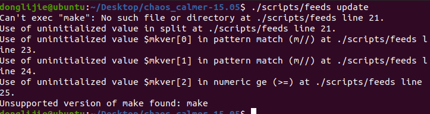

# 编译环境搭建
## 安装ubuntu虚拟机
这里我是用的vmware 安装的ubuntu20虚拟机。
```
#更新软件源以后，卸载系统自带的vim
sudo apt remove vim-common
sudo apt install vim
#安装编译工具
sudo apt-get install subversion 
sudo apt-get install g++ flex patch 
sudo apt-get install libncurses5-dev zlib1g-dev
sudo apt-get install git-core 
sudo apt-get install libssl-dev 
sudo apt-get install gawk 
# 这个在ubuntu20上找不到，暂时先不安装了。
sudo apt-get install xz-util
```
## 下载源码
现在已经22年了，书上用的是15.05这个版本，用书上给的命令下载不下来，这个旧版本已经挪位置了，
```
git clone git@github.com:openwrt/chaos_calmer.git
git checkout v15.05
```
具体可以看这个参考链接，[参考链接](https://github.com/openwrt/chaos_calmer/tree/v15.05) 
，直接在tag里选中v15.05，然后选择下载压缩包就可以了。

压缩包解压以后就变成了这样：

### 编译
```
./scripts/feeds update #升级
出现问题：
Can't exec "make": No such file or directory at ./scripts/feeds line 21.
解决方案：
apt-get install build-essential
./scripts/feeds install -a #安装所有

```
#### 编译配置
```
# 编译配置
make defconfig # 这里会检查所需的编译配置是否齐备，并生成默认的.config文件，我在运行的时候提示没有pytho2，我执行了一下安装命令。
sudo apt install python2
```
输入make menuconfig 出现下面的界面

执行升级操作出现了下面这个问题，不识别make。
