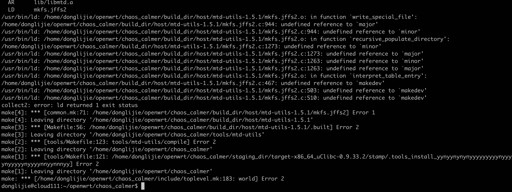

# 编译环境搭建
我放弃了编译15，太麻烦了。
## ubuntu16 编译
```
执行 openwrt目录下的init.exp文件，安装依赖。
# 下载源码
git clone git@github.com:openwrt/chaos_calmer.git
git checkout v15.05
./scripts/feeds update #升级
./scripts/feeds install -a #安装所有
make defconfig
make menuconfig
make V=s
# 编译的时候，有一个软件，一直下载不下来。我直接把它复制到对应目录了。
cp odhcpd-2015-05-21.tar.bz2 chaos_calmer/dl/odhcpd-2015-05-21.tar.bz2
```
然后就编译成功了，但是好像并没有编译很久。我弄错了，
## 安装ubuntu虚拟机
这里我是用的vmware 安装的ubuntu20虚拟机。
```
#更新软件源以后，卸载系统自带的vim
sudo apt remove vim-common
sudo apt install vim
# 不用再执行下面的命令。
#安装编译工具
sudo apt-get install subversion 
sudo apt-get install g++ flex patch 
sudo apt-get install libncurses5-dev zlib1g-dev
sudo apt-get install git-core 
sudo apt-get install libssl-dev 
sudo apt-get install gawk 
# 这个在ubuntu20上找不到，暂时先不安装了。
sudo apt-get install xz-util
```
## 下载源码
现在已经22年了，书上用的是15.05这个版本，用书上给的命令下载不下来，这个旧版本已经挪位置了，
```
git clone git@github.com:openwrt/chaos_calmer.git
git checkout v15.05
```
具体可以看这个参考链接，[参考链接](https://github.com/openwrt/chaos_calmer/tree/v15.05) 
，直接在tag里选中v15.05，然后选择下载压缩包就可以了。

压缩包解压以后就变成了这样：

### 编译
```
./scripts/feeds update #升级
出现问题：
Can't exec "make": No such file or directory at ./scripts/feeds line 21.
解决方案：
apt-get install build-essential
./scripts/feeds install -a #安装所有

```
#### 编译配置
```
# 编译配置
make defconfig # 这里会检查所需的编译配置是否齐备，并生成默认的.config文件，我在运行的时候提示没有pytho2，我执行了一下安装命令。
sudo apt install python2
```
输入make menuconfig 出现下面的界面

编译生成vmware镜像。

```
输入`make V=s`进行编译，出现下面的错误：
freadahead.c:91:3: error: #error "Please port gnulib freadahead.c to your platform! Look at the definition of fflush, fread, ungetc on your system, then report this to bug-gnulib."
   91 |  #error "Please port gnulib freadahead.c to your platform! Look at the definition of fflush, fread, ungetc on your system, then report this to bug-gnulib."
      |   ^~~~~
```
.png)
解决方案：
```
# 这个错误似乎是ubuntu20才有的，cd的这个目录是根据上面的截图 leaving directory 那行日志来的
cd build_dir/host/m4-1.4.17
sed -i 's/IO_ftrylockfile/IO_EOF_SEEN/' lib/*.c
echo "#define _IO_IN_BACKUP 0x100" >> lib/stdio-impl.h
```


```
lib/fseterr.c:77:3: error: #error "Please port gnulib fseterr.c to your platform! Look at the definitions of ferror and clearerr on your system, then report this to bug-gnulib."
解决方案
cd build_dir/host/bison-3.0.2/
sed -i 's/IO_ftrylockfile/IO_EOF_SEEN/' lib/*.c
echo "#define _IO_IN_BACKUP 0x100" >> lib/stdio-impl.h
```

```
-MF $depbase.Tpo -c -o lib/fseterr.o lib/fseterr.c &&\
mv -f $depbase.Tpo $depbase.Po
lib/fseterr.c: In function 'fseterr':
lib/fseterr.c:77:3: error: #error "Please port gnulib fseterr.c to your platform! Look at the definitions of ferror and clearerr on your system, then report this to bug-gnulib."
   77 |  #error "Please port gnulib fseterr.c to your platform! Look at the definitions of ferror and clearerr on your system, then report this to bug-gnulib."
      |   ^~~~~
```
解决方案：
```
donglijie@cloud111:~/openwrt/chaos_calmer$ cd build_dir/host/bison-3.0.2
donglijie@cloud111:~/openwrt/chaos_calmer/build_dir/host/bison-3.0.2$ sed -i 's/IO_ftrylockfile/IO_EOF_SEEN/' lib/*.c
donglijie@cloud111:~/openwrt/chaos_calmer/build_dir/host/bison-3.0.2$ echo "#define _IO_IN_BACKUP 0x100" >> lib/stdio-impl.h
donglijie@cloud111:~/openwrt/chaos_calmer/build_dir/host/bison-3.0.2$
```


```
/usr/bin/ld: contents.c:(.text+0xc17): undefined reference to `minor'
collect2: error: ld returned 1 exit status
# 解决方案 
cd build_dir/host/make-ex4fs-XXX(日期)文件夹,找到contents.c，编辑，在头文件引入中加入

#include <sys/sysmacros.h>

```

```
devname.c:(.text+0x888): undefined reference to `makedev'
/usr/bin/ld: devname.c:(.text+0xb7e): undefined reference to `makedev'
/usr/bin/ld: devname.c:(.text+0xc5b): undefined reference to `makedev'
collect2: error: ld returned 1 exit status
解决方案
vim build_dir/host/e2fsprogs-1.42.8/lib/blkid/devname.c
```

```
/usr/bin/ld: /home/donglijie/openwrt/chaos_calmer/build_dir/host/mtd-utils-1.5.1/mkfs.jffs2.o: in function `write_special_file':
/home/donglijie/openwrt/chaos_calmer/build_dir/host/mtd-utils-1.5.1/mkfs.jffs2.c:944: undefined reference to `major'
/usr/bin/ld: /home/donglijie/openwrt/chaos_calmer/build_dir/host/mtd-utils-1.5.1/mkfs.jffs2.c:944: undefined reference to `minor'
/usr/bin/ld: /home/donglijie/openwrt/chaos_calmer/build_dir/host/mtd-utils-1.5.1/mkfs.jffs2.o: in function `recursive_populate_directory':
/home/donglijie/openwrt/chaos_calmer/build_dir/host/mtd-utils-1.5.1/mkfs.jffs2.c:1273: undefined reference to `minor'
/usr/bin/ld: /home/donglijie/openwrt/chaos_calmer/build_dir/host/mtd-utils-1.5.1/mkfs.jffs2.c:1273: undefined reference to `major'
/usr/bin/ld: /home/donglijie/openwrt/chaos_calmer/build_dir/host/mtd-utils-1.5.1/mkfs.jffs2.c:1263: undefined reference to `minor'
/usr/bin/ld: /home/donglijie/openwrt/chaos_calmer/build_dir/host/mtd-utils-1.5.1/mkfs.jffs2.c:1263: undefined reference to `major'
/usr/bin/ld: /home/donglijie/openwrt/chaos_calmer/build_dir/host/mtd-utils-1.5.1/mkfs.jffs2.o: in function `interpret_table_entry':
/home/donglijie/openwrt/chaos_calmer/build_dir/host/mtd-utils-1.5.1/mkfs.jffs2.c:467: undefined reference to `makedev'
/usr/bin/ld: /home/donglijie/openwrt/chaos_calmer/build_dir/host/mtd-utils-1.5.1/mkfs.jffs2.c:503: undefined reference to `makedev'
/usr/bin/ld: /home/donglijie/openwrt/chaos_calmer/build_dir/host/mtd-utils-1.5.1/mkfs.jffs2.c:510: undefined reference to `makedev'
解决方案
vi build_dir/host/mtd-utils-1.5.1/mkfs.jffs2.c
加上#include <sys/sysmacros.h>
```

```

In file included from include/linux/compiler.h:54,
                 from /home/donglijie/openwrt/chaos_calmer/build_dir/host/u-boot-2014.10/arch/sandbox/include/asm/bitops.h:20,
                 from include/linux/bitops.h:110,
                 from /home/donglijie/openwrt/chaos_calmer/build_dir/host/u-boot-2014.10/include/common.h:20:
include/linux/compiler-gcc.h:114:1: fatal error: linux/compiler-gcc9.h: No such file or directory
  114 | #include gcc_header(__GNUC__)
      | ^~~~
解决方案：
https://askubuntu.com/questions/1328266/fatal-error-linux-compiler-gcc9-h-no-such-file-or-directory
```

```

/usr/bin/ld: /home/donglijie/openwrt/chaos_calmer/build_dir/host/mtd-utils-1.5.1/mkfs.jffs2.o: in function `write_special_file':
/home/donglijie/openwrt/chaos_calmer/build_dir/host/mtd-utils-1.5.1/mkfs.jffs2.c:944: undefined reference to `major'
/usr/bin/ld: /home/donglijie/openwrt/chaos_calmer/build_dir/host/mtd-utils-1.5.1/mkfs.jffs2.c:944: undefined reference to `minor'
/usr/bin/ld: /home/donglijie/openwrt/chaos_calmer/build_dir/host/mtd-utils-1.5.1/mkfs.jffs2.o: in function `recursive_populate_directory':
/home/donglijie/openwrt/chaos_calmer/build_dir/host/mtd-utils-1.5.1/mkfs.jffs2.c:1273: undefined reference to `minor'
/usr/bin/ld: /home/donglijie/openwrt/chaos_calmer/build_dir/host/mtd-utils-1.5.1/mkfs.jffs2.c:1273: undefined reference to `major'
/usr/bin/ld: /home/donglijie/openwrt/chaos_calmer/build_dir/host/mtd-utils-1.5.1/mkfs.jffs2.c:1263: undefined reference to `minor'
/usr/bin/ld: /home/donglijie/openwrt/chaos_calmer/build_dir/host/mtd-utils-1.5.1/mkfs.jffs2.c:1263: undefined reference to `major'
/usr/bin/ld: /home/donglijie/openwrt/chaos_calmer/build_dir/host/mtd-utils-1.5.1/mkfs.jffs2.o: in function `interpret_table_entry':
/home/donglijie/openwrt/chaos_calmer/build_dir/host/mtd-utils-1.5.1/mkfs.jffs2.c:467: undefined reference to `makedev'
/usr/bin/ld: /home/donglijie/openwrt/chaos_calmer/build_dir/host/mtd-utils-1.5.1/mkfs.jffs2.c:503: undefined reference to `makedev'
/usr/bin/ld: /home/donglijie/openwrt/chaos_calmer/build_dir/host/mtd-utils-1.5.1/mkfs.jffs2.c:510: undefined reference to `makedev'
解决方案
vim build_dir/host/mtd-utils-1.5.1/mkfs.jffs2.c 中添加 #include <sys/sysmacros.h>
vim build_dir/host/mtd-utils-1.5.1/ubi-utils/libubi.c  中添加 #include <sys/sysmacros.h>
vim build_dir/host/mtd-utils-1.5.1/mkfs.ubifs/devtable.c 中添加 #include <sys/sysmacros.h>
vim build_dir/host/mtd-utils-1.5.1/mkfs.ubifs/mkfs.ubifs.c 中添加 #include <sys/sysmacros.h>
```

```
freadahead.c: In function 'freadahead':
freadahead.c:64:3: error: #error "Please port gnulib freadahead.c to your platform! Look at the definition of fflush, fread on your system, then report this to bug-gnulib."
   64 |  #error "Please port gnulib freadahead.c to your platform! Look at the definition of fflush, fread on your system, then report this to bug-gnulib."
      |   ^~~~~
make[8]: *** [Makefile:890: freadahead.o] Error 1
make[8]: Leaving directory '/home/donglijie/openwrt/chaos_calmer/build_dir/host/findutils-4.4.2/gnulib/lib'
解决方案：
cd build_dir/host/findutils-4.4.2
sed -i 's/IO_ftrylockfile/IO_EOF_SEEN/' lib/*.c
echo "#define _IO_IN_BACKUP 0x100" >> lib/stdio-impl.h
 
sed -i 's/IO_ftrylockfile/IO_EOF_SEEN/' gnulib/lib/*.c
echo "#define _IO_IN_BACKUP 0x100" >> gnulib/lib/stdio-impl.h
echo "#define _IO_ferror_unlocked" >> gnulib/lib/stdio-impl.h
sed -i '/unistd/a #include <sys/sysmacros.h>' gnulib/lib/mountlist.c


在tools/findutils路径下，自行修改其Makefile中的定义：
PKG_NAME:=findutils
PKG_VERSION:=4.6.0
还要修改md5sum：
原来的是：351cc4adb07d54877fa15f75fb77d39f
修改后：9936aa8009438ce185bea2694a997fc1
但是这样直接改，还是不行，下载不下来，我直接进入到 dl 目录下，执行下载命令。
wget https://ftp.gnu.org/gnu/findutils/findutils-4.6.0.tar.gz
直接下太慢了，我给拷进来了。
```
[编译问题参考链接1](https://blog.csdn.net/kuangzuxiaoN/article/details/121458746)
[编译问题解决参考链接](http://m.blog.chinaunix.net/uid-20680966-id-5833778.html)
编译参考链接：https://blog.csdn.net/cheenbee/article/details/108488374
https://doc.embedfire.com/openwrt/user_manal/zh/latest/User_Manual/compile/make_menuconfig.html
https://wp.gxnas.com/2367.html

# k8s中创建 ubuntu16.04
```
# 创建命令如下：
kubectl create deployment openwrt-ubuntu --image registry.cn-beijing.aliyuncs.com/home-cloud/ubuntu16.04:v0 -n home-cloud
但是启动不成功，
原因是因为：对于像ubuntu这样的系统级docker ，用k8s集群启动管理后，会自动关闭，解决方法就是 让其一直在运行，所以在yaml文件中增加command命令即可
https://blog.csdn.net/weixin_42551369/article/details/102545957
https://www.cnblogs.com/liuluopeng/p/12172782.html
直接把这两行添加到 image 下面就可以了。
command: [ "/bin/bash", "-c", "--" ]
          args: [ "while true; do sleep 3600; done;" ]
```
