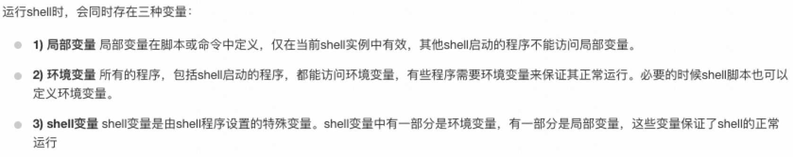

# shell 笔记
## 运行shell程序
shell脚本的第一行是`#!/bin/bash`,告诉系统其后路径所指定的程序即是解释此脚本文件的 Shell 程序。
下面的是最简单的shell脚本程序，将其保存为test.sh。
```
#!/bin/bash
echo "Hello World !"
```
运行shell脚本有两种方法：
- 方法一：作为可执行程序
```
chmod +x ./test.sh  #使脚本具有执行权限
./test.sh  #执行脚本

注意，一定要写成 ./test.sh，而不是 test.sh，运行其它二进制的程序也一样，直接写 test.sh，linux 系统会去 PATH 里寻找有没有叫 test.sh 的，而只有 /bin, /sbin, /usr/bin，/usr/sbin 等在 PATH 里，你的当前目录通常不在 PATH 里，所以写成 test.sh 是会找不到命令的，要用 ./test.sh 告诉系统说，就在当前目录找。
```
- 方法二
```
/bin/sh test.sh
这种方式运行的脚本，不需要在第一行指定解释器信息，写了也没用。
```
## shell 变量
### 定义变量
定义变量类似下面：
```
your_name="runoob.com"
```
需要注意以下几点：
- 变量名和等号之间不能有空格，
- 命名只能使用英文字母，数字和下划线，首个字符不能以数字开头。
- 中间不能有空格，可以使用下划线 _。
- 不能使用标点符号。
- 不能使用bash里的关键字（可用help命令查看保留关键字）。
### 使用变量
使用变量只需要在变量名前面加美元符号即可
```
your_name="qinjx"
echo $your_name
echo ${your_name}
# 变量名外面的花括号是可选的，加不加都行，加花括号是为了帮助解释器识别变量的边界，不过还是加上比较好。
```
### 已定义变量重新定义
重定义一个变量不需要加美元符号。
```
your_name="tom"
echo $your_name
your_name="alibaba"
echo $your_name
```
### 只读变量
```
#!/bin/bash

myUrl="https://www.google.com"
readonly myUrl
myUrl="https://www.runoob.com"
```
### 删除变量
变量被删除后不能再次使用。unset 命令不能删除只读变量。
```
unset variable_name
```
### 变量类型。

### shell 字符串
字符串可以是单引号，也可以是双引号。
单引号
```
str='this is a string'
单引号字符串的限制：
1、单引号里的任何字符都会原样输出，单引号字符串中的变量是无效的；
2、单引号字串中不能出现单独一个的单引号（对单引号使用转义符后也不行），但可成对出现，作为字符串拼接使用。
```
双引号
```
your_name="runoob"
str="Hello, I know you are \"$your_name\"! \n"
echo -e $str

双引号的优点：

双引号里可以有变量
双引号里可以出现转义字符
```
> 也就是说如果字符串里有变量的话，要使用双引号，而不是单引号。
### 获取字符串长度
```
string="abcd"
echo ${#string}   # 输出 4 这个感觉和awk读取一行类似。
```
### shell 数组
```
数组名=(值1 值2 ... 值n)
# 读取数组
${数组名[下标]}
使用@ 可以获取数组中的所有元素
echo ${array_name[@]}
```

# expect
使用shell，可以进行一些分支控制，但是不能模拟用户输入。可以使用expect 来代替。[参考链接](https://cloud.tencent.com/developer/article/1702986)
expect是基于tcl
## 安装expect
```
sudo apt install  expect。
```
##
```

#!/usr/bin/expect

set timeout 30
set host "101.200.241.109"
set username "root"
set password "123456"

spawn ssh $username@$host
expect "*password*" {send "$password\r"}
interact
```
[参考链接](https://cloud.tencent.com/developer/article/1691063?from=article.detail.1702986)