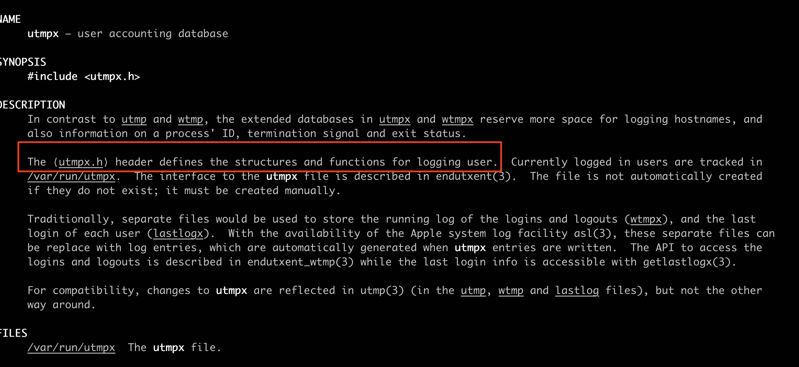
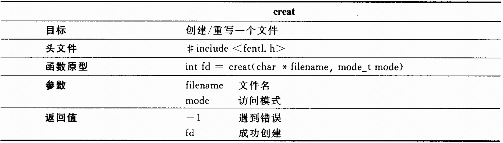
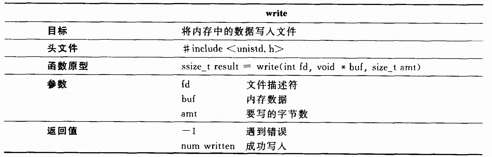
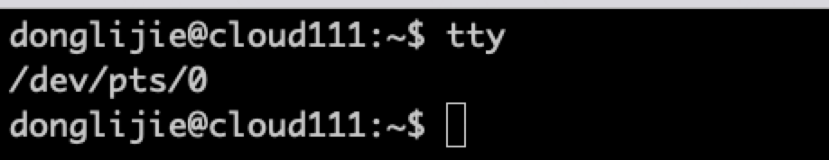
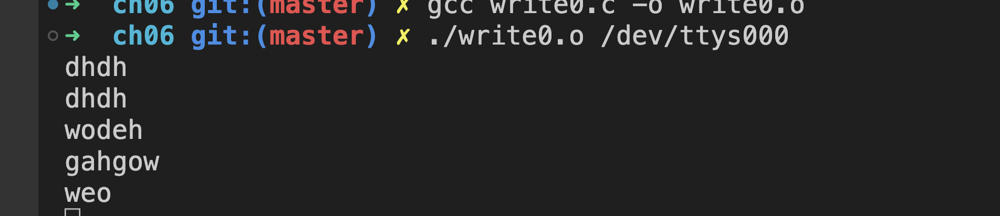
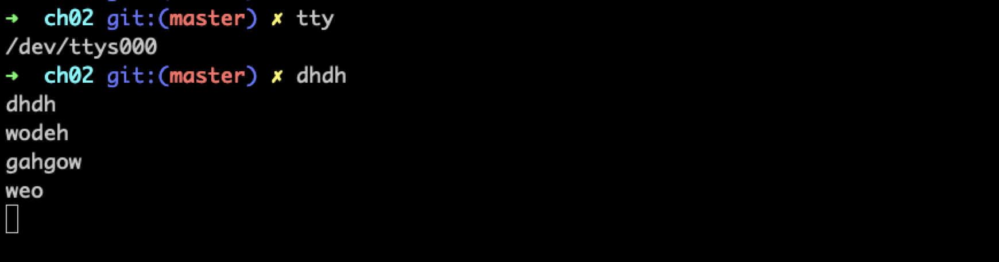

[github代码仓库参考链接](https://github.com/yuzhidi/Understanding-UNIXLINUX-Programming)

# 02 编写who命令、cp命令

who命令可以显示系统中活动用户的情况。通过man who 命令，可以看到已登录用户的信息是存放在文件/var/adm/utmp中的，who 通过读该文件获得信息。可以通过搜索联机帮助来了解这个文件的结构信息。

- 搜索联机帮助

  使用带有选项-k的man命令可以根据关键字搜索联机帮助。比如查找utmp， 输入命令：man -k utmp，会输出很多信息，其中有一个是：

​		utmp 位于第四节。输入 `man 4 utmp`，但是我在ubuntu20上，utmp位于第5节。utmp文件里保存的是结构数组，数组元素是utmp类型的结构，utmp的头文件在：/usr/include/utmp.h文件里。

### who的工作原理

主要就两步：

- 读取/var/adm/utmp中文件记录
- 显示记录

### 编写who 程序

如何从文件中读取数据结构。

使用系统调用open、read、close。

这是第一版代码，由于我是在mac上写的，/var/run/utmp 这个文件并不存在，UTMPX_FILE 这个宏定义也不存在，通过man who 命令，可以看到who 命令，是通过读取/var/run/utmpx 文件里的内容来展示有哪些用户登录的。

```
#include	<stdio.h>
#include	<utmp.h>
#include	<fcntl.h>
#include    <stdlib.h>
#include	<unistd.h>
#define	SHOWHOST	/* include remote machine on output */
#define UTMPX_FILE "/var/run/utmpx"
// 代码里show_info 并没有在main函数中提前声明。
void show_info(struct utmp *utbufp ){
	printf("%-8.8s", utbufp->ut_name);	/* the logname	*/
	printf(" ");				/* a space	*/
	printf("%-8.8s", utbufp->ut_line);	/* the tty	*/
	printf(" ");				/* a space	*/
	printf("%10ld", utbufp->ut_time);	/* login time	*/
	printf(" ");				/* a space	*/
#ifdef	SHOWHOST
	printf("(%s)", utbufp->ut_host);	/* the host	*/
#endif
	printf("\n");				/* newline	*/
}
int main(){
	struct utmp	current_record;	/* read info into here       */
	int		utmpfd;		/* read from this descriptor */
	int		reclen = sizeof(current_record);

	if ( (utmpfd = open(UTMPX_FILE, O_RDONLY)) == -1 ){
		
        perror( UTMPX_FILE );	/* UTMP_FILE is in utmp.h，在macos中UTMP_FILE 是没有定义的，    */
		exit(1); // 这个需要导入stdlib.h 头文件
	}

	while ( read(utmpfd, &current_record, reclen) == reclen ){
		show_info(&current_record);
    }
	close(utmpfd);
	return 0;			/* went ok */
}

```

上面的是版本1，存在一些问题，比如会有很多空白记录，以及登录时间。但是在mac上已经在提示utmp 是不推荐使用的了。而且我看在ubuntu上这个也是不推荐使用的了。

首先通过man who，可以看到现在登录信息是来自：


通过man utmpx 可以看到：新的结构是定义在utmpx.h头文件中。在这个头文件里定义了一个新的结构体utmpx。



这是新的代码：但是好像我读到的数据，没有一个用户是处于登录状态。这一点，暂时跳过。

```
#include	<stdio.h>
#include	<utmpx.h>
#include	<fcntl.h>
#include    <stdlib.h>
#include	<unistd.h>
#define	SHOWHOST	/* include remote machine on output */
// 代码里show_info 并没有在main函数中提前声明。
void show_info(struct utmpx *utbufp ){
	if (utbufp->ut_type != USER_PROCESS) {
		// 用户未登录直接跳过
		printf("ut_type:%d",utbufp->ut_type);
		return;
	}
	printf("%-8.8s", utbufp->ut_user);	/* the logname	*/
	printf(" ");				/* a space	*/
	printf("%-8.8s", utbufp->ut_line);	/* the tty	*/
	printf(" ");				/* a space	*/
	printf("%10ld", utbufp->ut_tv.tv_sec);	/* login time, 登录时间	*/
	printf(" ");				/* a space	*/
#ifdef	SHOWHOST
	printf("(%s)", utbufp->ut_host);	/* the host	*/
#endif
	printf("\n");				/* newline	*/
}
int main(){
	struct utmpx	current_record;	/* read info into here       */
	int		utmpfd;		/* read from this descriptor */
	int		reclen = sizeof(current_record);

	if ( (utmpfd = open(UTMPX_FILE, O_RDONLY)) == -1 ){
		
        perror( UTMPX_FILE );	/* UTMP_FILE is in utmp.h，在macos中UTMP_FILE 是没有定义的，    */
		exit(1); // 这个需要导入stdlib.h 头文件
	}

	while ( read(utmpfd, &current_record, reclen) == reclen ){
		show_info(&current_record);
    }
	close(utmpfd);
	return 0;			/* went ok */
}


```

## cp 命令

cp 能够复制文件，如果文件不存在就创建，存在就覆盖。创建或重写文件调用的是系统函数creat，



creat告诉内核创建一个名为filename的文件，如果这个文件不存在，就创建它，如果已经存在，就把它的内容清空，把文件的长度设置为0，如果内核成功的创建了文件，那么文件的许可位会被设置为由第2个参数mode所指定的值。

写文件是用write系统调用向已打开的文件中写入数据。



# 03 目录与文件属性：编写ls

目录可以看作是一种特殊的文件，可以使用cat 或者more 查看文件的内容。读取文件目录内容使用的是readdir，目录里存储的记录类型是是一个struct，定义在/usr/include/dirent.h中。

其他的不是特比感兴趣，暂时先跳过。

# 04 文件系统：编写pwd

不感兴趣，暂时跳过。

# 05 连接控制：学习stty。

linux中可以把设备看成一个文件。设备不仅具有文件名，同时也支持所有与文件相关的系统调用。

tty 用来告知用户所在终端的文件名。从下图可以看出，终端tty对应的设备描述文件名为：/dev/pts/2。



## 编写write程序

unix用户通过使用write命令和在其他终端上的用户聊天（linux确实很有意思，这个我真的是第一次知道）。wirte命令需要的参数是终端的文件名。真的可以。





# 06 为用户编程：终端控制和信号

## 终端驱动程序的模式

### 规范模式：缓冲和编辑

驱动程序输入的字符保存在缓冲区，并且仅在接收到回车键时才将这些缓冲的字符发送到程序，缓冲数据使驱动程序可以实现最基本的编辑功能，如果删除自负、单词或整行。

### 非规范模式和raw模式


