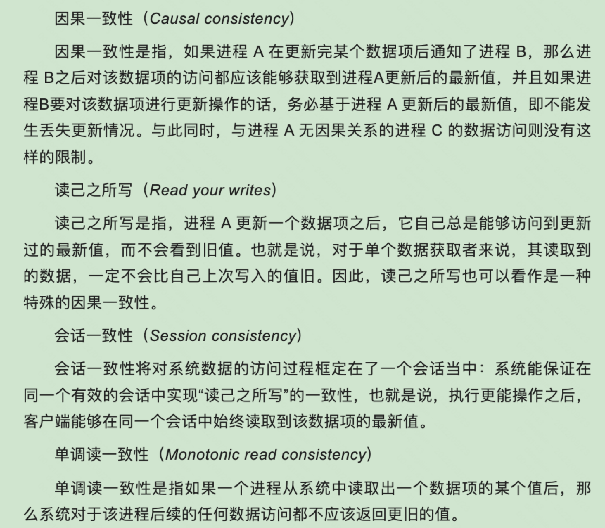
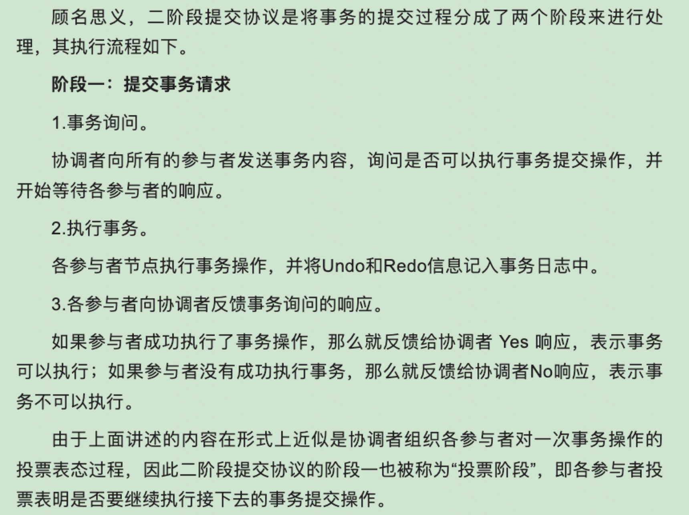
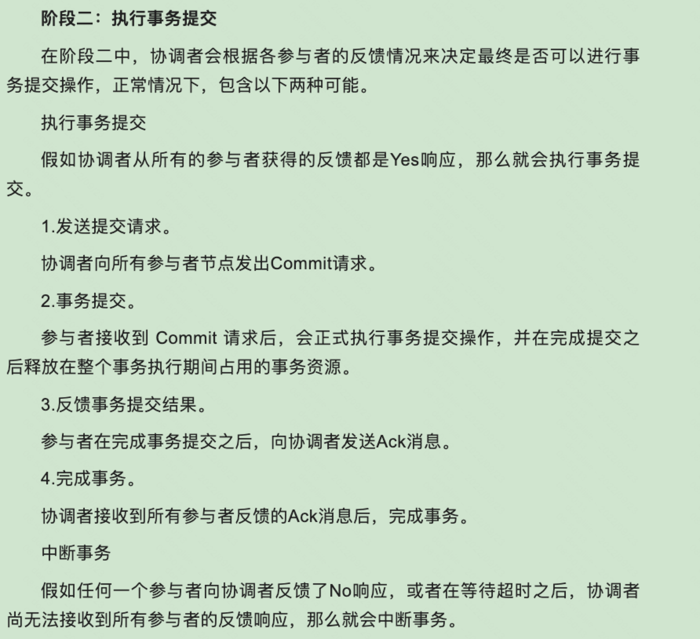
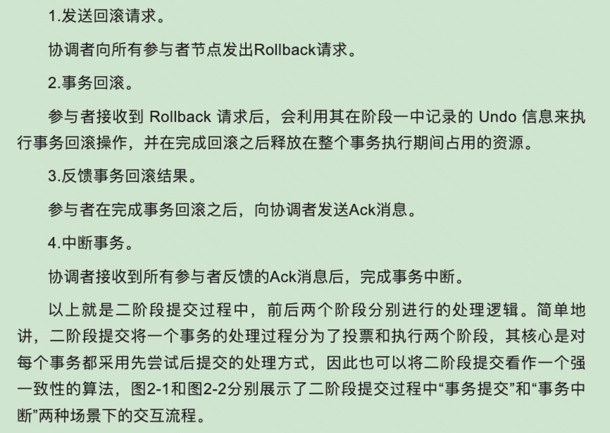
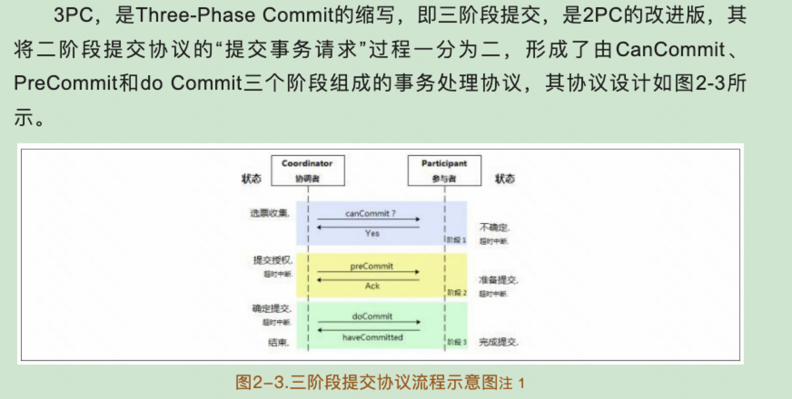
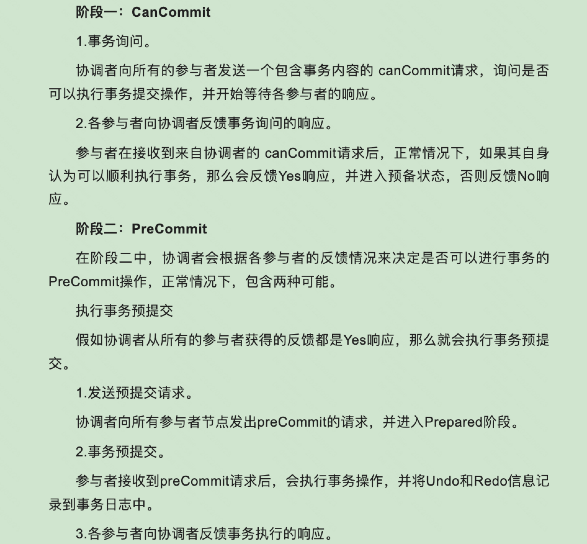
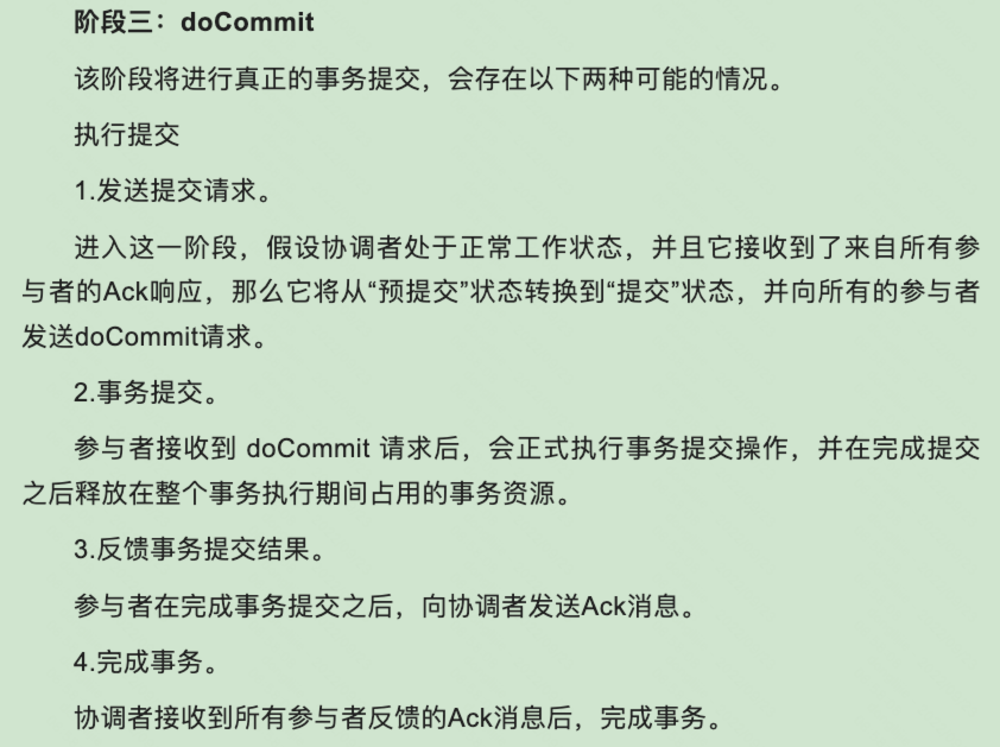
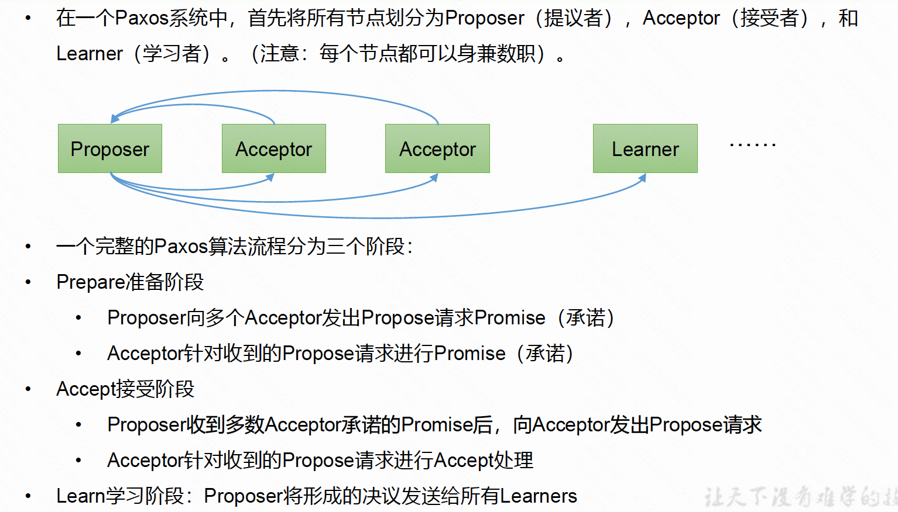
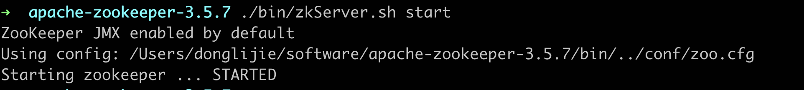

[toc]

# 从Paxos到zookeeper

## 01 分布式架构

### CAP和BASE理论

一个分布式系统不可能同时满足一致性（C：Consistency）、可用性（A：Availability）和分区容错性（P：Partition tolerance）。

- 一致性

  是指数据在多个副本之间是否能够保持一致的特性。

- 可用性

  是指系统提供的服务必须一直处于可用的状态，对于用户的每一个操作请求总是能够在有限的时间内返回结果。

- 分区容错性

  分布式系统在遇到任何网络分区故障的时候，仍然需要能够保证对外提供满足一致性和可用性的服务，除非是整个网络环境都发生了故障。

对于一个分布式系统，分区容错性是最基本的要求，因此架构师网络把精力花在根据业务特点在一致性和可用性之间寻求平衡。

BASE理论是Basically Available（基本可用）、Soft state（软状态）、和Eventually consistent（最终一致性），核心思想是即使无法做到强一致性，但每个应用都可以根据自身的业务特点，采用适当的方式使系统达到最终一致性。

- 基本可用

  是指分布式系统在出现不可预知故障的时候，允许损失部分可用性（不等价于系统不可用）。

  比如，响应时间的损失：一个功能正常情况下0.5秒返回结果，但是由于出现故障，导致返回结果的时间增加到了1～2秒。

- 软状态

  弱状态也称为软状态，和硬状态相对，是指允许系统中的数据存在中间状态，并认为该中间状态的存在不会影响系统的整体可用性，即允许系统在不同节点的数据副本之间进行数据同步的过程存在延迟。

- 最终一致性

  最终一致性强调的是系统中所有的数据副本，在经过一段时间的同步后，最终能达到一个一致的状态，最终一致性的本质是需要系统保证最终数据能够达到一致，而不需要实时保证系统数据的强一致性。

最终一致性有一下五类变种：




## 02 一致性协议

### 2pc 和3pc

#### 2pc

在分布式系统中，每一个机器节点，虽然都能明确地知道自己在执行事务操作过程中的结果是成功或者失败，但却无法直接获取到其他分布式节点的操作结果，因此当一个事务操作需要跨越多个分布式节点的时候，为了保持事务处理的ACID特性，就需要引入一个成为协调者（Coordinator）的组件来统一调度所有分布式节点的执行逻辑。这些被调度的分布式节点则被成为参与者，协调者负责调度参与者的行为，并最终决定这些参与者是否要把事务真正进行提交。








#### 3pc









### Paxos 算法

Paxos算法是一种机遇消息传递且具有高度容错特性的一致性算法。其解决的问题：就是如何正确地在一个分布式系统中对某个数据达成一致，并且保证不论发生任何异常，都不会破坏整个系统的一致性。书上的讲解好复杂，直接看尚硅谷的吧。



[参考链接](https://zhuanlan.zhihu.com/p/31780743)

paxos算法缺陷： 在网络复杂的情况下，一个应用Paxos算法的分布式系统，可能很久无法收敛，甚至陷入活锁的情况。

## 03 Paxos的工程实践

这一章可以跳过。

## 04 Zookeeper 与Paxos

zk并没有直接采用paxos算法，而是采用了ZAB协议。

### Zookeeper 介绍

#### zookeeper 一致性

zk可以保证如下分布式一致性：

- 顺序一致性

  从同一个客户端发起的事务请求，最终将会严格地按照其发起顺序被应用到zk中去。

- 原子性

  所有事务请求的处理结果在这整个集群中所有机器上的应用情况是一致的，也就是说，要么整个集群所有机器都成功应用了某一个事务，要么都没有应用。

- 单一视图

  无论客户端连接的是哪个zookeeper服务器，其看到的服务端数据模型都是一致的。

#### 设计目标

zk是一个开源的分布式协调服务，致力于提供一个高性能、高可用且具有严格的顺序访问控制能力（主要是写操作的严格顺序性）的分布式协调服务。

- 简单的数据模型

  zk使得分布式程序能够通过一个共享的、树形结果的名字空间来进行相互协调。zk的数据模型是由ZNode的数据节点组成。类似一个文件系统，

### 基本概念

#### 集群角色

zk中有三种角色：Leader、Follower和Observer，leader既可以提供写服务也可以提供读服务。Follower和Observer 都只能提供读服务，二者的区别在于，Observer 不参与Leader选举过程，也不参与写操作的“过半写成功策略”， Observer 在不影响集群写性能的情况下提升集群的读性能。

#### 数据节点（Znode）

持久节点：一旦这个znode建立了以后，除非主动进行znode的移除动作，否则这个znode将一直保持在zk上。

临时节点：它的生命周期和客户端会话绑定，一旦客户端会话失效，该客户端创建的所有临时节点都会被移除。

#### 版本

每个znode都会存储数据，zk都会为其维护一个叫做stat的数据结构，stat中记录了当前znode的三个数据版本，本别是version（当前znode的版本）、cversion（当前znode子节点的版本）、aveersion（当前znode的acl版本）。

#### Watcher

事件监听器，zk允许用户在指定节点上注册一些Watcher，并且在一些特定事件触发的时候，zk服务端将事件通知到感兴趣的客户端上。

#### ACL（Access Control Lists）

权限控制。

- CREATE： 创建子节点的权限
- READ：获取节点数据和子节点列表的权限
- WRITE：更新节点数据的权限
- DELETE：删除子节点的权限
- ADMIN：设置节点ACL的权限

### ZAB协议（zookeeper 原子消息广播协议）

zok使用一个单一的主进程来接收并处理客户端的所有事务请求，并采用ZAB的的原子广播协议，将服务器的状态变更一事务Proposal的形式广播到所有的副本进程上去。


ZAB协议好复杂，暂时先跳过吧。

## 05 使用zookeeper

### 单机安装

```
# 下载
wget https://archive.apache.org/dist/zookeeper/zookeeper-3.5.7/apache-zookeeper-3.5.7-bin.tar.gz
# 解压
tar -zxvf apache-zookeeper-3.5.7-bin.tar.gz
#移动到指定目录
sudo mv apache-zookeeper-3.5.7-bin /software/zookeeper-3.5.7
# 修改配置文件名
cp zoo_sample.cfg zoo.cfg
# 修改dataDir 的目录，单机版我安装在了mac电脑上，所以改成了下面这样
dataDir=/Users/donglijie/software/apache-zookeeper-3.5.7/zkData
#启动服务端
./bin/zkServer.sh start
# 查看zk的状态
./bin/zkServer.sh status
# 启动客户端
./bin/zkCli.sh  # 退出的话，输入quit 
# 停止服务端
bin/zkServer.sh stop
```



配置文件里主要有以下一些配置：

- tickTime：心跳时间，单位毫秒，会话超时时间是心跳时间的2倍。
- dataDir：内存数据库快照的存储位置。
- clientPort：客户端连接端口

