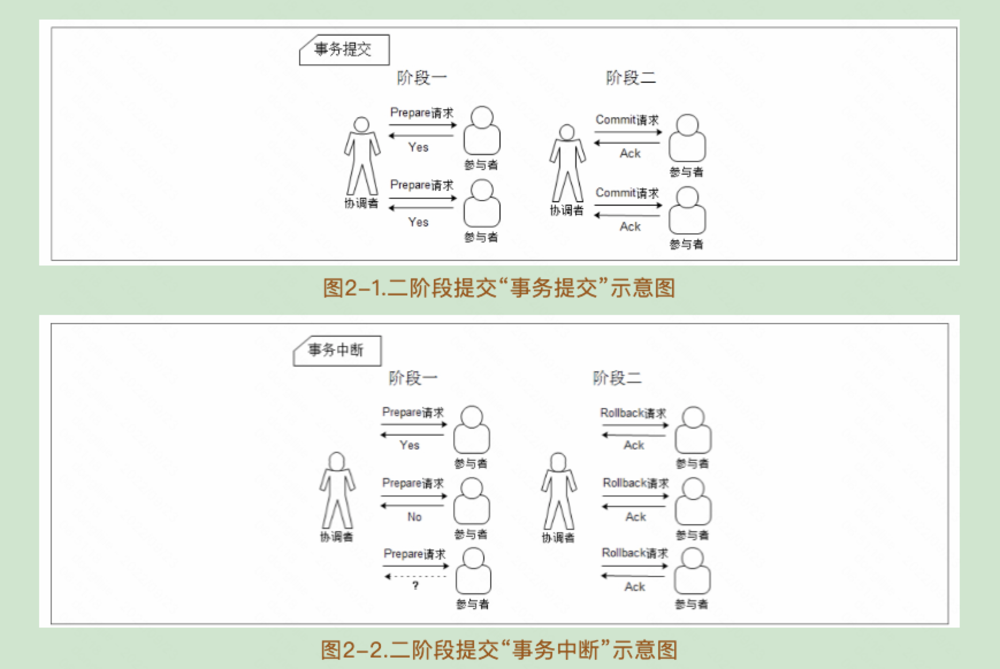
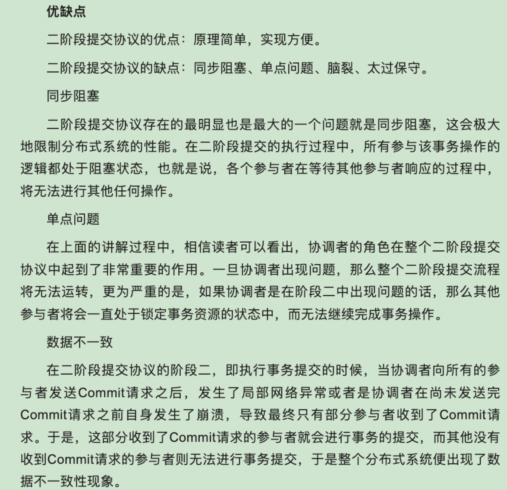
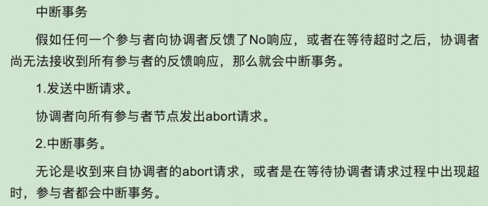
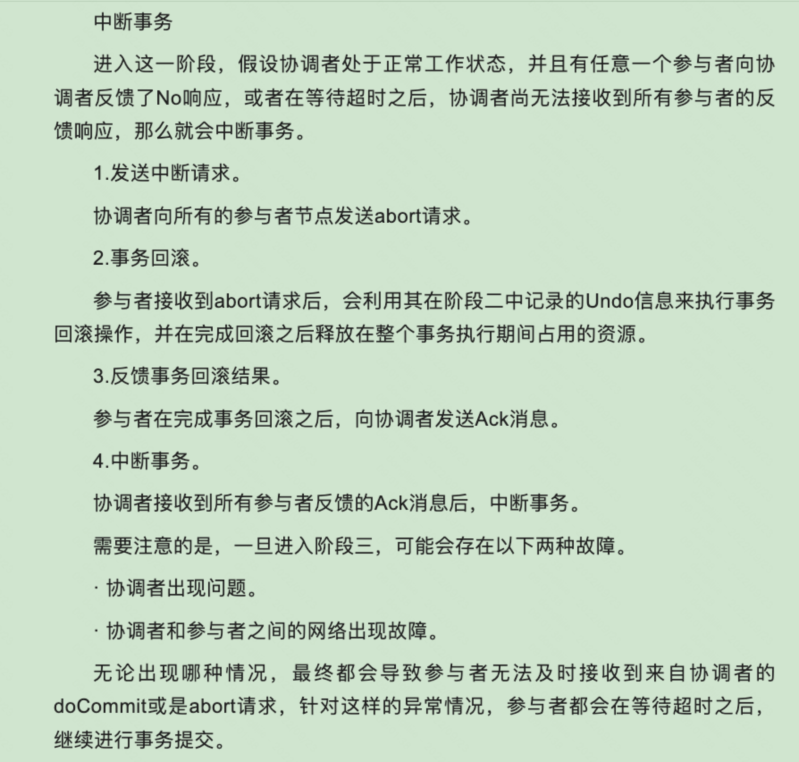
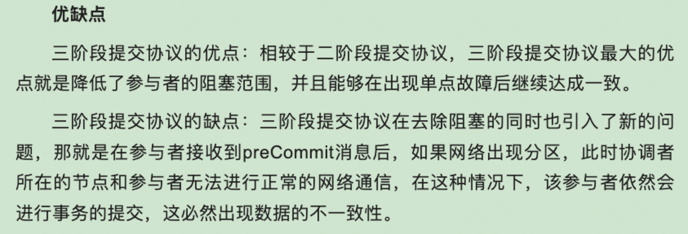

# 从Paxos到zookeeper

## 01 分布式架构

### CAP和BASE理论

一个分布式系统不可能同时满足一致性（C：Consistency）、可用性（A：Availability）和分区容错性（P：Partition tolerance）。

- 一致性

  是指数据在多个副本之间是否能够保持一致的特性。

- 可用性

  是指系统提供的服务必须一直处于可用的状态，对于用户的每一个操作请求总是能够在有限的时间内返回结果。

- 分区容错性

  分布式系统在遇到任何网络分区故障的时候，仍然需要能够保证对外提供满足一致性和可用性的服务，除非是整个网络环境都发生了故障。

对于一个分布式系统，分区容错性是最基本的要求，因此架构师网络把精力花在根据业务特点在一致性和可用性之间寻求平衡。

BASE理论是Basically Available（基本可用）、Soft state（软状态）、和Eventually consistent（最终一致性），核心思想是即使无法做到强一致性，但每个应用都可以根据自身的业务特点，采用适当的方式使系统达到最终一致性。

- 基本可用

  是指分布式系统在出现不可预知故障的时候，允许损失部分可用性（不等价于系统不可用）。

  比如，响应时间的损失：一个功能正常情况下0.5秒返回结果，但是由于出现故障，导致返回结果的时间增加到了1～2秒。

- 软状态

  弱状态也称为软状态，和硬状态相对，是指允许系统中的数据存在中间状态，并认为该中间状态的存在不会影响系统的整体可用性，即允许系统在不同节点的数据副本之间进行数据同步的过程存在延迟。

- 最终一致性

  最终一致性强调的是系统中所有的数据副本，在经过一段时间的同步后，最终能达到一个一致的状态，最终一致性的本质是需要系统保证最终数据能够达到一致，而不需要实时保证系统数据的强一致性。

最终一致性有一下五类变种：

## 02 一致性协议

### 2pc 和3pc

#### 2pc

在分布式系统中，每一个机器节点，虽然都能明确地知道自己在执行事务操作过程中的结果是成功或者失败，但却无法直接获取到其他分布式节点的操作结果，因此当一个事务操作需要跨越多个分布式节点的时候，为了保持事务处理的ACID特性，就需要引入一个成为协调者（Coordinator）的组件来统一调度所有分布式节点的执行逻辑。这些被调度的分布式节点则被成为参与者，协调者负责调度参与者的行为，并最终决定这些参与者是否要把事务真正进行提交。

#### 3pc

### Paxos 算法

